# ATS Compatibility Scoring

<cite>
**Referenced Files in This Document**
- [ats-calculator.js](file://assets/js/src/ats-calculator.js)
- [ats-calculator-styles.css](file://assets/css/ats-calculator-styles.css)
- [bioinformatics.json](file://public/data/roles/bioinformatics.json)
- [data-business-analyst.json](file://public/data/roles/data-business-analyst.json)
- [developer-testing.json](file://public/data/roles/developer-testing.json)
- [index.html (ATS page)](file://public/ats/index.html)
- [index.html (ATS role page)](file://public/ats/developer-testing/index.html)
- [index.html (Main)](file://index.html)
- [main.js](file://assets/js/main.js)
- [theme-manager.js](file://assets/js/src/theme-manager.js)
- [variant-manager.js](file://assets/js/src/variant-manager.js)
</cite>

## Table of Contents

1. [Introduction](#introduction)
2. [Project Structure](#project-structure)
3. [Core Components](#core-components)
4. [Architecture Overview](#architecture-overview)
5. [Detailed Component Analysis](#detailed-component-analysis)
6. [Dependency Analysis](#dependency-analysis)
7. [Performance Considerations](#performance-considerations)
8. [Troubleshooting Guide](#troubleshooting-guide)
9. [Conclusion](#conclusion)
10. [Appendices](#appendices)

## Introduction

This document explains the ATS compatibility scoring system implemented in the real-time resume optimization tool. It covers the scoring algorithm design, keyword matching system, multi-factor analysis approach, and job description integration. It also documents the ATS calculator class functionality, scoring methodology, improvement suggestion engine, and interactive user interface. Implementation details include resume parsing via role data, keyword extraction, score calculation logic, and dynamic feedback mechanisms. Role-specific optimizations, ATS-friendly formatting, and best practices for improving compatibility scores are included, along with examples of scoring workflows, suggestion implementation, and optimization strategies.

## Project Structure

The ATS scoring system is composed of:

- An interactive UI panel that slides in from the left and displays the ATS score and breakdown
- A scoring engine that computes compatibility across multiple factors
- Role-specific data sources that feed content and keywords for analysis
- ATS-friendly resume pages that demonstrate machine-readable formatting

**Diagram sources**

- [ats-calculator.js](file://assets/js/src/ats-calculator.js#L6-L151)
- [ats-calculator-styles.css](file://assets/css/ats-calculator-styles.css#L3-L501)
- [index.html (ATS page)](file://public/ats/index.html#L400-L526)
- [index.html (ATS role page)](file://public/ats/developer-testing/index.html#L1-L36)

**Section sources**

- [ats-calculator.js](file://assets/js/src/ats-calculator.js#L6-L151)
- [ats-calculator-styles.css](file://assets/css/ats-calculator-styles.css#L3-L501)
- [index.html (ATS page)](file://public/ats/index.html#L400-L526)
- [index.html (ATS role page)](file://public/ats/developer-testing/index.html#L1-L36)

## Core Components

- ATSScoreCalculator: Manages UI creation, toggling, and exposes placeholders for scoring logic and suggestions.
- Keyword sets: Predefined categories for technical skills, soft skills, experience descriptors, and formatting anchors.
- Resume parser: Extracts content from role-specific JSON data to compute matches and completeness.
- ATS-friendly resume pages: Serve as the baseline for ATS readability and formatting.

Key responsibilities:

- Build and render the scoring panel with animated slide-in/out behavior
- Compute and display a composite score and per-category breakdown
- Provide a job description input field for custom match analysis
- Render improvement suggestions based on missing keywords and structural gaps

**Section sources**

- [ats-calculator.js](file://assets/js/src/ats-calculator.js#L6-L151)
- [ats-calculator-styles.css](file://assets/css/ats-calculator-styles.css#L3-L501)
- [index.html (ATS page)](file://public/ats/index.html#L400-L526)

## Architecture Overview

The ATS scoring system integrates with the main application and the ATS resume pages. On page load, the ATS calculator initializes and creates a floating toggle button and a sliding panel. When opened, the panel calculates the score and renders the breakdown and suggestions. Role-specific data is consumed to extract keywords and content for analysis.

```mermaid
sequenceDiagram
participant U as "User"
participant DOM as "DOM"
participant Calc as "ATSScoreCalculator"
participant Panel as "Scoring Panel"
participant Data as "Role JSON"
U->>DOM : Click "📊 ATS Score"
DOM->>Calc : toggleScorer()
Calc->>Panel : Slide panel open
Calc->>Calc : calculateScore()
Calc->>Data : parse resume content
Calc->>Panel : render score + breakdown + suggestions
U->>Panel : Paste job description
U->>Calc : analyzeJobMatch()
Calc->>Panel : show match results
```

**Diagram sources**

- [ats-calculator.js](file://assets/js/src/ats-calculator.js#L135-L143)
- [ats-calculator.js](file://assets/js/src/ats-calculator.js#L45-L48)
- [index.html (ATS page)](file://public/ats/index.html#L484-L526)

## Detailed Component Analysis

### ATSScoreCalculator Class

The calculator defines:

- Constants for score bounds and keyword categories
- UI construction with toggle button and sliding panel
- Methods for toggling visibility and flattening nested arrays

**Diagram sources**

- [ats-calculator.js](file://assets/js/src/ats-calculator.js#L6-L151)

**Section sources**

- [ats-calculator.js](file://assets/js/src/ats-calculator.js#L6-L151)

### Scoring Panel UI and Styling

The panel includes:

- A circular score display with rating label
- Four breakdown bars for Format & Structure, Keywords, Content Completeness, Parsing & Readability
- Improvement suggestions container
- Job description input and analyze button

Styling supports:

- Smooth slide-in/slide-out transitions
- Responsive design for mobile devices
- Dark mode compatibility
- Print styles that hide UI controls

**Section sources**

- [ats-calculator.js](file://assets/js/src/ats-calculator.js#L50-L133)
- [ats-calculator-styles.css](file://assets/css/ats-calculator-styles.css#L3-L501)

### Resume Data Model and Parsing

Role-specific JSON files provide:

- Metadata, summary, work experience, projects, skills, education, publications, awards, certifications, languages
- Dedicated ats_keywords field for machine-readable keyword lists
- Metrics for experience, projects, publications, companies, and domain/technology distributions

The ATS resume page consumes these JSON files to render an ATS-friendly layout.

**Diagram sources**

- [bioinformatics.json](file://public/data/roles/bioinformatics.json#L1-L129)
- [data-business-analyst.json](file://public/data/roles/data-business-analyst.json#L1-L112)
- [developer-testing.json](file://public/data/roles/developer-testing.json#L1-L136)

**Section sources**

- [bioinformatics.json](file://public/data/roles/bioinformatics.json#L1-L129)
- [data-business-analyst.json](file://public/data/roles/data-business-analyst.json#L1-L112)
- [developer-testing.json](file://public/data/roles/developer-testing.json#L1-L136)
- [index.html (ATS page)](file://public/ats/index.html#L484-L526)

### Job Description Integration

The panel includes a job description input field and an analyze button. The calculator exposes a method to analyze job match, which would:

- Parse the job description for keywords
- Compare against the resume’s keyword sets and extracted keywords
- Compute match percentage and highlight found/missing keywords
- Render suggestions for alignment

Note: The analyze method is referenced in the UI but not yet implemented in the calculator class.

**Section sources**

- [ats-calculator.js](file://assets/js/src/ats-calculator.js#L116-L121)

### ATS-Friendly Formatting Best Practices

The ATS resume pages demonstrate:

- Plain, semantic typography suitable for OCR/ATS parsing
- Minimal styling to avoid rendering issues
- Hidden “Keywords” section to embed machine-readable keywords
- Print styles that optimize for A4 and remove UI elements

These practices improve compatibility with ATS systems that rely on structured, plain-text parsing.

**Section sources**

- [index.html (ATS page)](file://public/ats/index.html#L42-L329)
- [index.html (ATS role page)](file://public/ats/developer-testing/index.html#L6-L33)

## Architecture Overview

The ATS scoring system is integrated into the main application and the ATS resume pages. The calculator initializes on DOMContentLoaded and creates a floating toggle and panel. When opened, it parses role data to compute a compatibility score and presents a breakdown and suggestions. Users can paste a job description to receive a custom match analysis.

**Diagram sources**

- [index.html (Main)](file://index.html#L405-L407)
- [ats-calculator.js](file://assets/js/src/ats-calculator.js#L154-L160)
- [index.html (ATS page)](file://public/ats/index.html#L484-L526)

**Section sources**

- [index.html (Main)](file://index.html#L405-L407)
- [ats-calculator.js](file://assets/js/src/ats-calculator.js#L154-L160)
- [index.html (ATS page)](file://public/ats/index.html#L484-L526)

## Detailed Component Analysis

### Scoring Methodology

The calculator defines constants for score bounds and keyword categories. While the full scoring logic is not implemented in the calculator class, the UI is ready to display:

- Composite score out of 100
- Per-category breakdowns for Format & Structure, Keywords, Content Completeness, Parsing & Readability
- Improvement suggestions based on keyword gaps and structural issues

**Diagram sources**

- [ats-calculator.js](file://assets/js/src/ats-calculator.js#L6-L151)
- [ats-calculator.js](file://assets/js/src/ats-calculator.js#L45-L48)

**Section sources**

- [ats-calculator.js](file://assets/js/src/ats-calculator.js#L6-L151)

### Keyword Matching System

The calculator includes predefined keyword categories:

- technical: programming languages, frameworks, tools, cloud platforms
- soft_skills: leadership, communication, teamwork, problem-solving
- experience: temporal and action verbs indicating leadership and accomplishment
- formatting: section anchors commonly recognized by ATS

The ATS resume pages embed a dedicated keywords section to aid machine parsing.

**Section sources**

- [ats-calculator.js](file://assets/js/src/ats-calculator.js#L10-L40)
- [index.html (ATS page)](file://public/ats/index.html#L392-L398)

### Multi-Factor Analysis Approach

The scoring panel exposes four categories:

- Format & Structure: evaluates section headings, use of standard section anchors, and ATS-friendly formatting
- Keywords: compares extracted keywords against job description and predefined categories
- Content Completeness: assesses presence and depth of professional summary, experience, projects, skills, education
- Parsing & Readability: checks for clean typography, minimal styling, and absence of images or complex layouts

Each category contributes to the composite score, with the UI designed to visualize progress and highlight areas for improvement.

**Section sources**

- [ats-calculator.js](file://assets/js/src/ats-calculator.js#L79-L111)
- [ats-calculator-styles.css](file://assets/css/ats-calculator-styles.css#L135-L172)

### Improvement Suggestion Engine

The suggestions container is prepared to present actionable recommendations derived from:

- Missing keywords compared to job description
- Structural gaps (e.g., missing sections)
- Formatting issues (e.g., inconsistent headings, non-standard section names)

The UI includes styling for suggestion headers and items, and for job match results with found/missing keywords.

**Section sources**

- [ats-calculator.js](file://assets/js/src/ats-calculator.js#L113-L113)
- [ats-calculator-styles.css](file://assets/css/ats-calculator-styles.css#L173-L283)

### Interactive User Interface

The UI features:

- Floating toggle button with accessible labels
- Sliding panel with close button
- Animated score circle and progress bars
- Responsive layout and dark mode support
- Print styles that hide UI controls

Integration points:

- Theme manager toggles light/dark modes
- Variant manager controls primary actions and focus behavior
- Main page loads the application entry point

**Section sources**

- [ats-calculator.js](file://assets/js/src/ats-calculator.js#L50-L133)
- [ats-calculator-styles.css](file://assets/css/ats-calculator-styles.css#L3-L501)
- [theme-manager.js](file://assets/js/src/theme-manager.js#L141-L161)
- [variant-manager.js](file://assets/js/src/variant-manager.js#L68-L103)
- [main.js](file://assets/js/main.js#L5-L8)

## Dependency Analysis

The ATS scoring system depends on:

- Role JSON data for content and keywords
- ATS resume page rendering logic for data population
- UI styles for presentation and responsiveness
- Theme and variant managers for application-wide behavior

**Diagram sources**

- [ats-calculator.js](file://assets/js/src/ats-calculator.js#L154-L160)
- [ats-calculator-styles.css](file://assets/css/ats-calculator-styles.css#L3-L501)
- [index.html (ATS page)](file://public/ats/index.html#L484-L526)
- [index.html (Main)](file://index.html#L405-L407)
- [theme-manager.js](file://assets/js/src/theme-manager.js#L141-L161)
- [variant-manager.js](file://assets/js/src/variant-manager.js#L68-L103)

**Section sources**

- [ats-calculator.js](file://assets/js/src/ats-calculator.js#L154-L160)
- [ats-calculator-styles.css](file://assets/css/ats-calculator-styles.css#L3-L501)
- [index.html (ATS page)](file://public/ats/index.html#L484-L526)
- [index.html (Main)](file://index.html#L405-L407)

## Performance Considerations

- Minimize DOM queries by caching selectors during initialization
- Debounce repeated calculations when toggling the panel open/close
- Use efficient string and array operations for keyword matching and flattening
- Avoid heavy computations on the main thread; consider Web Workers for intensive tasks
- Optimize rendering by updating only changed elements in the panel

[No sources needed since this section provides general guidance]

## Troubleshooting Guide

Common issues and resolutions:

- Panel does not appear: Ensure the toggle button exists and the calculator initializes after DOMContentLoaded
- Scores not updating: Verify that the calculateScore method is invoked when the panel opens
- Job match not working: Confirm that analyzeJobMatch is implemented and bound to the button click
- Styling conflicts: Check for CSS specificity and ensure styles are loaded after base styles
- Print issues: Confirm print media queries hide UI controls and preserve readable typography

**Section sources**

- [ats-calculator.js](file://assets/js/src/ats-calculator.js#L154-L160)
- [ats-calculator-styles.css](file://assets/css/ats-calculator-styles.css#L327-L501)

## Conclusion

The ATS compatibility scoring system provides a foundation for real-time resume optimization. The ATSScoreCalculator class defines the UI and scoring framework, while role-specific JSON data supplies content and keywords. The ATS resume pages exemplify ATS-friendly formatting. Future enhancements should implement the scoring logic, job description analysis, and suggestion generation to deliver actionable insights and improve ATS compatibility.

[No sources needed since this section summarizes without analyzing specific files]

## Appendices

### Example Scoring Workflows

- Open the ATS panel and review the composite score and category breakdown
- Paste a job description and click analyze to see keyword match results
- Review improvement suggestions and adjust resume content and formatting accordingly
- Export or view the ATS-friendly resume to validate formatting

**Section sources**

- [ats-calculator.js](file://assets/js/src/ats-calculator.js#L116-L121)
- [ats-calculator.js](file://assets/js/src/ats-calculator.js#L135-L143)

### Optimization Strategies

- Include role-specific keywords in the ats_keywords field and visible content
- Use standard section headings recognized by ATS (Experience, Education, Skills, Projects)
- Maintain clean typography and avoid images, columns, or complex layouts
- Ensure bullet points are simple and action-oriented
- Regularly update skills and projects to reflect current market demands

**Section sources**

- [bioinformatics.json](file://public/data/roles/bioinformatics.json#L109-L109)
- [data-business-analyst.json](file://public/data/roles/data-business-analyst.json#L92-L92)
- [developer-testing.json](file://public/data/roles/developer-testing.json#L116-L116)
- [index.html (ATS page)](file://public/ats/index.html#L392-L398)
