# ATS Compatibility Scoring

<cite>
**Referenced Files in This Document**
- [ats-calculator.js](file://assets/js/src/ats-calculator.js)
- [ats-calculator-styles.css](file://assets/css/ats-calculator-styles.css)
- [index.html](file://index.html)
- [main.js](file://assets/js/main.js)
- [QUICK_REFERENCE.md](file://QUICK_REFERENCE.md)
- [public/ats/index.html](file://public/ats/index.html)
- [public/ats/bioinformatics/index.html](file://public/ats/bioinformatics/index.html)
- [public/data/roles/bioinformatics.json](file://public/data/roles/bioinformatics.json)
- [public/data/roles/data-business-analyst.json](file://public/data/roles/data-business-analyst.json)
- [public/data/roles/developer-testing.json](file://public/data/roles/developer-testing.json)
</cite>

## Table of Contents

1. [Introduction](#introduction)
2. [Project Structure](#project-structure)
3. [Core Components](#core-components)
4. [Architecture Overview](#architecture-overview)
5. [Detailed Component Analysis](#detailed-component-analysis)
6. [Dependency Analysis](#dependency-analysis)
7. [Performance Considerations](#performance-considerations)
8. [Troubleshooting Guide](#troubleshooting-guide)
9. [Conclusion](#conclusion)
10. [Appendices](#appendices)

## Introduction

This document explains the ATS compatibility scoring system implemented in the project. It focuses on the ATSScoreCalculator class, covering real-time scoring, keyword matching, job description analysis, scoring categories, and UI behavior. It also documents the toggle button and sliding panel, dynamic score calculation, and practical usage scenarios for resume optimization.

## Project Structure

The ATS scoring feature is implemented as a self-contained module that injects UI elements into the page and computes scores based on the current resume content. The calculator’s UI is styled via dedicated CSS and integrated into both the main landing page and the role-specific ATS pages.

**Diagram sources**

- [index.html](file://index.html#L1-L408)
- [main.js](file://assets/js/main.js#L1-L58)
- [ats-calculator.js](file://assets/js/src/ats-calculator.js#L1-L161)
- [ats-calculator-styles.css](file://assets/css/ats-calculator-styles.css#L1-L501)
- [public/ats/index.html](file://public/ats/index.html#L1-L543)
- [public/ats/bioinformatics/index.html](file://public/ats/bioinformatics/index.html#L1-L468)
- [public/data/roles/bioinformatics.json](file://public/data/roles/bioinformatics.json#L1-L129)
- [public/data/roles/data-business-analyst.json](file://public/data/roles/data-business-analyst.json#L1-L112)
- [public/data/roles/developer-testing.json](file://public/data/roles/developer-testing.json#L1-L136)

**Section sources**

- [index.html](file://index.html#L1-L408)
- [ats-calculator.js](file://assets/js/src/ats-calculator.js#L1-L161)
- [ats-calculator-styles.css](file://assets/css/ats-calculator-styles.css#L1-L501)
- [public/ats/index.html](file://public/ats/index.html#L1-L543)
- [public/ats/bioinformatics/index.html](file://public/ats/bioinformatics/index.html#L1-L468)

## Core Components

- ATSScoreCalculator class: Creates the toggle button and sliding panel, manages visibility, and performs dynamic score calculation.
- Scoring categories: Format & Structure, Keywords & Skills, Content Completeness, Parsing & Readability.
- Keyword matching: Uses predefined keyword groups to compute keyword-related score.
- Job description analysis: Provides a UI to paste a job description and analyze matching keywords and missing ones.
- Improvement suggestions: Displays actionable tips derived from the scoring logic.

Key implementation references:

- Scoring categories and weights are defined in the quick reference guide.
- UI creation and toggling are implemented in the calculator module.
- Styles for the panel, bars, and suggestions are defined in the CSS file.

**Section sources**

- [ats-calculator.js](file://assets/js/src/ats-calculator.js#L6-L43)
- [ats-calculator-styles.css](file://assets/css/ats-calculator-styles.css#L25-L171)
- [QUICK_REFERENCE.md](file://QUICK_REFERENCE.md#L54-L86)

## Architecture Overview

The ATS calculator runs on-demand. When the user clicks the toggle button, the sliding panel opens and triggers a recalculation. The calculator reads the current resume data and computes scores per category, updating the UI dynamically.

```mermaid
sequenceDiagram
participant U as "User"
participant BTN as "Toggle Button"
participant PANEL as "Sliding Panel"
participant CALC as "ATSScoreCalculator"
participant DOM as "DOM Elements"
U->>BTN : Click "📊 ATS Score"
BTN->>PANEL : Toggle class "open"
PANEL->>CALC : calculateScore()
CALC->>DOM : Read current resume content
CALC->>CALC : Compute scores per category
CALC->>DOM : Update score circle, bars, and suggestions
DOM-->>U : Display real-time score and breakdown
```

**Diagram sources**

- [ats-calculator.js](file://assets/js/src/ats-calculator.js#L135-L143)
- [ats-calculator.js](file://assets/js/src/ats-calculator.js#L45-L48)
- [ats-calculator-styles.css](file://assets/css/ats-calculator-styles.css#L25-L54)

## Detailed Component Analysis

### ATSScoreCalculator Class

The class encapsulates the entire ATS scoring experience:

- Initialization: Sets constants, defines keyword groups, initializes UI, and triggers initial calculation.
- UI creation: Builds a toggle button and a sliding panel with score display, breakdown bars, suggestions area, and job description input.
- Visibility control: Toggles the panel open/closed and recalculates on open.
- Utility: Provides a flattening utility for nested arrays.

**Diagram sources**

- [ats-calculator.js](file://assets/js/src/ats-calculator.js#L6-L151)

**Section sources**

- [ats-calculator.js](file://assets/js/src/ats-calculator.js#L6-L43)
- [ats-calculator.js](file://assets/js/src/ats-calculator.js#L50-L133)
- [ats-calculator.js](file://assets/js/src/ats-calculator.js#L135-L143)
- [ats-calculator.js](file://assets/js/src/ats-calculator.js#L145-L150)

### Scoring Categories and Methodology

The scoring methodology is documented in the quick reference guide and implemented in the calculator module. The four categories and their approximate weights are:

- Format & Structure: ~30%
- Keywords & Skills: ~25%
- Content Completeness: ~25%
- Parsing & Readability: ~20%

Scoring mechanism:

- The calculator reads the current resume content and applies category-specific checks.
- Scores are normalized to a 0–100 range and displayed with animated progress bars.
- Improvement suggestions are generated based on detected gaps.

Note: The exact internal scoring formulas are not exposed in the provided code. The implementation relies on the presence and structure of resume sections and keyword matches against predefined groups.

**Section sources**

- [QUICK_REFERENCE.md](file://QUICK_REFERENCE.md#L68-L72)
- [ats-calculator.js](file://assets/js/src/ats-calculator.js#L10-L40)

### Keyword Matching Mechanism

The calculator maintains predefined keyword groups for common ATS terms:

- Technical: programming languages, frameworks, tools, cloud platforms, version control.
- Soft skills: leadership, communication, teamwork, problem-solving, project management, critical thinking, collaboration.
- Experience: temporal and leadership indicators.
- Formatting: section headings recognized by ATS parsers.

Matching:

- The calculator scans the resume content for occurrences of these keywords.
- Results are used to compute the “Keywords & Skills” category score and to generate suggestions.

**Section sources**

- [ats-calculator.js](file://assets/js/src/ats-calculator.js#L10-L40)

### Job Description Analysis

The UI includes:

- A text input for pasting a job description.
- A button to trigger job match analysis.

Behavior:

- On click, the calculator would compute keyword overlap between the resume and the job description, highlighting matched and missing keywords, and present a summary with percentage match and actionable insights.

Note: The method name for job analysis is referenced in the UI, but the implementation is not present in the provided calculator file. It is expected to be wired up to the existing keyword matching logic.

**Section sources**

- [ats-calculator.js](file://assets/js/src/ats-calculator.js#L115-L121)

### Toggle Button and Sliding Panel UI

- Toggle button: Fixed-position button labeled “📊 ATS Score” with accessibility attributes.
- Sliding panel: Off-screen container that slides into view when opened, containing:
  - Score display (circular indicator and rating label).
  - Category breakdown bars with values.
  - Improvement suggestions area.
  - Job description input and analyze button.

Styling:

- CSS controls positioning, transitions, responsive breakpoints, dark mode variants, and print behavior.

**Section sources**

- [ats-calculator.js](file://assets/js/src/ats-calculator.js#L50-L133)
- [ats-calculator-styles.css](file://assets/css/ats-calculator-styles.css#L3-L482)

### Dynamic Score Calculation

- Trigger: Opening the panel invokes the calculation routine.
- Updates: Score circle, category bars, and suggestions update in real time as the user interacts with the resume content.

**Section sources**

- [ats-calculator.js](file://assets/js/src/ats-calculator.js#L135-L143)

### Integration with Resume Data

The calculator references role-specific JSON data that contains:

- Metadata, summary, work experience, projects, skills, education, awards, certifications, languages, keywords, and ATS-friendly keywords.
- These fields inform the scoring and suggestions.

Examples of data sources:

- Bioinformatics role data.
- Data Business Analyst role data.
- Developer & Testing role data.

**Section sources**

- [public/data/roles/bioinformatics.json](file://public/data/roles/bioinformatics.json#L1-L129)
- [public/data/roles/data-business-analyst.json](file://public/data/roles/data-business-analyst.json#L1-L112)
- [public/data/roles/developer-testing.json](file://public/data/roles/developer-testing.json#L1-L136)

### Practical Usage Scenarios

- Resume optimization: Use the calculator to identify gaps in formatting, keywords, completeness, and readability before submitting to ATS.
- Role tailoring: Compare your resume against a job description to see matching keywords and missing terms.
- Improvement planning: Apply suggestions to strengthen weak areas and increase ATS compatibility.

**Section sources**

- [QUICK_REFERENCE.md](file://QUICK_REFERENCE.md#L80-L85)

## Dependency Analysis

The ATS calculator depends on:

- DOM for reading resume content and updating UI.
- CSS for rendering the panel, bars, and suggestions.
- Role-specific JSON data for content and keywords.

**Diagram sources**

- [ats-calculator.js](file://assets/js/src/ats-calculator.js#L1-L161)
- [ats-calculator-styles.css](file://assets/css/ats-calculator-styles.css#L1-L501)
- [public/ats/index.html](file://public/ats/index.html#L1-L543)
- [public/ats/bioinformatics/index.html](file://public/ats/bioinformatics/index.html#L1-L468)
- [public/data/roles/bioinformatics.json](file://public/data/roles/bioinformatics.json#L1-L129)
- [public/data/roles/data-business-analyst.json](file://public/data/roles/data-business-analyst.json#L1-L112)
- [public/data/roles/developer-testing.json](file://public/data/roles/developer-testing.json#L1-L136)

**Section sources**

- [ats-calculator.js](file://assets/js/src/ats-calculator.js#L1-L161)
- [ats-calculator-styles.css](file://assets/css/ats-calculator-styles.css#L1-L501)
- [public/ats/index.html](file://public/ats/index.html#L1-L543)
- [public/ats/bioinformatics/index.html](file://public/ats/bioinformatics/index.html#L1-L468)

## Performance Considerations

- Real-time updates: Recompute scores only when the panel opens to avoid unnecessary work.
- DOM queries: Minimize repeated DOM reads by caching references during initialization.
- CSS transitions: Smooth animations are lightweight but avoid excessive reflows by batching updates.
- Data fetching: The calculator references role JSON files; ensure efficient loading and consider caching if used frequently.

[No sources needed since this section provides general guidance]

## Troubleshooting Guide

Common issues and resolutions:

- Panel does not open: Verify the toggle button exists and the open class is applied on click.
- Scores not updating: Ensure the calculation routine is invoked when the panel opens.
- Missing suggestions: Confirm that the suggestions area element exists and is populated after scoring.
- Styling inconsistencies: Check that the calculator styles are loaded and responsive media queries are respected.

**Section sources**

- [ats-calculator.js](file://assets/js/src/ats-calculator.js#L135-L143)
- [ats-calculator-styles.css](file://assets/css/ats-calculator-styles.css#L25-L54)

## Conclusion

The ATS compatibility scoring system provides a practical, real-time assessment of resume ATS-friendliness. Through a clean UI and structured scoring categories, it helps users optimize their resumes for automated screening systems. While the exact scoring formulas are not exposed, the component’s design supports future enhancements such as job description matching and more granular feedback.

[No sources needed since this section summarizes without analyzing specific files]

## Appendices

### Scoring Categories Reference

- Format & Structure (~30%): Section headings, consistent formatting, readable layout.
- Keywords & Skills (~25%): Presence of technical and soft skills aligned with job requirements.
- Content Completeness (~25%): Depth and breadth of experience, projects, and qualifications.
- Parsing & Readability (~20%): Plain text readability, minimal formatting artifacts.

**Section sources**

- [QUICK_REFERENCE.md](file://QUICK_REFERENCE.md#L68-L72)

### Example Inputs and Interpretation

- Bioinformatics role: Use the bioinformatics data to populate the calculator and assess ATS compatibility.
- Data Business Analyst role: Use the data analyst dataset for tailored scoring.
- Developer & Testing role: Use the developer/testing dataset for automation-focused optimization.

**Section sources**

- [public/data/roles/bioinformatics.json](file://public/data/roles/bioinformatics.json#L1-L129)
- [public/data/roles/data-business-analyst.json](file://public/data/roles/data-business-analyst.json#L1-L112)
- [public/data/roles/developer-testing.json](file://public/data/roles/developer-testing.json#L1-L136)
