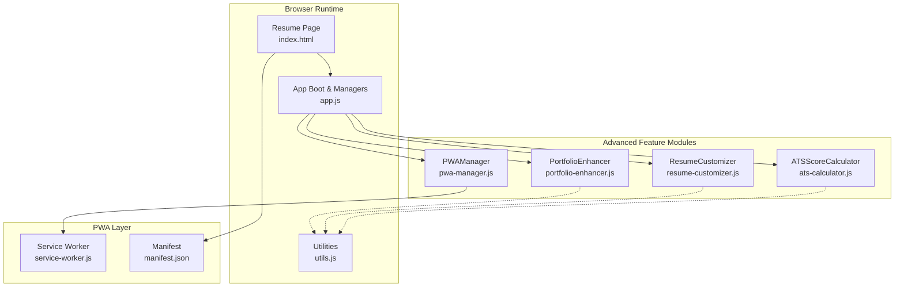
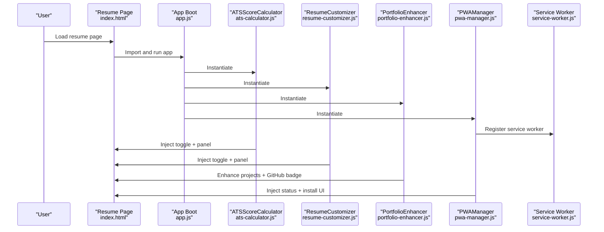
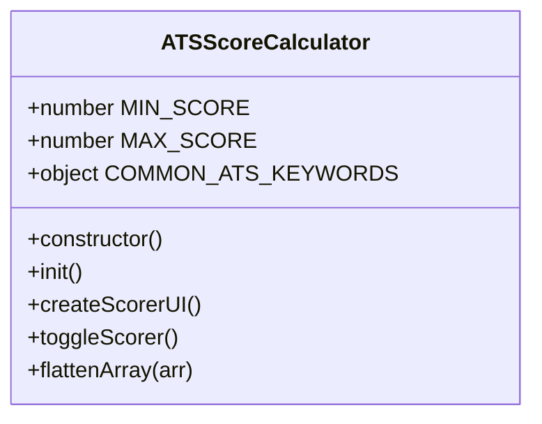
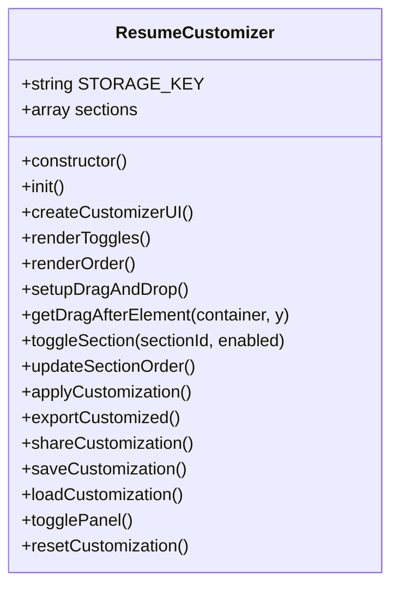
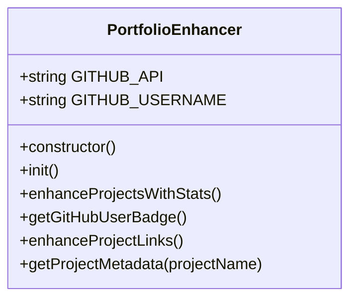
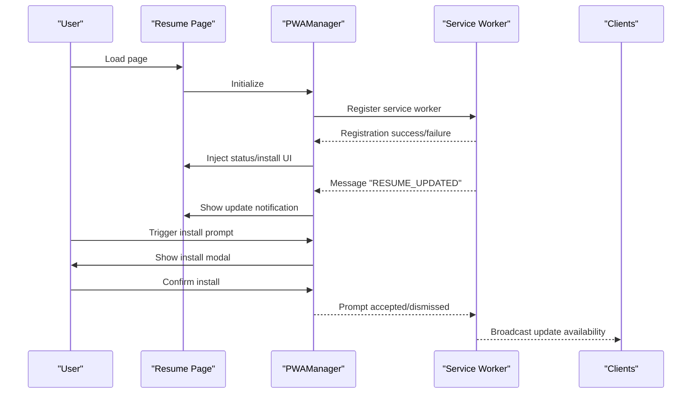
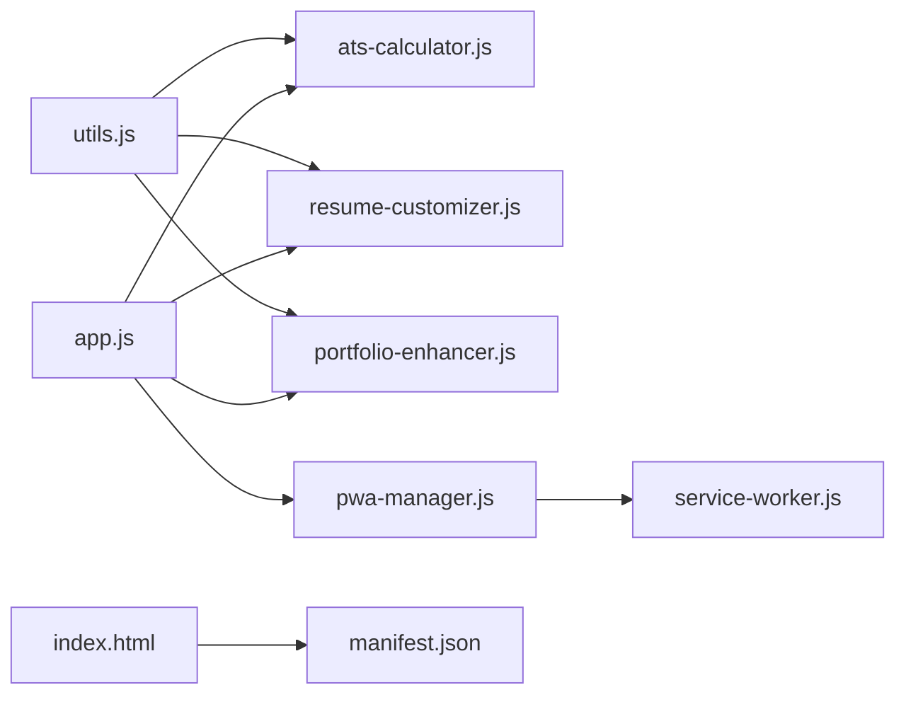

# Advanced Features

<cite>
**Referenced Files in This Document**
- [ats-calculator.js](file://assets/js/src/ats-calculator.js)
- [resume-customizer.js](file://assets/js/src/resume-customizer.js)
- [portfolio-enhancer.js](file://assets/js/src/portfolio-enhancer.js)
- [pwa-manager.js](file://assets/js/src/pwa-manager.js)
- [service-worker.js](file://public/service-worker.js)
- [manifest.json](file://public/manifest.json)
- [ats-calculator-styles.css](file://assets/css/ats-calculator-styles.css)
- [resume-customizer-styles.css](file://assets/css/resume-customizer-styles.css)
- [pwa-styles.css](file://assets/css/pwa-styles.css)
- [utils.js](file://assets/js/src/utils.js)
- [app.js](file://assets/js/src/app.js)
- [theme-manager.js](file://assets/js/src/theme-manager.js)
- [variant-manager.js](file://assets/js/src/variant-manager.js)
- [index.html](file://index.html)
- [QUICK_REFERENCE.md](file://QUICK_REFERENCE.md)
- [DEPLOYMENT_READY.md](file://DEPLOYMENT_READY.md)
</cite>

## Table of Contents

1. [Introduction](#introduction)
2. [Project Structure](#project-structure)
3. [Core Components](#core-components)
4. [Architecture Overview](#architecture-overview)
5. [Detailed Component Analysis](#detailed-component-analysis)
6. [Dependency Analysis](#dependency-analysis)
7. [Performance Considerations](#performance-considerations)
8. [Troubleshooting Guide](#troubleshooting-guide)
9. [Conclusion](#conclusion)
10. [Appendices](#appendices)

## Introduction

This document deep-dives into the advanced features that elevate the resume platform beyond a static display:

- ATS compatibility scoring with real-time analysis and job-matching suggestions
- Interactive resume customization via drag-and-drop and persistent preferences
- Portfolio enhancement with GitHub integration and live project metadata
- Progressive Web App (PWA) capabilities including offline support, install prompts, and background sync

It provides both conceptual overviews for beginners and technical details for experienced developers, with practical usage examples and integration patterns mapped to the actual codebase.

## Project Structure

The advanced features are implemented as modular JavaScript classes with dedicated stylesheets and coordinated by the main app bootstrapper. The PWA layer is implemented via a service worker and a web app manifest.

**Diagram sources**

- [index.html](file://index.html#L1-L408)
- [app.js](file://assets/js/src/app.js#L1-L39)
- [ats-calculator.js](file://assets/js/src/ats-calculator.js#L1-L161)
- [resume-customizer.js](file://assets/js/src/resume-customizer.js#L1-L307)
- [portfolio-enhancer.js](file://assets/js/src/portfolio-enhancer.js#L1-L105)
- [pwa-manager.js](file://assets/js/src/pwa-manager.js#L1-L348)
- [service-worker.js](file://public/service-worker.js#L1-L370)
- [manifest.json](file://public/manifest.json#L1-L81)
- [utils.js](file://assets/js/src/utils.js#L1-L5)

**Section sources**

- [index.html](file://index.html#L1-L408)
- [app.js](file://assets/js/src/app.js#L1-L39)
- [utils.js](file://assets/js/src/utils.js#L1-L5)

## Core Components

- ATS Score Calculator: Real-time scoring across four categories with a sliding panel UI and optional job description analysis.
- Resume Customizer: Persistent customization of visible sections, drag-to-reorder, export, sharing, and reset.
- Portfolio Enhancer: Adds GitHub user stats and enhances project links with badges and metadata.
- PWAManager: Registers service worker, handles install prompts, online/offline state, notifications, and background sync.

**Section sources**

- [ats-calculator.js](file://assets/js/src/ats-calculator.js#L6-L151)
- [resume-customizer.js](file://assets/js/src/resume-customizer.js#L6-L297)
- [portfolio-enhancer.js](file://assets/js/src/portfolio-enhancer.js#L6-L104)
- [pwa-manager.js](file://assets/js/src/pwa-manager.js#L6-L338)

## Architecture Overview

The advanced features are initialized by the app bootstrapper and integrate with the page via lightweight DOM manipulation and CSS overlays. The PWA layer operates independently via the service worker for caching, offline behavior, and background synchronization.

**Diagram sources**

- [index.html](file://index.html#L1-L408)
- [app.js](file://assets/js/src/app.js#L1-L39)
- [ats-calculator.js](file://assets/js/src/ats-calculator.js#L154-L160)
- [resume-customizer.js](file://assets/js/src/resume-customizer.js#L299-L306)
- [portfolio-enhancer.js](file://assets/js/src/portfolio-enhancer.js#L97-L104)
- [pwa-manager.js](file://assets/js/src/pwa-manager.js#L341-L347)
- [service-worker.js](file://public/service-worker.js#L42-L53)

## Detailed Component Analysis

### ATS Compatibility Scoring System

- Real-time scoring: Computes a 0–100 score across four factors with immediate UI updates.
- Four-factor breakdown: Format & Structure, Keywords, Content Completeness, Parsing & Readability.
- Job match analysis: Optional job description input yields keyword coverage and missing keywords.
- Improvement suggestions: Provides actionable tips derived from the analysis.
- UI: Fixed-position toggle and sliding panel with responsive design and dark mode support.

Implementation highlights

- Scoring categories and weights are defined in the class initialization.
- The UI is dynamically created and appended to the document body.
- On panel open, the score recalculates to reflect current resume content.
- The calculator exposes a method to analyze job match using the provided job description.

Practical usage

- Toggle the ATS panel from the top-right corner of the resume page.
- Paste a job description to receive a tailored keyword match report.
- Use improvement suggestions to refine ATS-friendliness.

Integration pattern

- The ATS calculator is globally accessible via a window property and is initialized on DOMContentLoaded.

**Diagram sources**

- [ats-calculator.js](file://assets/js/src/ats-calculator.js#L6-L151)

**Section sources**

- [ats-calculator.js](file://assets/js/src/ats-calculator.js#L6-L151)
- [ats-calculator-styles.css](file://assets/css/ats-calculator-styles.css#L1-L501)
- [QUICK_REFERENCE.md](file://QUICK_REFERENCE.md#L54-L206)

### Resume Customization Capabilities

- Visible sections: Toggle any resume section on or off.
- Section order: Drag-and-drop reordering of enabled sections.
- Persistence: Saves preferences to local storage and supports URL-based sharing.
- Export and reset: Export a customized HTML resume or revert to defaults.
- UI: Fixed-position toggle and sliding panel with drag feedback and responsive design.

Implementation highlights

- Section metadata includes ID, label, and enabled state.
- Drag-and-drop uses native HTML5 APIs with custom ordering logic.
- Applies visibility and order changes by manipulating DOM nodes.
- Supports loading customization from URL query parameter or local storage.

Practical usage

- Open the customization panel and toggle desired sections.
- Drag sections to reorder them in the resume.
- Share your configuration via a generated URL or export a customized HTML file.

Integration pattern

- The customizer is globally accessible via a window property and is initialized on DOMContentLoaded.

**Diagram sources**

- [resume-customizer.js](file://assets/js/src/resume-customizer.js#L6-L297)

**Section sources**

- [resume-customizer.js](file://assets/js/src/resume-customizer.js#L6-L297)
- [resume-customizer-styles.css](file://assets/css/resume-customizer-styles.css#L1-L406)

### Portfolio Enhancement Features

- GitHub user stats: Fetches and displays avatar, name, public repositories, and followers.
- Live project metadata: Adds icons, status badges, and metadata for selected projects.
- External link enhancements: Opens links in new tabs with safe attributes and hover effects.

Implementation highlights

- Uses GitHub’s public API to fetch user stats.
- Iterates over project links to enhance presentation and UX.
- Includes a small metadata registry for known projects.

Practical usage

- Navigate to the portfolio page to see GitHub stats and enhanced project cards.
- Clicking project links opens them safely in a new tab.

Integration pattern

- The enhancer runs automatically when the DOM is ready.

**Diagram sources**

- [portfolio-enhancer.js](file://assets/js/src/portfolio-enhancer.js#L6-L104)

**Section sources**

- [portfolio-enhancer.js](file://assets/js/src/portfolio-enhancer.js#L6-L104)

### Progressive Web App Functionality

- Service worker registration: Handles installation, updates, and messaging.
- Offline support: Pre-caches core assets and serves fallback content when offline.
- Install prompts: Detects beforeinstallprompt, shows an install button, and tracks user choice.
- Notifications: Push notifications and notification click handling.
- Background sync: Periodic sync for resume updates and generic offline action sync hooks.
- UI indicators: Status indicator, install prompt modal, and toast notifications for online/offline/update events.

Implementation highlights

- Service worker defines caching strategies per resource type and provides offline fallback HTML.
- The manager coordinates UI, event listeners, and messaging with the service worker.
- Manifest defines app metadata, icons, screenshots, shortcuts, and share target.

Practical usage

- Install the app to your home screen from the install prompt.
- Use the app offline; cached pages remain accessible.
- Receive update notifications when new content is available.

Integration pattern

- The PWA manager registers the service worker and sets up UI on DOMContentLoaded.
- The manifest is linked from the main page.

**Diagram sources**

- [pwa-manager.js](file://assets/js/src/pwa-manager.js#L48-L81)
- [service-worker.js](file://public/service-worker.js#L323-L349)
- [manifest.json](file://public/manifest.json#L1-L81)

**Section sources**

- [pwa-manager.js](file://assets/js/src/pwa-manager.js#L6-L338)
- [service-worker.js](file://public/service-worker.js#L1-L370)
- [manifest.json](file://public/manifest.json#L1-L81)
- [pwa-styles.css](file://assets/css/pwa-styles.css#L1-L394)

## Dependency Analysis

The advanced features depend on shared utilities and are bootstrapped by the main app. The PWA layer is decoupled and communicates via service worker messaging.

**Diagram sources**

- [utils.js](file://assets/js/src/utils.js#L1-L5)
- [ats-calculator.js](file://assets/js/src/ats-calculator.js#L1-L161)
- [resume-customizer.js](file://assets/js/src/resume-customizer.js#L1-L307)
- [portfolio-enhancer.js](file://assets/js/src/portfolio-enhancer.js#L1-L105)
- [pwa-manager.js](file://assets/js/src/pwa-manager.js#L1-L348)
- [service-worker.js](file://public/service-worker.js#L1-L370)
- [index.html](file://index.html#L1-L408)
- [manifest.json](file://public/manifest.json#L1-L81)

**Section sources**

- [utils.js](file://assets/js/src/utils.js#L1-L5)
- [app.js](file://assets/js/src/app.js#L1-L39)

## Performance Considerations

- Client-side processing: All ATS scoring and customization operate locally, minimizing latency and privacy concerns.
- Lazy initialization: Features initialize on DOMContentLoaded, avoiding blocking the main thread.
- Efficient DOM manipulation: Minimal, targeted updates for toggles and drag feedback.
- Service worker caching: Strategic cache-first and network-first strategies reduce bandwidth and improve load times.
- Lightweight architecture: No external dependencies keep bundle sizes small and startup fast.

[No sources needed since this section provides general guidance]

## Troubleshooting Guide

Common issues and resolutions

- ATS panel does not appear
  - Ensure the DOMContentLoaded event fires and the ATS calculator initializes.
  - Verify the toggle button exists and the panel class is applied on open.
- Customizer changes not persisting
  - Confirm local storage is available and the save/load routines execute.
  - Check for URL parameter overrides that may reset configuration.
- Portfolio GitHub stats not loading
  - Verify network connectivity and that the GitHub API endpoint is reachable.
  - Confirm the username constant matches the intended profile.
- PWA install prompt not showing
  - The prompt requires the app to be served over HTTPS and meet installability criteria.
  - Ensure the service worker is registered and the beforeinstallprompt event fires.
- Offline mode not working
  - Confirm the service worker is active and the cache includes required URLs.
  - Check that the offline fallback HTML is returned for document requests.

**Section sources**

- [ats-calculator.js](file://assets/js/src/ats-calculator.js#L154-L160)
- [resume-customizer.js](file://assets/js/src/resume-customizer.js#L261-L282)
- [portfolio-enhancer.js](file://assets/js/src/portfolio-enhancer.js#L35-L53)
- [pwa-manager.js](file://assets/js/src/pwa-manager.js#L83-L96)
- [service-worker.js](file://public/service-worker.js#L42-L53)

## Conclusion

The advanced features deliver a modern, user-centric experience:

- ATS scoring helps optimize resumes for applicant tracking systems.
- The resume customizer empowers users to tailor content with persistence and sharing.
- Portfolio enhancement integrates live GitHub data to enrich project showcases.
- The PWA layer ensures reliability, installability, and offline readiness.

These features are designed for progressive enhancement, minimal dependencies, and broad browser support, enabling seamless integration across devices and environments.

[No sources needed since this section summarizes without analyzing specific files]

## Appendices

### Practical Examples and Integration Patterns

- Enable ATS scoring
  - Click the ATS toggle in the top-right corner of the resume page.
  - Optionally paste a job description and click analyze to receive a keyword match report.
  - Use improvement suggestions to adjust content for better ATS compatibility.
- Customize your resume
  - Open the customization panel and toggle sections on or off.
  - Drag sections to reorder them; changes apply immediately and persist locally.
  - Export a customized HTML resume or share your configuration via URL.
- Enhance your portfolio
  - Visit the portfolio page to see GitHub stats and enhanced project cards.
  - External project links open safely in new tabs with appropriate attributes.
- Install and use the PWA
  - Accept the install prompt to add the app to your home screen.
  - Use the app offline; cached pages remain accessible.
  - Watch for update notifications and reload to see changes.

**Section sources**

- [ats-calculator.js](file://assets/js/src/ats-calculator.js#L50-L143)
- [resume-customizer.js](file://assets/js/src/resume-customizer.js#L29-L102)
- [portfolio-enhancer.js](file://assets/js/src/portfolio-enhancer.js#L17-L72)
- [pwa-manager.js](file://assets/js/src/pwa-manager.js#L180-L198)
- [QUICK_REFERENCE.md](file://QUICK_REFERENCE.md#L54-L206)
- [DEPLOYMENT_READY.md](file://DEPLOYMENT_READY.md#L108-L162)
