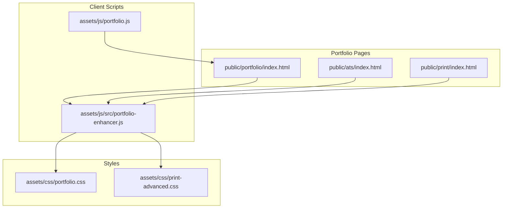
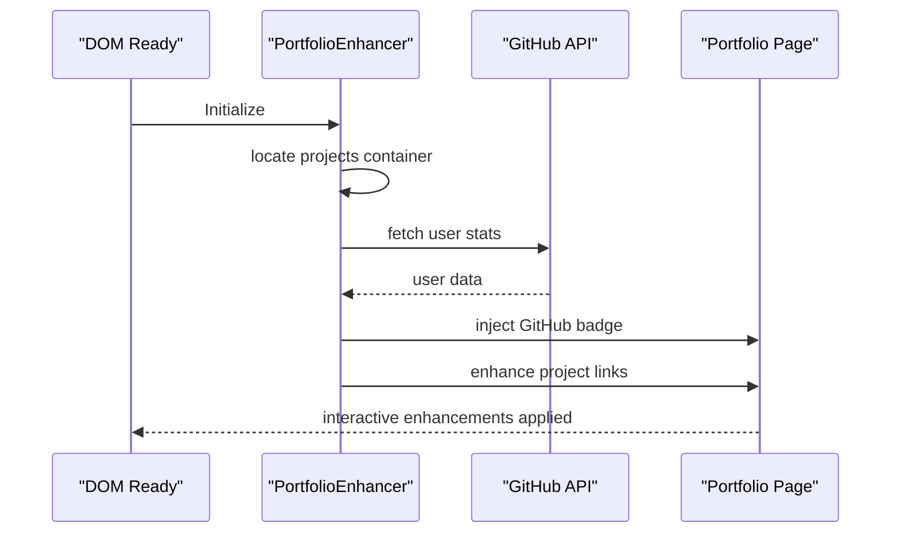
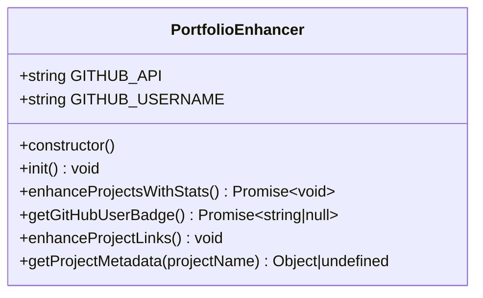
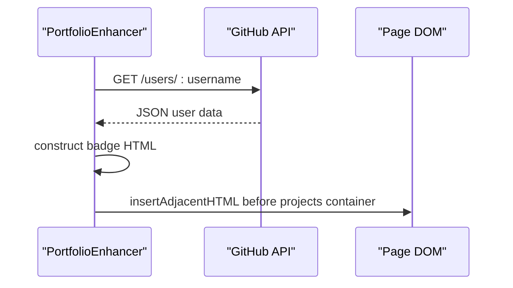
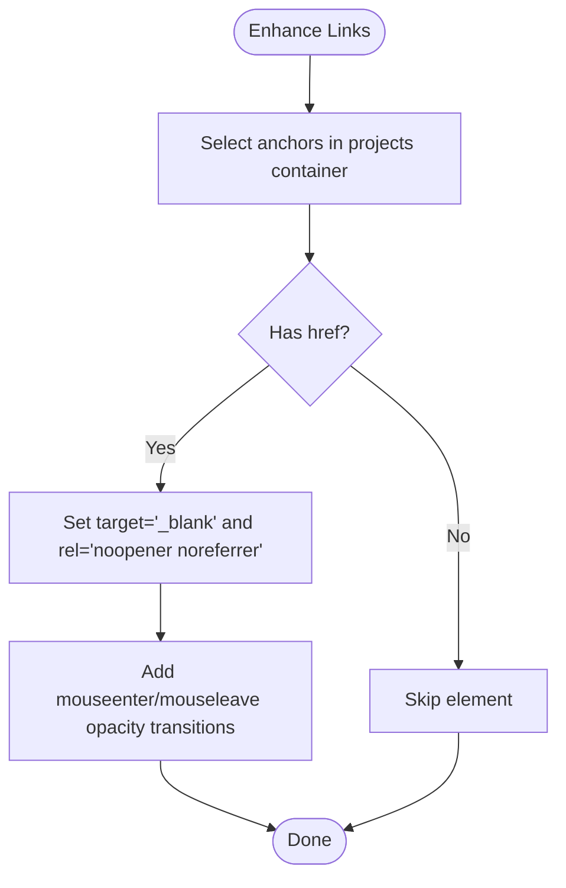
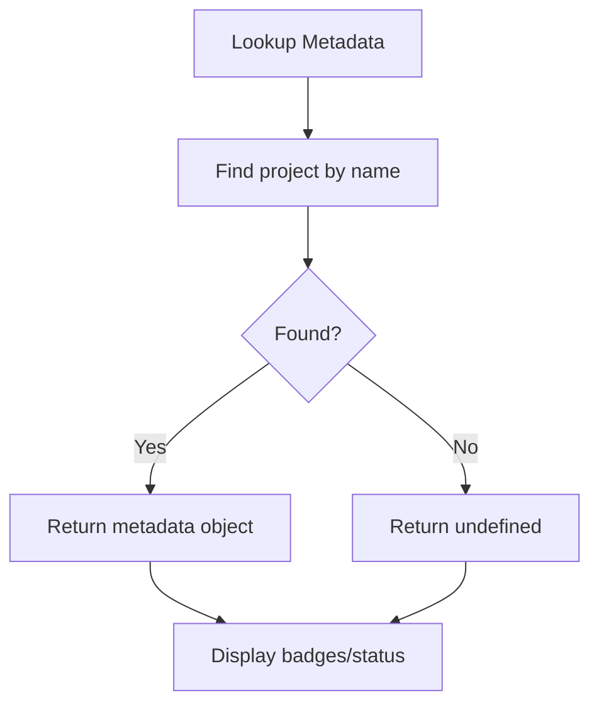
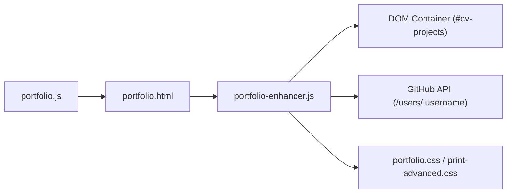

# Portfolio Enhancement

<cite>
**Referenced Files in This Document**
- [portfolio-enhancer.js](file://assets/js/src/portfolio-enhancer.js)
- [portfolio.js](file://assets/js/portfolio.js)
- [portfolio.html](file://public/portfolio/index.html)
- [ats/index.html](file://public/ats/index.html)
- [print/index.html](file://public/print/index.html)
- [portfolio.css](file://assets/css/portfolio.css)
- [print-advanced.css](file://assets/css/print-advanced.css)
- [package.json](file://package.json)
</cite>

## Table of Contents

1. [Introduction](#introduction)
2. [Project Structure](#project-structure)
3. [Core Components](#core-components)
4. [Architecture Overview](#architecture-overview)
5. [Detailed Component Analysis](#detailed-component-analysis)
6. [Dependency Analysis](#dependency-analysis)
7. [Performance Considerations](#performance-considerations)
8. [Troubleshooting Guide](#troubleshooting-guide)
9. [Conclusion](#conclusion)

## Introduction

This document explains the Portfolio Enhancement system that augments portfolio pages with real-time GitHub integration, project metadata, and external link optimizations. It covers how the system integrates with GitHub APIs to display live profile badges, enhances project links for improved discoverability and UX, and maintains live metadata for selected projects. The documentation also outlines the integration patterns, data fetching mechanisms, and enhancement algorithms used to improve project presentation across portfolio variants.

## Project Structure

The enhancement system spans client-side JavaScript, HTML templates, and CSS styles:

- Client-side enhancement logic resides in a dedicated module that initializes on DOM ready.
- Portfolio pages (main portfolio and ATS/print variants) include the enhancement script and rely on shared CSS for consistent styling.
- GitHub integration is performed via the public GitHub REST API.

**Diagram sources**

- [portfolio.html](file://public/portfolio/index.html#L640-L643)
- [ats/index.html](file://public/ats/index.html#L528-L542)
- [print/index.html](file://public/print/index.html#L350-L549)
- [portfolio-enhancer.js](file://assets/js/src/portfolio-enhancer.js#L1-L105)
- [portfolio.css](file://assets/css/portfolio.css#L1-L800)
- [print-advanced.css](file://assets/css/print-advanced.css#L130-L130)

**Section sources**

- [portfolio.html](file://public/portfolio/index.html#L640-L643)
- [ats/index.html](file://public/ats/index.html#L528-L542)
- [print/index.html](file://public/print/index.html#L350-L549)
- [portfolio-enhancer.js](file://assets/js/src/portfolio-enhancer.js#L1-L105)
- [portfolio.css](file://assets/css/portfolio.css#L1-L800)
- [print-advanced.css](file://assets/css/print-advanced.css#L130-L130)

## Core Components

- PortfolioEnhancer: Orchestrates GitHub integration and project link enhancements.
- Portfolio runtime: Provides theme switching and analytics hooks used alongside enhancements.
- Portfolio pages: Host the enhancement logic and render project content.

Key responsibilities:

- Fetch GitHub user stats and render a profile badge near the projects section.
- Apply external link optimizations (safe targets, rel attributes, hover effects) to project links.
- Provide project metadata lookup for live badges and status indicators.

**Section sources**

- [portfolio-enhancer.js](file://assets/js/src/portfolio-enhancer.js#L6-L95)
- [portfolio.js](file://assets/js/portfolio.js#L1-L174)
- [portfolio.html](file://public/portfolio/index.html#L200-L465)

## Architecture Overview

The enhancement system follows a modular pattern:

- Initialization on DOM ready triggers enhancement routines.
- GitHub API calls are made asynchronously to fetch user stats.
- Project link enhancements are applied to all anchor elements within the projects container.
- Metadata retrieval supports live badges and status indicators for specific projects.

**Diagram sources**

- [portfolio-enhancer.js](file://assets/js/src/portfolio-enhancer.js#L13-L33)
- [portfolio-enhancer.js](file://assets/js/src/portfolio-enhancer.js#L35-L53)
- [portfolio-enhancer.js](file://assets/js/src/portfolio-enhancer.js#L55-L72)
- [portfolio.html](file://public/portfolio/index.html#L272-L465)

## Detailed Component Analysis

### PortfolioEnhancer Module

The module encapsulates all enhancement logic:

- Configuration constants for GitHub API endpoint and username.
- Initialization routine that locates the projects container and applies enhancements.
- Asynchronous GitHub user stats retrieval and badge injection.
- Project link enhancement routine that adds safe target attributes, rel values, and hover effects.
- Project metadata lookup for live badges and status indicators.

**Diagram sources**

- [portfolio-enhancer.js](file://assets/js/src/portfolio-enhancer.js#L6-L95)

Implementation highlights:

- GitHub integration uses a public API endpoint and constructs a badge with avatar, name/login, and follower/public repo counts.
- Project link enhancement ensures external links open safely and improves hover UX.
- Project metadata is stored locally for supported projects and can be extended to integrate with repository-level data.

**Section sources**

- [portfolio-enhancer.js](file://assets/js/src/portfolio-enhancer.js#L6-L15)
- [portfolio-enhancer.js](file://assets/js/src/portfolio-enhancer.js#L17-L33)
- [portfolio-enhancer.js](file://assets/js/src/portfolio-enhancer.js#L35-L53)
- [portfolio-enhancer.js](file://assets/js/src/portfolio-enhancer.js#L55-L72)
- [portfolio-enhancer.js](file://assets/js/src/portfolio-enhancer.js#L74-L94)

### GitHub Integration Patterns

The system integrates with GitHub via the REST API:

- Endpoint: Users resource for profile data.
- Request: GET user stats using configured username.
- Response handling: Extracts avatar URL, name or login, public repositories count, and followers.
- Rendering: Generates a structured HTML fragment injected before the projects container.

**Diagram sources**

- [portfolio-enhancer.js](file://assets/js/src/portfolio-enhancer.js#L35-L53)
- [portfolio.html](file://public/portfolio/index.html#L272-L465)

**Section sources**

- [portfolio-enhancer.js](file://assets/js/src/portfolio-enhancer.js#L35-L53)

### External Link Optimization

The enhancement routine optimizes external links:

- Adds target="\_blank" and rel="noopener noreferrer" to ensure security and proper tab behavior.
- Applies hover effects to improve interactivity.
- Operates on anchor elements within the projects container.

**Diagram sources**

- [portfolio-enhancer.js](file://assets/js/src/portfolio-enhancer.js#L55-L72)

**Section sources**

- [portfolio-enhancer.js](file://assets/js/src/portfolio-enhancer.js#L55-L72)

### Live Metadata Display

The system includes a metadata lookup mechanism:

- Maintains a static dictionary of project metadata including icons, status, and additional descriptors.
- Can be extended to fetch repository-level metadata (e.g., stars, languages) for dynamic badges.

**Diagram sources**

- [portfolio-enhancer.js](file://assets/js/src/portfolio-enhancer.js#L74-L94)

**Section sources**

- [portfolio-enhancer.js](file://assets/js/src/portfolio-enhancer.js#L74-L94)

### Portfolio Runtime Integration

The portfolio runtime complements enhancements:

- Theme switching with persistence in localStorage.
- Analytics hooks for tracking resume downloads and variant switches.
- Contact form submission with Web3Forms and feedback messaging.

These integrations coexist with enhancements without interfering, while the enhancement module focuses on GitHub integration and link optimization.

**Section sources**

- [portfolio.js](file://assets/js/portfolio.js#L1-L174)

### Styles and Presentation

Styling for enhancements:

- Portfolio CSS defines base themes, cards, and badges.
- Print-specific CSS includes a selector for the injected GitHub badge to ensure visibility in print layouts.

**Section sources**

- [portfolio.css](file://assets/css/portfolio.css#L737-L800)
- [print-advanced.css](file://assets/css/print-advanced.css#L130-L130)

## Dependency Analysis

The enhancement module depends on:

- DOM availability and presence of the projects container.
- Network access to the GitHub API.
- CSS selectors for applying styles and ensuring print-friendly rendering.

**Diagram sources**

- [portfolio-enhancer.js](file://assets/js/src/portfolio-enhancer.js#L17-L33)
- [portfolio.html](file://public/portfolio/index.html#L272-L465)
- [portfolio.css](file://assets/css/portfolio.css#L737-L800)
- [print-advanced.css](file://assets/css/print-advanced.css#L130-L130)
- [portfolio.js](file://assets/js/portfolio.js#L1-L174)

**Section sources**

- [portfolio-enhancer.js](file://assets/js/src/portfolio-enhancer.js#L17-L33)
- [portfolio.html](file://public/portfolio/index.html#L272-L465)
- [portfolio.css](file://assets/css/portfolio.css#L737-L800)
- [print-advanced.css](file://assets/css/print-advanced.css#L130-L130)
- [portfolio.js](file://assets/js/portfolio.js#L1-L174)

## Performance Considerations

- Asynchronous GitHub fetch: The enhancement routine performs a single lightweight API call during initialization. Ensure the projects container exists to avoid unnecessary work.
- Minimal DOM manipulation: The badge is inserted once, and link enhancements are applied efficiently using querySelectorAll and event listeners.
- CSS-based hover effects: Prefer CSS transitions for smooth animations without heavy JavaScript overhead.
- Print layout: The injected GitHub badge is styled to remain visible in print media.

[No sources needed since this section provides general guidance]

## Troubleshooting Guide

Common issues and resolutions:

- Projects container missing: The enhancement routine checks for the projects container and exits early if not found. Verify the container exists in the page template.
- Network errors: GitHub API calls may fail due to network conditions or rate limits. The routine logs errors and continues gracefully.
- External links not opening in new tabs: Ensure the projects container contains the intended anchor elements and that the enhancement routine runs after DOM ready.
- Print visibility: Confirm the print stylesheet includes the selector for the injected GitHub badge.

**Section sources**

- [portfolio-enhancer.js](file://assets/js/src/portfolio-enhancer.js#L17-L33)
- [portfolio-enhancer.js](file://assets/js/src/portfolio-enhancer.js#L35-L53)
- [portfolio-enhancer.js](file://assets/js/src/portfolio-enhancer.js#L55-L72)
- [print-advanced.css](file://assets/css/print-advanced.css#L130-L130)

## Conclusion

The Portfolio Enhancement system seamlessly integrates real-time GitHub data and optimizes external links to elevate the presentation of portfolio projects. By initializing on DOM ready, fetching user stats asynchronously, and applying safe link behaviors, it improves both discoverability and user experience. The modular design allows easy extension to include repository-level metadata and additional live badges, while maintaining compatibility across portfolio variants and print layouts.
