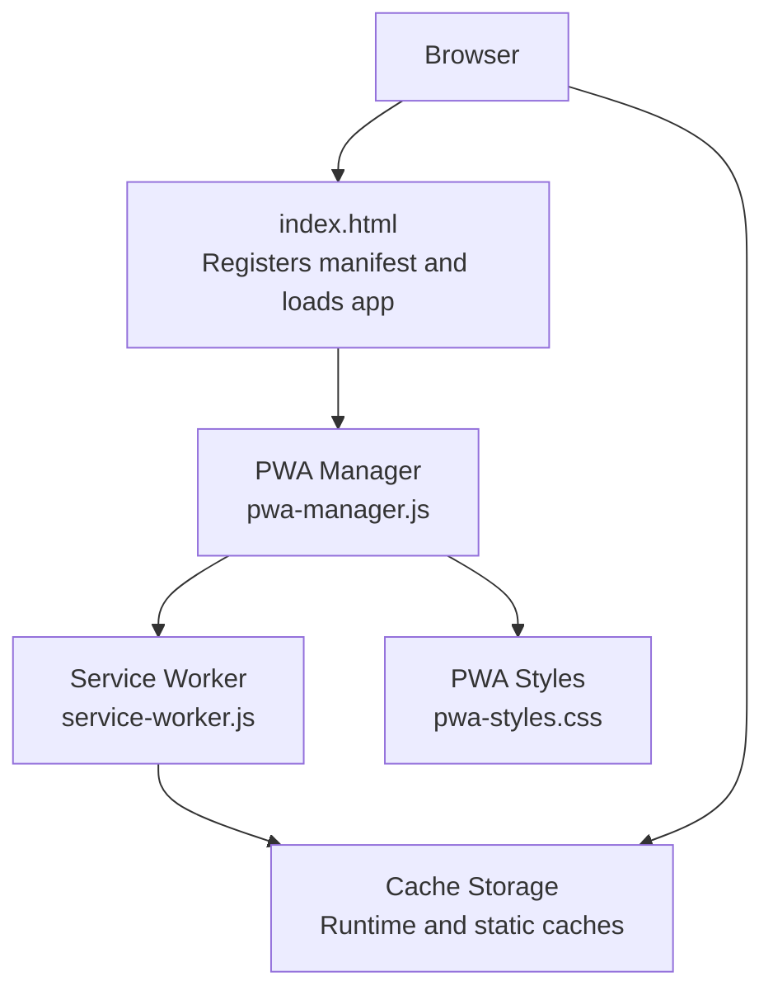
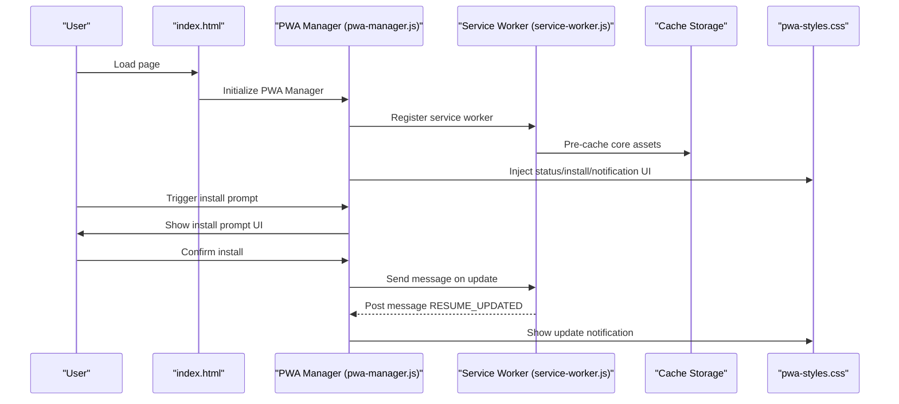
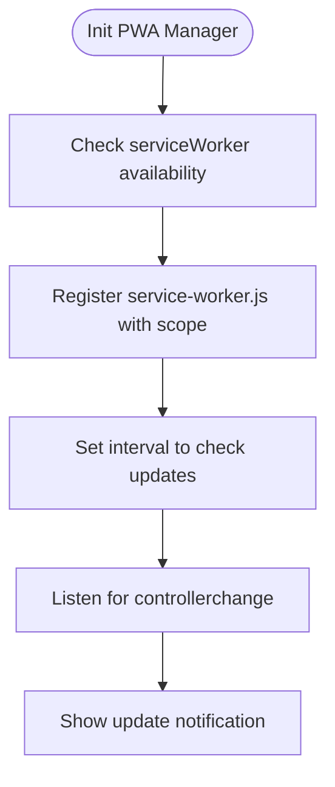
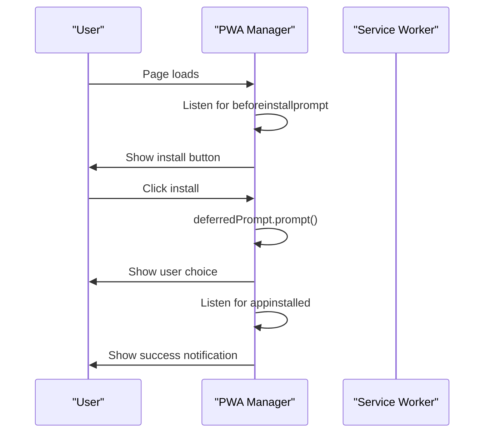
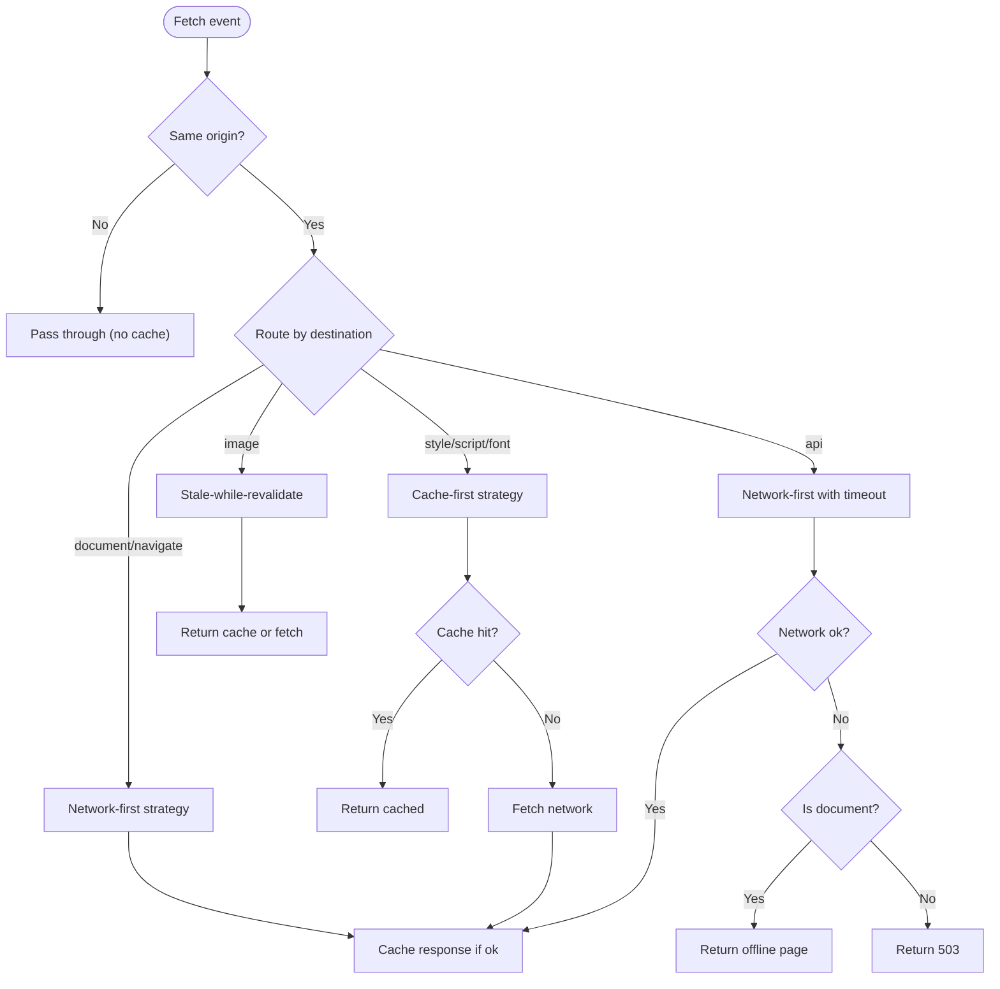
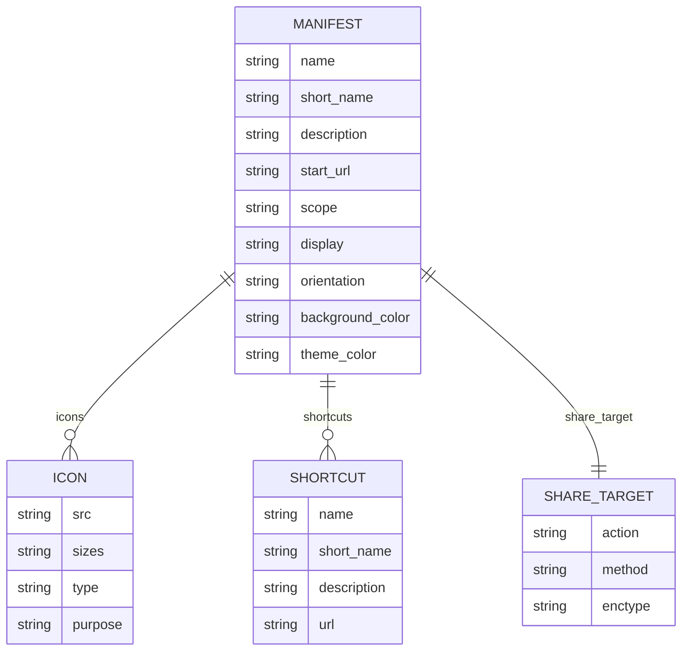
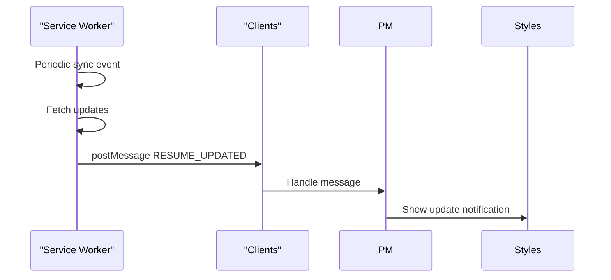
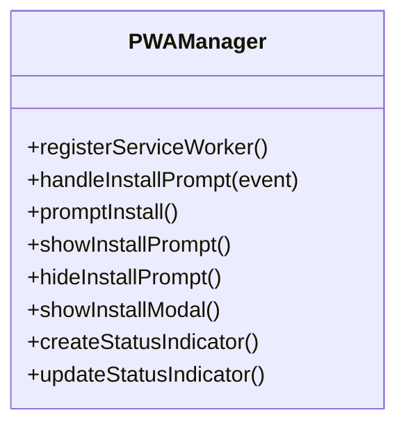
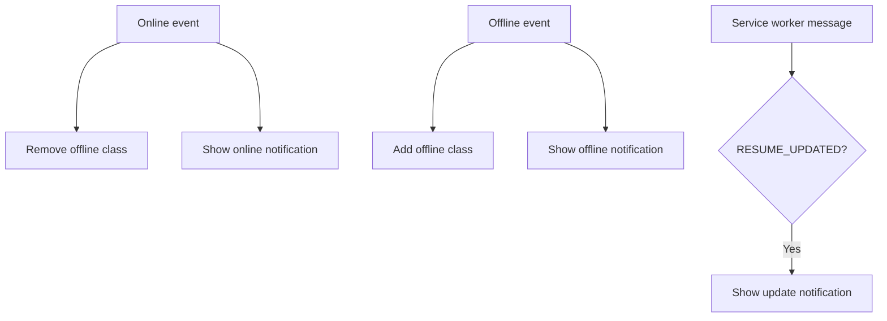
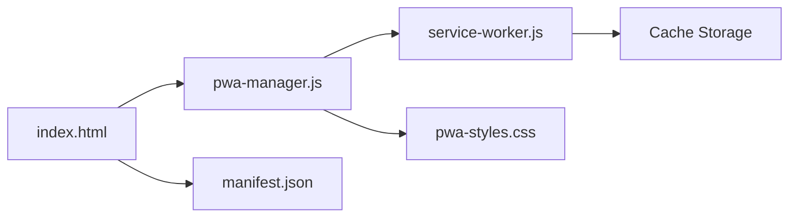

# Progressive Web App

<cite>
**Referenced Files in This Document**
- [index.html](file://index.html)
- [manifest.json](file://public/manifest.json)
- [service-worker.js](file://public/service-worker.js)
- [pwa-manager.js](file://assets/js/src/pwa-manager.js)
- [pwa-styles.css](file://assets/css/pwa-styles.css)
- [main.js](file://assets/js/main.js)
</cite>

## Table of Contents

1. [Introduction](#introduction)
2. [Project Structure](#project-structure)
3. [Core Components](#core-components)
4. [Architecture Overview](#architecture-overview)
5. [Detailed Component Analysis](#detailed-component-analysis)
6. [Dependency Analysis](#dependency-analysis)
7. [Performance Considerations](#performance-considerations)
8. [Troubleshooting Guide](#troubleshooting-guide)
9. [Conclusion](#conclusion)

## Introduction

This document explains the Progressive Web App (PWA) implementation for the Resume Portfolio application. It covers service worker registration and lifecycle, offline support, caching strategies, the PWA manifest configuration (including shortcuts and share target), background sync capabilities, and the user experience components such as installation prompts, offline state indicators, and notification system.

## Project Structure

The PWA functionality spans several key files:

- HTML entry point registers the manifest and initializes the PWA manager
- Service worker implements caching strategies and background sync
- PWA manager coordinates installation, online/offline state, and user notifications
- Styles define the appearance and behavior of PWA UI elements

**Diagram sources**

- [index.html](file://index.html#L44-L46)
- [service-worker.js](file://public/service-worker.js#L42-L75)
- [pwa-manager.js](file://assets/js/src/pwa-manager.js#L15-L46)
- [pwa-styles.css](file://assets/css/pwa-styles.css#L1-L394)

**Section sources**

- [index.html](file://index.html#L44-L46)
- [manifest.json](file://public/manifest.json#L1-L81)

## Core Components

- Service Worker: Installs, activates, and intercepts fetch requests to implement caching strategies and background sync.
- PWA Manager: Registers the service worker, listens for install prompts, manages online/offline state, and renders UI notifications.
- Manifest: Defines app metadata, icons, display mode, categories, screenshots, shortcuts, and share target.
- Styles: Provide the visual design for the status indicator, install prompt, and notifications.

**Section sources**

- [service-worker.js](file://public/service-worker.js#L42-L119)
- [pwa-manager.js](file://assets/js/src/pwa-manager.js#L6-L46)
- [manifest.json](file://public/manifest.json#L1-L81)
- [pwa-styles.css](file://assets/css/pwa-styles.css#L1-L394)

## Architecture Overview

The PWA architecture integrates the browser’s service worker with the application’s JavaScript runtime and styles. The service worker controls caching and background tasks, while the PWA manager coordinates user-facing UX and state.

**Diagram sources**

- [index.html](file://index.html#L44-L46)
- [pwa-manager.js](file://assets/js/src/pwa-manager.js#L48-L81)
- [service-worker.js](file://public/service-worker.js#L323-L349)
- [pwa-styles.css](file://assets/css/pwa-styles.css#L160-L250)

## Detailed Component Analysis

### Service Worker Registration and Lifecycle

- Registration: The PWA manager detects the correct service worker path based on deployment context and registers it with a scope aligned to the deployment root.
- Update mechanism: The service worker is periodically checked for updates and a controller change triggers an update notification.
- Controller change listener: Ensures the app informs users when a new service worker is ready.

**Diagram sources**

- [pwa-manager.js](file://assets/js/src/pwa-manager.js#L48-L81)

**Section sources**

- [pwa-manager.js](file://assets/js/src/pwa-manager.js#L48-L81)

### Installation Logic and Prompt

- Deferred install prompt: Captures the beforeinstallprompt event and exposes an install button.
- Manual install flow: If the prompt is not available, the manager guides the user to install via the browser menu.
- Post-install: Listens for appinstalled and hides the prompt, showing a success notification.

**Diagram sources**

- [pwa-manager.js](file://assets/js/src/pwa-manager.js#L83-L96)

**Section sources**

- [pwa-manager.js](file://assets/js/src/pwa-manager.js#L83-L96)

### Offline Support Mechanisms and Caching Strategies

- Pre-caching: On install, the service worker caches a curated set of URLs for immediate offline availability.
- Activation: Old caches are cleaned up and the service worker claims all clients.
- Intelligent caching:
  - Network-first for documents and API calls with timeouts
  - Cache-first for styles, scripts, and fonts
  - Stale-while-revalidate for images
- Offline fallback: For navigations, returns a built-in offline page with styled UI; for other resources, returns a 503 response.

**Diagram sources**

- [service-worker.js](file://public/service-worker.js#L80-L119)
- [service-worker.js](file://public/service-worker.js#L124-L202)
- [service-worker.js](file://public/service-worker.js#L207-L278)

**Section sources**

- [service-worker.js](file://public/service-worker.js#L6-L30)
- [service-worker.js](file://public/service-worker.js#L42-L75)
- [service-worker.js](file://public/service-worker.js#L80-L119)
- [service-worker.js](file://public/service-worker.js#L124-L202)
- [service-worker.js](file://public/service-worker.js#L207-L278)

### PWA Manifest Configuration

- Identity and presentation: name, short_name, description, start_url, scope, display, orientation, background_color, theme_color.
- Icons: multiple sizes and purposes for home screen and app launcher.
- Categories and screenshots: marketing metadata for app stores and install surfaces.
- Shortcuts: three quick-access entries to main resume, ATS calculator, and customize features.
- Share target: integration to receive shared content via the Web Share Target API.

**Diagram sources**

- [manifest.json](file://public/manifest.json#L1-L81)

**Section sources**

- [manifest.json](file://public/manifest.json#L1-L81)

### Background Sync Capabilities

- Periodic background sync: Registers a periodic sync tag to check for resume updates at a configured interval and notifies clients.
- One-off background sync: Registers a sync tag for offline actions (e.g., downloads) to retry when connectivity is restored.

**Diagram sources**

- [service-worker.js](file://public/service-worker.js#L323-L349)
- [pwa-manager.js](file://assets/js/src/pwa-manager.js#L112-L117)

**Section sources**

- [service-worker.js](file://public/service-worker.js#L323-L367)
- [pwa-manager.js](file://assets/js/src/pwa-manager.js#L112-L117)

### Installation Prompt Styling and UX

- Install button: Fixed-position gradient button with hover effects, positioned above the status indicator.
- Prompt modal: Slide-up modal with icon, title, description, and primary/secondary actions; auto-dismisses after a period.
- Status indicator: Fixed bottom-left indicator showing online/offline/app-installed state with smooth transitions.

**Diagram sources**

- [pwa-manager.js](file://assets/js/src/pwa-manager.js#L150-L178)
- [pwa-manager.js](file://assets/js/src/pwa-manager.js#L200-L225)
- [pwa-manager.js](file://assets/js/src/pwa-manager.js#L124-L148)

**Section sources**

- [pwa-styles.css](file://assets/css/pwa-styles.css#L36-L66)
- [pwa-styles.css](file://assets/css/pwa-styles.css#L68-L159)
- [pwa-styles.css](file://assets/css/pwa-styles.css#L4-L35)

### Offline State Indicators and Notifications

- Offline body overlay: Adds a subtle diagonal striped overlay to indicate offline mode.
- Online/offline notifications: Animated notifications with distinct colors and icons.
- Update notifications: Gradient-styled notification with reload action.

**Diagram sources**

- [pwa-manager.js](file://assets/js/src/pwa-manager.js#L98-L110)
- [pwa-manager.js](file://assets/js/src/pwa-manager.js#L112-L117)
- [pwa-manager.js](file://assets/js/src/pwa-manager.js#L247-L279)
- [pwa-manager.js](file://assets/js/src/pwa-manager.js#L227-L245)
- [pwa-styles.css](file://assets/css/pwa-styles.css#L252-L273)

**Section sources**

- [pwa-manager.js](file://assets/js/src/pwa-manager.js#L98-L110)
- [pwa-manager.js](file://assets/js/src/pwa-manager.js#L247-L279)
- [pwa-manager.js](file://assets/js/src/pwa-manager.js#L227-L245)
- [pwa-styles.css](file://assets/css/pwa-styles.css#L252-L273)

## Dependency Analysis

- HTML depends on the manifest for PWA metadata and on the PWA manager for runtime UX.
- PWA manager depends on the service worker for caching and background tasks.
- Service worker depends on cache storage for asset caching and on clients for messaging.
- Styles depend on the PWA manager to inject UI elements.

**Diagram sources**

- [index.html](file://index.html#L44-L46)
- [pwa-manager.js](file://assets/js/src/pwa-manager.js#L15-L46)
- [service-worker.js](file://public/service-worker.js#L42-L75)
- [pwa-styles.css](file://assets/css/pwa-styles.css#L1-L394)
- [manifest.json](file://public/manifest.json#L1-L81)

**Section sources**

- [index.html](file://index.html#L44-L46)
- [pwa-manager.js](file://assets/js/src/pwa-manager.js#L15-L46)
- [service-worker.js](file://public/service-worker.js#L42-L75)
- [pwa-styles.css](file://assets/css/pwa-styles.css#L1-L394)
- [manifest.json](file://public/manifest.json#L1-L81)

## Performance Considerations

- Strategy selection: Network-first for dynamic content, cache-first for static assets, stale-while-revalidate for images to balance freshness and performance.
- Timeout tuning: Network-first fetches use timeouts to degrade gracefully without blocking UI.
- Cache cleanup: Activation removes old caches to prevent unbounded growth.
- Background sync intervals: Periodic sync is set to a reasonable cadence to minimize battery impact while keeping content fresh.

[No sources needed since this section provides general guidance]

## Troubleshooting Guide

- Service worker not registering:
  - Verify the correct path is used depending on deployment context.
  - Ensure HTTPS or localhost for service worker support.
- Install prompt not appearing:
  - Confirm beforeinstallprompt fires and is captured.
  - Check that the app meets installability criteria (manifest completeness, HTTPS, etc.).
- Offline page not shown:
  - Ensure navigation requests are routed to network-first and that the offline page is returned for document requests.
- Notifications not visible:
  - Confirm Notification permission is granted and styles are loaded.
  - Verify the PWA manager creates and removes notification elements correctly.

**Section sources**

- [pwa-manager.js](file://assets/js/src/pwa-manager.js#L48-L81)
- [pwa-manager.js](file://assets/js/src/pwa-manager.js#L83-L96)
- [service-worker.js](file://public/service-worker.js#L149-L184)
- [pwa-styles.css](file://assets/css/pwa-styles.css#L160-L250)

## Conclusion

The Resume Portfolio PWA combines a robust service worker with a cohesive user experience. The service worker implements intelligent caching strategies and background sync, while the PWA manager orchestrates installation, offline state, and notifications. The manifest defines a rich presence with shortcuts and share target integration. Together, these components deliver a reliable, installable, and engaging application that performs well offline and adapts to user preferences.
