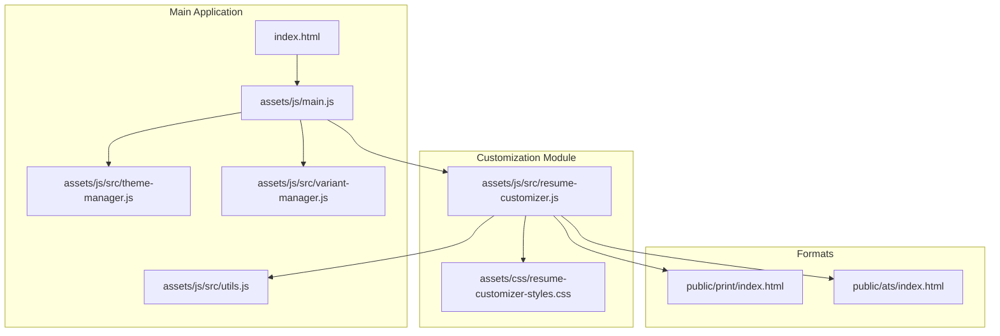
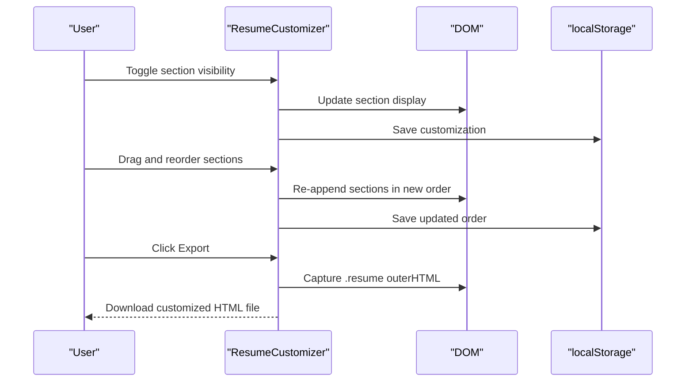
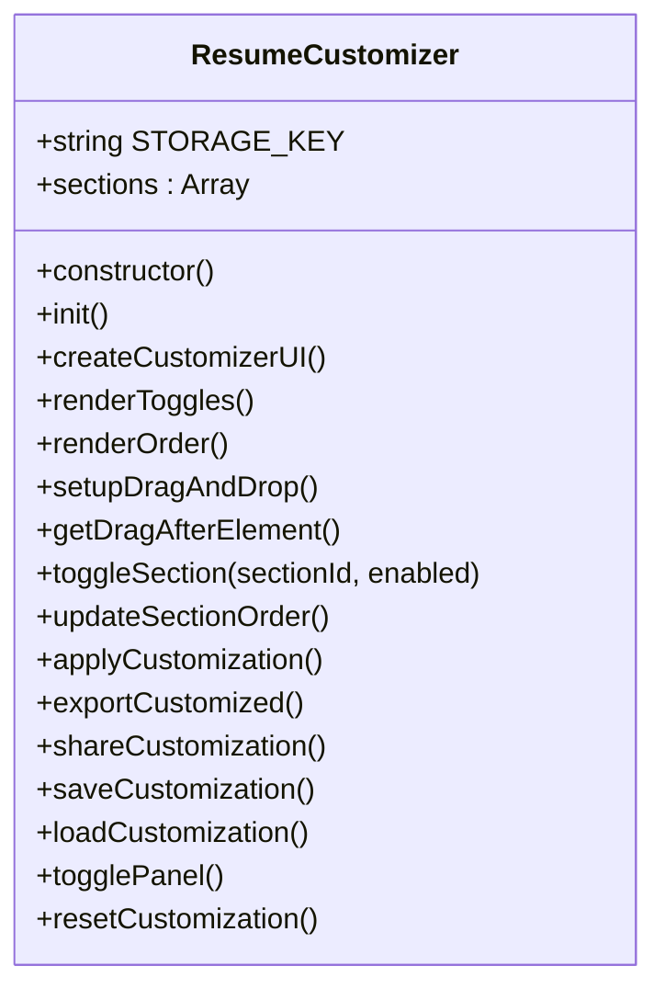
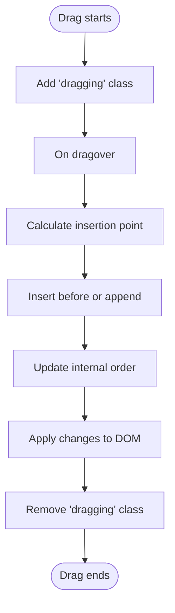
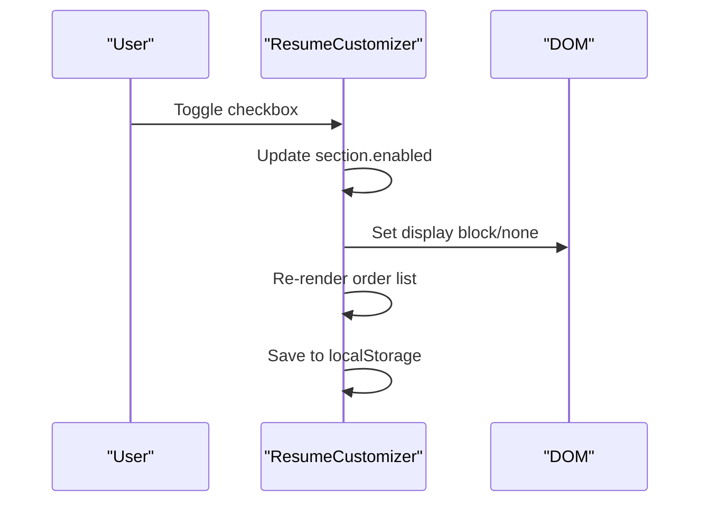
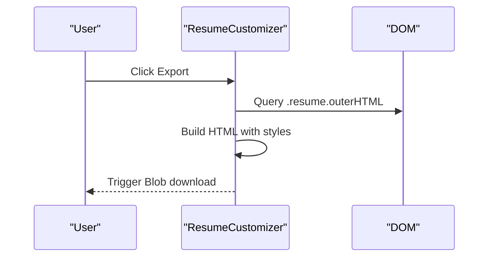
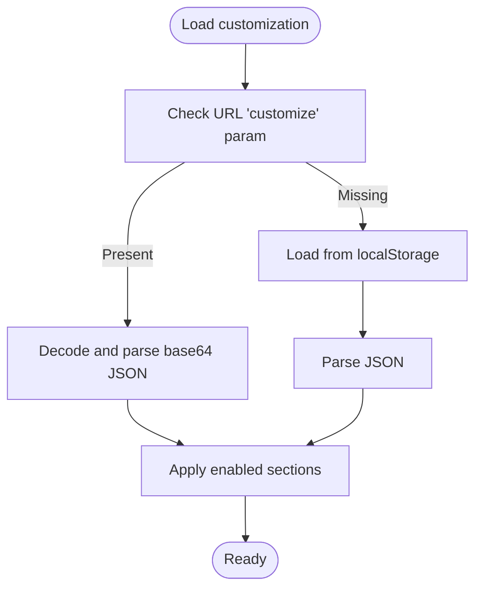
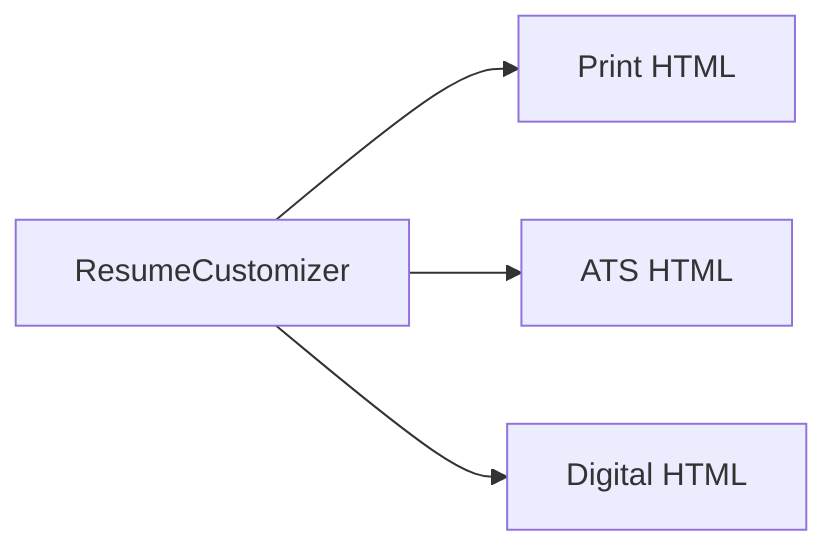
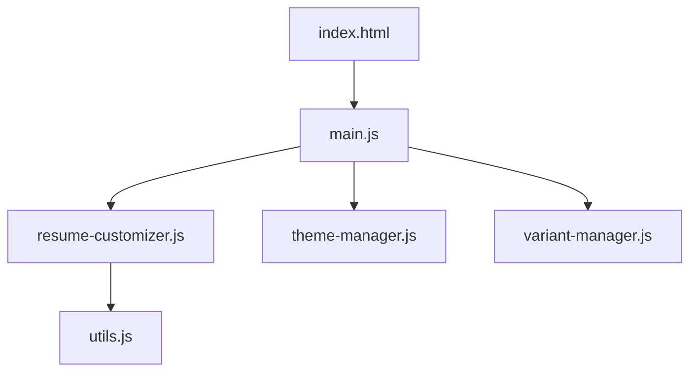

# Resume Customization

<cite>
**Referenced Files in This Document**
- [resume-customizer.js](file://assets/js/src/resume-customizer.js)
- [resume-customizer-styles.css](file://assets/css/resume-customizer-styles.css)
- [index.html](file://index.html)
- [main.js](file://assets/js/main.js)
- [theme-manager.js](file://assets/js/src/theme-manager.js)
- [variant-manager.js](file://assets/js/src/variant-manager.js)
- [utils.js](file://assets/js/src/utils.js)
- [print/index.html](file://public/print/index.html)
- [ats/index.html](file://public/ats/index.html)
</cite>

## Table of Contents

1. [Introduction](#introduction)
2. [Project Structure](#project-structure)
3. [Core Components](#core-components)
4. [Architecture Overview](#architecture-overview)
5. [Detailed Component Analysis](#detailed-component-analysis)
6. [Dependency Analysis](#dependency-analysis)
7. [Performance Considerations](#performance-considerations)
8. [Troubleshooting Guide](#troubleshooting-guide)
9. [Conclusion](#conclusion)

## Introduction

This document explains the resume customization system that enables users to tailor their resume presentation through drag-and-drop reordering, visibility toggles, and export capabilities. It covers the customization UI components, local storage integration for saving preferences, and how customization relates to different resume formats (print, ATS, digital). The implementation details include reorderable sections, visibility controls, and the export workflow that produces customized HTML versions.

## Project Structure

The customization system is implemented as a standalone module that integrates with the main application. It adds a floating panel to the page, renders section toggles and a sortable list, and persists user preferences locally. Different resume formats are served from separate HTML pages and JSON data sources.

**Diagram sources**

- [index.html](file://index.html#L1-L408)
- [main.js](file://assets/js/main.js#L1-L58)
- [resume-customizer.js](file://assets/js/src/resume-customizer.js#L1-L307)
- [resume-customizer-styles.css](file://assets/css/resume-customizer-styles.css#L1-L406)
- [print/index.html](file://public/print/index.html#L1-L807)
- [ats/index.html](file://public/ats/index.html#L1-L543)

**Section sources**

- [index.html](file://index.html#L1-L408)
- [main.js](file://assets/js/main.js#L1-L58)

## Core Components

- ResumeCustomizer class manages the customization UI, persistence, drag-and-drop reordering, and export.
- Customizer panel UI is injected into the page and contains:
  - Visible sections toggles
  - Draggable section order list
  - Export, reset, and share buttons
- Local storage stores the last-used customization configuration.
- Export workflow creates a downloadable HTML file based on the current visible sections and order.

Key responsibilities:

- UI creation and rendering
- Visibility toggling and ordering updates
- Persistence via localStorage and URL-based sharing
- Export to HTML with current styles and section state

**Section sources**

- [resume-customizer.js](file://assets/js/src/resume-customizer.js#L6-L297)
- [resume-customizer-styles.css](file://assets/css/resume-customizer-styles.css#L1-L406)

## Architecture Overview

The customization system is a self-contained module that:

- Initializes on DOMContentLoaded
- Creates a floating panel with toggles and a sortable list
- Applies visibility and order changes immediately to the resume content
- Persists preferences to localStorage and supports sharing via URL parameter
- Exports a customized HTML snapshot of the current resume

**Diagram sources**

- [resume-customizer.js](file://assets/js/src/resume-customizer.js#L150-L234)
- [resume-customizer.js](file://assets/js/src/resume-customizer.js#L253-L282)

## Detailed Component Analysis

### ResumeCustomizer Class

The class encapsulates all customization logic:

- Stores section metadata with IDs, labels, and enabled state
- Renders UI panels and lists
- Implements drag-and-drop reordering with mouse/touch events
- Applies visibility and order changes to the resume content
- Persists configuration to localStorage and supports URL-based sharing
- Exports a customized HTML snapshot

**Diagram sources**

- [resume-customizer.js](file://assets/js/src/resume-customizer.js#L6-L297)

**Section sources**

- [resume-customizer.js](file://assets/js/src/resume-customizer.js#L6-L297)

### Drag-and-Drop Reordering

The reorderable list uses native HTML5 drag-and-drop:

- Items are marked draggable
- On dragover, calculates insertion point based on mouse Y-position
- Updates the internal sections array order and re-appends DOM nodes
- Preserves disabled sections at the end

**Diagram sources**

- [resume-customizer.js](file://assets/js/src/resume-customizer.js#L104-L148)
- [resume-customizer.js](file://assets/js/src/resume-customizer.js#L160-L202)

**Section sources**

- [resume-customizer.js](file://assets/js/src/resume-customizer.js#L104-L148)
- [resume-customizer.js](file://assets/js/src/resume-customizer.js#L160-L202)

### Visibility Controls

Each visible section has a checkbox that toggles its display:

- Toggling updates the section’s enabled flag
- Immediately applies display changes to the DOM
- Re-renders the reorderable list to reflect enabled sections only
- Saves the updated configuration

**Diagram sources**

- [resume-customizer.js](file://assets/js/src/resume-customizer.js#L71-L102)
- [resume-customizer.js](file://assets/js/src/resume-customizer.js#L150-L158)

**Section sources**

- [resume-customizer.js](file://assets/js/src/resume-customizer.js#L71-L102)
- [resume-customizer.js](file://assets/js/src/resume-customizer.js#L150-L158)

### Export Workflow

Exporting creates a downloadable HTML file containing the current customized resume:

- Reads the active role from the body attribute or defaults
- Captures the current .resume HTML
- Wraps it in a minimal HTML document with styles
- Creates a Blob and triggers a download with a filename derived from the role and date

**Diagram sources**

- [resume-customizer.js](file://assets/js/src/resume-customizer.js#L204-L234)

**Section sources**

- [resume-customizer.js](file://assets/js/src/resume-customizer.js#L204-L234)

### Local Storage Integration

Preferences are persisted under a dedicated key:

- Saved configuration includes the sections array and a timestamp
- On load, checks for a URL-encoded configuration parameter first
- Falls back to localStorage if no parameter is present
- Supports resetting to defaults

**Diagram sources**

- [resume-customizer.js](file://assets/js/src/resume-customizer.js#L261-L282)

**Section sources**

- [resume-customizer.js](file://assets/js/src/resume-customizer.js#L253-L282)

### Relationship Between Customization and Formats

The customization system targets the shared resume content that appears across formats:

- Print format: A static HTML page with a two-column layout and print-specific styles
- ATS format: A machine-readable HTML page that renders sections from JSON data
- Digital format: An interactive page with enhanced features and theme toggling

The customization affects the visible sections and their order in the shared resume content, while each format maintains its own presentation and data sources.

**Diagram sources**

- [resume-customizer.js](file://assets/js/src/resume-customizer.js#L181-L202)
- [print/index.html](file://public/print/index.html#L1-L807)
- [ats/index.html](file://public/ats/index.html#L1-L543)

**Section sources**

- [print/index.html](file://public/print/index.html#L1-L807)
- [ats/index.html](file://public/ats/index.html#L1-L543)

## Dependency Analysis

The customization module depends on:

- DOM manipulation utilities
- Browser APIs for drag-and-drop, Blob creation, and localStorage
- Integration with the main application lifecycle

**Diagram sources**

- [resume-customizer.js](file://assets/js/src/resume-customizer.js#L1-L307)
- [utils.js](file://assets/js/src/utils.js#L1-L5)
- [main.js](file://assets/js/main.js#L1-L58)
- [theme-manager.js](file://assets/js/src/theme-manager.js#L1-L170)
- [variant-manager.js](file://assets/js/src/variant-manager.js#L1-L125)
- [index.html](file://index.html#L1-L408)

**Section sources**

- [resume-customizer.js](file://assets/js/src/resume-customizer.js#L1-L307)
- [utils.js](file://assets/js/src/utils.js#L1-L5)
- [main.js](file://assets/js/main.js#L1-L58)

## Performance Considerations

- Drag-and-drop recalculations are O(n) per reorder event; keep the number of visible sections reasonable for smooth interactions.
- Applying display changes and re-appending DOM nodes is efficient for typical resume sizes.
- Exporting captures the entire .resume subtree; large resumes may increase download time and memory usage.
- Using localStorage avoids server round-trips for persistence.

## Troubleshooting Guide

Common issues and resolutions:

- Panel does not appear
  - Ensure the module initializes after DOMContentLoaded and that the customizer panel is inserted into the DOM.
  - Verify the toggle button and panel elements exist.
- Drag-and-drop not working
  - Confirm draggable attributes are set and event listeners are attached.
  - Check that the sortable list container exists and items are selectable.
- Export fails
  - Confirm .resume element exists and contains HTML.
  - Ensure Blob and URL APIs are supported by the browser.
- Preferences not loading
  - Check localStorage availability and JSON parsing.
  - Validate URL parameter encoding and decoding.

**Section sources**

- [resume-customizer.js](file://assets/js/src/resume-customizer.js#L299-L306)
- [resume-customizer.js](file://assets/js/src/resume-customizer.js#L261-L282)
- [resume-customizer.js](file://assets/js/src/resume-customizer.js#L204-L234)

## Conclusion

The resume customization system provides a user-friendly way to tailor resume sections, manage visibility, and export personalized HTML snapshots. Its modular design integrates cleanly with the main application, persists preferences reliably, and adapts to different resume formats. The drag-and-drop interface and immediate feedback make it straightforward to optimize resumes for specific roles and audiences.
