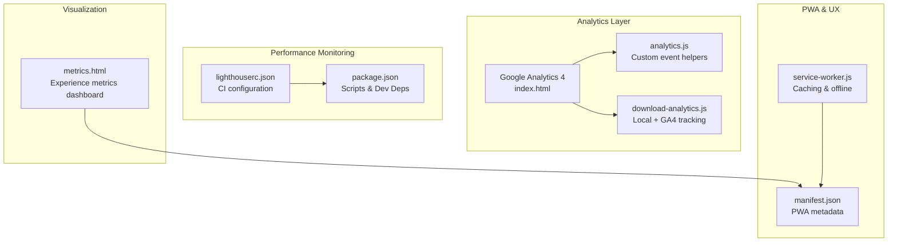
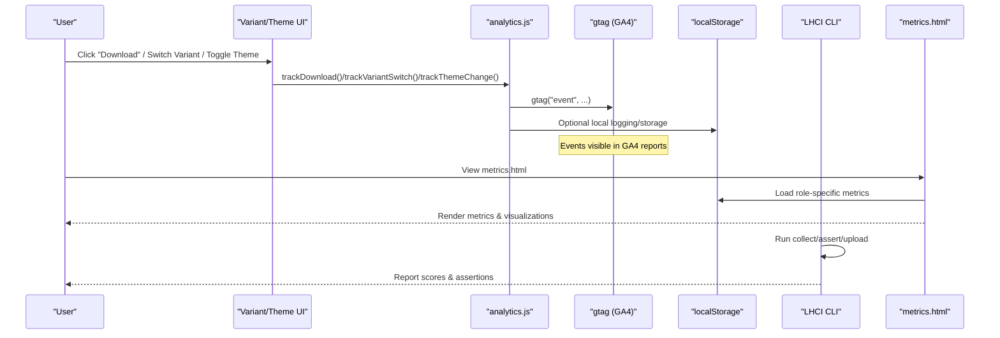
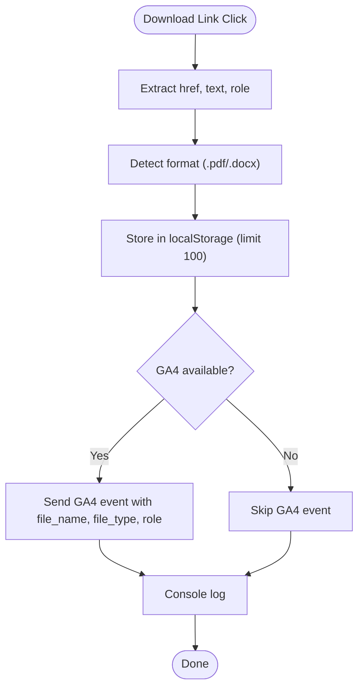
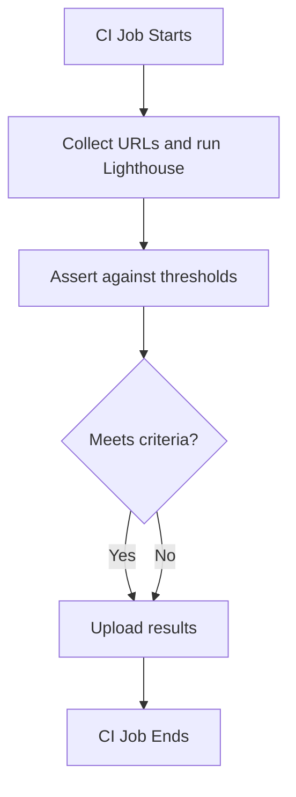
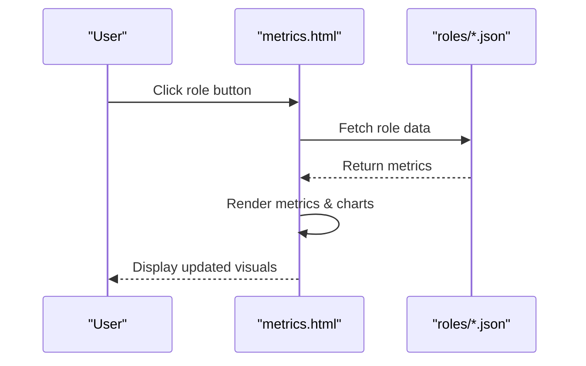
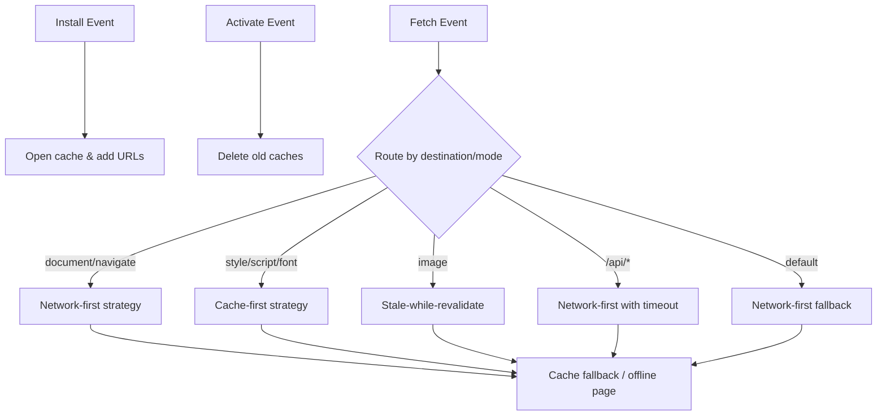
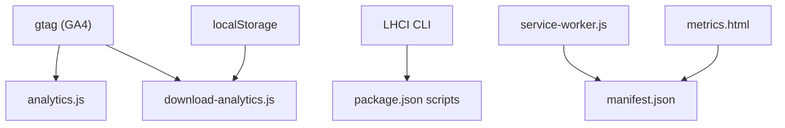

# Analytics and Performance Monitoring

<cite>
**Referenced Files in This Document**
- [ANALYTICS.md](file://docs/ANALYTICS.md)
- [analytics.js](file://assets/js/src/analytics.js)
- [download-analytics.js](file://assets/js/src/download-analytics.js)
- [lighthouserc.json](file://lighthouserc.json)
- [package.json](file://package.json)
- [metrics.html](file://metrics.html)
- [index.html](file://index.html)
- [service-worker.js](file://public/service-worker.js)
- [main.js](file://assets/js/main.js)
- [analytics.test.js](file://tests/unit/analytics.test.js)
- [variant-manager.js](file://assets/js/src/variant-manager.js)
- [theme-manager.js](file://assets/js/src/theme-manager.js)
- [manifest.json](file://public/manifest.json)
</cite>

## Table of Contents

1. [Introduction](#introduction)
2. [Project Structure](#project-structure)
3. [Core Components](#core-components)
4. [Architecture Overview](#architecture-overview)
5. [Detailed Component Analysis](#detailed-component-analysis)
6. [Dependency Analysis](#dependency-analysis)
7. [Performance Considerations](#performance-considerations)
8. [Troubleshooting Guide](#troubleshooting-guide)
9. [Conclusion](#conclusion)
10. [Appendices](#appendices)

## Introduction

This document explains the analytics and performance monitoring systems implemented in the resume website. It covers Google Analytics 4 integration, custom event tracking for user behavior, performance monitoring via Lighthouse CI, and the metrics dashboard used for experience visualization. The guide includes setup instructions, event tracking logic, performance measurement, and reporting mechanisms, with practical examples for analytics configuration, performance monitoring, and optimization workflows.

## Project Structure

The analytics and performance monitoring stack spans several areas:

- Analytics configuration and custom tracking modules
- Lighthouse CI configuration and scripts
- Metrics dashboard for experience visualization
- Service worker for PWA caching and offline behavior
- Unit tests validating analytics behavior

**Diagram sources**

- [index.html](file://index.html#L51-L60)
- [analytics.js](file://assets/js/src/analytics.js#L1-L75)
- [download-analytics.js](file://assets/js/src/download-analytics.js#L1-L99)
- [lighthouserc.json](file://lighthouserc.json#L1-L39)
- [package.json](file://package.json#L1-L56)
- [metrics.html](file://metrics.html#L1-L374)
- [service-worker.js](file://public/service-worker.js#L1-L370)
- [manifest.json](file://public/manifest.json#L1-L81)

**Section sources**

- [index.html](file://index.html#L51-L60)
- [lighthouserc.json](file://lighthouserc.json#L1-L39)
- [package.json](file://package.json#L1-L56)
- [metrics.html](file://metrics.html#L1-L374)
- [service-worker.js](file://public/service-worker.js#L1-L370)
- [manifest.json](file://public/manifest.json#L1-L81)

## Core Components

- Google Analytics 4 integration in the main HTML page
- Custom analytics module exporting helper functions for event tracking
- Download analytics tracker combining local storage and GA4
- Lighthouse CI configuration for automated performance checks
- Metrics dashboard for visualizing experience data
- Service worker enabling PWA caching and offline behavior
- Unit tests ensuring analytics helper functions behave correctly

**Section sources**

- [index.html](file://index.html#L51-L60)
- [analytics.js](file://assets/js/src/analytics.js#L1-L75)
- [download-analytics.js](file://assets/js/src/download-analytics.js#L1-L99)
- [lighthouserc.json](file://lighthouserc.json#L1-L39)
- [metrics.html](file://metrics.html#L1-L374)
- [service-worker.js](file://public/service-worker.js#L1-L370)
- [analytics.test.js](file://tests/unit/analytics.test.js#L1-L50)

## Architecture Overview

The analytics and performance monitoring architecture integrates GA4 with custom JavaScript modules and CI-based performance checks. The flow below shows how user interactions trigger analytics events, how performance is measured, and how metrics are visualized.

**Diagram sources**

- [analytics.js](file://assets/js/src/analytics.js#L10-L74)
- [download-analytics.js](file://assets/js/src/download-analytics.js#L25-L52)
- [index.html](file://index.html#L51-L60)
- [metrics.html](file://metrics.html#L280-L370)
- [lighthouserc.json](file://lighthouserc.json#L2-L37)

## Detailed Component Analysis

### Google Analytics 4 Integration

- GA4 is initialized in the main HTML head with a Measurement ID and configuration call.
- The analytics module provides helper functions to send custom events to GA4 when available.
- The download analytics module augments tracking by storing local records and sending GA4 events when present.

Implementation highlights:

- GA4 initialization and configuration in the HTML head
- Helper functions for resume downloads, variant switches, theme changes, palette changes, and page views
- Conditional event sending gated by GA4 availability

**Section sources**

- [index.html](file://index.html#L51-L60)
- [analytics.js](file://assets/js/src/analytics.js#L10-L74)
- [download-analytics.js](file://assets/js/src/download-analytics.js#L25-L52)

### Custom Event Tracking Logic

The analytics module exports functions for:

- Resume downloads with category "Resume" and label indicating the format
- Variant switches with category "Resume" and label indicating the variant
- Theme changes with category "UI" and label "light" or "dark"
- Palette changes with category "UI" and label as the palette name
- Page views for SPA-like navigation

Behavior:

- Events are sent only if GA4 is available
- Console logs confirm successful tracking during development

**Section sources**

- [analytics.js](file://assets/js/src/analytics.js#L10-L74)
- [analytics.test.js](file://tests/unit/analytics.test.js#L16-L48)

### Download Analytics Tracker

The download analytics tracker:

- Observes all download links and attaches click handlers
- Extracts file format, role, timestamp, and user agent
- Stores recent downloads in localStorage with a cap
- Sends GA4 events when available
- Exposes statistics and clearing utilities

**Diagram sources**

- [download-analytics.js](file://assets/js/src/download-analytics.js#L16-L52)

**Section sources**

- [download-analytics.js](file://assets/js/src/download-analytics.js#L6-L88)

### Lighthouse CI Integration

Lighthouse CI configuration defines:

- Collection targets and number of runs
- Assertion thresholds for performance, accessibility, SEO, and best practices
- Upload target for results

Scripts and dependencies:

- NPM scripts for building, testing, and generating assets
- Dev dependency on LHCI CLI for automated checks

**Diagram sources**

- [lighthouserc.json](file://lighthouserc.json#L2-L37)
- [package.json](file://package.json#L5-L23)

**Section sources**

- [lighthouserc.json](file://lighthouserc.json#L1-L39)
- [package.json](file://package.json#L25-L45)

### Metrics Dashboard

The metrics dashboard:

- Loads role-specific JSON data for experience metrics
- Renders counts and visualizations for skills and domain focus
- Supports role switching with animated skill bars and domain circles

**Diagram sources**

- [metrics.html](file://metrics.html#L280-L370)

**Section sources**

- [metrics.html](file://metrics.html#L274-L370)

### PWA Caching and Offline Behavior

The service worker:

- Pre-caches core assets and routes
- Implements caching strategies per resource type
- Handles offline fallbacks and background sync capabilities

**Diagram sources**

- [service-worker.js](file://public/service-worker.js#L42-L119)
- [service-worker.js](file://public/service-worker.js#L124-L202)
- [service-worker.js](file://public/service-worker.js#L207-L278)

**Section sources**

- [service-worker.js](file://public/service-worker.js#L6-L30)
- [service-worker.js](file://public/service-worker.js#L80-L119)
- [service-worker.js](file://public/service-worker.js#L124-L202)
- [service-worker.js](file://public/service-worker.js#L207-L278)
- [manifest.json](file://public/manifest.json#L1-L81)

### Integration Examples

- Theme changes: Integrate analytics tracking into theme toggling logic
- Variant switches: Add analytics tracking to variant selection logic
- Download buttons: Attach analytics tracking to download handlers

**Section sources**

- [theme-manager.js](file://assets/js/src/theme-manager.js#L156-L161)
- [variant-manager.js](file://assets/js/src/variant-manager.js#L68-L103)
- [download-analytics.js](file://assets/js/src/download-analytics.js#L16-L23)
- [ANALYTICS.md](file://docs/ANALYTICS.md#L158-L200)

## Dependency Analysis

The analytics and performance monitoring components depend on:

- GA4 availability for event delivery
- Local storage for download tracking persistence
- NPM scripts and LHCI CLI for automated performance checks
- Service worker for caching and offline behavior

**Diagram sources**

- [analytics.js](file://assets/js/src/analytics.js#L10-L74)
- [download-analytics.js](file://assets/js/src/download-analytics.js#L60-L66)
- [lighthouserc.json](file://lighthouserc.json#L2-L37)
- [package.json](file://package.json#L5-L23)
- [service-worker.js](file://public/service-worker.js#L6-L30)
- [manifest.json](file://public/manifest.json#L1-L81)
- [metrics.html](file://metrics.html#L1-L374)

**Section sources**

- [analytics.js](file://assets/js/src/analytics.js#L10-L74)
- [download-analytics.js](file://assets/js/src/download-analytics.js#L60-L66)
- [lighthouserc.json](file://lighthouserc.json#L1-L39)
- [package.json](file://package.json#L25-L45)
- [service-worker.js](file://public/service-worker.js#L6-L30)
- [manifest.json](file://public/manifest.json#L1-L81)
- [metrics.html](file://metrics.html#L1-L374)

## Performance Considerations

- Lighthouse CI thresholds ensure minimum acceptable scores across performance, accessibility, SEO, and best practices
- Caching strategies in the service worker improve load performance and enable offline access
- Metrics dashboard renders visualizations efficiently with minimal DOM manipulation
- GA4 event sending is conditional to avoid errors when analytics is unavailable

[No sources needed since this section provides general guidance]

## Troubleshooting Guide

Common issues and resolutions:

- Events not appearing in GA4:
  - Verify Measurement ID replacement
  - Allow time for data propagation
  - Use GA4 DebugView and browser console
  - Some ad blockers may prevent tracking
- GA4 availability:
  - Events are conditionally sent; absence of gtag prevents errors
- Lighthouse CI failures:
  - Review assertion thresholds and address failing categories
  - Re-run CI to confirm improvements

**Section sources**

- [ANALYTICS.md](file://docs/ANALYTICS.md#L303-L316)
- [lighthouserc.json](file://lighthouserc.json#L8-L33)

## Conclusion

The analytics and performance monitoring systems combine GA4 with custom tracking modules, automated Lighthouse CI checks, and a metrics dashboard. These components provide insights into user behavior, enforce performance standards, and deliver a responsive, offline-capable experience through PWA features.

[No sources needed since this section summarizes without analyzing specific files]

## Appendices

### Implementation Details and References

- Analytics setup and event definitions: [ANALYTICS.md](file://docs/ANALYTICS.md#L20-L121)
- Custom event tracking functions: [analytics.js](file://assets/js/src/analytics.js#L10-L74)
- Download analytics tracker: [download-analytics.js](file://assets/js/src/download-analytics.js#L6-L88)
- Lighthouse CI configuration: [lighthouserc.json](file://lighthouserc.json#L1-L39)
- NPM scripts and dependencies: [package.json](file://package.json#L5-L23)
- Metrics dashboard rendering: [metrics.html](file://metrics.html#L280-L370)
- Service worker caching strategies: [service-worker.js](file://public/service-worker.js#L80-L119)
- PWA manifest: [manifest.json](file://public/manifest.json#L1-L81)
- Unit tests for analytics: [analytics.test.js](file://tests/unit/analytics.test.js#L16-L48)
