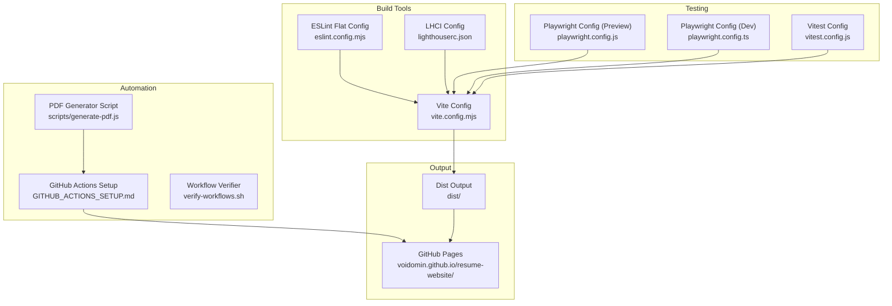
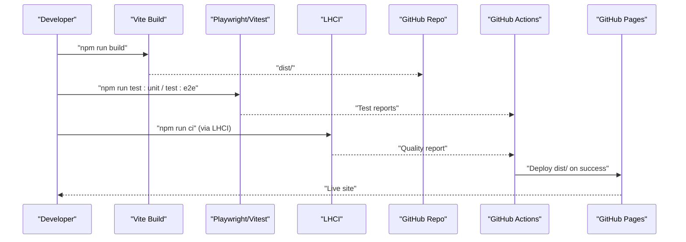
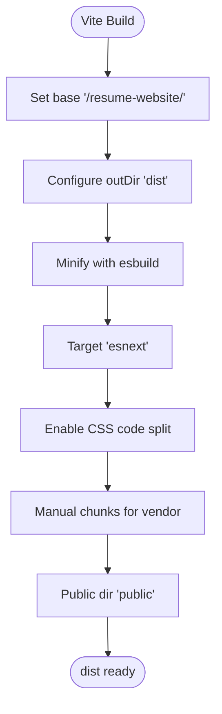
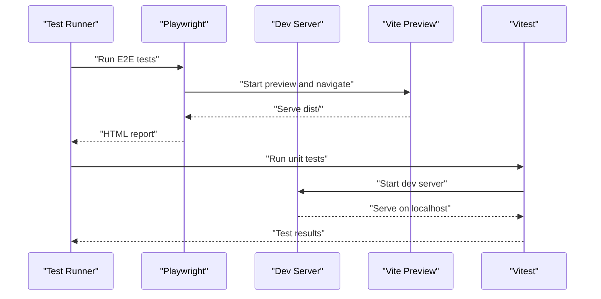
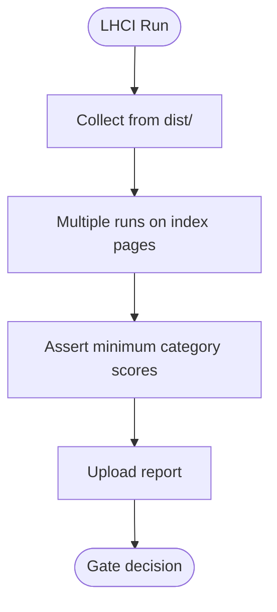
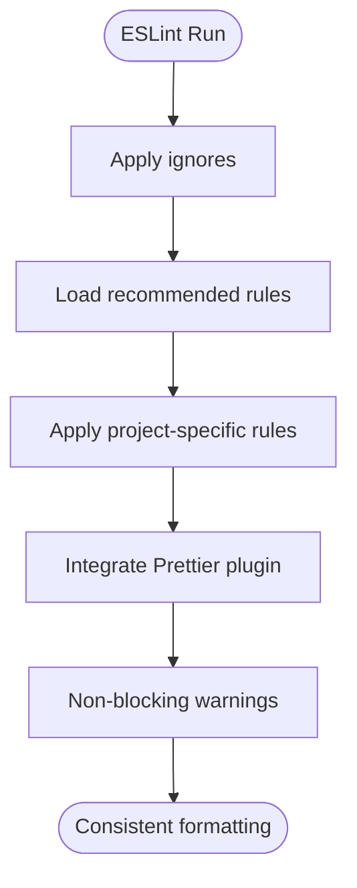
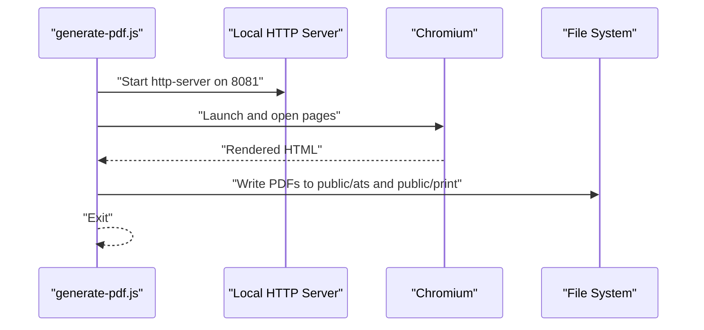
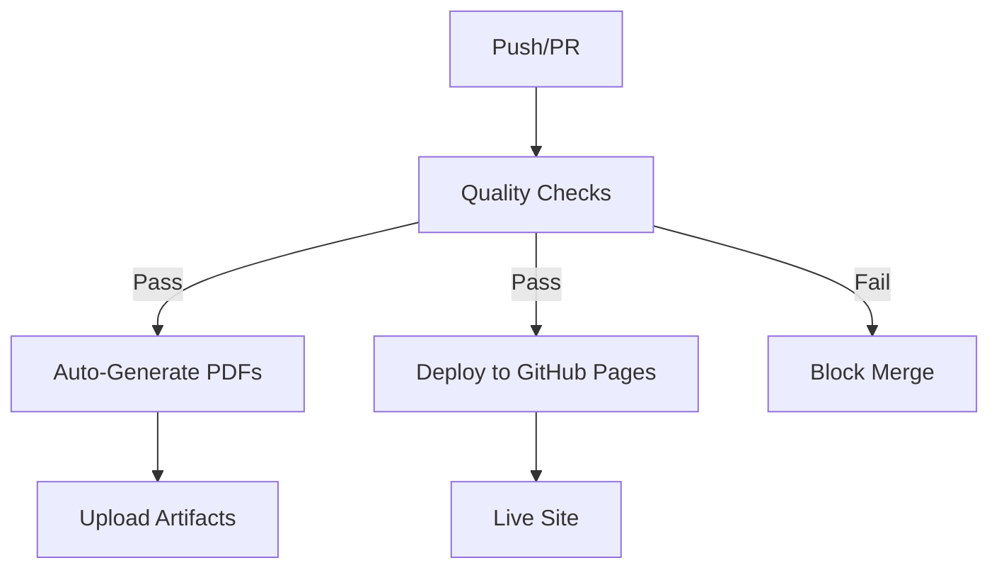
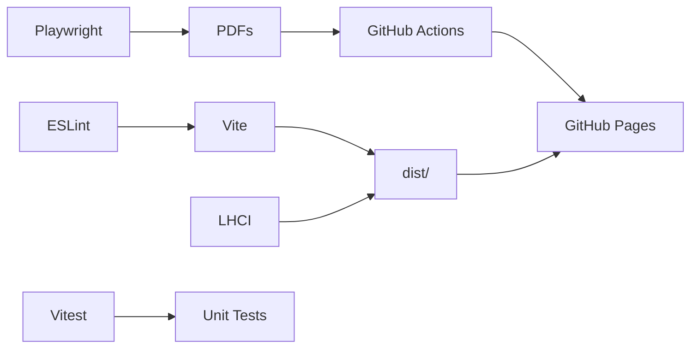

# Build System and Deployment

<cite>
**Referenced Files in This Document**
- [vite.config.mjs](file://vite.config.mjs)
- [package.json](file://package.json)
- [playwright.config.js](file://playwright.config.js)
- [playwright.config.ts](file://playwright.config.ts)
- [vitest.config.js](file://vitest.config.js)
- [lighthouserc.json](file://lighthouserc.json)
- [eslint.config.mjs](file://eslint.config.mjs)
- [scripts/generate-pdf.js](file://scripts/generate-pdf.js)
- [verify-workflows.sh](file://verify-workflows.sh)
- [GITHUB_ACTIONS_SETUP.md](file://GITHUB_ACTIONS_SETUP.md)
- [DEPLOYMENT_COMPLETE.md](file://DEPLOYMENT_COMPLETE.md)
- [DEPLOYMENT_READY.md](file://DEPLOYMENT_READY.md)
</cite>

## Table of Contents

1. [Introduction](#introduction)
2. [Project Structure](#project-structure)
3. [Core Components](#core-components)
4. [Architecture Overview](#architecture-overview)
5. [Detailed Component Analysis](#detailed-component-analysis)
6. [Dependency Analysis](#dependency-analysis)
7. [Performance Considerations](#performance-considerations)
8. [Troubleshooting Guide](#troubleshooting-guide)
9. [Conclusion](#conclusion)
10. [Appendices](#appendices)

## Introduction

This document explains the build system and deployment pipeline for the resume website. It covers Vite configuration, automated deployment via GitHub Actions, CI/CD workflows, testing integration, environment configuration, asset optimization, bundle splitting, and production readiness. It also documents deployment strategies, build artifacts, release management, and practical troubleshooting and optimization guidance.

## Project Structure

The project is a frontend-focused static site with a modern build toolchain and automated CI/CD. Key build and deployment assets include:

- Vite configuration for development and production builds
- Playwright configuration for E2E testing and PDF generation
- Vitest configuration for unit tests
- LHCI configuration for automated performance and quality gates
- ESLint flat config for code quality
- Scripts for automated PDF generation
- GitHub Actions workflows for quality checks and deployment

**Diagram sources**

- [vite.config.mjs](file://vite.config.mjs#L1-L21)
- [eslint.config.mjs](file://eslint.config.mjs#L1-L82)
- [lighthouserc.json](file://lighthouserc.json#L1-L39)
- [playwright.config.js](file://playwright.config.js#L1-L45)
- [playwright.config.ts](file://playwright.config.ts#L1-L27)
- [vitest.config.js](file://vitest.config.js#L1-L11)
- [scripts/generate-pdf.js](file://scripts/generate-pdf.js#L1-L81)
- [GITHUB_ACTIONS_SETUP.md](file://GITHUB_ACTIONS_SETUP.md#L1-L273)
- [verify-workflows.sh](file://verify-workflows.sh#L1-L67)

**Section sources**

- [vite.config.mjs](file://vite.config.mjs#L1-L21)
- [package.json](file://package.json#L1-L56)
- [playwright.config.js](file://playwright.config.js#L1-L45)
- [playwright.config.ts](file://playwright.config.ts#L1-L27)
- [vitest.config.js](file://vitest.config.js#L1-L11)
- [lighthouserc.json](file://lighthouserc.json#L1-L39)
- [eslint.config.mjs](file://eslint.config.mjs#L1-L82)
- [scripts/generate-pdf.js](file://scripts/generate-pdf.js#L1-L81)
- [GITHUB_ACTIONS_SETUP.md](file://GITHUB_ACTIONS_SETUP.md#L1-L273)
- [verify-workflows.sh](file://verify-workflows.sh#L1-L67)

## Core Components

- Vite build configuration defines output directory, minification, CSS code splitting, modern browser target, and manual chunking strategy for vendor bundles.
- Package scripts orchestrate development, building, testing, linting, formatting, and artifact generation.
- Playwright configurations drive E2E tests and PDF generation against built previews or local servers.
- Vitest configuration sets up unit tests with jsdom environment.
- LHCI configuration enforces quality gates for performance, accessibility, SEO, and best practices.
- ESLint flat config ensures consistent code quality and formatting across the project.
- GitHub Actions workflows automate PDF regeneration, quality checks, and deployment to GitHub Pages.

**Section sources**

- [vite.config.mjs](file://vite.config.mjs#L3-L20)
- [package.json](file://package.json#L5-L24)
- [playwright.config.js](file://playwright.config.js#L4-L44)
- [playwright.config.ts](file://playwright.config.ts#L3-L26)
- [vitest.config.js](file://vitest.config.js#L3-L10)
- [lighthouserc.json](file://lighthouserc.json#L2-L38)
- [eslint.config.mjs](file://eslint.config.mjs#L20-L81)
- [scripts/generate-pdf.js](file://scripts/generate-pdf.js#L5-L80)
- [GITHUB_ACTIONS_SETUP.md](file://GITHUB_ACTIONS_SETUP.md#L46-L54)

## Architecture Overview

The build and deployment pipeline integrates local development, automated testing, quality gates, and continuous deployment to GitHub Pages.

**Diagram sources**

- [package.json](file://package.json#L5-L24)
- [playwright.config.js](file://playwright.config.js#L38-L43)
- [playwright.config.ts](file://playwright.config.ts#L20-L25)
- [vitest.config.js](file://vitest.config.js#L3-L10)
- [lighthouserc.json](file://lighthouserc.json#L2-L38)
- [GITHUB_ACTIONS_SETUP.md](file://GITHUB_ACTIONS_SETUP.md#L48-L54)

## Detailed Component Analysis

### Vite Build Configuration

Key behaviors:

- Sets base path for GitHub Pages hosting.
- Outputs to dist with empty-outdir semantics.
- Minifies with esbuild and targets modern browsers for smaller bundles.
- Enables CSS code splitting.
- Defines manualChunks to group shared vendor assets.
- Uses explicit public directory for static pages.

**Diagram sources**

- [vite.config.mjs](file://vite.config.mjs#L3-L20)

**Section sources**

- [vite.config.mjs](file://vite.config.mjs#L3-L20)

### Testing Configuration

- Playwright (preview): Runs E2E tests against a built and served preview, with Chromium and Mobile Chrome projects, HTML reporter, and trace collection on retry.
- Playwright (dev): Runs tests against a local development server with a simpler setup.
- Vitest: Runs unit tests in jsdom environment with include/exclude patterns.

**Diagram sources**

- [playwright.config.js](file://playwright.config.js#L38-L43)
- [playwright.config.ts](file://playwright.config.ts#L20-L25)
- [vitest.config.js](file://vitest.config.js#L3-L10)

**Section sources**

- [playwright.config.js](file://playwright.config.js#L4-L44)
- [playwright.config.ts](file://playwright.config.ts#L3-L26)
- [vitest.config.js](file://vitest.config.js#L3-L10)

### Quality Gates with LHCI

- Collects performance metrics from dist using two runs on key pages.
- Asserts minimum scores for performance, accessibility, SEO, and best practices.
- Uploads temporary public storage for review.

**Diagram sources**

- [lighthouserc.json](file://lighthouserc.json#L2-L38)

**Section sources**

- [lighthouserc.json](file://lighthouserc.json#L1-L39)

### Code Quality with ESLint (Flat Config)

- Ignores node_modules, dist, public, preview, and scripts directories.
- Applies recommended base rules and project-specific rules for browser globals.
- Integrates Prettier via eslint-plugin-prettier with non-blocking warnings.

**Diagram sources**

- [eslint.config.mjs](file://eslint.config.mjs#L20-L81)

**Section sources**

- [eslint.config.mjs](file://eslint.config.mjs#L1-L82)

### Automated PDF Generation

- Starts a local HTTP server on port 8081.
- Launches a headless Chromium browser.
- Generates main ATS PDF and per-role ATS/print PDFs.
- Writes outputs to public/ats and public/print directories.

**Diagram sources**

- [scripts/generate-pdf.js](file://scripts/generate-pdf.js#L5-L80)

**Section sources**

- [scripts/generate-pdf.js](file://scripts/generate-pdf.js#L1-L81)

### GitHub Actions Workflows

Workflows orchestrated by GitHub Actions:

- generate-pdfs.yml: Auto-generates PDFs on role data changes, commits artifacts, and uploads.
- quality.yml: Runs lint, format, unit tests, and link checks on every push and PR.
- deploy.yml: Deploys to GitHub Pages after quality checks succeed.

**Diagram sources**

- [GITHUB_ACTIONS_SETUP.md](file://GITHUB_ACTIONS_SETUP.md#L48-L54)

**Section sources**

- [GITHUB_ACTIONS_SETUP.md](file://GITHUB_ACTIONS_SETUP.md#L1-L273)

### Environment Configuration and Scripts

- Node engine requirement pinned for reproducible builds.
- Scripts cover dev, build, unit tests, E2E tests, lint/format, and artifact generation.
- Husky prepare hook enables pre-commit hooks.

**Section sources**

- [package.json](file://package.json#L2-L24)

### Deployment Readiness and Completion

- Deployment ready documentation outlines deliverables, integrations, and quality metrics.
- Deployment complete documentation confirms live URLs, features, and statistics.

**Section sources**

- [DEPLOYMENT_READY.md](file://DEPLOYMENT_READY.md#L1-L316)
- [DEPLOYMENT_COMPLETE.md](file://DEPLOYMENT_COMPLETE.md#L1-L386)

## Dependency Analysis

The build system exhibits low external dependency usage, favoring native browser APIs and modern tooling. Internal dependencies include:

- Vite for bundling and dev server
- Playwright for E2E and PDF generation
- Vitest for unit tests
- LHCI for quality gates
- ESLint/Prettier for code quality
- GitHub Actions for automation

**Diagram sources**

- [vite.config.mjs](file://vite.config.mjs#L3-L20)
- [lighthouserc.json](file://lighthouserc.json#L2-L38)
- [playwright.config.js](file://playwright.config.js#L38-L43)
- [vitest.config.js](file://vitest.config.js#L3-L10)
- [GITHUB_ACTIONS_SETUP.md](file://GITHUB_ACTIONS_SETUP.md#L48-L54)

**Section sources**

- [vite.config.mjs](file://vite.config.mjs#L1-L21)
- [package.json](file://package.json#L25-L56)
- [playwright.config.js](file://playwright.config.js#L1-L45)
- [playwright.config.ts](file://playwright.config.ts#L1-L27)
- [vitest.config.js](file://vitest.config.js#L1-L11)
- [lighthouserc.json](file://lighthouserc.json#L1-L39)
- [eslint.config.mjs](file://eslint.config.mjs#L1-L82)
- [scripts/generate-pdf.js](file://scripts/generate-pdf.js#L1-L81)
- [GITHUB_ACTIONS_SETUP.md](file://GITHUB_ACTIONS_SETUP.md#L1-L273)

## Performance Considerations

- Modern browser target reduces bundle size by leveraging newer JavaScript features.
- CSS code splitting improves initial load performance by deferring non-critical styles.
- Manual chunking groups shared vendor assets to improve caching and reduce duplication.
- LHCI assertions enforce performance and accessibility thresholds to maintain quality over time.
- Using esbuild minification balances speed and compression.

[No sources needed since this section provides general guidance]

## Troubleshooting Guide

Common issues and resolutions:

- Workflows not running: Verify Actions permissions and workflow file existence; ensure path filters match intended files.
- PDF generation failures: Check Node.js version, Playwright installation, and template validity; inspect detailed logs.
- Deployment failures: Confirm GitHub Pages is enabled and branch settings are correct; manually trigger the deploy workflow to diagnose.
- Local verification: Use the workflow verifier script to confirm workflow presence, Node version, dependencies, scripts, and role data files.

**Section sources**

- [GITHUB_ACTIONS_SETUP.md](file://GITHUB_ACTIONS_SETUP.md#L213-L235)
- [verify-workflows.sh](file://verify-workflows.sh#L9-L53)

## Conclusion

The build system leverages Vite for efficient bundling, Playwright for robust testing and PDF generation, Vitest for unit tests, and LHCI for quality gates. GitHub Actions automates PDF regeneration, quality checks, and deployment to GitHub Pages. The configuration emphasizes modern browser compatibility, CSS code splitting, and manual chunking for optimal performance. The provided scripts and documentation enable reliable local verification and troubleshooting.

[No sources needed since this section summarizes without analyzing specific files]

## Appendices

### Build Artifacts and Release Management

- Build output: dist/
- Static pages: public/
- Generated PDFs: public/ats/, public/print/
- GitHub Pages: voidomin.github.io/resume-website/

**Section sources**

- [vite.config.mjs](file://vite.config.mjs#L5-L20)
- [scripts/generate-pdf.js](file://scripts/generate-pdf.js#L19-L67)
- [DEPLOYMENT_COMPLETE.md](file://DEPLOYMENT_COMPLETE.md#L187-L201)

### Example Customizations

- Build customization: Adjust Vite target, minification, and manualChunks to balance bundle size and runtime performance.
- Environment configuration: Align Node engine and package scripts with CI runner versions.
- Deployment strategy: Switch deployment branch in GitHub Actions or adjust base path for alternate hosting.
- Monitoring: Add LHCI assertions for additional categories or increase run count for stability.

**Section sources**

- [vite.config.mjs](file://vite.config.mjs#L3-L20)
- [package.json](file://package.json#L2-L24)
- [GITHUB_ACTIONS_SETUP.md](file://GITHUB_ACTIONS_SETUP.md#L188-L198)
- [lighthouserc.json](file://lighthouserc.json#L8-L32)
