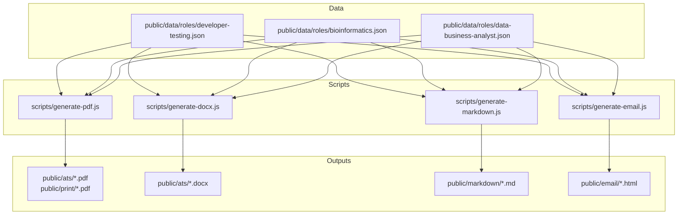
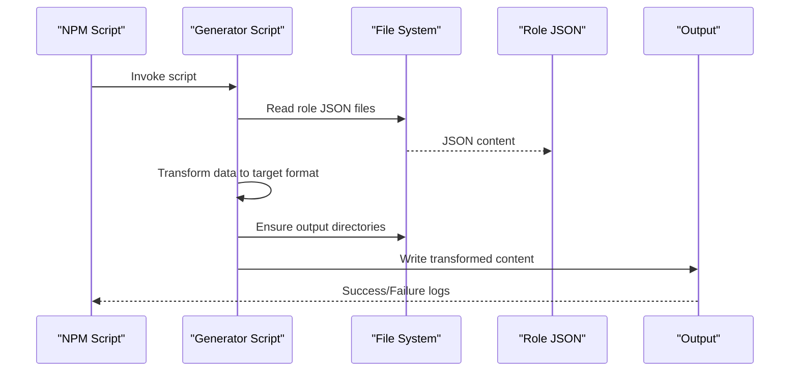
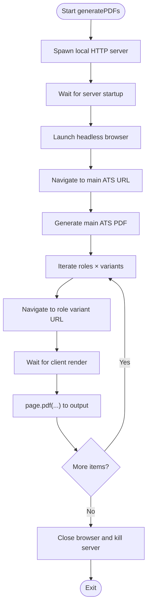
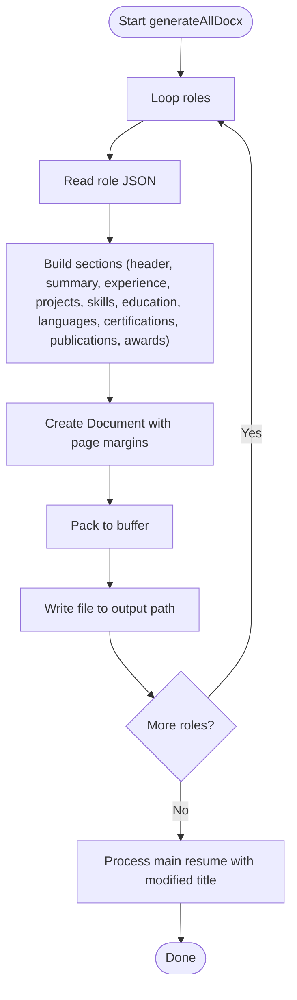
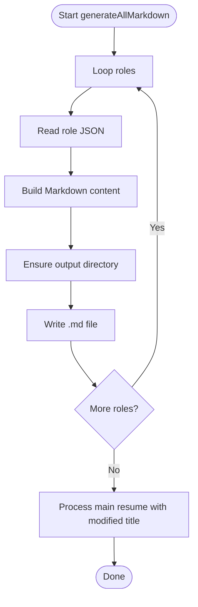
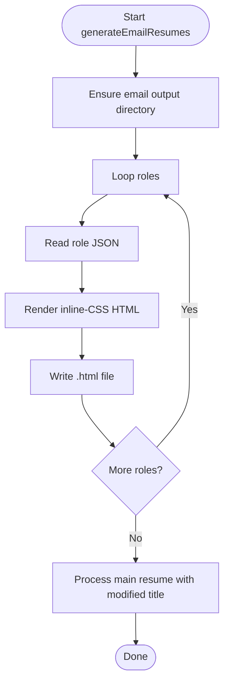
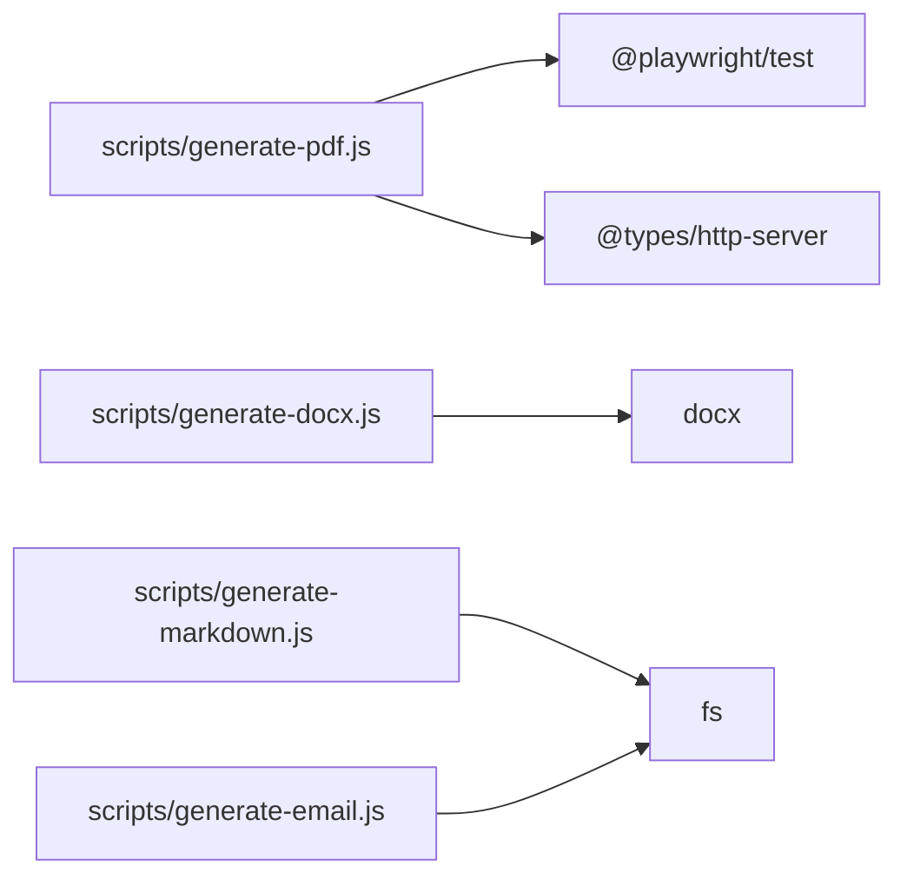

# Content Generation Scripts

<cite>
**Referenced Files in This Document**
- [generate-pdf.js](file://scripts/generate-pdf.js)
- [generate-docx.js](file://scripts/generate-docx.js)
- [generate-markdown.js](file://scripts/generate-markdown.js)
- [generate-email.js](file://scripts/generate-email.js)
- [developer-testing.json](file://public/data/roles/developer-testing.json)
- [bioinformatics.json](file://public/data/roles/bioinformatics.json)
- [data-business-analyst.json](file://public/data/roles/data-business-analyst.json)
- [package.json](file://package.json)
- [README.md](file://README.md)
</cite>

## Table of Contents

1. [Introduction](#introduction)
2. [Project Structure](#project-structure)
3. [Core Components](#core-components)
4. [Architecture Overview](#architecture-overview)
5. [Detailed Component Analysis](#detailed-component-analysis)
6. [Dependency Analysis](#dependency-analysis)
7. [Performance Considerations](#performance-considerations)
8. [Troubleshooting Guide](#troubleshooting-guide)
9. [Conclusion](#conclusion)
10. [Appendices](#appendices)

## Introduction

This document explains the automated content generation scripts that produce multiple resume formats from structured JSON data. It covers:

- PDF generation using a headless browser
- DOCX conversion using a document library
- Markdown export for portability and version control
- Email-friendly HTML for candidate outreach and internal sharing

It details the script architecture, data processing workflows, template rendering, and output formatting. It also documents integration with resume data, template systems, and export workflows, along with usage examples, customization options, and automation integration.

## Project Structure

The content generation scripts live under the scripts directory and operate on role-specific JSON data located under public/data/roles. Outputs are written to public/ for immediate use in static hosting and distribution.

**Diagram sources**

- [generate-pdf.js](file://scripts/generate-pdf.js#L1-L81)
- [generate-docx.js](file://scripts/generate-docx.js#L1-L492)
- [generate-markdown.js](file://scripts/generate-markdown.js#L1-L173)
- [generate-email.js](file://scripts/generate-email.js#L1-L271)
- [developer-testing.json](file://public/data/roles/developer-testing.json#L1-L136)
- [bioinformatics.json](file://public/data/roles/bioinformatics.json#L1-L129)
- [data-business-analyst.json](file://public/data/roles/data-business-analyst.json#L1-L112)

**Section sources**

- [README.md](file://README.md#L104-L135)
- [package.json](file://package.json#L17-L22)

## Core Components

- PDF generator: Launches a local HTTP server, navigates to role-specific pages, and prints PDFs with consistent margins and backgrounds.
- DOCX generator: Builds a compact, one-page layout using a document library, transforming JSON fields into paragraphs and lists.
- Markdown generator: Produces a clean, readable Markdown resume with semantic headers and links.
- Email generator: Renders an inline-CSS HTML suitable for email clients, preserving essential sections and contact links.

Each script reads role JSON files, applies transformations, and writes outputs to the appropriate public directories.

**Section sources**

- [generate-pdf.js](file://scripts/generate-pdf.js#L5-L81)
- [generate-docx.js](file://scripts/generate-docx.js#L17-L437)
- [generate-markdown.js](file://scripts/generate-markdown.js#L13-L129)
- [generate-email.js](file://scripts/generate-email.js#L13-L226)

## Architecture Overview

The scripts follow a consistent pattern:

- Define roles to process
- Resolve input data paths and output directories
- Parse JSON data
- Transform data into target format
- Write output files
- Handle errors and log progress

**Diagram sources**

- [generate-pdf.js](file://scripts/generate-pdf.js#L44-L67)
- [generate-docx.js](file://scripts/generate-docx.js#L439-L489)
- [generate-markdown.js](file://scripts/generate-markdown.js#L131-L170)
- [generate-email.js](file://scripts/generate-email.js#L228-L268)

## Detailed Component Analysis

### PDF Generation Script

Purpose:

- Generate PDFs for ATS and print variants across roles and a main resume.

Key behaviors:

- Starts a local HTTP server on a fixed port to serve static HTML pages.
- Waits for the server to be ready.
- Launches a headless Chromium browser.
- Iterates over roles and variants, navigating to each page and printing to PDF with A4 sizing and margins.
- Writes a main ATS PDF for the primary role.
- Includes robust error handling per role and cleanup of browser and server processes.

Processing logic:

- Role enumeration and variant mapping define URLs and output paths.
- Network idle waits and short stabilization delays ensure client-side rendering completes before PDF capture.
- Output directories are created as needed.

**Diagram sources**

- [generate-pdf.js](file://scripts/generate-pdf.js#L5-L78)

**Section sources**

- [generate-pdf.js](file://scripts/generate-pdf.js#L5-L81)

### DOCX Conversion Process

Purpose:

- Produce a compact, one-page DOCX resume for each role.

Key behaviors:

- Reads role JSON from public/data/roles.
- Constructs a document with sections for header, summary, work experience, projects, skills, education, languages, certifications, publications, and awards.
- Applies typography, spacing, borders, and bullet styles using a document library.
- Limits certain sections to concise entries to fit on one page.
- Writes the final DOCX buffer to disk.

Processing logic:

- Parses JSON and extracts metadata and sections.
- Builds paragraph and text-run objects with alignment, size, and italics.
- Adds borders beneath major section headers.
- Writes buffer to file and logs completion.

**Diagram sources**

- [generate-docx.js](file://scripts/generate-docx.js#L439-L489)

**Section sources**

- [generate-docx.js](file://scripts/generate-docx.js#L17-L437)
- [generate-docx.js](file://scripts/generate-docx.js#L439-L492)

### Markdown Export Functionality

Purpose:

- Export human-readable Markdown resumes for each role.

Key behaviors:

- Reads role JSON and transforms it into Markdown with headers, bullet lists, and links.
- Emits a clean structure with sections for summary, experience, projects, skills, education, publications, awards, languages, and certifications.
- Writes Markdown to public/markdown with role-specific filenames and a main resume file.

Processing logic:

- Iterates roles, parses JSON, builds Markdown content, ensures output directories, and writes files.
- Applies minimal formatting to preserve readability and compatibility.

**Diagram sources**

- [generate-markdown.js](file://scripts/generate-markdown.js#L131-L170)

**Section sources**

- [generate-markdown.js](file://scripts/generate-markdown.js#L13-L129)
- [generate-markdown.js](file://scripts/generate-markdown.js#L131-L173)

### Email Template Generation

Purpose:

- Produce email-friendly HTML with embedded CSS for easy sharing and delivery.

Key behaviors:

- Reads role JSON and renders an HTML document with inline styles.
- Includes responsive-friendly typography and spacing.
- Emits sections for header, contact, summary, experience, projects, skills, education, certifications, and languages.
- Writes individual HTML files per role and a main resume file.

Processing logic:

- Iterates roles, parses JSON, generates HTML with embedded styles, ensures output directory, and writes files.
- Uses minimal markup to maximize compatibility across email clients.

**Diagram sources**

- [generate-email.js](file://scripts/generate-email.js#L228-L268)

**Section sources**

- [generate-email.js](file://scripts/generate-email.js#L13-L226)
- [generate-email.js](file://scripts/generate-email.js#L228-L271)

## Dependency Analysis

The scripts depend on:

- Node.js built-ins (fs, path, child_process)
- Third-party libraries (docx for DOCX generation)
- Playwright for PDF generation
- Local HTTP server for PDF generation

**Diagram sources**

- [generate-pdf.js](file://scripts/generate-pdf.js#L1-L3)
- [generate-docx.js](file://scripts/generate-docx.js#L1-L11)
- [package.json](file://package.json#L25-L46)

**Section sources**

- [generate-pdf.js](file://scripts/generate-pdf.js#L1-L3)
- [generate-docx.js](file://scripts/generate-docx.js#L1-L11)
- [package.json](file://package.json#L25-L46)

## Performance Considerations

- PDF generation:
  - Headless browser launch and navigation introduce startup overhead. Batch processing across roles is sequential; parallelization could reduce total runtime but requires careful resource management.
  - Network idle waits and stabilization timeouts balance reliability against speed.
- DOCX generation:
  - Buffer-based packing is efficient; ensure adequate memory for large documents.
- Markdown and email generation:
  - Pure string concatenation and file I/O are lightweight and fast.

[No sources needed since this section provides general guidance]

## Troubleshooting Guide

Common issues and resolutions:

- PDF generation fails to load pages:
  - Verify the local HTTP server starts and listens on the expected port before browser navigation.
  - Increase stabilization delays if client-side rendering is slow.
- DOCX generation errors:
  - Confirm role JSON is valid and contains required fields.
  - Ensure output directories exist or allow the script to create them.
- Markdown and email generation errors:
  - Validate JSON structure and encoding.
  - Check write permissions for output directories.

Logging:

- Scripts log progress and errors during each step, including per-role failures and completion messages.

**Section sources**

- [generate-pdf.js](file://scripts/generate-pdf.js#L68-L78)
- [generate-docx.js](file://scripts/generate-docx.js#L463-L466)
- [generate-markdown.js](file://scripts/generate-markdown.js#L165-L167)
- [generate-email.js](file://scripts/generate-email.js#L263-L265)

## Conclusion

The content generation scripts provide a cohesive pipeline to transform structured resume data into multiple formats. They are designed for reliability, simplicity, and automation readiness. By leveraging role JSON and consistent templates, teams can quickly regenerate ATS, print, Markdown, and email-ready resumes whenever data changes.

[No sources needed since this section summarizes without analyzing specific files]

## Appendices

### Script Usage Examples

- Run all generators:
  - Use the combined NPM script to generate DOCX, Markdown, email HTML, and PDFs.
- Run individual generators:
  - Generate DOCX for all roles
  - Generate Markdown for all roles
  - Generate email HTML for all roles
  - Generate PDFs for all roles

These commands are defined in the project’s NPM scripts.

**Section sources**

- [package.json](file://package.json#L17-L22)

### Data Model Integration

The scripts consume role JSON files containing metadata and sections such as summary, work experience, projects, skills, education, languages, certifications, publications, and awards. Outputs are derived directly from these fields.

**Section sources**

- [developer-testing.json](file://public/data/roles/developer-testing.json#L1-L136)
- [bioinformatics.json](file://public/data/roles/bioinformatics.json#L1-L129)
- [data-business-analyst.json](file://public/data/roles/data-business-analyst.json#L1-L112)

### Automation Integration

- CI/CD:
  - The project’s documentation describes automated workflows that regenerate PDFs when role data changes.
- Local automation:
  - NPM scripts orchestrate batch generation for all formats.

**Section sources**

- [README.md](file://README.md#L29-L41)
- [README.md](file://README.md#L75-L75)
- [package.json](file://package.json#L17-L22)
