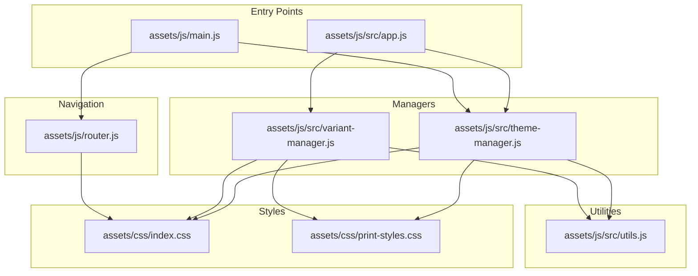
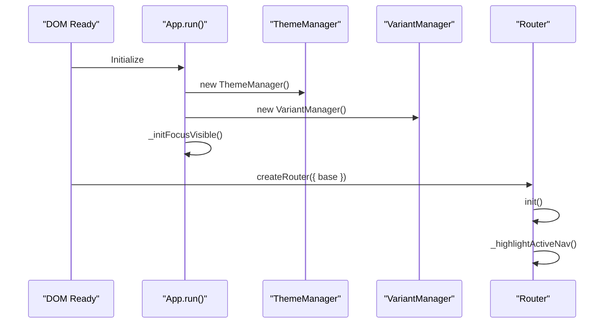
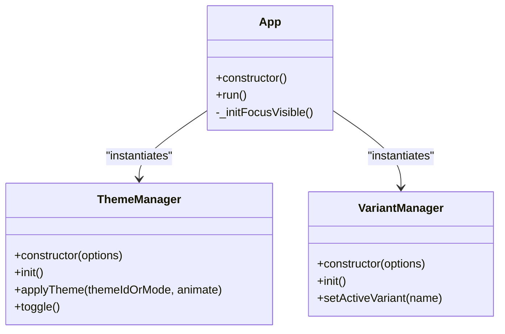
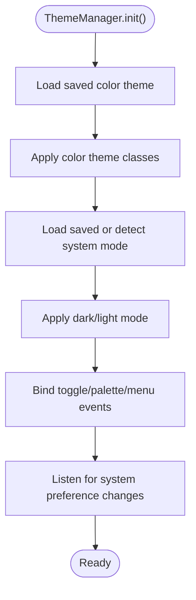
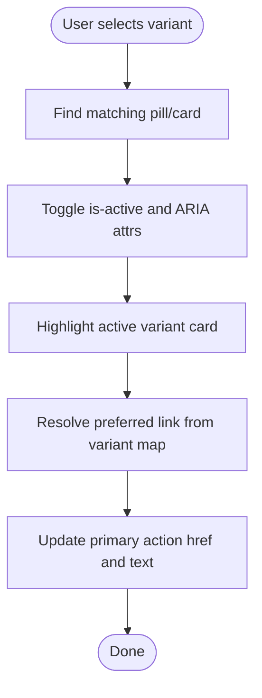
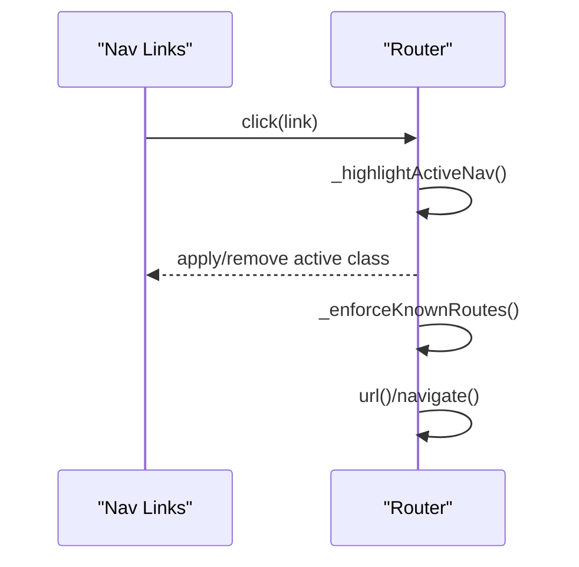
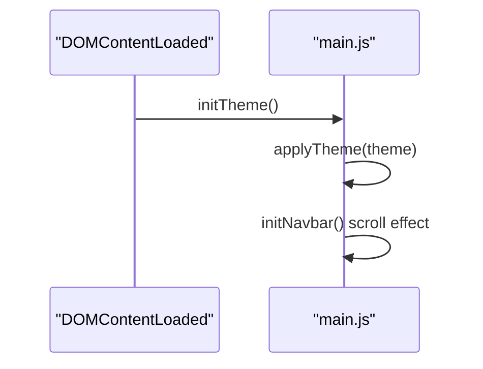
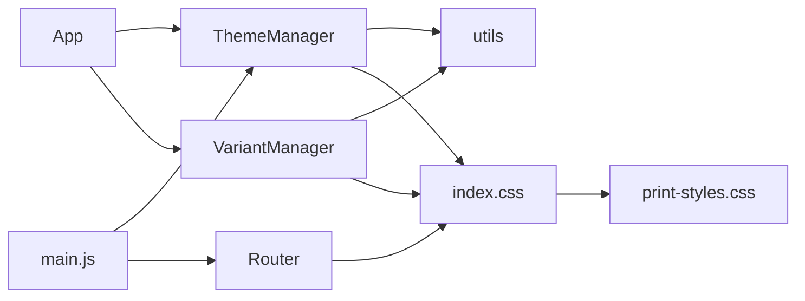

# Core Features

<cite>
**Referenced Files in This Document**
- [README.md](file://README.md)
- [FEATURES.md](file://docs/FEATURES.md)
- [ROUTER_GUIDE.md](file://docs/ROUTER_GUIDE.md)
- [app.js](file://assets/js/src/app.js)
- [theme-manager.js](file://assets/js/src/theme-manager.js)
- [theme-manager-enhanced.js](file://assets/js/src/theme-manager-enhanced.js)
- [variant-manager.js](file://assets/js/src/variant-manager.js)
- [router.js](file://assets/js/router.js)
- [main.js](file://assets/js/main.js)
- [utils.js](file://assets/js/src/utils.js)
- [index.css](file://assets/css/index.css)
- [print-styles.css](file://assets/css/print-styles.css)
- [vite.config.mjs](file://vite.config.mjs)
- [package.json](file://package.json)
- [router.test.js](file://tests/unit/router.test.js)
</cite>

## Table of Contents

1. [Introduction](#introduction)
2. [Project Structure](#project-structure)
3. [Core Components](#core-components)
4. [Architecture Overview](#architecture-overview)
5. [Detailed Component Analysis](#detailed-component-analysis)
6. [Dependency Analysis](#dependency-analysis)
7. [Performance Considerations](#performance-considerations)
8. [Troubleshooting Guide](#troubleshooting-guide)
9. [Conclusion](#conclusion)

## Introduction

This document explains the core features that power the Resume Website: the multi-variant resume system, theme management, navigation system, and application bootstrapping. It provides both conceptual overviews for beginners and technical details for experienced developers, with concrete integration patterns and references to the actual source files.

## Project Structure

The core runtime logic resides in the assets/js/src directory as ES6 modules, while the router is a standalone module designed for GitHub Pages deployments. Styles are centralized in assets/css with theme tokens and print-specific overrides.

**Diagram sources**

- [app.js](file://assets/js/src/app.js#L1-L39)
- [theme-manager.js](file://assets/js/src/theme-manager.js#L1-L170)
- [variant-manager.js](file://assets/js/src/variant-manager.js#L1-L125)
- [router.js](file://assets/js/router.js#L1-L210)
- [main.js](file://assets/js/main.js#L1-L58)
- [utils.js](file://assets/js/src/utils.js#L1-L5)
- [index.css](file://assets/css/index.css#L1-L673)
- [print-styles.css](file://assets/css/print-styles.css#L1-L110)

**Section sources**

- [README.md](file://README.md#L104-L135)
- [vite.config.mjs](file://vite.config.mjs#L1-L21)

## Core Components

- App orchestrator: initializes ThemeManager and VariantManager, and sets up focus-visible keyboard UX.
- ThemeManager: manages dark/light mode, persists preferences, and applies color themes.
- VariantManager: switches between resume variants (Print, ATS, Digital, Portfolio) and updates primary actions.
- Router: base-aware navigation for GitHub Pages, active link highlighting, and route utilities.
- Utilities: small helpers for DOM queries and clamping.

**Section sources**

- [app.js](file://assets/js/src/app.js#L1-L39)
- [theme-manager.js](file://assets/js/src/theme-manager.js#L1-L170)
- [variant-manager.js](file://assets/js/src/variant-manager.js#L1-L125)
- [router.js](file://assets/js/router.js#L1-L210)
- [utils.js](file://assets/js/src/utils.js#L1-L5)

## Architecture Overview

The application bootstraps via the App class, which constructs and wires ThemeManager and VariantManager. Navigation is handled by Router, which integrates with main.js for GitHub Pages compatibility. Styles are theme-aware and include print-specific rules.

**Diagram sources**

- [app.js](file://assets/js/src/app.js#L11-L36)
- [theme-manager.js](file://assets/js/src/theme-manager.js#L33-L85)
- [variant-manager.js](file://assets/js/src/variant-manager.js#L25-L50)
- [router.js](file://assets/js/router.js#L38-L134)

## Detailed Component Analysis

### App Orchestration

- Responsibilities:
  - Construct ThemeManager and VariantManager instances.
  - Initialize focus-visible keyboard UX to improve accessibility.
- Boot process:
  - On run(), instantiate managers and attach keyboard/mouse handlers to toggle a focus-visible class on elements.
- Integration:
  - Used by the premium redesign entry point in main.js for theme and navbar logic.

**Diagram sources**

- [app.js](file://assets/js/src/app.js#L5-L36)
- [theme-manager.js](file://assets/js/src/theme-manager.js#L4-L31)
- [variant-manager.js](file://assets/js/src/variant-manager.js#L4-L23)

**Section sources**

- [app.js](file://assets/js/src/app.js#L1-L39)
- [main.js](file://assets/js/main.js#L5-L42)

### Theme Management

Two implementations coexist:

- ThemeManager (ES6 module): full-featured manager with color theme cycling and persistent dark/light mode.
- ThemeManager (enhanced): simplified class-based manager with auto/dark/light toggle and localStorage persistence.

Key behaviors:

- Persistence: reads/writes to localStorage using keys for color theme and dark/light mode.
- System preference: respects prefers-color-scheme media query and updates on change.
- UI updates: toggles data-theme attributes and CSS classes, updates icons/text.
- Color themes: cycles through named CSS classes applied to documentElement.

**Diagram sources**

- [theme-manager.js](file://assets/js/src/theme-manager.js#L33-L85)

**Section sources**

- [theme-manager.js](file://assets/js/src/theme-manager.js#L1-L170)
- [theme-manager-enhanced.js](file://assets/js/src/theme-manager-enhanced.js#L1-L85)
- [index.css](file://assets/css/index.css#L4-L37)

### Multi-Variant Resume System

- Purpose: switch between Print, ATS, Digital, and Portfolio variants without reloading the page.
- Mechanism:
  - Pills and variant cards listen for clicks and keyboard events.
  - setActiveVariant updates active pills, highlights the selected card, and updates the primary action link.
  - Uses a variant map to resolve preferred links per variant.
- Accessibility:
  - Keyboard navigation (arrow keys) moves focus between pills.
  - ARIA attributes reflect active state and tab order.

**Diagram sources**

- [variant-manager.js](file://assets/js/src/variant-manager.js#L68-L103)

**Section sources**

- [variant-manager.js](file://assets/js/src/variant-manager.js#L1-L125)
- [FEATURES.md](file://docs/FEATURES.md#L7-L45)

### Navigation System (Router)

- Designed for GitHub Pages with base-aware routing.
- Highlights active navigation links and enforces known routes.
- Provides helpers to build URLs and navigate programmatically.

**Diagram sources**

- [router.js](file://assets/js/router.js#L120-L134)
- [router.js](file://assets/js/router.js#L108-L114)
- [router.js](file://assets/js/router.js#L159-L174)

**Section sources**

- [router.js](file://assets/js/router.js#L1-L210)
- [ROUTER_GUIDE.md](file://docs/ROUTER_GUIDE.md#L1-L301)
- [vite.config.mjs](file://vite.config.mjs#L4-L4)

### Application Bootstrapping

- Premium redesign entry point initializes theme and navbar on DOMContentLoaded.
- Router is available globally for advanced scenarios.

**Diagram sources**

- [main.js](file://assets/js/main.js#L5-L58)

**Section sources**

- [main.js](file://assets/js/main.js#L1-L58)

## Dependency Analysis

- App depends on ThemeManager and VariantManager.
- Managers depend on utils for DOM helpers.
- Router is independent but integrates with main.js for GitHub Pages.
- Styles depend on theme tokens and print rules.

**Diagram sources**

- [app.js](file://assets/js/src/app.js#L1-L39)
- [theme-manager.js](file://assets/js/src/theme-manager.js#L1-L170)
- [variant-manager.js](file://assets/js/src/variant-manager.js#L1-L125)
- [utils.js](file://assets/js/src/utils.js#L1-L5)
- [main.js](file://assets/js/main.js#L1-L58)
- [router.js](file://assets/js/router.js#L1-L210)
- [index.css](file://assets/css/index.css#L1-L673)
- [print-styles.css](file://assets/css/print-styles.css#L1-L110)

**Section sources**

- [package.json](file://package.json#L1-L56)
- [vite.config.mjs](file://vite.config.mjs#L1-L21)

## Performance Considerations

- Modern build target: Vite configured for esnext, targeting modern browsers to reduce bundle size.
- Code splitting: vendor chunks separate main.js and theme-manager.js for caching.
- CSS code splitting: improves load performance by chunking styles.
- Print styles: enforce light theme and hide non-essential UI for optimal print output.

**Section sources**

- [vite.config.mjs](file://vite.config.mjs#L5-L18)
- [index.css](file://assets/css/index.css#L600-L673)
- [print-styles.css](file://assets/css/print-styles.css#L1-L110)

## Troubleshooting Guide

- Router not highlighting active links:
  - Ensure links have the data-nav-link attribute and absolute paths include the base.
  - Confirm router.init() runs after DOMContentLoaded.
- 404 fallback not working:
  - Verify public/404.html exists and router.enforceKnownRoutes() redirects to base.
- Base path issues:
  - Confirm vite.config.mjs base matches GitHub Pages path and all internal links include the base.
- Theme toggle not persisting:
  - Check localStorage availability and that ThemeManager keys match expected values.
- Variant selection not updating primary action:
  - Ensure variant map entries exist and preferred selectors resolve to anchor elements.

**Section sources**

- [ROUTER_GUIDE.md](file://docs/ROUTER_GUIDE.md#L265-L284)
- [router.js](file://assets/js/router.js#L108-L114)
- [theme-manager.js](file://assets/js/src/theme-manager.js#L98-L130)
- [variant-manager.js](file://assets/js/src/variant-manager.js#L81-L103)
- [router.test.js](file://tests/unit/router.test.js#L1-L49)

## Conclusion

The Resume Website’s core features are modular, accessible, and optimized for GitHub Pages. App orchestrates ThemeManager and VariantManager, Router provides robust navigation, and styles deliver responsive, theme-aware experiences with print optimization. Together, they enable a fast, maintainable, and user-friendly resume and portfolio platform.
