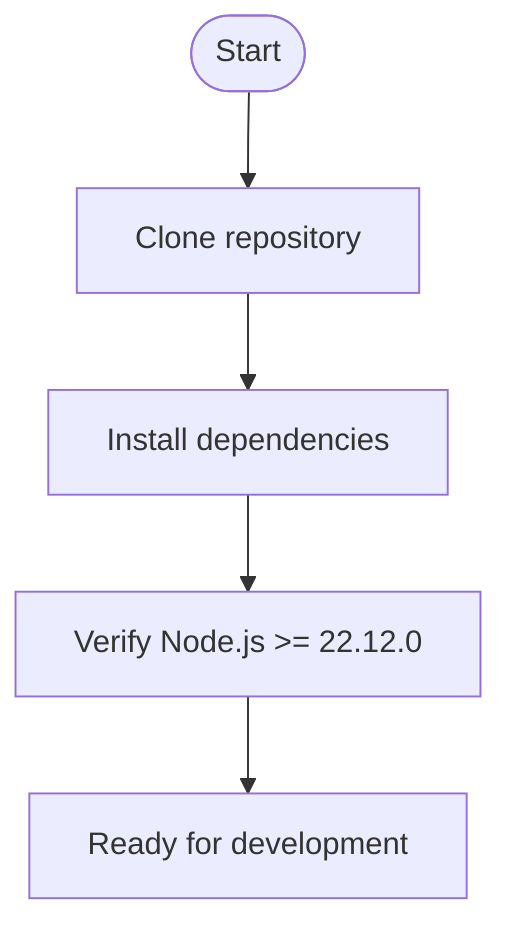
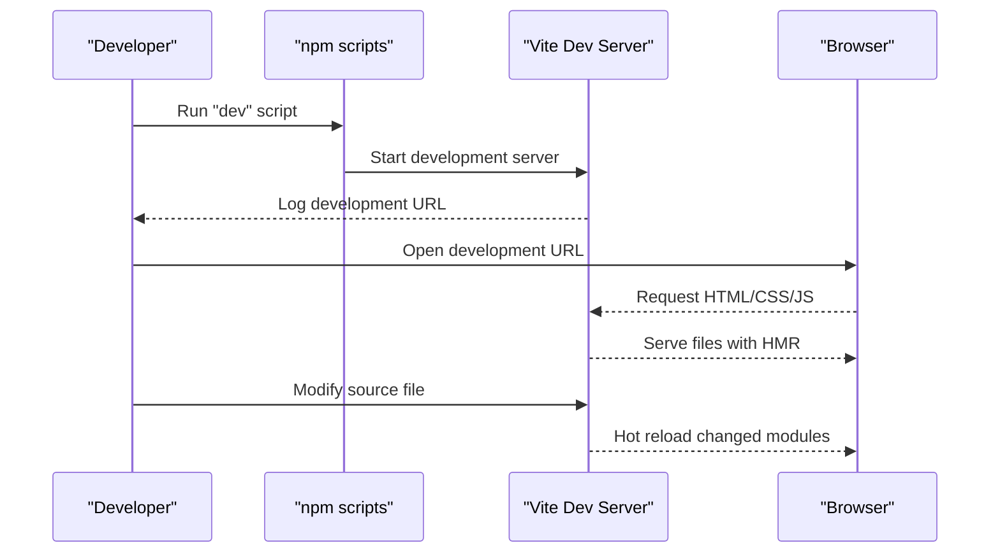
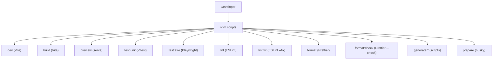
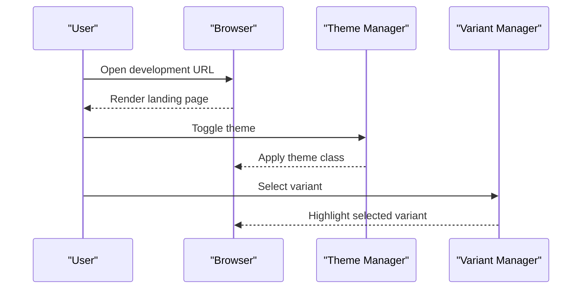
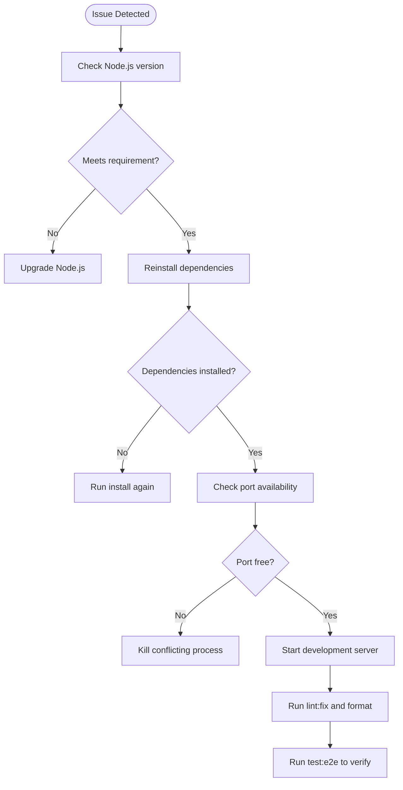
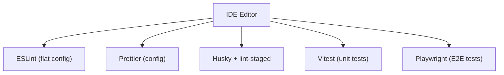

# Getting Started

<cite>
**Referenced Files in This Document**
- [README.md](file://README.md)
- [package.json](file://package.json)
- [vite.config.mjs](file://vite.config.mjs)
- [index.html](file://index.html)
- [assets/js/main.js](file://assets/js/main.js)
- [assets/js/src/app.js](file://assets/js/src/app.js)
- [assets/js/src/theme-manager.js](file://assets/js/src/theme-manager.js)
- [assets/js/src/variant-manager.js](file://assets/js/src/variant-manager.js)
- [vitest.config.js](file://vitest.config.js)
- [playwright.config.js](file://playwright.config.js)
- [eslint.config.mjs](file://eslint.config.mjs)
- [.prettierrc](file://.prettierrc)
- [DEPLOYMENT_READY.md](file://DEPLOYMENT_READY.md)
</cite>

## Table of Contents

1. [Introduction](#introduction)
2. [Prerequisites](#prerequisites)
3. [Installation](#installation)
4. [Local Development](#local-development)
5. [Development Workflow](#development-workflow)
6. [Basic Usage](#basic-usage)
7. [Troubleshooting](#troubleshooting)
8. [IDE Integration](#ide-integration)
9. [Conclusion](#conclusion)

## Introduction

This guide helps you quickly set up and run the Resume Website project locally. It covers prerequisites, installation, development server startup, basic usage, and troubleshooting. The project is built with vanilla JavaScript and Vite, featuring multiple resume variants, theme switching, responsive design, and automated tooling.

## Prerequisites

- Node.js version 22.12.0 or higher
- npm (typically included with Node.js)

These requirements are enforced by the project configuration and documented in the repository.

**Section sources**

- [README.md](file://README.md#L141-L144)
- [package.json](file://package.json#L2-L4)

## Installation

Follow these steps to clone and prepare the project:

1. Clone the repository
   - Use your preferred Git client or command line to clone the repository to your local machine.
   - Change into the project directory after cloning.

2. Install dependencies
   - Run the package manager install command to fetch all required development and runtime dependencies.

3. Verify Node.js version
   - Ensure your installed Node.js version meets the minimum requirement.

**Section sources**

- [README.md](file://README.md#L148-L159)
- [package.json](file://package.json#L2-L4)

## Local Development

Start the development server and preview the site:

1. Start the development server
   - Run the development script to launch Vite’s local server.

2. Open the site in your browser
   - Navigate to the development server URL shown in the terminal.

3. Enable hot module replacement (HMR)
   - The development server supports HMR for instant updates when you modify files.

**Section sources**

- [README.md](file://README.md#L161-L172)
- [package.json](file://package.json#L8-L8)

## Development Workflow

The project uses npm scripts for common tasks. Here are the primary commands:

- Development server: starts Vite with HMR
- Build: creates a production bundle
- Preview build: serves the production build locally
- Unit tests: runs Vitest unit tests
- E2E tests: runs Playwright end-to-end tests
- Linting: validates JavaScript with ESLint
- Auto-fix linting: attempts automatic fixes
- Formatting: formats code with Prettier
- Formatting check: verifies formatting without writing changes
- Generate documents: creates DOCX/PDF/Markdown/Email variants
- Prepare: sets up Git hooks

**Section sources**

- [README.md](file://README.md#L176-L241)
- [package.json](file://package.json#L5-L23)

## Basic Usage

Once the development server is running, you can explore the site and interact with its features:

- Theme switching: toggle between light and dark modes
- Variant selection: switch between Print, ATS, Digital, and Portfolio variants
- Navigation: use the main navigation to jump to sections
- Browser preview: open the development URL in your browser to see live changes

**Section sources**

- [README.md](file://README.md#L167-L172)
- [index.html](file://index.html#L69-L118)
- [assets/js/src/theme-manager.js](file://assets/js/src/theme-manager.js#L4-L85)
- [assets/js/src/variant-manager.js](file://assets/js/src/variant-manager.js#L4-L50)

## Troubleshooting

Common setup issues and solutions:

- Node.js version mismatch
  - Symptom: Installation fails or scripts fail with engine errors.
  - Solution: Upgrade Node.js to meet the minimum version requirement.

- Port conflicts
  - Symptom: Development server fails to start due to port already in use.
  - Solution: Stop the conflicting process or configure Vite to use a different port.

- Missing dependencies
  - Symptom: Commands fail due to missing packages.
  - Solution: Re-run the dependency installation step.

- Lint/format errors
  - Symptom: Pre-commit hooks or CI fail due to lint/format violations.
  - Solution: Run the lint and format commands to fix issues automatically or manually.

- E2E test failures
  - Symptom: Playwright tests fail locally.
  - Solution: Review the test configuration and ensure the development server is reachable at the expected URL.

**Section sources**

- [README.md](file://README.md#L141-L159)
- [package.json](file://package.json#L2-L4)
- [eslint.config.mjs](file://eslint.config.mjs#L24-L26)
- [playwright.config.js](file://playwright.config.js#L38-L43)

## IDE Integration

Integrate your IDE with the project’s tooling:

- ESLint
  - The project uses a flat config with recommended rules and Prettier integration. Configure your IDE to use the project’s ESLint settings for real-time feedback.

- Prettier
  - Formatting is enforced via Prettier. Configure your IDE to format on save using the project’s Prettier settings.

- Pre-commit hooks
  - Husky and lint-staged run ESLint and Prettier on staged files. Ensure your IDE triggers these hooks during commits.

- Testing
  - Vitest and Playwright configurations are provided. Configure your IDE to run unit and E2E tests using the project’s test scripts.

**Section sources**

- [eslint.config.mjs](file://eslint.config.mjs#L20-L81)
- [.prettierrc](file://.prettierrc#L1-L9)
- [vitest.config.js](file://vitest.config.js#L3-L10)
- [playwright.config.js](file://playwright.config.js#L4-L44)

## Conclusion

You now have everything needed to run the Resume Website project locally, understand the development workflow, and integrate with your IDE. For advanced features and integrations, refer to the deployment-ready documentation and feature guides.

**Section sources**

- [README.md](file://README.md#L1-L374)
- [DEPLOYMENT_READY.md](file://DEPLOYMENT_READY.md#L1-L316)
