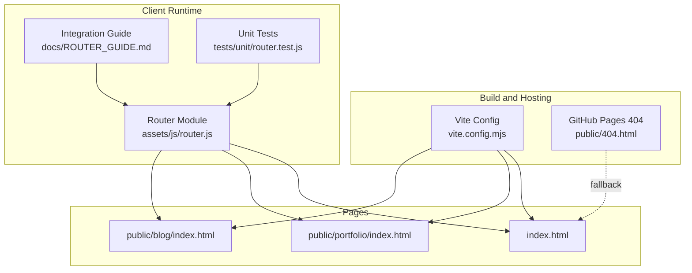
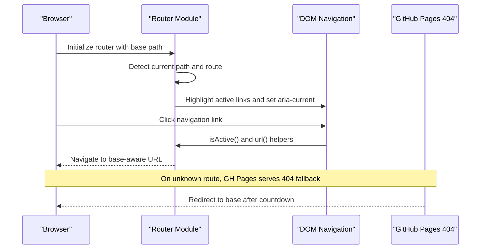
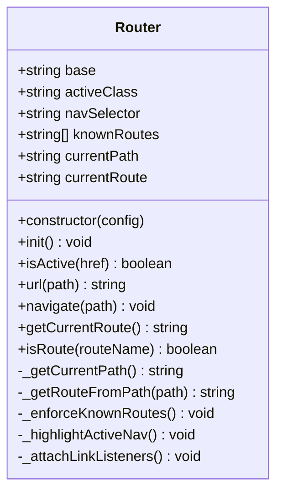
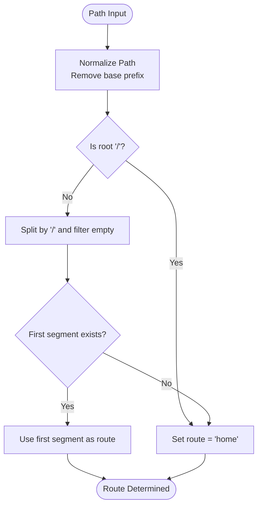
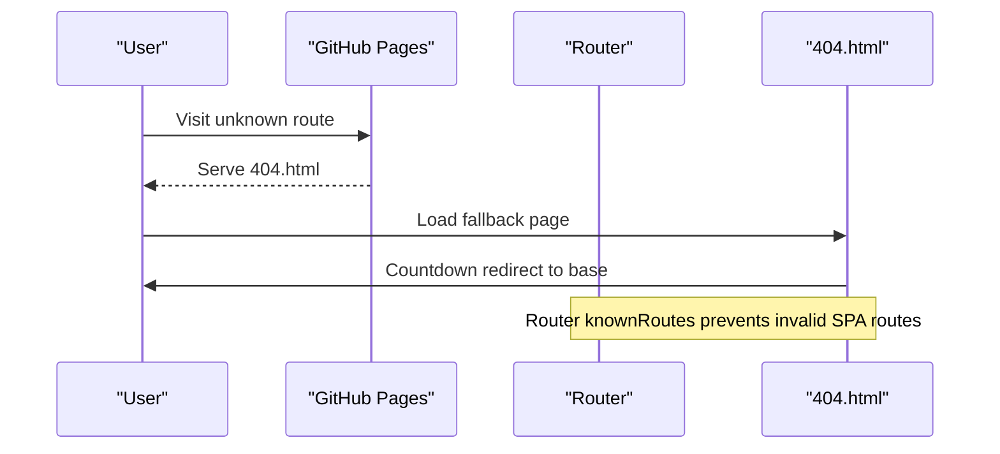
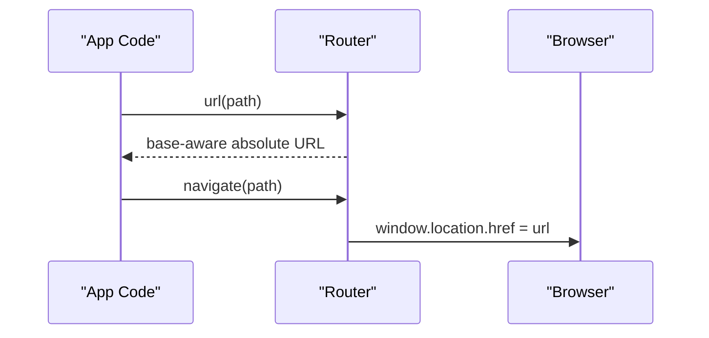
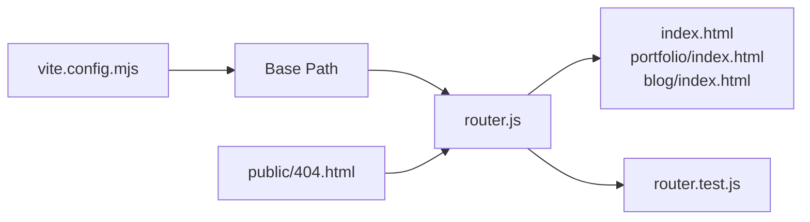

# Navigation and Routing

<cite>
**Referenced Files in This Document**
- [router.js](file://assets/js/router.js)
- [ROUTER_GUIDE.md](file://docs/ROUTER_GUIDE.md)
- [404.html](file://public/404.html)
- [vite.config.mjs](file://vite.config.mjs)
- [index.html](file://index.html)
- [portfolio/index.html](file://public/portfolio/index.html)
- [blog/index.html](file://public/blog/index.html)
- [router.test.js](file://tests/unit/router.test.js)
- [package.json](file://package.json)
</cite>

## Table of Contents

1. [Introduction](#introduction)
2. [Project Structure](#project-structure)
3. [Core Components](#core-components)
4. [Architecture Overview](#architecture-overview)
5. [Detailed Component Analysis](#detailed-component-analysis)
6. [Dependency Analysis](#dependency-analysis)
7. [Performance Considerations](#performance-considerations)
8. [Troubleshooting Guide](#troubleshooting-guide)
9. [Conclusion](#conclusion)
10. [Appendices](#appendices)

## Introduction

This document explains the navigation and routing system centered on the Router module. It covers routing architecture, active link highlighting, route detection logic, and GitHub Pages compatibility. You will learn how to configure the router, manage URLs, integrate with a single-page application structure, handle navigation events, and optimize for SEO. The guide also includes testing strategies and best practices for extending the navigation system.

## Project Structure

The routing system spans client-side JavaScript, static HTML pages, and build configuration:

- Router implementation: assets/js/router.js
- Router usage and examples: docs/ROUTER_GUIDE.md
- GitHub Pages 404 fallback: public/404.html
- Build base configuration: vite.config.mjs
- Example pages using router: index.html, public/portfolio/index.html, public/blog/index.html
- Unit tests: tests/unit/router.test.js
- Scripts and tooling: package.json



**Diagram sources**

- [vite.config.mjs](file://vite.config.mjs#L1-L21)
- [404.html](file://public/404.html#L1-L147)
- [router.js](file://assets/js/router.js#L1-L210)
- [ROUTER_GUIDE.md](file://docs/ROUTER_GUIDE.md#L1-L301)
- [router.test.js](file://tests/unit/router.test.js#L1-L49)
- [index.html](file://index.html#L1-L408)
- [portfolio/index.html](file://public/portfolio/index.html#L1-L624)
- [blog/index.html](file://public/blog/index.html#L1-L116)

**Section sources**

- [router.js](file://assets/js/router.js#L1-L210)
- [ROUTER_GUIDE.md](file://docs/ROUTER_GUIDE.md#L1-L301)
- [404.html](file://public/404.html#L1-L147)
- [vite.config.mjs](file://vite.config.mjs#L1-L21)
- [index.html](file://index.html#L1-L408)
- [portfolio/index.html](file://public/portfolio/index.html#L1-L624)
- [blog/index.html](file://public/blog/index.html#L1-L116)
- [router.test.js](file://tests/unit/router.test.js#L1-L49)
- [package.json](file://package.json#L1-L56)

## Core Components

- Router class: Provides route detection, active link highlighting, URL construction, and navigation helpers.
- Router configuration: Base path, active class, navigation selector, and known routes.
- GitHub Pages 404 fallback: Handles SPA-like routing errors gracefully.
- Build base configuration: Ensures absolute paths and correct deployment base.

Key capabilities:

- Base-aware path normalization and URL building
- Active navigation highlighting with ARIA support
- Known-route enforcement to prevent invalid SPA-like routes
- Keyboard accessibility for navigation links
- Programmatic navigation and route checks

**Section sources**

- [router.js](file://assets/js/router.js#L11-L192)
- [ROUTER_GUIDE.md](file://docs/ROUTER_GUIDE.md#L75-L107)
- [404.html](file://public/404.html#L116-L144)
- [vite.config.mjs](file://vite.config.mjs#L4-L4)

## Architecture Overview

The routing architecture combines a lightweight client-side router with GitHub Pages hosting and Vite build configuration:



**Diagram sources**

- [router.js](file://assets/js/router.js#L38-L152)
- [404.html](file://public/404.html#L116-L144)
- [vite.config.mjs](file://vite.config.mjs#L4-L4)

## Detailed Component Analysis

### Router Module

The Router class encapsulates routing logic:

- Initialization: Enforces known routes, highlights active links, attaches keyboard listeners.
- Path handling: Strips base prefix and normalizes paths.
- Route detection: Derives route name from first path segment.
- Active link detection: Ignores anchors and external links; supports absolute and relative paths.
- URL construction: Builds base-aware absolute URLs.
- Navigation: Programmatic navigation via location replacement.



**Diagram sources**

- [router.js](file://assets/js/router.js#L11-L192)

**Section sources**

- [router.js](file://assets/js/router.js#L11-L192)

### Route Detection Logic

Route detection extracts the top-level route from the normalized path:

- Root path resolves to "home".
- First path segment becomes the route name.
- Known routes include "home", "portfolio", "print", "ats", "digital", "blog".



**Diagram sources**

- [router.js](file://assets/js/router.js#L49-L71)

**Section sources**

- [router.js](file://assets/js/router.js#L49-L71)

### Active Link Highlighting

Active link highlighting:

- Selects links via configurable selector.
- Applies active class and aria-current attributes when the link matches the current route.
- Ignores anchor links and external links.
- Adds keyboard accessibility for Enter key activation.

```mermaid
sequenceDiagram
participant Init as "Router.init()"
participant DOM as "DOM Query"
participant Link as "Navigation Link"
Init->>DOM : Query selector for nav links
DOM-->>Init : NodeList of links
loop For each link
Init->>Link : isActive(href)
alt isActive == true
Init->>Link : add class "active"<br/>set aria-current="page"
else
Init->>Link : remove "active"<br/>remove aria-current
end
end
```

**Diagram sources**

- [router.js](file://assets/js/router.js#L120-L134)
- [router.js](file://assets/js/router.js#L78-L102)

**Section sources**

- [router.js](file://assets/js/router.js#L120-L134)
- [router.js](file://assets/js/router.js#L78-L102)

### GitHub Pages Compatibility and 404 Fallback

- Build base: Vite base is configured for GitHub Pages deployment.
- 404 fallback: A static page handles unknown routes with a countdown redirect to the base.
- SPA-like behavior: Router enforces known routes and redirects unknown routes to base.



**Diagram sources**

- [vite.config.mjs](file://vite.config.mjs#L4-L4)
- [404.html](file://public/404.html#L116-L144)
- [router.js](file://assets/js/router.js#L108-L114)

**Section sources**

- [vite.config.mjs](file://vite.config.mjs#L4-L4)
- [404.html](file://public/404.html#L116-L144)
- [router.js](file://assets/js/router.js#L108-L114)

### URL Management and Navigation Patterns

- Base-aware URL building: Ensures absolute URLs include the configured base.
- Programmatic navigation: Navigates to a given path using the constructed URL.
- Route checks: Determine current route or check against a specific route.



**Diagram sources**

- [router.js](file://assets/js/router.js#L159-L174)

**Section sources**

- [router.js](file://assets/js/router.js#L159-L174)

### Integration with Single-Page Application Structure

While the site uses static pages, the router enables SPA-like navigation:

- Each page initializes the router on DOMContentLoaded.
- Navigation links use absolute paths with the base to ensure correct routing.
- Known routes are enforced to avoid client-side routing conflicts.

Examples:

- Portfolio page integrates router initialization and navigation.
- Blog page demonstrates dynamic base detection and extended known routes.

**Section sources**

- [portfolio/index.html](file://public/portfolio/index.html#L588-L592)
- [blog/index.html](file://public/blog/index.html#L100-L113)
- [ROUTER_GUIDE.md](file://docs/ROUTER_GUIDE.md#L111-L145)

## Dependency Analysis

The routing system depends on:

- Build configuration for base path resolution.
- Static HTML pages for navigation and router initialization.
- Router module for runtime behavior.
- Unit tests for validation.



**Diagram sources**

- [vite.config.mjs](file://vite.config.mjs#L4-L4)
- [router.js](file://assets/js/router.js#L11-L33)
- [index.html](file://index.html#L69-L118)
- [portfolio/index.html](file://public/portfolio/index.html#L588-L592)
- [blog/index.html](file://public/blog/index.html#L100-L113)
- [router.test.js](file://tests/unit/router.test.js#L1-L49)
- [404.html](file://public/404.html#L116-L144)

**Section sources**

- [vite.config.mjs](file://vite.config.mjs#L4-L4)
- [router.js](file://assets/js/router.js#L11-L33)
- [index.html](file://index.html#L69-L118)
- [portfolio/index.html](file://public/portfolio/index.html#L588-L592)
- [blog/index.html](file://public/blog/index.html#L100-L113)
- [router.test.js](file://tests/unit/router.test.js#L1-L49)
- [404.html](file://public/404.html#L116-L144)

## Performance Considerations

- Minimal runtime overhead: Router performs simple string operations and DOM queries.
- Efficient selectors: Uses attribute selectors for navigation links.
- Avoid unnecessary reflows: Active highlighting updates only affected nodes.
- Build-time base ensures correct asset paths, reducing runtime path computations.

## Troubleshooting Guide

Common issues and resolutions:

- Links not highlighting: Ensure links have the data-nav-link attribute and absolute paths with the base.
- 404 page not showing: Confirm public/404.html exists and test locally with a simulated 404.
- Base path issues: Verify vite.config.mjs base setting and use router.url() for constructing URLs.
- Unknown routes: Router enforces known routes and redirects to base; ensure route names match knownRoutes.

**Section sources**

- [ROUTER_GUIDE.md](file://docs/ROUTER_GUIDE.md#L265-L284)
- [router.js](file://assets/js/router.js#L108-L114)

## Conclusion

The Router module provides a robust, framework-free solution for navigation and routing on GitHub Pages. It offers base-aware URL handling, active link highlighting, route detection, and SPA-like behavior through a 404 fallback. With clear configuration, integration examples, and testing strategies, the system is straightforward to extend and maintain.

## Appendices

### Router Configuration Reference

- base: GitHub Pages base path (e.g., "/resume-website/")
- activeClass: CSS class applied to active links (default: "active")
- navSelector: Selector for navigation links (default: "[data-nav-link]")
- knownRoutes: Allowed top-level routes (default includes "home", "portfolio", "print", "ats", "digital", "blog")

**Section sources**

- [router.js](file://assets/js/router.js#L19-L33)
- [ROUTER_GUIDE.md](file://docs/ROUTER_GUIDE.md#L77-L85)

### Adding New Routes

Steps to add a new route:

1. Extend knownRoutes to include the new top-level route.
2. Add navigation links with data-nav-link and absolute paths using the base.
3. Style the active state with the configured activeClass.
4. Test locally and on GitHub Pages.

**Section sources**

- [ROUTER_GUIDE.md](file://docs/ROUTER_GUIDE.md#L45-L71)
- [blog/index.html](file://public/blog/index.html#L107-L107)

### Handling Navigation Events

- Use isActive() to conditionally style or process links.
- Use isRoute() to branch logic based on the current route.
- Use url() to construct absolute URLs and navigate() for programmatic navigation.

**Section sources**

- [router.js](file://assets/js/router.js#L78-L102)
- [router.js](file://assets/js/router.js#L189-L191)
- [router.js](file://assets/js/router.js#L159-L174)

### SEO and Accessibility Best Practices

- Canonical URLs: Ensure canonical tags point to the production base.
- ARIA attributes: Router sets aria-current="page" for active links.
- Structured data: Pages include JSON-LD and meta tags for improved SEO.
- Accessibility: Router adds keyboard support for navigation links.

**Section sources**

- [index.html](file://index.html#L18-L28)
- [portfolio/index.html](file://public/portfolio/index.html#L56-L83)
- [blog/index.html](file://public/blog/index.html#L7-L17)
- [router.js](file://assets/js/router.js#L127-L131)
- [router.js](file://assets/js/router.js#L145-L150)

### Testing Strategies

- Unit tests: Validate path normalization, active link detection, and URL generation.
- Manual testing: Verify active highlighting, navigation, and 404 fallback behavior.
- E2E testing: Use Playwright to simulate user interactions across pages.

**Section sources**

- [router.test.js](file://tests/unit/router.test.js#L1-L49)
- [package.json](file://package.json#L10-L12)
