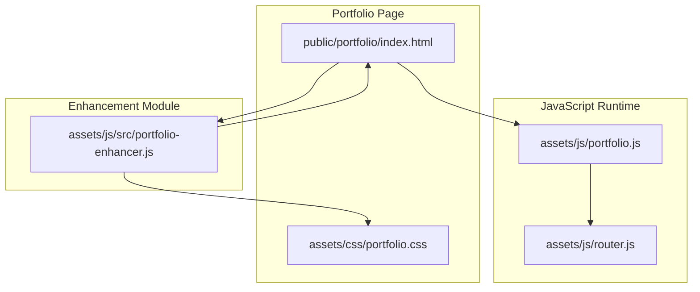
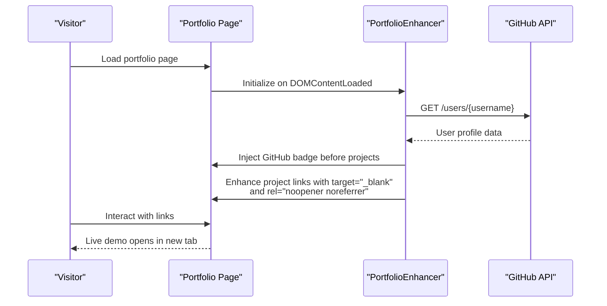
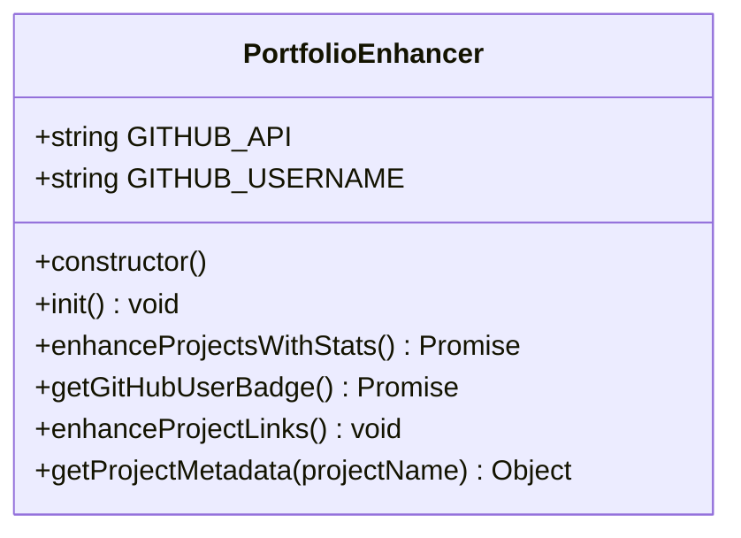
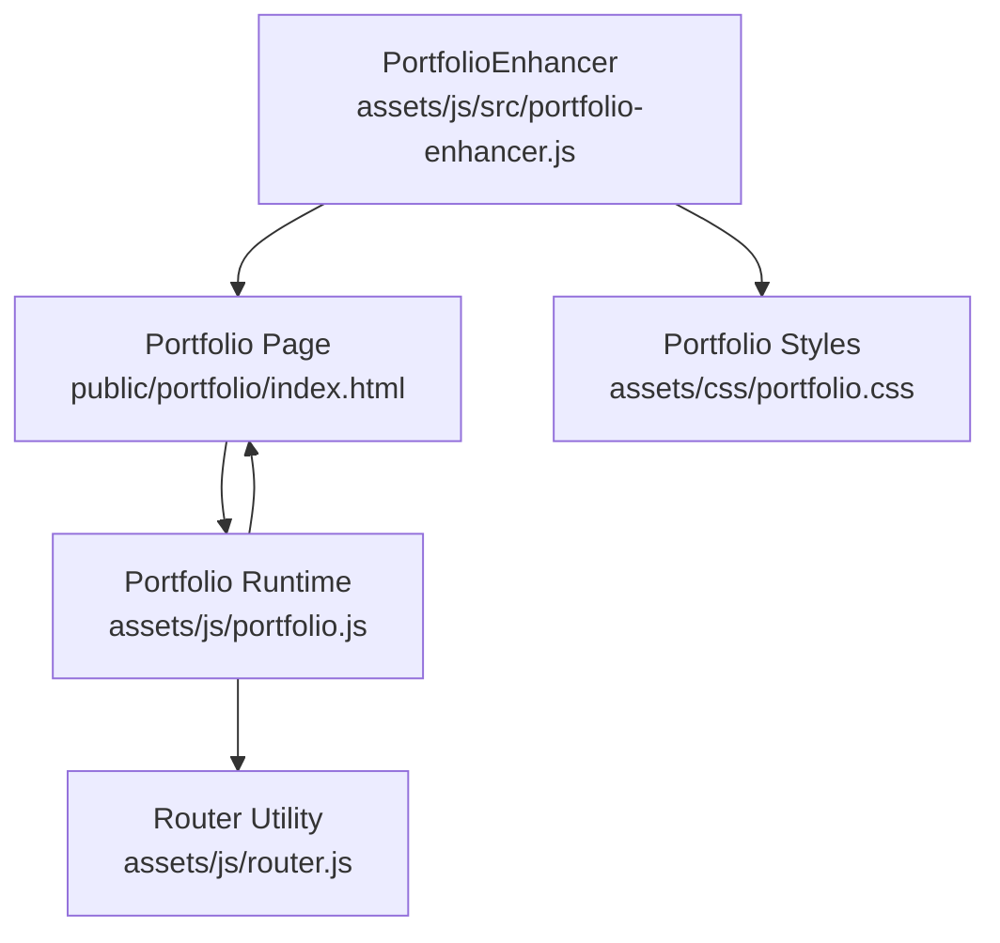

# Portfolio Enhancement

<cite>
**Referenced Files in This Document**
- [portfolio-enhancer.js](file://assets/js/src/portfolio-enhancer.js)
- [portfolio.js](file://assets/js/portfolio.js)
- [index.html](file://public/portfolio/index.html)
- [portfolio.css](file://assets/css/portfolio.css)
- [router.js](file://assets/js/router.js)
- [README.md](file://README.md)
- [DEPLOYMENT_READY.md](file://DEPLOYMENT_READY.md)
- [verify-workflows.sh](file://verify-workflows.sh)
</cite>

## Table of Contents

1. [Introduction](#introduction)
2. [Project Structure](#project-structure)
3. [Core Components](#core-components)
4. [Architecture Overview](#architecture-overview)
5. [Detailed Component Analysis](#detailed-component-analysis)
6. [Dependency Analysis](#dependency-analysis)
7. [Performance Considerations](#performance-considerations)
8. [Troubleshooting Guide](#troubleshooting-guide)
9. [Conclusion](#conclusion)

## Introduction

This document explains the portfolio enhancement system with a focus on GitHub integration and project metadata optimization. It covers how the PortfolioEnhancer class integrates with the GitHub API to enrich the portfolio page with live GitHub profile badges and project link improvements. It also documents the dynamic content generation for project showcases, external link management, and live metadata display. Implementation details include API authentication considerations, data fetching strategies, project metadata enrichment, and performance optimization techniques. The document concludes with practical examples for setting up GitHub integration, enhancing projects, and optimizing metadata for better presentation and SEO.

## Project Structure

The portfolio enhancement system spans several key files:

- PortfolioEnhancer class for GitHub integration and project link enhancement
- Portfolio page HTML containing project sections and structured content
- Portfolio-specific CSS for GitHub badge styling and responsive layouts
- Portfolio runtime script for theme switching and analytics
- Router utility for GitHub Pages compatibility
- Documentation and deployment guides for CI/CD and GitHub Actions

**Diagram sources**

- [index.html](file://public/portfolio/index.html#L1-L624)
- [portfolio.js](file://assets/js/portfolio.js#L1-L171)
- [portfolio-enhancer.js](file://assets/js/src/portfolio-enhancer.js#L1-L105)
- [portfolio.css](file://assets/css/portfolio.css#L242-L272)
- [router.js](file://assets/js/router.js#L1-L210)

**Section sources**

- [README.md](file://README.md#L104-L135)
- [index.html](file://public/portfolio/index.html#L1-L624)
- [portfolio.js](file://assets/js/portfolio.js#L1-L171)
- [portfolio-enhancer.js](file://assets/js/src/portfolio-enhancer.js#L1-L105)
- [portfolio.css](file://assets/css/portfolio.css#L242-L272)
- [router.js](file://assets/js/router.js#L1-L210)

## Core Components

- PortfolioEnhancer class
  - Initializes GitHub API endpoint and username
  - Fetches GitHub user profile data and renders a GitHub badge before the projects section
  - Enhances project links with target="\_blank", rel="noopener noreferrer", and hover effects
  - Provides a metadata lookup for selected projects
- Portfolio page
  - Contains structured project sections with links to live demos and repositories
  - Includes Open Graph, Twitter, and JSON-LD metadata for SEO and social sharing
- Portfolio runtime
  - Manages theme switching, resume variant toggling, and contact form submission
  - Integrates analytics and feedback messaging
- Router utility
  - Ensures GitHub Pages-compatible navigation and route handling

Key implementation references:

- GitHub API integration and badge rendering
- Project link enhancement and metadata lookup
- Portfolio page SEO metadata and structured data
- Theme and analytics runtime behaviors
- Router base-aware path handling for GitHub Pages

**Section sources**

- [portfolio-enhancer.js](file://assets/js/src/portfolio-enhancer.js#L6-L105)
- [index.html](file://public/portfolio/index.html#L17-L83)
- [portfolio.js](file://assets/js/portfolio.js#L1-L171)
- [router.js](file://assets/js/router.js#L11-L210)

## Architecture Overview

The portfolio enhancement system follows a modular architecture:

- The PortfolioEnhancer class encapsulates GitHub integration and project link enhancement
- The portfolio page serves as the content canvas where GitHub badges and enhanced links are injected
- The runtime script manages UI behaviors and analytics
- The router ensures navigation compatibility with GitHub Pages base paths

**Diagram sources**

- [portfolio-enhancer.js](file://assets/js/src/portfolio-enhancer.js#L17-L33)
- [portfolio-enhancer.js](file://assets/js/src/portfolio-enhancer.js#L35-L53)
- [index.html](file://public/portfolio/index.html#L252-L445)

## Detailed Component Analysis

### PortfolioEnhancer Class

The PortfolioEnhancer class orchestrates GitHub integration and project link enhancement:

- Initialization sets GitHub API endpoint and username, then triggers enhancement
- enhanceProjectsWithStats locates the projects container, injects a GitHub badge, and enhances links
- getGitHubUserBadge performs a fetch to the GitHub API and returns an HTML fragment with avatar, name, and stats
- enhanceProjectLinks adds external link attributes and hover effects to project links
- getProjectMetadata provides static metadata for specific projects (icon, status, users/downloads/features)

**Diagram sources**

- [portfolio-enhancer.js](file://assets/js/src/portfolio-enhancer.js#L6-L95)

**Section sources**

- [portfolio-enhancer.js](file://assets/js/src/portfolio-enhancer.js#L6-L105)

### GitHub API Integration

- Endpoint: GitHub REST API users endpoint
- Data fetched: avatar URL, name or login, public repositories count, followers count
- Rendering: GitHub badge inserted before the projects section using innerHTML
- Error handling: Console logs on fetch failures; graceful degradation if badge fails to render

Implementation references:

- API endpoint and username configuration
- Fetch and JSON parsing for user data
- HTML template construction for badge
- Injection into the DOM before the projects container

**Section sources**

- [portfolio-enhancer.js](file://assets/js/src/portfolio-enhancer.js#L7-L11)
- [portfolio-enhancer.js](file://assets/js/src/portfolio-enhancer.js#L17-L33)
- [portfolio-enhancer.js](file://assets/js/src/portfolio-enhancer.js#L35-L53)

### Project Statistics Collection

- Live GitHub stats badge displays public repositories and followers
- Project links are enhanced with external link attributes for security and UX
- Metadata lookup provides additional project details for selected entries

Implementation references:

- Badge injection logic
- Link enhancement with target and rel attributes
- Metadata dictionary for project-specific details

**Section sources**

- [portfolio-enhancer.js](file://assets/js/src/portfolio-enhancer.js#L21-L33)
- [portfolio-enhancer.js](file://assets/js/src/portfolio-enhancer.js#L55-L72)
- [portfolio-enhancer.js](file://assets/js/src/portfolio-enhancer.js#L74-L94)

### External Link Optimization

- All project links are set to open in a new tab with rel="noopener noreferrer" for security
- Hover effects improve interactivity and visual feedback
- Target selectors focus on links within the projects container

Implementation references:

- Attribute assignment for external links
- Event listeners for hover effects
- DOM query targeting project links

**Section sources**

- [portfolio-enhancer.js](file://assets/js/src/portfolio-enhancer.js#L55-L72)

### Live Metadata Display

- GitHub badge content is generated dynamically from API responses
- Project metadata is available for specific projects to augment descriptions
- CSS styles define the appearance and responsiveness of the GitHub badge

Implementation references:

- Dynamic HTML construction for GitHub badge
- Metadata lookup for project details
- CSS rules for badge layout and typography

**Section sources**

- [portfolio-enhancer.js](file://assets/js/src/portfolio-enhancer.js#L35-L53)
- [portfolio-enhancer.js](file://assets/js/src/portfolio-enhancer.js#L74-L94)
- [portfolio.css](file://assets/css/portfolio.css#L242-L272)

### Portfolio Page Integration

- The portfolio page includes structured project sections with live demo and code links
- SEO metadata (Open Graph, Twitter, JSON-LD) improves social sharing and search visibility
- The page loads the portfolio runtime script for theme and analytics features

Implementation references:

- Project sections with links
- Meta tags and structured data
- Script inclusion for runtime behaviors

**Section sources**

- [index.html](file://public/portfolio/index.html#L252-L445)
- [index.html](file://public/portfolio/index.html#L17-L83)
- [index.html](file://public/portfolio/index.html#L621)

### Theme and Analytics Runtime

- Theme switching persists user preference and updates UI accordingly
- Analytics-style logging captures resume download interactions
- Contact form submission uses a third-party API with feedback messaging

Implementation references:

- Theme initialization and toggle
- Resume variant toggling
- Contact form submission flow

**Section sources**

- [portfolio.js](file://assets/js/portfolio.js#L1-L171)

### Router Utility for GitHub Pages

- Base-aware path handling ensures correct routing on GitHub Pages deployments
- Active navigation highlighting and keyboard accessibility
- URL building and programmatic navigation helpers

Implementation references:

- Base path extraction and normalization
- Route detection and active class management
- URL construction with base prefix

**Section sources**

- [router.js](file://assets/js/router.js#L11-L210)

## Dependency Analysis

The portfolio enhancement system exhibits clear separation of concerns:

- PortfolioEnhancer depends on the portfolio page DOM and GitHub API
- Portfolio runtime depends on DOMContentLoaded lifecycle and external APIs
- Router utility is independent and reusable across pages
- CSS styles are scoped to the portfolio page and GitHub badge

**Diagram sources**

- [portfolio-enhancer.js](file://assets/js/src/portfolio-enhancer.js#L1-L105)
- [index.html](file://public/portfolio/index.html#L1-L624)
- [portfolio.css](file://assets/css/portfolio.css#L242-L272)
- [portfolio.js](file://assets/js/portfolio.js#L1-L171)
- [router.js](file://assets/js/router.js#L1-L210)

**Section sources**

- [portfolio-enhancer.js](file://assets/js/src/portfolio-enhancer.js#L1-L105)
- [portfolio.js](file://assets/js/portfolio.js#L1-L171)
- [router.js](file://assets/js/router.js#L1-L210)
- [portfolio.css](file://assets/css/portfolio.css#L242-L272)
- [index.html](file://public/portfolio/index.html#L1-L624)

## Performance Considerations

- Minimize DOM queries: Cache selectors and reuse results where possible
- Defer enhancement until DOMContentLoaded to avoid blocking render
- Use efficient CSS selectors for link enhancement
- Consider caching GitHub API responses to reduce repeated network requests
- Lazy-load images and minimize heavy computations during user interactions
- Keep CSS and JavaScript bundles small to improve load times

## Troubleshooting Guide

Common issues and resolutions:

- GitHub API fetch failures
  - Symptom: GitHub badge not displayed
  - Cause: Network errors or rate limiting
  - Resolution: Check network connectivity, verify API endpoint, handle errors gracefully
- External link attributes not applied
  - Symptom: Links open in same tab or lack security attributes
  - Cause: Missing DOM element or selector mismatch
  - Resolution: Ensure projects container exists and selectors match actual markup
- Theme toggle not persisting
  - Symptom: Theme resets on reload
  - Cause: localStorage access blocked or disabled
  - Resolution: Verify browser settings and localStorage availability
- Router navigation issues on GitHub Pages
  - Symptom: Broken navigation or incorrect active states
  - Cause: Incorrect base path configuration
  - Resolution: Confirm base path and route detection logic

**Section sources**

- [portfolio-enhancer.js](file://assets/js/src/portfolio-enhancer.js#L35-L53)
- [portfolio-enhancer.js](file://assets/js/src/portfolio-enhancer.js#L55-L72)
- [portfolio.js](file://assets/js/portfolio.js#L3-L23)
- [router.js](file://assets/js/router.js#L19-L33)

## Conclusion

The portfolio enhancement system successfully integrates GitHub data and optimizes project presentation through dynamic content generation and external link management. The PortfolioEnhancer class centralizes GitHub API usage, badge rendering, and link enhancement, while the portfolio page and runtime scripts provide a robust foundation for theme switching, analytics, and user interactions. The router utility ensures compatibility with GitHub Pages deployments. By following the implementation details and best practices outlined in this document, developers can maintain and extend the system effectively, ensuring optimal performance and user experience.
