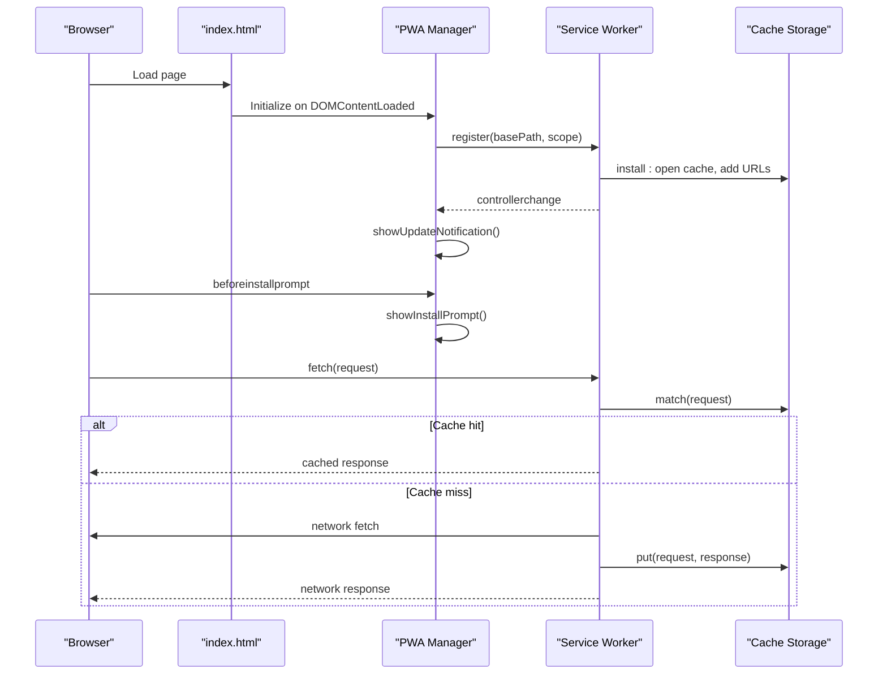
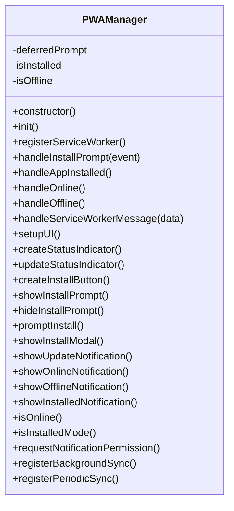
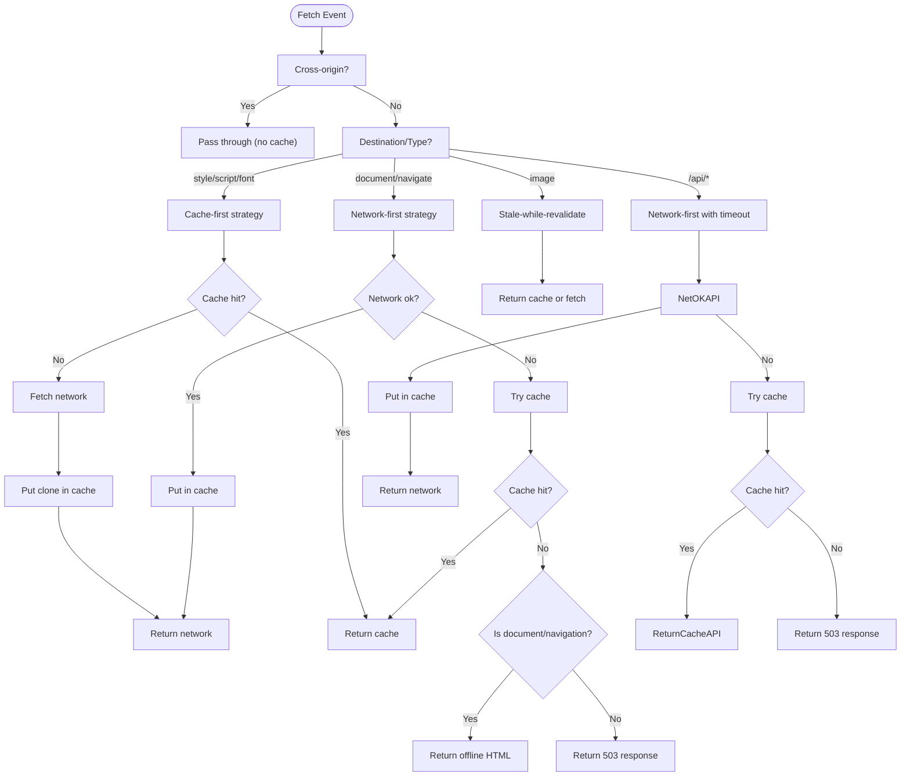
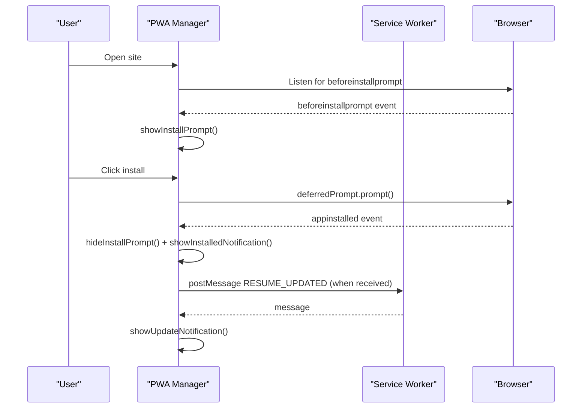
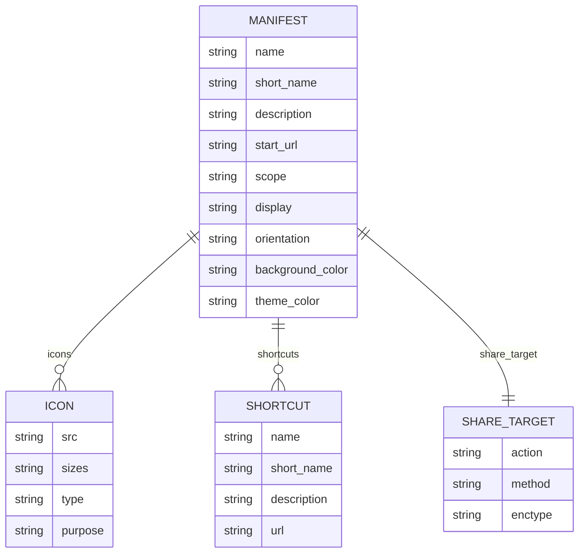
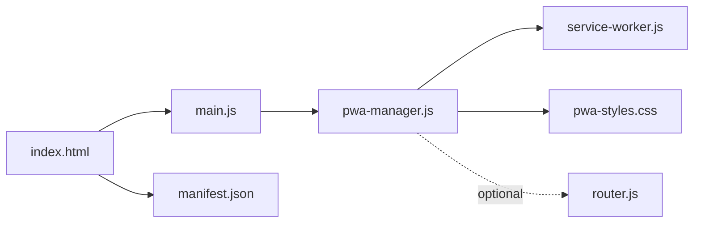

# Progressive Web App

<cite>
**Referenced Files in This Document**
- [service-worker.js](file://public/service-worker.js)
- [pwa-manager.js](file://assets/js/src/pwa-manager.js)
- [manifest.json](file://public/manifest.json)
- [pwa-styles.css](file://assets/css/pwa-styles.css)
- [index.html](file://index.html)
- [main.js](file://assets/js/main.js)
- [router.js](file://assets/js/router.js)
</cite>

## Table of Contents

1. [Introduction](#introduction)
2. [Project Structure](#project-structure)
3. [Core Components](#core-components)
4. [Architecture Overview](#architecture-overview)
5. [Detailed Component Analysis](#detailed-component-analysis)
6. [Dependency Analysis](#dependency-analysis)
7. [Performance Considerations](#performance-considerations)
8. [Troubleshooting Guide](#troubleshooting-guide)
9. [Conclusion](#conclusion)
10. [Appendices](#appendices)

## Introduction

This document explains the Progressive Web App (PWA) implementation for the Resume Portfolio website, focusing on offline capabilities, installation features, and user experience enhancements. It covers the PWA manager, service worker lifecycle, caching strategies, background sync, manifest configuration, shortcuts, share targets, and styling for install prompts and notifications. It also provides practical guidance for setup, testing, and optimization.

## Project Structure

The PWA features are implemented across three primary areas:

- Service worker for caching and offline behavior
- Client-side PWA manager for installation prompts and runtime UX
- Manifest and styles for installability and UI feedback

```mermaid
graph TB
subgraph "Client"
Index["index.html"]
MainJS["assets/js/main.js"]
PWAJS["assets/js/src/pwa-manager.js"]
Styles["assets/css/pwa-styles.css"]
RouterJS["assets/js/router.js"]
end
subgraph "Service Worker"
SW["public/service-worker.js"]
end
subgraph "Manifest"
Manifest["public/manifest.json"]
end
Index --> MainJS
MainJS --> PWAJS
PWAJS --> SW
PWAJS --> Styles
Index --> Manifest
RouterJS -. optional routing .-> PWAJS
```

**Diagram sources**

- [index.html](file://index.html#L44-L46)
- [main.js](file://assets/js/main.js#L5-L8)
- [pwa-manager.js](file://assets/js/src/pwa-manager.js#L15-L46)
- [service-worker.js](file://public/service-worker.js#L42-L75)
- [manifest.json](file://public/manifest.json#L1-L81)
- [pwa-styles.css](file://assets/css/pwa-styles.css#L1-L394)
- [router.js](file://assets/js/router.js#L11-L33)

**Section sources**

- [index.html](file://index.html#L44-L46)
- [pwa-manager.js](file://assets/js/src/pwa-manager.js#L15-L46)
- [service-worker.js](file://public/service-worker.js#L42-L75)
- [manifest.json](file://public/manifest.json#L1-L81)
- [pwa-styles.css](file://assets/css/pwa-styles.css#L1-L394)
- [router.js](file://assets/js/router.js#L11-L33)

## Core Components

- PWA Manager: Registers the service worker, handles install prompts, tracks online/offline state, and displays UX notifications.
- Service Worker: Implements caching strategies, manages offline fallbacks, periodic and background sync, and push-like notifications via postMessage.
- Manifest: Defines app metadata, icons, categories, screenshots, shortcuts, and share target.
- Styles: Provides install prompt, notification, and status indicator UI with responsive and dark mode support.

**Section sources**

- [pwa-manager.js](file://assets/js/src/pwa-manager.js#L6-L46)
- [service-worker.js](file://public/service-worker.js#L6-L30)
- [manifest.json](file://public/manifest.json#L1-L81)
- [pwa-styles.css](file://assets/css/pwa-styles.css#L1-L394)

## Architecture Overview

The PWA architecture integrates client-side initialization, service worker lifecycle, and manifest-driven installability.



**Diagram sources**

- [index.html](file://index.html#L44-L46)
- [pwa-manager.js](file://assets/js/src/pwa-manager.js#L48-L81)
- [service-worker.js](file://public/service-worker.js#L42-L119)

## Detailed Component Analysis

### PWA Manager Implementation

The PWA Manager orchestrates service worker registration, install prompts, and runtime UX.

- Service worker registration:
  - Determines correct path and scope depending on hosting context.
  - Periodically checks for updates and listens for controller changes.
  - Subscribes to messages from the service worker.
- Install prompts:
  - Captures and handles the beforeinstallprompt event.
  - Displays an install prompt UI and triggers the native prompt.
  - Updates UI state after appinstalled.
- Online/offline handling:
  - Listens to online/offline events and toggles body classes and notifications.
- Background sync and periodic sync:
  - Registers background sync and periodic sync tags when supported.



**Diagram sources**

- [pwa-manager.js](file://assets/js/src/pwa-manager.js#L6-L338)

**Section sources**

- [pwa-manager.js](file://assets/js/src/pwa-manager.js#L6-L338)

### Service Worker Lifecycle and Caching Strategies

The service worker defines cache-first, network-first, and stale-while-revalidate strategies and provides offline fallbacks.

- Cache and activation:
  - Pre-caches a curated set of URLs during install.
  - Cleans up old caches during activate and claims clients.
- Fetch handling:
  - Applies different strategies per destination/type.
  - Uses timeouts for network-first to avoid long hangs.
- Offline fallback:
  - Returns a styled offline HTML for navigational documents.
  - Returns a 503 response for other resource types when offline.
- Background sync and periodic sync:
  - Registers and handles sync tags for background tasks.
  - Periodically checks for resume updates and notifies clients.



**Diagram sources**

- [service-worker.js](file://public/service-worker.js#L77-L202)

**Section sources**

- [service-worker.js](file://public/service-worker.js#L42-L75)
- [service-worker.js](file://public/service-worker.js#L77-L202)
- [service-worker.js](file://public/service-worker.js#L204-L278)
- [service-worker.js](file://public/service-worker.js#L320-L367)

### Installation Prompts and UX

The PWA Manager exposes UI elements and notifications for installation and status.

- Status indicator: Shows online/offline/installation state.
- Install button: Appears when the beforeinstallprompt event fires.
- Notifications: Online, offline, installed, and update-available notifications with auto-dismiss.



**Diagram sources**

- [pwa-manager.js](file://assets/js/src/pwa-manager.js#L83-L117)
- [pwa-manager.js](file://assets/js/src/pwa-manager.js#L180-L198)
- [service-worker.js](file://public/service-worker.js#L329-L349)

**Section sources**

- [pwa-manager.js](file://assets/js/src/pwa-manager.js#L119-L178)
- [pwa-manager.js](file://assets/js/src/pwa-manager.js#L227-L296)
- [pwa-styles.css](file://assets/css/pwa-styles.css#L3-L394)

### Manifest Configuration, Shortcuts, and Share Targets

The manifest defines app identity, display mode, icons, screenshots, categories, shortcuts, and share target.

- Identity and presentation: name, short_name, description, start_url, scope, display, orientation, background_color, theme_color.
- Icons: multiple sizes and purposes.
- Screenshots: device form factors.
- Shortcuts: quick-access entries to specific views.
- Share target: endpoint and params for sharing content.



**Diagram sources**

- [manifest.json](file://public/manifest.json#L1-L81)

**Section sources**

- [manifest.json](file://public/manifest.json#L1-L81)

### Routing Considerations for PWA

The vanilla router supports base-aware paths and active navigation highlighting. While not directly PWA-specific, it ensures correct navigation within hosted contexts and complements offline behavior by preventing unknown routes.

**Section sources**

- [router.js](file://assets/js/router.js#L11-L33)
- [router.js](file://assets/js/router.js#L108-L114)

## Dependency Analysis

The PWA relies on the following relationships:

- index.html links the manifest and loads the module entry point.
- main.js initializes basic UI logic; PWA Manager runs independently.
- pwa-manager.js depends on service-worker.js for caching and sync.
- pwa-styles.css provides UI for prompts and notifications.
- router.js optionally enhances navigation.



**Diagram sources**

- [index.html](file://index.html#L44-L46)
- [main.js](file://assets/js/main.js#L5-L8)
- [pwa-manager.js](file://assets/js/src/pwa-manager.js#L15-L46)
- [service-worker.js](file://public/service-worker.js#L42-L75)
- [pwa-styles.css](file://assets/css/pwa-styles.css#L1-L394)
- [router.js](file://assets/js/router.js#L11-L33)

**Section sources**

- [index.html](file://index.html#L44-L46)
- [pwa-manager.js](file://assets/js/src/pwa-manager.js#L15-L46)
- [service-worker.js](file://public/service-worker.js#L42-L75)
- [pwa-styles.css](file://assets/css/pwa-styles.css#L1-L394)
- [router.js](file://assets/js/router.js#L11-L33)

## Performance Considerations

- Strategy selection:
  - Use cache-first for static assets (CSS, JS, fonts) to minimize network usage.
  - Use network-first for HTML and API endpoints to ensure freshness.
  - Use stale-while-revalidate for images to reduce latency.
- Timeout tuning:
  - Network-first timeouts prevent long hangs; adjust based on expected latency.
- Cache hygiene:
  - Version caches and clean up old ones during activation.
- Background sync:
  - Use periodic sync for low-frequency updates; background sync for offline actions.
- Offline UX:
  - Provide clear offline page for navigations; 503 fallback for other resources.

[No sources needed since this section provides general guidance]

## Troubleshooting Guide

- Service worker not updating:
  - Ensure controllerchange listener triggers and that update checks occur periodically.
  - Verify scope and base path resolution for registration.
- Install prompt not appearing:
  - Confirm beforeinstallprompt fires and deferredPrompt is captured.
  - Ensure prompt is triggered programmatically and user choice is handled.
- Offline fallback not working:
  - Check fetch strategy logic and cross-origin filtering.
  - Verify offline HTML generation and cache population during install.
- Notifications not shown:
  - Confirm notification permission is requested when appropriate.
  - Ensure message handlers are attached and UI creation succeeds.

**Section sources**

- [pwa-manager.js](file://assets/js/src/pwa-manager.js#L48-L81)
- [pwa-manager.js](file://assets/js/src/pwa-manager.js#L83-L117)
- [service-worker.js](file://public/service-worker.js#L77-L119)
- [service-worker.js](file://public/service-worker.js#L204-L278)

## Conclusion

The Resume Portfolio PWA combines a robust service worker with a client-side manager to deliver reliable offline access, smooth installation, and clear user feedback. The manifest and styles round out the installability and UX. By leveraging appropriate caching strategies and background sync, the app remains functional and up-to-date even without connectivity.

[No sources needed since this section summarizes without analyzing specific files]

## Appendices

### Example Setup Checklist

- Link manifest in index.html and ensure icons are available.
- Register service worker with correct scope and base path.
- Implement beforeinstallprompt handling and install UI.
- Choose and tune caching strategies for your content types.
- Add periodic and background sync registrations where applicable.
- Style prompts, notifications, and status indicators.

**Section sources**

- [index.html](file://index.html#L44-L46)
- [manifest.json](file://public/manifest.json#L1-L81)
- [pwa-manager.js](file://assets/js/src/pwa-manager.js#L48-L81)
- [service-worker.js](file://public/service-worker.js#L77-L119)
- [pwa-styles.css](file://assets/css/pwa-styles.css#L1-L394)

### Offline Functionality Testing Tips

- Simulate offline conditions in DevTools Network panel.
- Verify HTML fallback for navigations and 503 fallback for other resources.
- Test cache-first vs network-first behavior for assets.
- Confirm background sync and periodic sync messages reach the client.

[No sources needed since this section provides general guidance]

### Installation Optimization

- Ensure manifest fields are accurate and icons are properly sized.
- Place install prompt near intuitive affordances (e.g., toolbar area).
- Provide clear messaging about benefits of installing.
- Respect user choice and avoid prompting repeatedly.

[No sources needed since this section provides general guidance]
