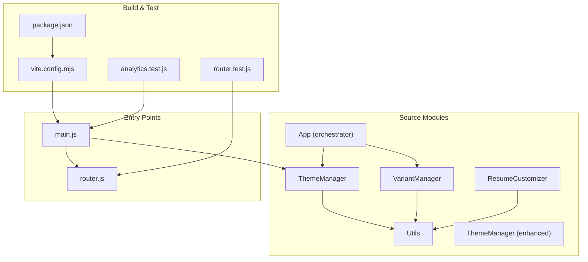
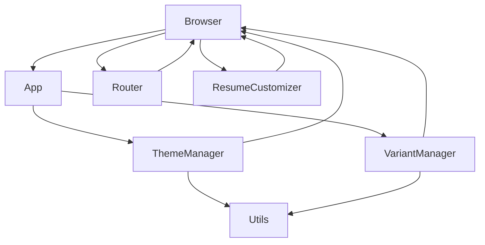
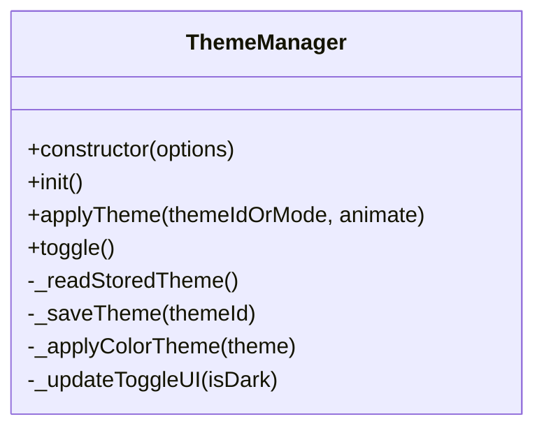
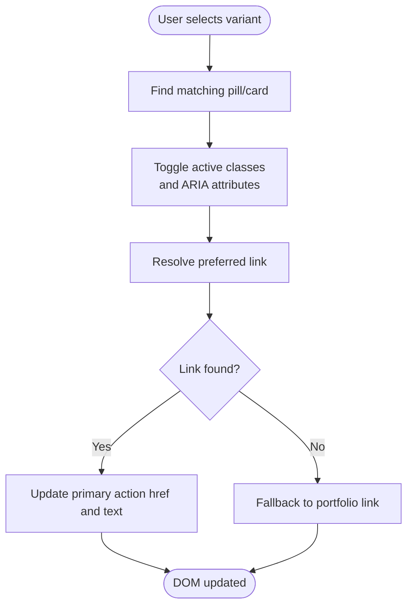
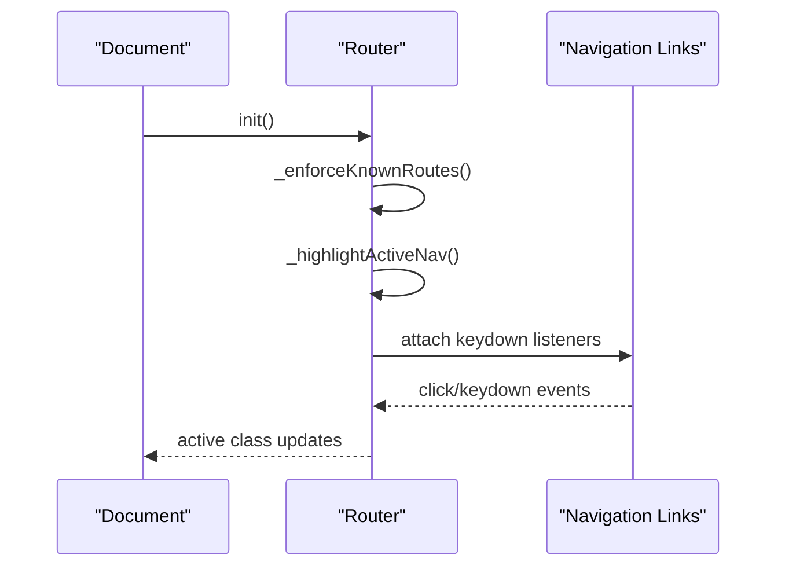
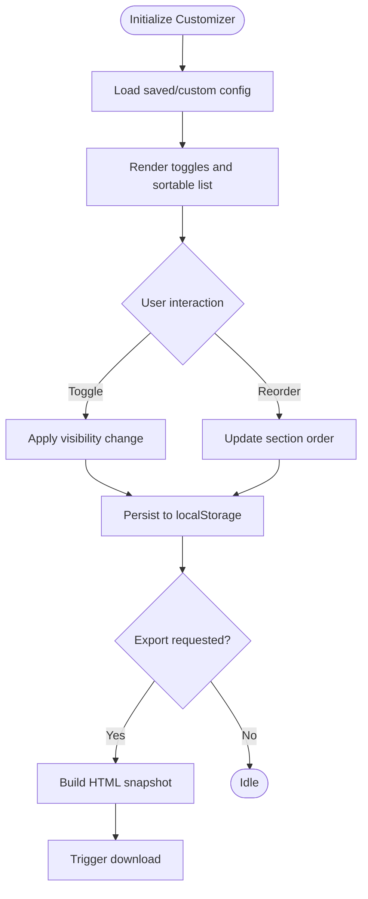
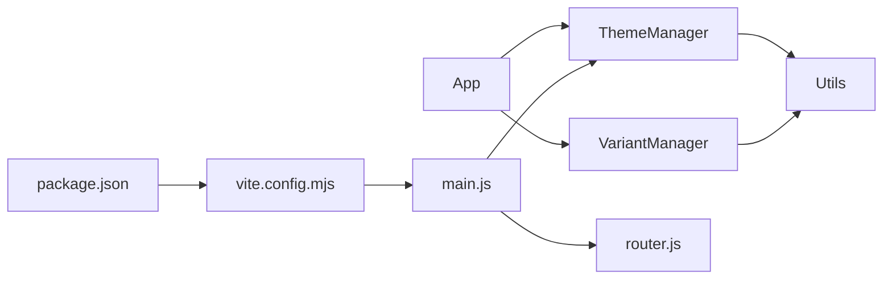
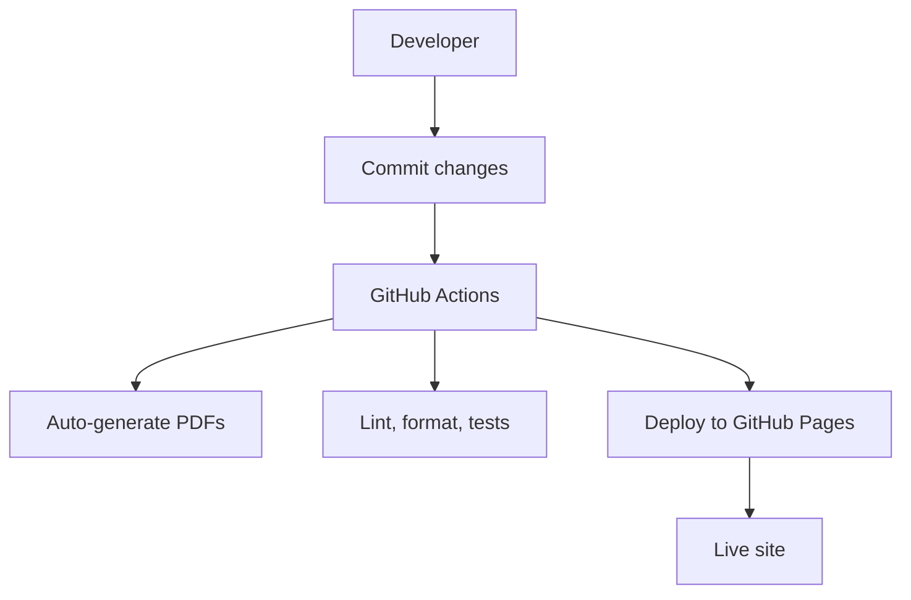

# Architecture Overview

<cite>
**Referenced Files in This Document**
- [README.md](file://README.md)
- [DEPLOYMENT_COMPLETE.md](file://DEPLOYMENT_COMPLETE.md)
- [GITHUB_ACTIONS_SETUP.md](file://GITHUB_ACTIONS_SETUP.md)
- [vite.config.mjs](file://vite.config.mjs)
- [package.json](file://package.json)
- [app.js](file://assets/js/src/app.js)
- [theme-manager.js](file://assets/js/src/theme-manager.js)
- [variant-manager.js](file://assets/js/src/variant-manager.js)
- [router.js](file://assets/js/router.js)
- [utils.js](file://assets/js/src/utils.js)
- [resume-customizer.js](file://assets/js/src/resume-customizer.js)
- [theme-manager-enhanced.js](file://assets/js/src/theme-manager-enhanced.js)
- [main.js](file://assets/js/main.js)
- [router.test.js](file://tests/unit/router.test.js)
- [analytics.test.js](file://tests/unit/analytics.test.js)
</cite>

## Table of Contents

1. [Introduction](#introduction)
2. [Project Structure](#project-structure)
3. [Core Components](#core-components)
4. [Architecture Overview](#architecture-overview)
5. [Detailed Component Analysis](#detailed-component-analysis)
6. [Dependency Analysis](#dependency-analysis)
7. [Performance Considerations](#performance-considerations)
8. [Troubleshooting Guide](#troubleshooting-guide)
9. [Conclusion](#conclusion)
10. [Appendices](#appendices)

## Introduction

This document presents the architecture of the Resume Website project, a modular, themeable, and multi-variant resume platform built with vanilla JavaScript and Vite. The system emphasizes:

- Modular ES6 architecture with factory-like initialization via the App orchestrator
- Feature managers for theme, variant selection, and navigation
- Event-driven UI updates and DOM manipulation
- Build-time optimization and production deployment via Vite and GitHub Actions

The platform supports multiple resume variants (Print, ATS, Digital, Portfolio), theme switching (light/dark/auto), and integrates additional features such as a resume customizer, ATS calculator, and PWA capabilities.

## Project Structure

The project follows a feature-based organization with clear separation between shared utilities, feature managers, and build configuration:

- assets/js/src: ES6 modules implementing managers and utilities
- assets/js: entry points and legacy theme logic
- public: static pages and assets for hosting
- tests: unit and end-to-end tests
- vite.config.mjs: Vite build configuration
- package.json: scripts and dependencies

**Diagram sources**

- [app.js](file://assets/js/src/app.js#L1-L39)
- [theme-manager.js](file://assets/js/src/theme-manager.js#L1-L170)
- [variant-manager.js](file://assets/js/src/variant-manager.js#L1-L125)
- [utils.js](file://assets/js/src/utils.js#L1-L5)
- [resume-customizer.js](file://assets/js/src/resume-customizer.js#L1-L307)
- [theme-manager-enhanced.js](file://assets/js/src/theme-manager-enhanced.js#L1-L85)
- [main.js](file://assets/js/main.js#L1-L58)
- [router.js](file://assets/js/router.js#L1-L210)
- [vite.config.mjs](file://vite.config.mjs#L1-L21)
- [package.json](file://package.json#L1-L56)
- [router.test.js](file://tests/unit/router.test.js#L1-L49)
- [analytics.test.js](file://tests/unit/analytics.test.js#L1-L50)

**Section sources**

- [README.md](file://README.md#L104-L135)
- [vite.config.mjs](file://vite.config.mjs#L1-L21)
- [package.json](file://package.json#L1-L56)

## Core Components

- App: Initializes and orchestrates feature managers (ThemeManager, VariantManager) and cross-cutting concerns like focus-visible behavior.
- ThemeManager: Manages color themes and dark/light modes with persistence and UI updates.
- VariantManager: Controls active resume variant selection and primary action updates.
- Router: Provides base-aware routing for GitHub Pages, active navigation highlighting, and programmatic navigation.
- Utils: Lightweight DOM helpers and clamping utility.
- ResumeCustomizer: Dynamic UI for customizing resume sections, drag-and-drop ordering, export, and sharing.
- Legacy Theme Logic (main.js): Alternative theme initialization and navbar scroll behavior.

Design patterns observed:

- Factory pattern: App initializes managers on demand
- Singleton-like usage: ThemeManager instances are created once per page lifecycle
- Observer pattern: Event listeners propagate user interactions to state updates and DOM changes
- Strategy pattern: VariantManager encapsulates variant-specific behaviors and mappings

**Section sources**

- [app.js](file://assets/js/src/app.js#L1-L39)
- [theme-manager.js](file://assets/js/src/theme-manager.js#L1-L170)
- [variant-manager.js](file://assets/js/src/variant-manager.js#L1-L125)
- [router.js](file://assets/js/router.js#L1-L210)
- [utils.js](file://assets/js/src/utils.js#L1-L5)
- [resume-customizer.js](file://assets/js/src/resume-customizer.js#L1-L307)
- [main.js](file://assets/js/main.js#L1-L58)

## Architecture Overview

High-level architecture centers on the App orchestrator that bootstraps managers and utilities. Managers listen to user interactions, update internal state, and manipulate the DOM. Routing is handled independently for GitHub Pages deployments, while theme and variant managers manage presentation and content selection respectively.

**Diagram sources**

- [app.js](file://assets/js/src/app.js#L1-L39)
- [theme-manager.js](file://assets/js/src/theme-manager.js#L1-L170)
- [variant-manager.js](file://assets/js/src/variant-manager.js#L1-L125)
- [router.js](file://assets/js/router.js#L1-L210)
- [utils.js](file://assets/js/src/utils.js#L1-L5)
- [resume-customizer.js](file://assets/js/src/resume-customizer.js#L1-L307)

## Detailed Component Analysis

### App Orchestrator

Responsibilities:

- Instantiate ThemeManager and VariantManager during run()
- Initialize accessibility behavior for focus-visible indicators
- Serve as the central bootstrap for feature managers

Design notes:

- Minimal coupling to managers; relies on constructor instantiation
- Cross-cutting concern for keyboard/mouse interaction detection

**Section sources**

- [app.js](file://assets/js/src/app.js#L1-L39)

### ThemeManager

Responsibilities:

- Persist and apply color themes and dark/light modes
- Manage UI controls for theme toggling and palette selection
- React to system preference changes and external clicks

Design patterns:

- Singleton-like usage per page lifecycle
- Observer pattern for event-driven updates

**Diagram sources**

- [theme-manager.js](file://assets/js/src/theme-manager.js#L1-L170)

**Section sources**

- [theme-manager.js](file://assets/js/src/theme-manager.js#L1-L170)

### VariantManager

Responsibilities:

- Manage active variant selection among Print, ATS, Digital, and Portfolio
- Update primary action links based on selected variant
- Support keyboard navigation and focus management

Design patterns:

- Strategy-like mapping of variants to preferred targets
- Observer pattern for pill/card interactions

**Diagram sources**

- [variant-manager.js](file://assets/js/src/variant-manager.js#L68-L123)

**Section sources**

- [variant-manager.js](file://assets/js/src/variant-manager.js#L1-L125)

### Router

Responsibilities:

- Normalize paths for GitHub Pages base-aware routing
- Highlight active navigation items
- Programmatic navigation and URL building
- Known-route enforcement for SPA-like behavior

**Diagram sources**

- [router.js](file://assets/js/router.js#L38-L152)

**Section sources**

- [router.js](file://assets/js/router.js#L1-L210)

### Utils

Responsibilities:

- Provide lightweight DOM helpers ($, $$) and numeric clamping
- Reduce boilerplate across managers

**Section sources**

- [utils.js](file://assets/js/src/utils.js#L1-L5)

### ResumeCustomizer

Responsibilities:

- Allow users to toggle and reorder resume sections
- Persist configuration to localStorage and share via URL
- Export customized resume as HTML

Design patterns:

- Strategy-like section ordering and visibility toggling
- Observer pattern for drag-and-drop and input events

**Diagram sources**

- [resume-customizer.js](file://assets/js/src/resume-customizer.js#L181-L234)

**Section sources**

- [resume-customizer.js](file://assets/js/src/resume-customizer.js#L1-L307)

### Legacy Theme Logic (main.js)

Responsibilities:

- Alternative theme initialization and navbar scroll behavior
- Demonstrates dual theme approaches coexisting in the project

**Section sources**

- [main.js](file://assets/js/main.js#L1-L58)

## Dependency Analysis

Module-level dependencies and coupling:

- App depends on ThemeManager and VariantManager constructors
- Managers depend on Utils for DOM queries
- Router is independent and used by page-level scripts
- Build configuration defines chunking and base path for GitHub Pages

**Diagram sources**

- [app.js](file://assets/js/src/app.js#L1-L39)
- [theme-manager.js](file://assets/js/src/theme-manager.js#L1-L170)
- [variant-manager.js](file://assets/js/src/variant-manager.js#L1-L125)
- [utils.js](file://assets/js/src/utils.js#L1-L5)
- [main.js](file://assets/js/main.js#L1-L58)
- [router.js](file://assets/js/router.js#L1-L210)
- [vite.config.mjs](file://vite.config.mjs#L1-L21)
- [package.json](file://package.json#L1-L56)

**Section sources**

- [vite.config.mjs](file://vite.config.mjs#L1-L21)
- [package.json](file://package.json#L1-L56)

## Performance Considerations

- Build target: esnext for modern browsers yields smaller bundles
- CSS code splitting enabled
- Manual chunking groups shared modules (main.js and theme-manager.js)
- Base path configured for GitHub Pages to avoid runtime path issues
- Testing ensures router correctness and analytics event dispatch

Recommendations:

- Keep feature modules lazy-loaded where appropriate
- Minimize heavy synchronous DOM operations in event handlers
- Use requestAnimationFrame for smooth UI updates
- Monitor bundle sizes and split further if needed

**Section sources**

- [vite.config.mjs](file://vite.config.mjs#L1-L21)
- [router.test.js](file://tests/unit/router.test.js#L1-L49)
- [analytics.test.js](file://tests/unit/analytics.test.js#L1-L50)

## Troubleshooting Guide

Common issues and resolutions:

- Router not highlighting active links
  - Ensure base path matches GitHub Pages and known routes are configured
  - Verify DOMContentLoaded timing and nav selector usage
- Theme toggle not persisting
  - Confirm localStorage availability and correct keys
  - Check system preference media query support
- Variant selection not updating primary action
  - Validate variant mappings and presence of target elements
  - Ensure proper ARIA attributes and tabindex updates
- Build fails or incorrect base path
  - Verify vite base setting and publicDir
  - Check production preview command and dist output

**Section sources**

- [router.js](file://assets/js/router.js#L1-L210)
- [theme-manager.js](file://assets/js/src/theme-manager.js#L1-L170)
- [variant-manager.js](file://assets/js/src/variant-manager.js#L1-L125)
- [vite.config.mjs](file://vite.config.mjs#L1-L21)

## Conclusion

The Resume Website employs a clean, modular ES6 architecture with clear separation of concerns. The App orchestrator bootstraps specialized managers that handle theme, variant selection, and navigation. The system leverages event-driven updates, minimal coupling, and build-time optimizations to deliver a fast, accessible, and extensible platform. The integration with Vite and GitHub Actions enables automated quality checks and seamless deployments.

## Appendices

### Build Architecture and Deployment Pipeline

- Vite configuration sets base path, output directory, and chunking strategy
- Scripts in package.json enable development, build, preview, testing, and formatting
- GitHub Actions workflows automate PDF generation, quality checks, and deployment

**Diagram sources**

- [vite.config.mjs](file://vite.config.mjs#L1-L21)
- [package.json](file://package.json#L1-L56)
- [GITHUB_ACTIONS_SETUP.md](file://GITHUB_ACTIONS_SETUP.md#L1-L273)
- [DEPLOYMENT_COMPLETE.md](file://DEPLOYMENT_COMPLETE.md#L1-L386)

**Section sources**

- [README.md](file://README.md#L244-L250)
- [GITHUB_ACTIONS_SETUP.md](file://GITHUB_ACTIONS_SETUP.md#L1-L273)
- [DEPLOYMENT_COMPLETE.md](file://DEPLOYMENT_COMPLETE.md#L1-L386)
