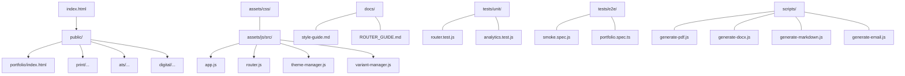
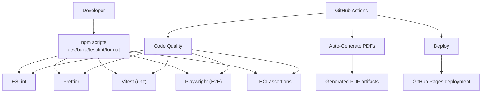
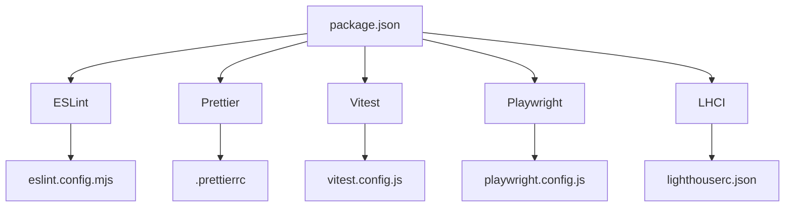

# Contributing Guidelines

<cite>
**Referenced Files in This Document**
- [README.md](file://README.md)
- [GITHUB_ACTIONS_SETUP.md](file://GITHUB_ACTIONS_SETUP.md)
- [package.json](file://package.json)
- [eslint.config.mjs](file://eslint.config.mjs)
- [.prettierrc](file://.prettierrc)
- [playwright.config.js](file://playwright.config.js)
- [vitest.config.js](file://vitest.config.js)
- [vite.config.mjs](file://vite.config.mjs)
- [lighthouserc.json](file://lighthouserc.json)
- [docs/style-guide.md](file://docs/style-guide.md)
- [docs/ROUTER_GUIDE.md](file://docs/ROUTER_GUIDE.md)
- [tests/unit/analytics.test.js](file://tests/unit/analytics.test.js)
- [tests/unit/router.test.js](file://tests/unit/router.test.js)
- [tests/e2e/portfolio.spec.ts](file://tests/e2e/portfolio.spec.ts)
- [tests/e2e/smoke.spec.js](file://tests/e2e/smoke.spec.js)
</cite>

## Table of Contents

1. [Introduction](#introduction)
2. [Project Structure](#project-structure)
3. [Core Components](#core-components)
4. [Architecture Overview](#architecture-overview)
5. [Detailed Component Analysis](#detailed-component-analysis)
6. [Dependency Analysis](#dependency-analysis)
7. [Performance Considerations](#performance-considerations)
8. [Troubleshooting Guide](#troubleshooting-guide)
9. [Conclusion](#conclusion)
10. [Appendices](#appendices)

## Introduction

Thank you for contributing to the Resume Website project. This document explains how to develop, test, review, and deploy changes in a way that keeps the project reliable, accessible, and maintainable. It covers branching, commits, pull requests, code quality, testing, CI/CD, and release practices. It also provides templates for issues and pull requests and outlines community and maintainer responsibilities.

## Project Structure

The project is a static, themeable resume and portfolio website built with vanilla JavaScript and Vite. Key areas:

- Public pages: index and variant pages under public/.
- Assets: shared CSS and modular JavaScript under assets/.
- Docs: style guide, router guide, and feature documentation under docs/.
- Tests: unit tests under tests/unit and E2E tests under tests/e2e.
- Scripts: automated generation of DOCX, PDF, Markdown, and email outputs under scripts/.

**Section sources**

- [README.md](file://README.md#L104-L135)

## Core Components

- Build and deployment: Vite configuration sets the base path for GitHub Pages and splits vendor chunks.
- Code quality: ESLint flat config with Prettier integration and warnings instead of errors for CI friendliness.
- Formatting: Prettier configuration enforces consistent style across JS, CSS, HTML, JSON, and Markdown.
- Testing: Vitest for unit tests in jsdom; Playwright for E2E tests across desktop and mobile devices.
- CI/CD: Three GitHub Actions workflows for PDF generation, quality checks, and deployment.

**Section sources**

- [vite.config.mjs](file://vite.config.mjs#L1-L21)
- [eslint.config.mjs](file://eslint.config.mjs#L1-L82)
- [.prettierrc](file://.prettierrc#L1-L9)
- [vitest.config.js](file://vitest.config.js#L1-L11)
- [playwright.config.js](file://playwright.config.js#L1-L45)
- [README.md](file://README.md#L29-L42)

## Architecture Overview

The development lifecycle integrates local tooling with GitHub Actions:

- Local: npm scripts for dev, build, test, lint, and format.
- CI: automated linting, formatting, unit tests, E2E tests, LHCI assertions, PDF regeneration, and deployment to GitHub Pages.

**Diagram sources**

- [README.md](file://README.md#L29-L42)
- [GITHUB_ACTIONS_SETUP.md](file://GITHUB_ACTIONS_SETUP.md#L1-L273)
- [package.json](file://package.json#L5-L24)
- [lighthouserc.json](file://lighthouserc.json#L1-L39)

**Section sources**

- [README.md](file://README.md#L29-L42)
- [GITHUB_ACTIONS_SETUP.md](file://GITHUB_ACTIONS_SETUP.md#L1-L273)
- [package.json](file://package.json#L5-L24)

## Detailed Component Analysis

### Branching Strategy

- Use feature branches prefixed with feature/, fix/, chore/, docs/, or refactor/ to clearly categorize changes.
- Keep branches focused and avoid mixing unrelated changes.
- Reference related issues in branch names when helpful (e.g., feature/issue-123).

### Commit Conventions

- Follow conventional commit messages with type and optional scope.
- Types commonly used: feat, fix, refactor, style, docs, chore, test.
- Example format: <type>(<scope>): <description>.

**Section sources**

- [docs/style-guide.md](file://docs/style-guide.md#L209-L231)
- [README.md](file://README.md#L258-L285)

### Pull Request Process

- Open a PR from your feature branch to main.
- Ensure all CI checks pass (lint, format, unit tests, E2E tests, LHCI).
- Include a brief description of the change, its motivation, and any migration notes.
- Request review from maintainers; address comments promptly.
- Squash or rebase commits before merging; keep history clean.

**Section sources**

- [README.md](file://README.md#L258-L285)

### Code Quality Standards

- ESLint configuration:
  - Uses flat config with recommended rules for JavaScript.
  - Treats issues as warnings in CI to prevent blocking merges while still surfacing problems.
  - Disables rules that conflict with Prettier; Prettier is enforced as an ESLint rule with warnings.
  - Ignores node_modules, dist, public, preview, and scripts directories.
- Prettier formatting:
  - Enforced via npm scripts and pre-commit hooks.
  - Applies to JS, CSS, HTML, JSON, and Markdown files.
- Pre-commit hooks:
  - Husky + lint-staged run ESLint and Prettier on staged files.

**Section sources**

- [eslint.config.mjs](file://eslint.config.mjs#L1-L82)
- [.prettierrc](file://.prettierrc#L1-L9)
- [package.json](file://package.json#L47-L54)

### Testing Requirements

- Unit tests:
  - Vitest with jsdom environment.
  - Located under tests/unit; examples include router and analytics tests.
  - Run via npm run test:unit.
- E2E tests:
  - Playwright tests under tests/e2e; include smoke and portfolio tests.
  - Run via npm run test:e2e; optionally run specific suites via npm run test:downloads.
  - Configured to run in parallel, collect traces on first retry on CI, and use a local dev server during tests.
- Lighthouse CI:
  - Asserts minimum scores for performance, accessibility, SEO, and best practices.
  - Collects from multiple URLs and uploads temporary reports.

**Section sources**

- [vitest.config.js](file://vitest.config.js#L1-L11)
- [tests/unit/analytics.test.js](file://tests/unit/analytics.test.js#L1-L50)
- [tests/unit/router.test.js](file://tests/unit/router.test.js#L1-L49)
- [playwright.config.js](file://playwright.config.js#L1-L45)
- [tests/e2e/portfolio.spec.ts](file://tests/e2e/portfolio.spec.ts#L1-L71)
- [tests/e2e/smoke.spec.js](file://tests/e2e/smoke.spec.js#L1-L45)
- [lighthouserc.json](file://lighthouserc.json#L1-L39)

### Continuous Integration and Deployment

- Workflows:
  - Auto-Generate PDFs: triggered on data/roles/\*.json changes; regenerates PDFs and uploads artifacts.
  - Code Quality: runs lint, format, unit tests, E2E tests, and link checks on every push and PR.
  - Deploy: deploys to GitHub Pages after successful quality checks.
- Deployment:
  - Base path configured for GitHub Pages; build outputs to dist/.
  - Manual deployment available via Actions if needed.

**Section sources**

- [GITHUB_ACTIONS_SETUP.md](file://GITHUB_ACTIONS_SETUP.md#L1-L273)
- [README.md](file://README.md#L244-L256)
- [vite.config.mjs](file://vite.config.mjs#L1-L21)

### Feature Development Guidelines

- Follow the style guide for naming, HTML semantics, CSS variables, and JavaScript architecture.
- Keep functions small, modules cohesive, and avoid global state.
- Add or update tests alongside feature changes.
- Update documentation (docs/) when introducing new features or changing behavior.

**Section sources**

- [docs/style-guide.md](file://docs/style-guide.md#L1-L273)
- [docs/ROUTER_GUIDE.md](file://docs/ROUTER_GUIDE.md#L1-L301)

### Bug Reporting and Issue Triage

- Use the issue templates to report bugs and request features.
- Include reproduction steps, expected vs. actual behavior, environment details, and screenshots if applicable.
- Triage is handled by maintainers; labels help categorize issues.

**Section sources**

- [README.md](file://README.md#L355-L374)

### Community Guidelines and Communication

- Be respectful and inclusive; follow the project’s style guide and testing standards.
- Use GitHub Discussions or Issues for questions; maintainers will respond as time permits.
- Keep communication constructive and focused on solutions.

**Section sources**

- [README.md](file://README.md#L355-L374)

### Maintainer Responsibilities

- Review pull requests, ensuring code quality, tests, and documentation meet standards.
- Merge only after CI passes and approvals are granted.
- Keep workflows healthy and update documentation as needed.
- Respond to issues and PRs in a timely manner.

**Section sources**

- [README.md](file://README.md#L355-L374)

## Dependency Analysis

The project relies on a small set of dev dependencies for building, testing, linting, formatting, and CI checks. The configuration ensures that ESLint and Prettier cooperate without conflicts and that tests run in isolated environments.

**Diagram sources**

- [package.json](file://package.json#L25-L46)
- [eslint.config.mjs](file://eslint.config.mjs#L1-L82)
- [.prettierrc](file://.prettierrc#L1-L9)
- [vitest.config.js](file://vitest.config.js#L1-L11)
- [playwright.config.js](file://playwright.config.js#L1-L45)
- [lighthouserc.json](file://lighthouserc.json#L1-L39)

**Section sources**

- [package.json](file://package.json#L25-L46)

## Performance Considerations

- Keep page sizes small; the style guide recommends constraining total page size.
- Defer non-critical JavaScript and preload critical fonts.
- Use lazy loading for below-the-fold images.
- Maintain WCAG 2.1 AA compliance for accessibility and SEO.

**Section sources**

- [docs/style-guide.md](file://docs/style-guide.md#L247-L254)

## Troubleshooting Guide

- CI failures:
  - Check Actions logs for lint, format, test, or LHCI failures.
  - Re-run specific jobs to isolate flakiness.
- PDF generation:
  - Verify Node.js dependencies and Playwright installation in Actions logs.
  - Ensure HTML templates are syntactically valid.
- Deployment:
  - Confirm GitHub Pages is enabled and configured to deploy from main with root folder.
  - Manually trigger the Deploy workflow if needed.
- Local testing:
  - Run npm run test:unit and npm run test:e2e to reproduce issues locally.

**Section sources**

- [GITHUB_ACTIONS_SETUP.md](file://GITHUB_ACTIONS_SETUP.md#L213-L236)
- [README.md](file://README.md#L244-L256)

## Conclusion

By following these guidelines—branching, committing, reviewing, testing, and deploying—you help maintain a high-quality, accessible, and automated project. Thank you for contributing!

## Appendices

### A. Templates

- Issue Template (Bug Report)
  - Title: [Bug] <concise description>
  - Steps to reproduce:
  - Expected behavior:
  - Actual behavior:
  - Environment:
  - Screenshots (optional):
  - Additional context (optional):

- Issue Template (Feature Request)
  - Title: [Feature] <concise description>
  - Motivation:
  - Proposed solution:
  - Alternatives considered:
  - Additional context (optional):

- Pull Request Template
  - Description:
  - Related issues:
  - Changes:
  - Testing:
  - Documentation:
  - Screenshots (optional):

**Section sources**

- [README.md](file://README.md#L355-L374)

### B. Quick Reference

- Local commands
  - npm run dev
  - npm run build
  - npm run preview
  - npm run test:unit
  - npm run test:e2e
  - npm run lint
  - npm run lint:fix
  - npm run format
  - npm run format:check

- CI triggers
  - Auto-Generate PDFs: data/roles/\*.json changes
  - Code Quality: every push and PR
  - Deploy: after quality checks succeed

**Section sources**

- [README.md](file://README.md#L139-L228)
- [GITHUB_ACTIONS_SETUP.md](file://GITHUB_ACTIONS_SETUP.md#L46-L53)
