# Key Features

<cite>
**Referenced Files in This Document**
- [README.md](file://README.md)
- [README_TOP_3_FEATURES.md](file://README_TOP_3_FEATURES.md)
- [TOP_3_FEATURES_IMPLEMENTATION.md](file://TOP_3_FEATURES_IMPLEMENTATION.md)
- [FEATURES_USER_GUIDE.md](file://FEATURES_USER_GUIDE.md)
- [QUICK_REFERENCE.md](file://QUICK_REFERENCE.md)
- [resume-customizer.js](file://assets/js/src/resume-customizer.js)
- [ats-calculator.js](file://assets/js/src/ats-calculator.js)
- [pwa-manager.js](file://assets/js/src/pwa-manager.js)
- [service-worker.js](file://public/service-worker.js)
- [resume-customizer-styles.css](file://assets/css/resume-customizer-styles.css)
- [ats-calculator-styles.css](file://assets/css/ats-calculator-styles.css)
- [pwa-styles.css](file://assets/css/pwa-styles.css)
- [theme-manager.js](file://assets/js/src/theme-manager.js)
- [index.html](file://index.html)
- [public/ats/index.html](file://public/ats/index.html)
- [manifest.json](file://public/manifest.json)
</cite>

## Table of Contents

1. [Introduction](#introduction)
2. [Project Structure](#project-structure)
3. [Core Components](#core-components)
4. [Architecture Overview](#architecture-overview)
5. [Detailed Component Analysis](#detailed-component-analysis)
6. [Dependency Analysis](#dependency-analysis)
7. [Performance Considerations](#performance-considerations)
8. [Troubleshooting Guide](#troubleshooting-guide)
9. [Conclusion](#conclusion)
10. [Appendices](#appendices)

## Introduction

This document focuses on the top 3 key features delivered in the Resume Website project:

- Multi-format resume system (Print, ATS, Digital, Portfolio)
- Advanced theme management with dark/light mode and color palette cycling
- Progressive Web App (PWA) capabilities

It explains each feature’s purpose, benefits, and implementation approach, provides practical usage examples, and outlines value propositions for job seekers, developers, and professionals. It also includes quick reference guides for feature discovery and usage patterns.

## Project Structure

The project is organized around a multi-variant resume system with shared theme management and PWA infrastructure. The three new features are integrated into key HTML pages and styled via dedicated CSS modules. The PWA manifest and service worker enable offline and installable behavior.

**Diagram sources**

- [index.html](file://index.html#L38-L46)
- [public/ats/index.html](file://public/ats/index.html#L1-L120)
- [resume-customizer.js](file://assets/js/src/resume-customizer.js#L1-L200)
- [ats-calculator.js](file://assets/js/src/ats-calculator.js#L1-L161)
- [pwa-manager.js](file://assets/js/src/pwa-manager.js#L1-L200)
- [service-worker.js](file://public/service-worker.js#L1-L200)
- [resume-customizer-styles.css](file://assets/css/resume-customizer-styles.css#L1-L200)
- [ats-calculator-styles.css](file://assets/css/ats-calculator-styles.css#L1-L200)
- [pwa-styles.css](file://assets/css/pwa-styles.css#L1-L200)
- [theme-manager.js](file://assets/js/src/theme-manager.js#L1-L170)
- [manifest.json](file://public/manifest.json#L1-L81)

**Section sources**

- [README.md](file://README.md#L104-L135)
- [index.html](file://index.html#L38-L46)
- [public/ats/index.html](file://public/ats/index.html#L1-L120)

## Core Components

- Multi-format resume system: The site provides distinct resume variants (Print, ATS, Digital, Portfolio) enabling tailored presentation for different audiences and channels.
- Advanced theme management: Dark/light mode toggle and color palette cycling are integrated across all pages for consistent visual experience.
- PWA capabilities: Service worker registration, offline caching, install prompts, and status indicators deliver a native app-like experience.

These components are implemented with vanilla JavaScript and CSS, ensuring zero external dependencies and strong accessibility and performance characteristics.

**Section sources**

- [README.md](file://README.md#L14-L26)
- [README_TOP_3_FEATURES.md](file://README_TOP_3_FEATURES.md#L100-L137)
- [TOP_3_FEATURES_IMPLEMENTATION.md](file://TOP_3_FEATURES_IMPLEMENTATION.md#L3-L56)

## Architecture Overview

The three features are integrated into the main landing page and the ATS page. They rely on:

- Feature modules (Resume Customizer, ATS Calculator, PWA Manager)
- Feature-specific styles
- Theme manager for dark/light mode and color themes
- Service worker for offline and caching
- Manifest for PWA metadata and shortcuts

**Diagram sources**

- [index.html](file://index.html#L38-L46)
- [public/ats/index.html](file://public/ats/index.html#L1-L120)
- [resume-customizer.js](file://assets/js/src/resume-customizer.js#L1-L200)
- [ats-calculator.js](file://assets/js/src/ats-calculator.js#L1-L161)
- [pwa-manager.js](file://assets/js/src/pwa-manager.js#L1-L200)
- [service-worker.js](file://public/service-worker.js#L1-L200)

## Detailed Component Analysis

### 1) Resume Customizer

Purpose: Allow users to tailor their resume layout by toggling sections on/off, reordering them via drag-and-drop, exporting as HTML, and sharing configurations.

Benefits:

- Increases personalization for specific job applications
- Improves ATS friendliness by emphasizing key sections
- Enables quick sharing of customized layouts

Implementation approach:

- A fixed panel on the right with a toggle button
- Section toggles and a sortable list for ordering
- Local storage persistence and URL-encoded sharing
- Responsive design with dark mode support

User interaction examples:

- Click the “⚙️ Customize” button to open the panel
- Toggle desired sections on/off
- Drag sections to reorder priority
- Export as HTML or copy a shareable URL

Value proposition:

- Job seekers: Quickly adapt resumes per role
- Developers: Showcase projects and skills effectively
- Professionals: Present tailored experiences for different industries

```mermaid
flowchart TD
Start(["Open Resume Page"]) --> Toggle["Click '⚙️ Customize'"]
Toggle --> Toggles["Toggle sections on/off"]
Toggles --> Reorder["Drag to reorder sections"]
Reorder --> Export{"Export or Share?"}
Export --> |Export| Download["Download HTML file"]
Export --> |Share| URL["Copy shareable URL"]
Download --> End(["Done"])
URL --> End
```

**Diagram sources**

- [resume-customizer.js](file://assets/js/src/resume-customizer.js#L23-L200)
- [resume-customizer-styles.css](file://assets/css/resume-customizer-styles.css#L1-L200)
- [FEATURES_USER_GUIDE.md](file://FEATURES_USER_GUIDE.md#L3-L34)

**Section sources**

- [resume-customizer.js](file://assets/js/src/resume-customizer.js#L1-L200)
- [resume-customizer-styles.css](file://assets/css/resume-customizer-styles.css#L1-L200)
- [FEATURES_USER_GUIDE.md](file://FEATURES_USER_GUIDE.md#L3-L34)
- [README_TOP_3_FEATURES.md](file://README_TOP_3_FEATURES.md#L102-L112)

### 2) ATS Score Calculator

Purpose: Provide real-time ATS compatibility scoring with a breakdown across four factors and optional job description matching.

Benefits:

- Helps avoid ATS rejections by highlighting formatting and keyword issues
- Offers actionable suggestions to improve compatibility
- Supports job-specific tailoring with keyword analysis

Implementation approach:

- A fixed panel on the left with a toggle button
- Score visualization with factor breakdown bars
- Job description input for match analysis
- Dark mode support and responsive layout

User interaction examples:

- Click the “📊 ATS Score” button to reveal the panel
- Review the overall score and factor ratings
- Paste a job description and analyze keyword match
- Read improvement suggestions and adjust resume accordingly

Value proposition:

- Job seekers: Reduce risk of automatic filtering
- Recruiters: Validate ATS-readiness quickly
- Hiring teams: Ensure resumes pass initial parsing

```mermaid
sequenceDiagram
participant U as "User"
participant AC as "ATSScoreCalculator"
participant UI as "ATS Panel"
U->>AC : Click "📊 ATS Score"
AC->>UI : Render score + breakdown
U->>UI : Paste job description
UI->>AC : Analyze keywords
AC-->>UI : Show match % + missing keywords
U->>UI : Read suggestions
UI-->>U : Updated score after changes
```

**Diagram sources**

- [ats-calculator.js](file://assets/js/src/ats-calculator.js#L1-L161)
- [ats-calculator-styles.css](file://assets/css/ats-calculator-styles.css#L1-L200)
- [FEATURES_USER_GUIDE.md](file://FEATURES_USER_GUIDE.md#L36-L77)

**Section sources**

- [ats-calculator.js](file://assets/js/src/ats-calculator.js#L1-L161)
- [ats-calculator-styles.css](file://assets/css/ats-calculator-styles.css#L1-L200)
- [FEATURES_USER_GUIDE.md](file://FEATURES_USER_GUIDE.md#L36-L77)
- [README_TOP_3_FEATURES.md](file://README_TOP_3_FEATURES.md#L114-L124)

### 3) PWA Mobile App

Purpose: Enable offline access, one-click installation, and native app-like behavior for quick resume retrieval and practice.

Benefits:

- Access resumes offline with cached assets
- Installable from home screen for native-like experience
- Online/offline status indicators and notifications
- Background sync for updates

Implementation approach:

- Service worker with multiple caching strategies (cache-first, network-first, stale-while-revalidate)
- PWA manager handles registration, install prompts, and status updates
- Manifest defines app metadata, icons, screenshots, and shortcuts
- UI components for status indicator and install button

User interaction examples:

- On mobile: Look for “Install App” in the browser menu and add to home screen
- On desktop: Click the “📱 Install App” button and confirm installation
- Use offline: Access cached pages and features when offline
- Receive notifications: Online/offline status and update alerts

Value proposition:

- Job seekers: Practice interviews and access resumes anywhere
- Developers: Demonstrate modern web capabilities
- Professionals: Maintain a polished, accessible presence

```mermaid
sequenceDiagram
participant U as "User"
participant PM as "PWAManager"
participant SW as "ServiceWorker"
participant MF as "Manifest"
participant UI as "PWA UI"
U->>PM : Open resume page
PM->>SW : Register service worker
PM->>MF : Read manifest
U->>PM : Click "📱 Install App"
PM->>U : Show install prompt
PM->>SW : Cache assets
U->>UI : Launch installed app
PM->>UI : Update status indicator
U->>PM : Go offline
PM->>UI : Show offline mode
```

**Diagram sources**

- [pwa-manager.js](file://assets/js/src/pwa-manager.js#L1-L200)
- [service-worker.js](file://public/service-worker.js#L1-L200)
- [manifest.json](file://public/manifest.json#L1-L81)
- [pwa-styles.css](file://assets/css/pwa-styles.css#L1-L200)
- [FEATURES_USER_GUIDE.md](file://FEATURES_USER_GUIDE.md#L79-L140)

**Section sources**

- [pwa-manager.js](file://assets/js/src/pwa-manager.js#L1-L200)
- [service-worker.js](file://public/service-worker.js#L1-L200)
- [manifest.json](file://public/manifest.json#L1-L81)
- [pwa-styles.css](file://assets/css/pwa-styles.css#L1-L200)
- [FEATURES_USER_GUIDE.md](file://FEATURES_USER_GUIDE.md#L79-L140)
- [README_TOP_3_FEATURES.md](file://README_TOP_3_FEATURES.md#L126-L136)

## Dependency Analysis

The three features depend on:

- Shared theme management for dark/light mode and color themes
- Feature-specific CSS for UI and animations
- Service worker for caching and offline behavior
- Manifest for PWA metadata and shortcuts

**Diagram sources**

- [theme-manager.js](file://assets/js/src/theme-manager.js#L1-L170)
- [index.html](file://index.html#L38-L46)
- [public/ats/index.html](file://public/ats/index.html#L1-L120)
- [resume-customizer.js](file://assets/js/src/resume-customizer.js#L1-L200)
- [ats-calculator.js](file://assets/js/src/ats-calculator.js#L1-L161)
- [pwa-manager.js](file://assets/js/src/pwa-manager.js#L1-L200)
- [service-worker.js](file://public/service-worker.js#L1-L200)
- [manifest.json](file://public/manifest.json#L1-L81)
- [resume-customizer-styles.css](file://assets/css/resume-customizer-styles.css#L1-L200)
- [ats-calculator-styles.css](file://assets/css/ats-calculator-styles.css#L1-L200)
- [pwa-styles.css](file://assets/css/pwa-styles.css#L1-L200)

**Section sources**

- [README.md](file://README.md#L104-L135)
- [index.html](file://index.html#L38-L46)
- [public/ats/index.html](file://public/ats/index.html#L1-L120)

## Performance Considerations

- Lightweight implementation: All features use vanilla JavaScript with no external dependencies, minimizing bundle size and improving load times.
- Progressive enhancement: Features load after page render and degrade gracefully if JavaScript is disabled.
- Caching strategies: Service worker employs cache-first for static assets, network-first for HTML/APIs, and stale-while-revalidate for images to balance freshness and speed.
- Responsive design: Panels and components adapt to mobile, tablet, and desktop screens for optimal usability.

[No sources needed since this section provides general guidance]

## Troubleshooting Guide

Common issues and resolutions:

- Customizer not showing:
  - Ensure JavaScript is enabled and refresh the page
  - Clear browser cache and reload
- ATS Score seems incorrect:
  - Verify resume is fully loaded and all sections are visible
  - Simplify the job description for clearer matching
- PWA installation problems:
  - Use supported browsers (Chrome, Edge, Safari)
  - Access over HTTPS or localhost for testing
  - Check browser notifications for install prompts
- Offline mode not working:
  - Service worker may need time to register; reload the page
  - Visit pages while online to populate caches
  - Confirm browser storage and offline settings

**Section sources**

- [FEATURES_USER_GUIDE.md](file://FEATURES_USER_GUIDE.md#L180-L205)

## Conclusion

The Resume Website’s top 3 features—multi-format resume system, advanced theme management, and PWA capabilities—deliver significant value across job seeking, development, and professional contexts. They are production-ready, accessible, responsive, and fully integrated into the existing site architecture. Users gain powerful tools to tailor, optimize, and access their resumes anywhere, anytime.

[No sources needed since this section summarizes without analyzing specific files]

## Appendices

### Quick Reference Guides

- Resume Customizer
  - Location: Top-right “⚙️ Customize”
  - Capabilities: Toggle 9 sections, drag-to-reorder, export HTML, share URL
  - Use case: Tailor resume per job application
- ATS Score Calculator
  - Location: Top-left “📊 ATS Score”
  - Capabilities: Real-time 0–100 score, 4-factor breakdown, job match analysis
  - Use case: Improve ATS compatibility before sending
- PWA Mobile App
  - Location: Top-right “📱 Install App”
  - Capabilities: One-click install, offline access, online/offline notifications
  - Use case: Quick access and practice interviews offline

**Section sources**

- [QUICK_REFERENCE.md](file://QUICK_REFERENCE.md#L20-L121)
- [FEATURES_USER_GUIDE.md](file://FEATURES_USER_GUIDE.md#L142-L155)

### Feature Discovery Patterns

- Start at the landing page to explore variants and use the theme toggle
- Use the ATS calculator to validate compatibility before applying
- Customize sections to highlight role-relevant experience
- Install the PWA for convenient offline access

**Section sources**

- [README.md](file://README.md#L104-L135)
- [FEATURES_USER_GUIDE.md](file://FEATURES_USER_GUIDE.md#L142-L155)
