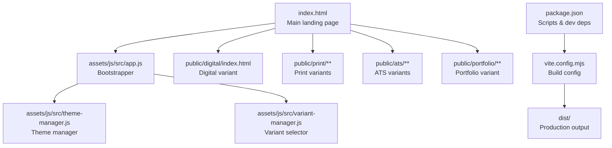
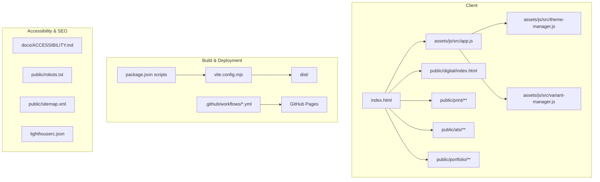
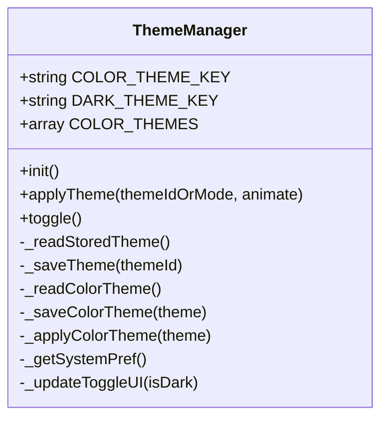
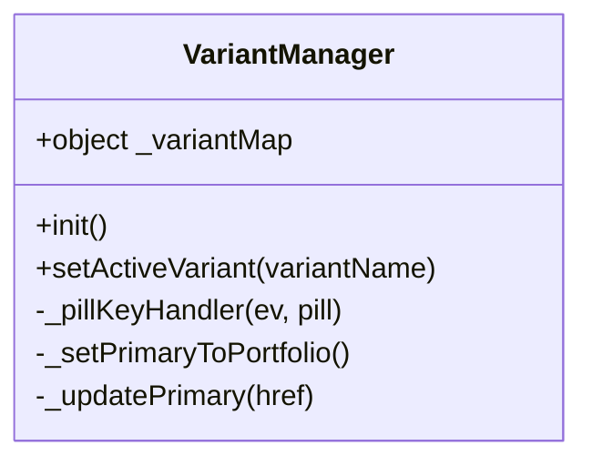
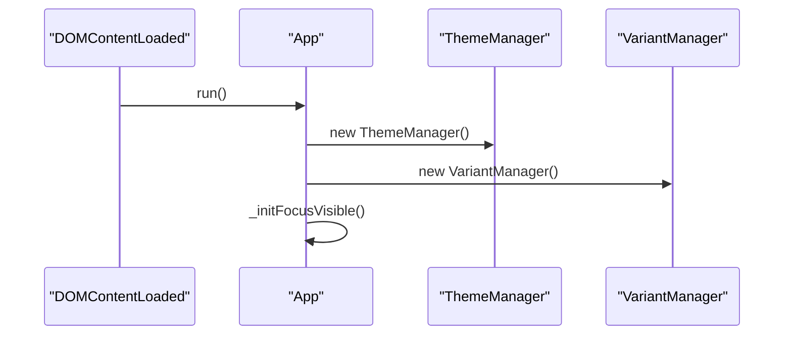
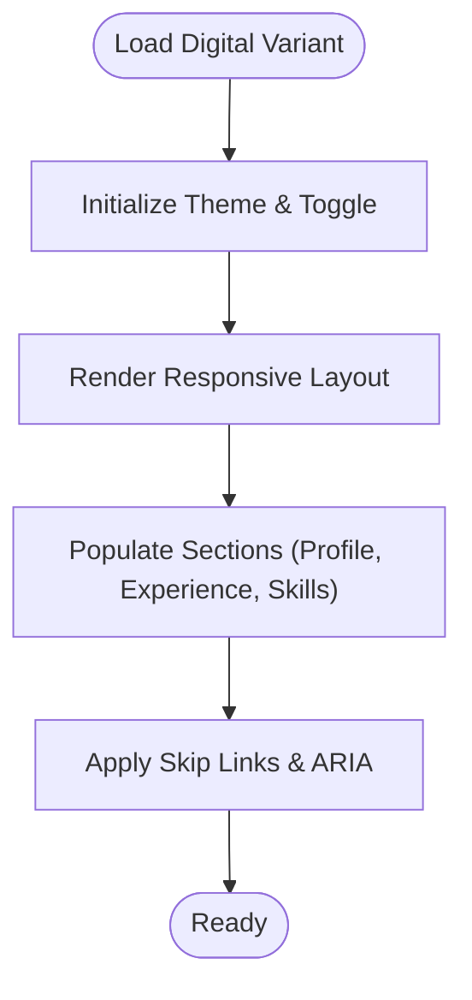
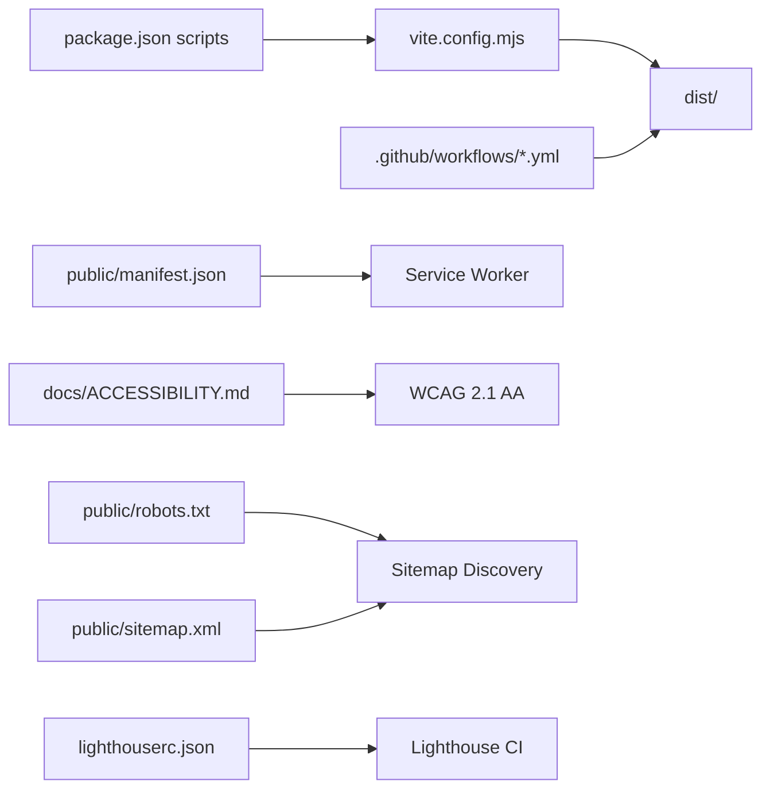

# Project Overview

<cite>
**Referenced Files in This Document**
- [README.md](file://README.md)
- [package.json](file://package.json)
- [index.html](file://index.html)
- [vite.config.mjs](file://vite.config.mjs)
- [assets/js/src/app.js](file://assets/js/src/app.js)
- [assets/js/src/theme-manager.js](file://assets/js/src/theme-manager.js)
- [assets/js/src/variant-manager.js](file://assets/js/src/variant-manager.js)
- [assets/js/main.js](file://assets/js/main.js)
- [public/digital/index.html](file://public/digital/index.html)
- [public/manifest.json](file://public/manifest.json)
- [docs/ACCESSIBILITY.md](file://docs/ACCESSIBILITY.md)
- [docs/FEATURES.md](file://docs/FEATURES.md)
- [public/robots.txt](file://public/robots.txt)
- [public/sitemap.xml](file://public/sitemap.xml)
- [lighthouserc.json](file://lighthouserc.json)
</cite>

## Table of Contents

1. [Introduction](#introduction)
2. [Project Structure](#project-structure)
3. [Core Components](#core-components)
4. [Architecture Overview](#architecture-overview)
5. [Detailed Component Analysis](#detailed-component-analysis)
6. [Dependency Analysis](#dependency-analysis)
7. [Performance Considerations](#performance-considerations)
8. [Troubleshooting Guide](#troubleshooting-guide)
9. [Conclusion](#conclusion)
10. [Appendices](#appendices)

## Introduction

This Resume Website project is a modular, themeable resume and portfolio website built with vanilla JavaScript and Vite. It delivers a modern, fast, and accessible online presence with multiple resume variants tailored for different contexts: Print, ATS (Applicant Tracking Systems), Digital, and Portfolio. The site emphasizes user control through theme switching, responsive design, and automated CI/CD for continuous deployment.

Live Demo: https://voidomin.github.io/resume-website/

## Project Structure

At a high level, the project is organized into:

- A landing page and feature showcases
- Static variant pages for Print, ATS, Digital, and Portfolio
- Shared assets (CSS, JS modules, images)
- Documentation and configuration for build, accessibility, and deployment

**Diagram sources**

- [index.html](file://index.html#L1-L408)
- [assets/js/src/app.js](file://assets/js/src/app.js#L1-L39)
- [assets/js/src/theme-manager.js](file://assets/js/src/theme-manager.js#L1-L170)
- [assets/js/src/variant-manager.js](file://assets/js/src/variant-manager.js#L1-L125)
- [public/digital/index.html](file://public/digital/index.html#L1-L1242)
- [vite.config.mjs](file://vite.config.mjs#L1-L21)
- [package.json](file://package.json#L1-L56)

**Section sources**

- [README.md](file://README.md#L104-L135)
- [index.html](file://index.html#L1-L408)
- [vite.config.mjs](file://vite.config.mjs#L1-L21)
- [package.json](file://package.json#L1-L56)

## Core Components

- Multi-variant resume system: Print, ATS, Digital, and Portfolio variants are available as separate static pages, enabling tailored delivery for different audiences and platforms.
- Theme switching: Users can toggle between light/dark modes and cycle through color palettes, with persistence across sessions.
- Responsive design: Optimized for mobile, tablet, and desktop with adaptive layouts and touch-friendly interactions.
- Accessibility: WCAG 2.1 AA compliant with skip links, ARIA live regions, semantic HTML, keyboard navigation, and focus management.
- Automated CI/CD: GitHub Actions workflows handle linting, formatting, testing, and auto-deployment to GitHub Pages.
- PWA support: Manifest and service worker enable installability and offline-ready experiences.

Practical examples:

- Choose a variant and download the appropriate format directly from the landing page.
- Toggle theme and color palette from the UI to personalize the experience.
- Navigate using keyboard-only controls and screen reader announcements.

**Section sources**

- [README.md](file://README.md#L14-L26)
- [docs/FEATURES.md](file://docs/FEATURES.md#L7-L45)
- [docs/ACCESSIBILITY.md](file://docs/ACCESSIBILITY.md#L21-L174)
- [public/manifest.json](file://public/manifest.json#L1-L81)

## Architecture Overview

The site uses a static-first architecture with a small set of client-side modules coordinating user interactions and theme/variant selection. Vite handles development and production builds, while GitHub Actions automates quality checks and deployment.

**Diagram sources**

- [index.html](file://index.html#L1-L408)
- [assets/js/src/app.js](file://assets/js/src/app.js#L1-L39)
- [assets/js/src/theme-manager.js](file://assets/js/src/theme-manager.js#L1-L170)
- [assets/js/src/variant-manager.js](file://assets/js/src/variant-manager.js#L1-L125)
- [public/digital/index.html](file://public/digital/index.html#L1-L1242)
- [vite.config.mjs](file://vite.config.mjs#L1-L21)
- [package.json](file://package.json#L5-L24)
- [docs/ACCESSIBILITY.md](file://docs/ACCESSIBILITY.md#L1-L488)
- [public/robots.txt](file://public/robots.txt#L1-L5)
- [public/sitemap.xml](file://public/sitemap.xml#L1-L40)
- [lighthouserc.json](file://lighthouserc.json#L1-L39)

## Detailed Component Analysis

### Theme Manager

The Theme Manager encapsulates theme switching and color palette cycling. It reads persisted preferences, respects system preferences, and updates UI affordances accordingly.

**Diagram sources**

- [assets/js/src/theme-manager.js](file://assets/js/src/theme-manager.js#L1-L170)

**Section sources**

- [assets/js/src/theme-manager.js](file://assets/js/src/theme-manager.js#L1-L170)
- [assets/js/main.js](file://assets/js/main.js#L13-L42)

### Variant Manager

The Variant Manager controls the active resume variant, updates primary action links, and ensures keyboard accessibility for variant selection.

**Diagram sources**

- [assets/js/src/variant-manager.js](file://assets/js/src/variant-manager.js#L1-L125)

**Section sources**

- [assets/js/src/variant-manager.js](file://assets/js/src/variant-manager.js#L1-L125)
- [index.html](file://index.html#L192-L390)

### App Bootstrap

The App initializes the ThemeManager and VariantManager and sets up focus-visible behavior for keyboard navigation.

**Diagram sources**

- [assets/js/src/app.js](file://assets/js/src/app.js#L1-L39)
- [assets/js/src/theme-manager.js](file://assets/js/src/theme-manager.js#L1-L170)
- [assets/js/src/variant-manager.js](file://assets/js/src/variant-manager.js#L1-L125)

**Section sources**

- [assets/js/src/app.js](file://assets/js/src/app.js#L1-L39)

### Digital Variant (Conceptual Overview)

The Digital variant demonstrates a screen-first, responsive layout with a sidebar and main content area, integrated theme toggling and accessibility features.

**Diagram sources**

- [public/digital/index.html](file://public/digital/index.html#L1-L1242)

**Section sources**

- [public/digital/index.html](file://public/digital/index.html#L1-L1242)

## Dependency Analysis

The project relies on a lean toolchain:

- Vite for development server and optimized production builds
- GitHub Actions for CI/CD
- Optional Google Analytics 4 for analytics
- PWA manifest and service worker for installability

**Diagram sources**

- [package.json](file://package.json#L5-L24)
- [vite.config.mjs](file://vite.config.mjs#L1-L21)
- [public/manifest.json](file://public/manifest.json#L1-L81)
- [docs/ACCESSIBILITY.md](file://docs/ACCESSIBILITY.md#L1-L488)
- [public/robots.txt](file://public/robots.txt#L1-L5)
- [public/sitemap.xml](file://public/sitemap.xml#L1-L40)
- [lighthouserc.json](file://lighthouserc.json#L1-L39)

**Section sources**

- [package.json](file://package.json#L1-L56)
- [README.md](file://README.md#L29-L41)
- [public/manifest.json](file://public/manifest.json#L1-L81)
- [public/robots.txt](file://public/robots.txt#L1-L5)
- [public/sitemap.xml](file://public/sitemap.xml#L1-L40)
- [lighthouserc.json](file://lighthouserc.json#L1-L39)

## Performance Considerations

- Build targeting modern browsers reduces bundle size and improves runtime performance.
- CSS code splitting and ES module usage minimize payload.
- Lighthouse CI enforces performance and accessibility thresholds.
- Static hosting via GitHub Pages provides global CDN distribution.

[No sources needed since this section provides general guidance]

## Troubleshooting Guide

- Theme not persisting: Verify localStorage availability and correct keys used by the Theme Manager.
- Variant selection not updating: Confirm event listeners and mapping logic in Variant Manager.
- Accessibility issues: Review skip links, ARIA attributes, and focus indicators against documented WCAG criteria.
- Build/deployment failures: Inspect GitHub Actions logs and Vite configuration for base path and output directory.

**Section sources**

- [assets/js/src/theme-manager.js](file://assets/js/src/theme-manager.js#L98-L130)
- [assets/js/src/variant-manager.js](file://assets/js/src/variant-manager.js#L68-L103)
- [docs/ACCESSIBILITY.md](file://docs/ACCESSIBILITY.md#L410-L428)
- [README.md](file://README.md#L244-L255)

## Conclusion

This project delivers a fast, accessible, and automated resume and portfolio platform. Its modular architecture, multi-variant design, and robust CI/CD pipeline make it easy to maintain and deploy while offering a personalized experience through theme switching and responsive layouts.

[No sources needed since this section summarizes without analyzing specific files]

## Appendices

- Live Demo: https://voidomin.github.io/resume-website/
- Analytics Setup: Configure Google Analytics 4 measurement ID in key HTML files.
- SEO: robots.txt and sitemap.xml included for discoverability.
- PWA: Manifest and service worker enable installability and offline-ready experiences.

**Section sources**

- [README.md](file://README.md#L10-L100)
- [README.md](file://README.md#L244-L255)
- [public/robots.txt](file://public/robots.txt#L1-L5)
- [public/sitemap.xml](file://public/sitemap.xml#L1-L40)
- [public/manifest.json](file://public/manifest.json#L1-L81)
