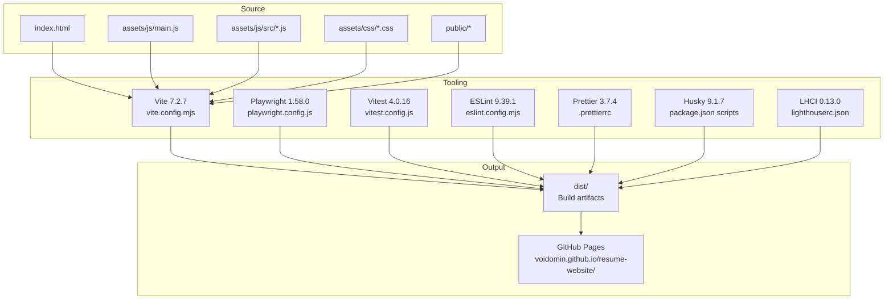
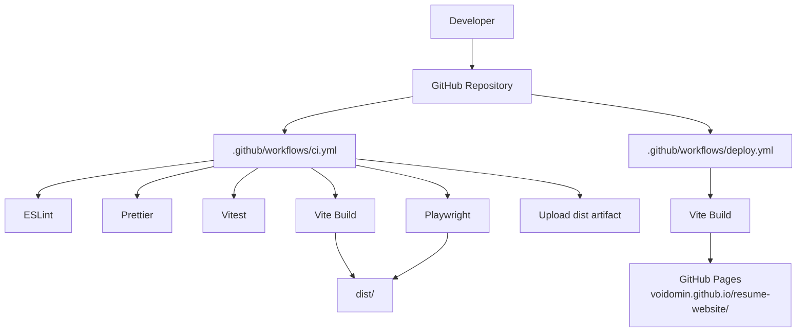
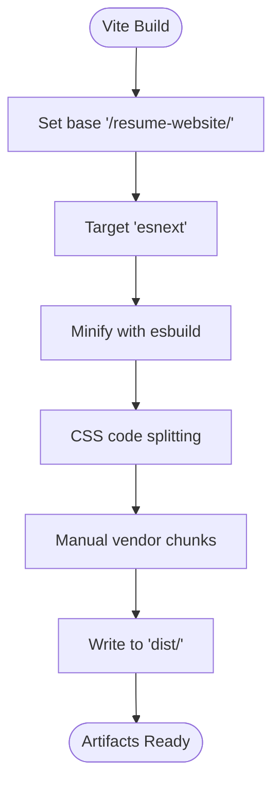
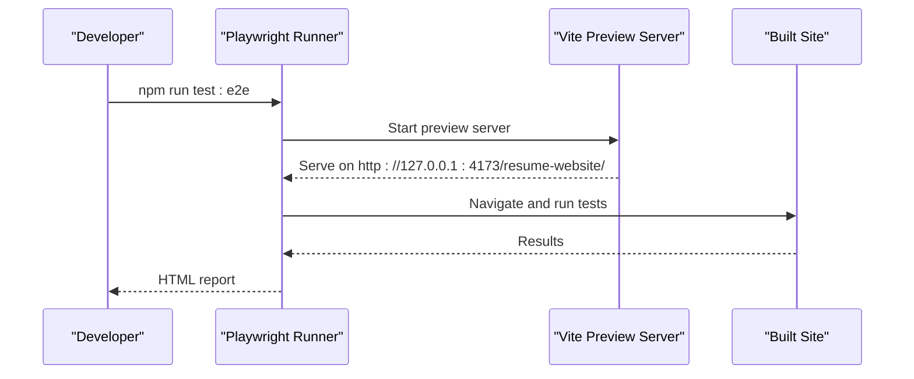
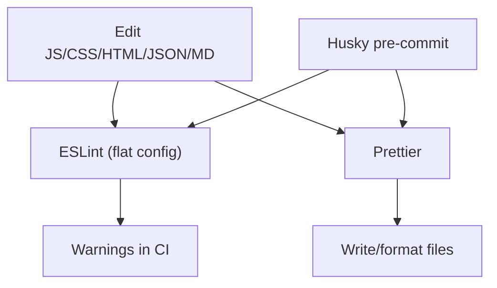
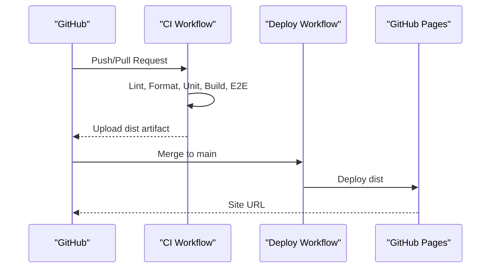
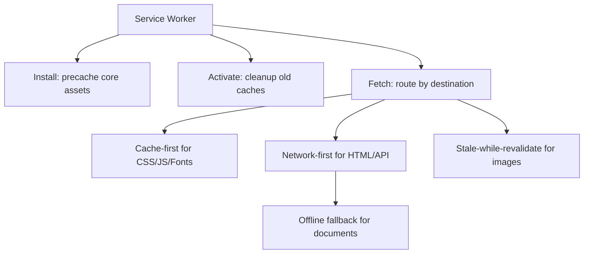
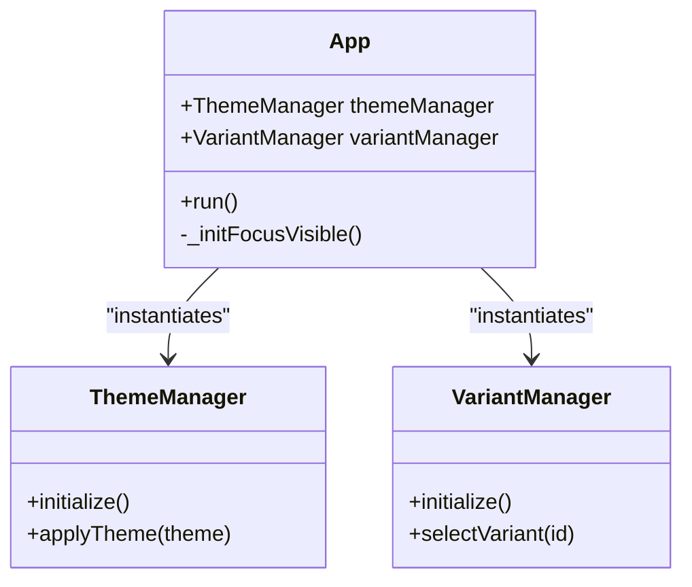
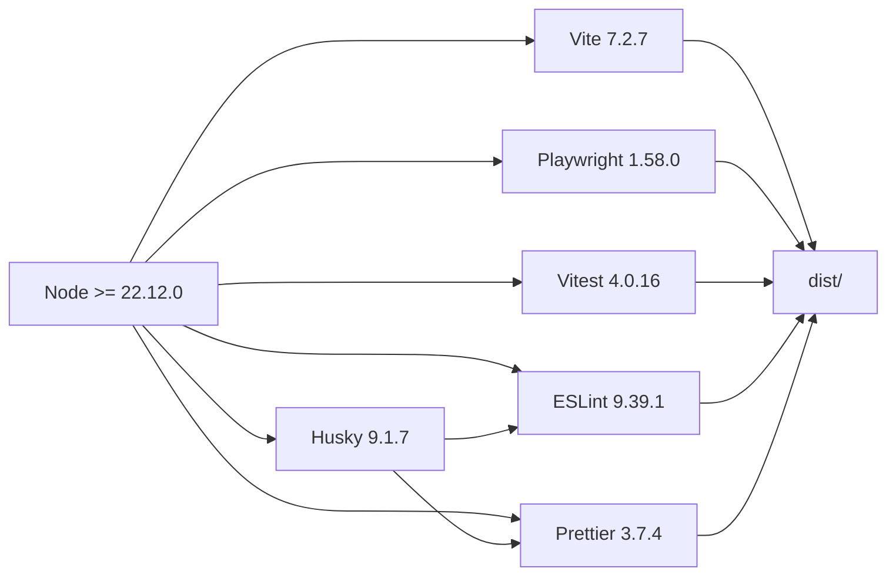

# Technology Stack

<cite>
**Referenced Files in This Document**
- [package.json](file://package.json)
- [vite.config.mjs](file://vite.config.mjs)
- [playwright.config.js](file://playwright.config.js)
- [vitest.config.js](file://vitest.config.js)
- [eslint.config.mjs](file://eslint.config.mjs)
- [.prettierrc](file://.prettierrc)
- [.github/workflows/ci.yml](file://.github/workflows/ci.yml)
- [.github/workflows/deploy.yml](file://.github/workflows/deploy.yml)
- [lighthouserc.json](file://lighthouserc.json)
- [index.html](file://index.html)
- [assets/js/main.js](file://assets/js/main.js)
- [assets/js/src/app.js](file://assets/js/src/app.js)
- [public/service-worker.js](file://public/service-worker.js)
- [public/manifest.json](file://public/manifest.json)
</cite>

## Table of Contents

1. [Introduction](#introduction)
2. [Project Structure](#project-structure)
3. [Core Components](#core-components)
4. [Architecture Overview](#architecture-overview)
5. [Detailed Component Analysis](#detailed-component-analysis)
6. [Dependency Analysis](#dependency-analysis)
7. [Performance Considerations](#performance-considerations)
8. [Troubleshooting Guide](#troubleshooting-guide)
9. [Conclusion](#conclusion)

## Introduction

This document describes the technology stack used to build a modern, performant, and accessible resume website. The stack emphasizes contemporary web standards, efficient development and build workflows, comprehensive testing, and automated deployment. It covers:

- Frontend framework and runtime: vanilla JavaScript ES modules
- Build tooling: Vite 7.2.7
- Testing: Playwright 1.58.0 (end-to-end) and Vitest 4.0.16 (unit)
- Code quality: ESLint 9.39.1 and Prettier 3.7.4
- Pre-commit hooks: Husky 9.1.7
- Deployment: GitHub Actions, GitHub Pages, and LHCI for performance auditing
- Progressive Web App capabilities via service worker and manifest

## Project Structure

The project follows a flat, content-centric structure with clear separation between source assets, generated artifacts, and deployment configurations:

- Source entry points and modules under assets/js and assets/css
- Static HTML pages under public and root
- Build output directed to dist
- CI/CD under .github/workflows
- Testing under tests/e2e and tests/unit
- Tooling configs for Vite, Playwright, Vitest, ESLint, Prettier, and LHCI

**Diagram sources**

- [index.html](file://index.html#L1-L408)
- [vite.config.mjs](file://vite.config.mjs#L1-L21)
- [playwright.config.js](file://playwright.config.js#L1-L45)
- [vitest.config.js](file://vitest.config.js#L1-L11)
- [eslint.config.mjs](file://eslint.config.mjs#L1-L82)
- [.prettierrc](file://.prettierrc#L1-L9)
- [lighthouserc.json](file://lighthouserc.json#L1-L39)

**Section sources**

- [package.json](file://package.json#L1-L56)
- [vite.config.mjs](file://vite.config.mjs#L1-L21)
- [.github/workflows/ci.yml](file://.github/workflows/ci.yml#L1-L53)
- [.github/workflows/deploy.yml](file://.github/workflows/deploy.yml#L1-L50)

## Core Components

- Vanilla JavaScript ES modules: The site uses modern ES module imports and DOM APIs for interactivity and theming. Entry points load via type="module".
- Vite 7.2.7: Provides fast development server, optimized production builds, and asset handling tailored for GitHub Pages.
- Playwright 1.58.0: End-to-end testing suite targeting desktop and mobile environments with a local preview server.
- Vitest 4.0.16: Unit testing with jsdom environment for DOM-like testing.
- ESLint 9.39.1 + Prettier 3.7.4: Enforced via flat config and pre-commit hooks to maintain code quality and consistency.
- GitHub Actions: Automated CI/CD for linting, formatting, testing, building, and deploying to GitHub Pages.
- Progressive Web App: Service worker and manifest enable offline support and installability.

**Section sources**

- [index.html](file://index.html#L404-L406)
- [assets/js/main.js](file://assets/js/main.js#L1-L58)
- [assets/js/src/app.js](file://assets/js/src/app.js#L1-L39)
- [vite.config.mjs](file://vite.config.mjs#L1-L21)
- [playwright.config.js](file://playwright.config.js#L1-L45)
- [vitest.config.js](file://vitest.config.js#L1-L11)
- [eslint.config.mjs](file://eslint.config.mjs#L1-L82)
- [.prettierrc](file://.prettierrc#L1-L9)
- [package.json](file://package.json#L23-L24)
- [.github/workflows/ci.yml](file://.github/workflows/ci.yml#L1-L53)
- [.github/workflows/deploy.yml](file://.github/workflows/deploy.yml#L1-L50)
- [public/service-worker.js](file://public/service-worker.js#L1-L370)
- [public/manifest.json](file://public/manifest.json#L1-L81)

## Architecture Overview

The architecture centers on a static site built with modern tooling and deployed via GitHub Pages. The CI pipeline enforces quality gates, builds the site, runs tests, and deploys on successful merges to main.

**Diagram sources**

- [.github/workflows/ci.yml](file://.github/workflows/ci.yml#L1-L53)
- [.github/workflows/deploy.yml](file://.github/workflows/deploy.yml#L1-L50)
- [vite.config.mjs](file://vite.config.mjs#L1-L21)

## Detailed Component Analysis

### Build System: Vite 7.2.7

- Purpose: Fast development server, optimized bundling, and static site generation for GitHub Pages.
- Key settings:
  - base: "/resume-website/" for proper routing on GitHub Pages
  - outDir: "dist"
  - minify: esbuild
  - cssCodeSplit: true
  - target: "esnext" for modern browsers only
  - manualChunks: vendor chunking strategy
  - publicDir: "public"

**Diagram sources**

- [vite.config.mjs](file://vite.config.mjs#L3-L20)

**Section sources**

- [vite.config.mjs](file://vite.config.mjs#L1-L21)

### Testing Stack: Playwright 1.58.0 and Vitest 4.0.16

- Playwright:
  - Fully parallel execution with browser projects for Desktop Chrome and Mobile Chrome
  - Local preview server launched via "npm run build && vite preview"
  - Base URL configured for GitHub Pages path
  - Trace collection on first retry for diagnostics
- Vitest:
  - jsdom environment for DOM-like unit tests
  - Glob pattern includes unit tests under tests/unit
  - Globals enabled for concise test syntax

**Diagram sources**

- [playwright.config.js](file://playwright.config.js#L38-L43)

**Section sources**

- [playwright.config.js](file://playwright.config.js#L1-L45)
- [vitest.config.js](file://vitest.config.js#L1-L11)

### Code Quality: ESLint 9.39.1 and Prettier 3.7.4

- ESLint flat config:
  - Recommended base rules
  - Project-specific rules scoped to assets/js/\*\*
  - Warnings instead of errors for CI friendliness
  - Prettier rules disabled via eslint-config-prettier
  - Prettier plugin enabled as a non-blocking rule
- Prettier:
  - Configuration file defines formatting preferences

**Diagram sources**

- [eslint.config.mjs](file://eslint.config.mjs#L20-L81)
- [.prettierrc](file://.prettierrc#L1-L9)
- [package.json](file://package.json#L47-L54)

**Section sources**

- [eslint.config.mjs](file://eslint.config.mjs#L1-L82)
- [.prettierrc](file://.prettierrc#L1-L9)
- [package.json](file://package.json#L23-L24)
- [package.json](file://package.json#L47-L54)

### Pre-commit Hooks: Husky 9.1.7

- Husky is prepared via npm script to run lint and format checks before commits.
- lint-staged integrates with ESLint and Prettier to auto-correct staged files.

**Section sources**

- [package.json](file://package.json#L23-L24)
- [package.json](file://package.json#L47-L54)

### Deployment Stack: GitHub Actions, GitHub Pages, and LHCI

- CI workflow:
  - Node.js 22 setup
  - Prettier check and ESLint lint
  - Unit tests and Playwright installation
  - Vite build and E2E tests
  - Upload dist artifact
- Deploy workflow:
  - Build on main branch
  - Upload artifact and deploy to GitHub Pages
- LHCI:
  - Collects performance metrics for key URLs
  - Asserts minimum scores per category

**Diagram sources**

- [.github/workflows/ci.yml](file://.github/workflows/ci.yml#L1-L53)
- [.github/workflows/deploy.yml](file://.github/workflows/deploy.yml#L1-L50)
- [lighthouserc.json](file://lighthouserc.json#L1-L39)

**Section sources**

- [.github/workflows/ci.yml](file://.github/workflows/ci.yml#L1-L53)
- [.github/workflows/deploy.yml](file://.github/workflows/deploy.yml#L1-L50)
- [lighthouserc.json](file://lighthouserc.json#L1-L39)

### Progressive Web App: Service Worker and Manifest

- Service Worker:
  - Precaches core assets and routes
  - Implements cache-first, network-first, and stale-while-revalidate strategies
  - Handles offline fallback and push notifications
- Manifest:
  - Defines app metadata, icons, screenshots, shortcuts, and share targets

**Diagram sources**

- [public/service-worker.js](file://public/service-worker.js#L42-L119)
- [public/manifest.json](file://public/manifest.json#L1-L81)

**Section sources**

- [public/service-worker.js](file://public/service-worker.js#L1-L370)
- [public/manifest.json](file://public/manifest.json#L1-L81)

### Frontend Runtime: ES Modules and Theming

- Entry point loads theme initialization and navigation logic.
- App class orchestrates managers and focus-visible behavior.

**Diagram sources**

- [assets/js/src/app.js](file://assets/js/src/app.js#L1-L39)

**Section sources**

- [index.html](file://index.html#L404-L406)
- [assets/js/main.js](file://assets/js/main.js#L1-L58)
- [assets/js/src/app.js](file://assets/js/src/app.js#L1-L39)

## Dependency Analysis

- Node.js engine requirement: >= 22.12.0
- Toolchain versions:
  - Vite: 7.2.7
  - Playwright: 1.58.0
  - Vitest: 4.0.16
  - ESLint: 9.39.1
  - Prettier: 3.7.4
  - Husky: 9.1.7
- Build-time dependencies:
  - esbuild minification
  - Rollup manual chunking
  - CSS code splitting
- Runtime dependencies:
  - Service worker for offline and caching
  - Manifest for PWA installability

**Diagram sources**

- [package.json](file://package.json#L2-L4)
- [vite.config.mjs](file://vite.config.mjs#L8-L17)
- [playwright.config.js](file://playwright.config.js#L38-L43)
- [vitest.config.js](file://vitest.config.js#L5-L8)
- [eslint.config.mjs](file://eslint.config.mjs#L26-L41)
- [.prettierrc](file://.prettierrc#L1-L9)

**Section sources**

- [package.json](file://package.json#L2-L4)
- [vite.config.mjs](file://vite.config.mjs#L1-L21)
- [playwright.config.js](file://playwright.config.js#L1-L45)
- [vitest.config.js](file://vitest.config.js#L1-L11)
- [eslint.config.mjs](file://eslint.config.mjs#L1-L82)
- [.prettierrc](file://.prettierrc#L1-L9)

## Performance Considerations

- Build optimization:
  - esnext target reduces bundle size for modern browsers
  - CSS code splitting improves loading performance
  - Manual vendor chunking separates frequently changing code
- Testing and observability:
  - LHCI collects performance metrics across multiple runs and asserts minimum scores
- PWA:
  - Service worker caching strategies reduce network requests and improve offline resilience

**Section sources**

- [vite.config.mjs](file://vite.config.mjs#L8-L17)
- [lighthouserc.json](file://lighthouserc.json#L1-L39)
- [public/service-worker.js](file://public/service-worker.js#L33-L37)

## Troubleshooting Guide

- Build fails on GitHub Pages:
  - Verify base path matches repository name and casing
  - Confirm outDir and publicDir are set appropriately
- Playwright tests fail locally:
  - Ensure browsers are installed and preview server is reachable at configured baseURL
  - Check fullyParallel and workers settings for CI vs local differences
- ESLint or Prettier violations:
  - Run npm run lint and npm run format to auto-correct
  - Ensure Husky hooks are installed and lint-staged is configured
- LHCI assertion failures:
  - Review minimum score thresholds and optimize flagged areas
- Service worker not caching:
  - Confirm cache strategy matches resource types and origin
  - Validate offline fallback logic for document requests

**Section sources**

- [vite.config.mjs](file://vite.config.mjs#L4-L17)
- [playwright.config.js](file://playwright.config.js#L17-L23)
- [playwright.config.js](file://playwright.config.js#L38-L43)
- [eslint.config.mjs](file://eslint.config.mjs#L67-L81)
- [.prettierrc](file://.prettierrc#L1-L9)
- [lighthouserc.json](file://lighthouserc.json#L8-L32)
- [public/service-worker.js](file://public/service-worker.js#L80-L119)

## Conclusion

The Resume Website leverages a modern, streamlined technology stack to deliver a fast, accessible, and maintainable single-page application. Vite provides efficient builds and previews, Playwright and Vitest ensure reliability across environments, and ESLint/Prettier/Husky enforce consistent code quality. GitHub Actions automates CI/CD, while GitHub Pages hosts the site globally. Optional PWA features further enhance user experience with offline support and installability.
