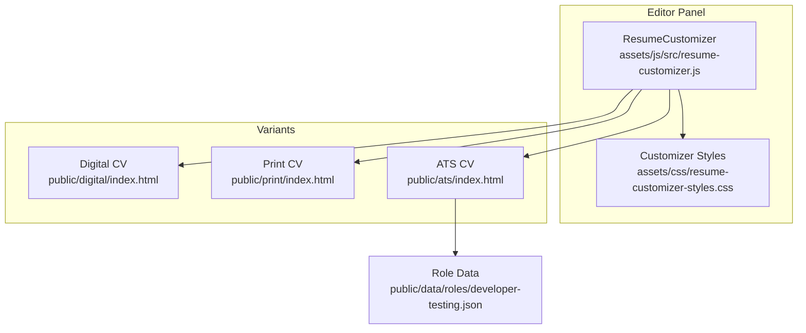
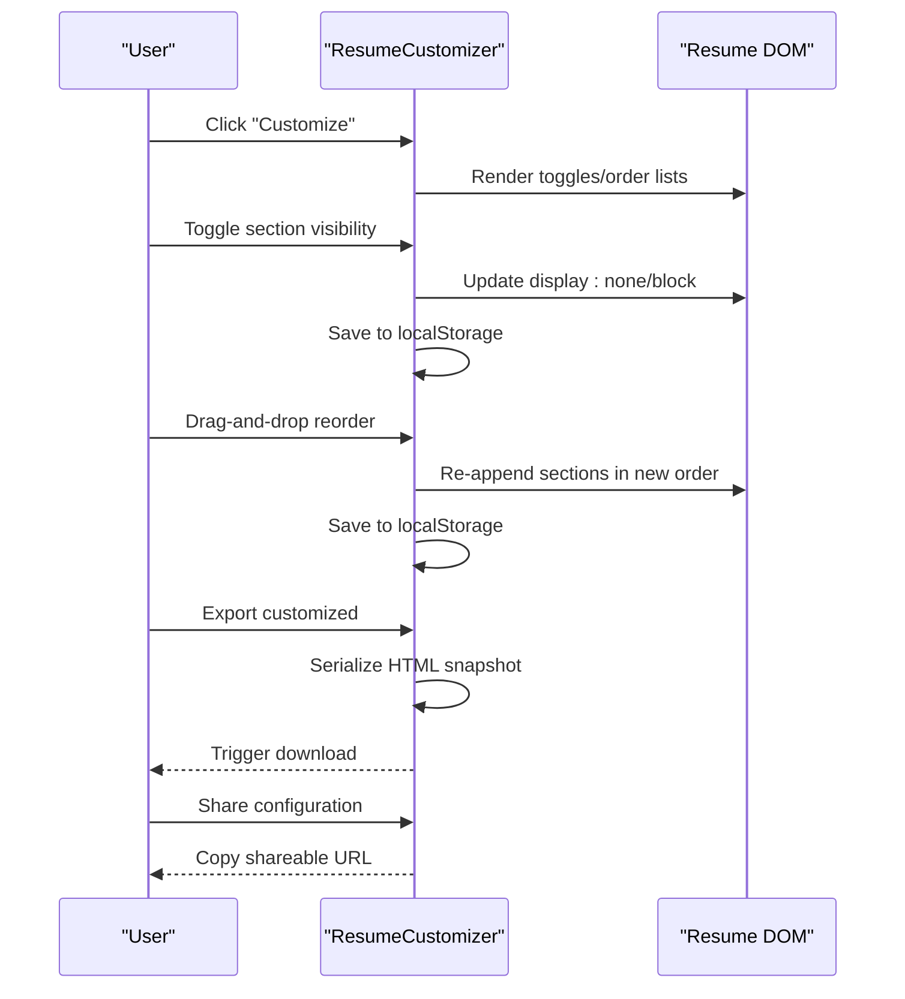
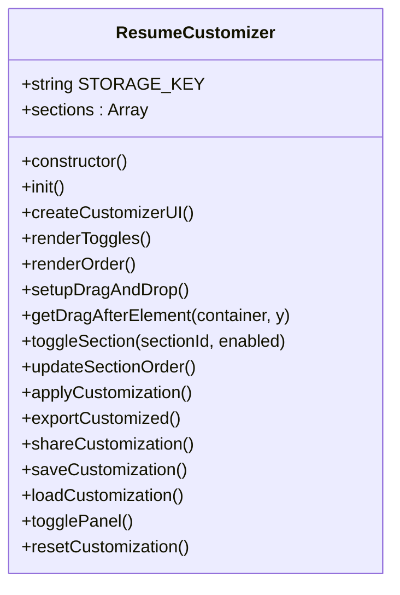
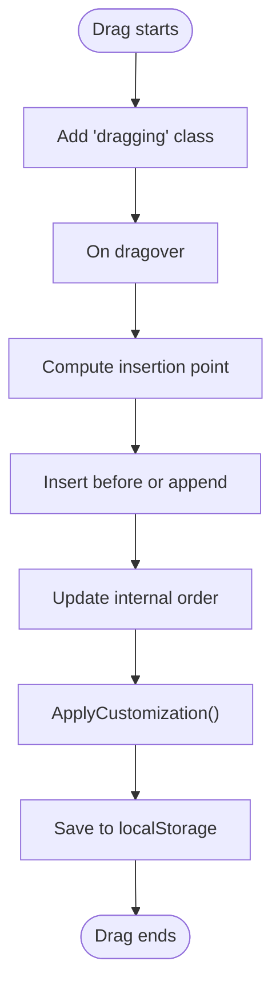
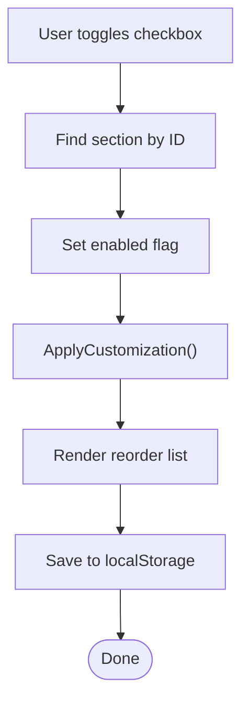
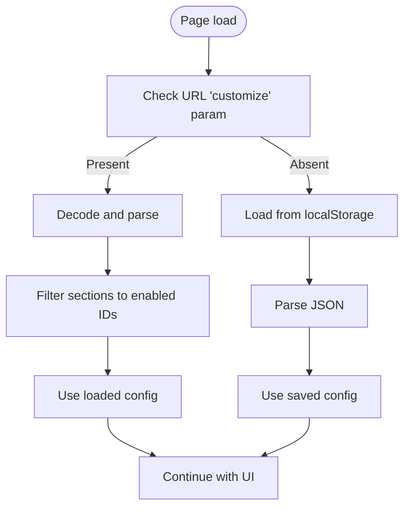
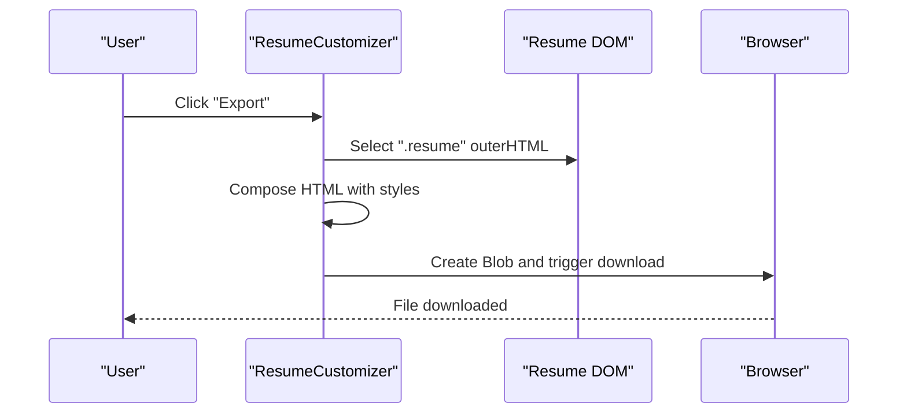
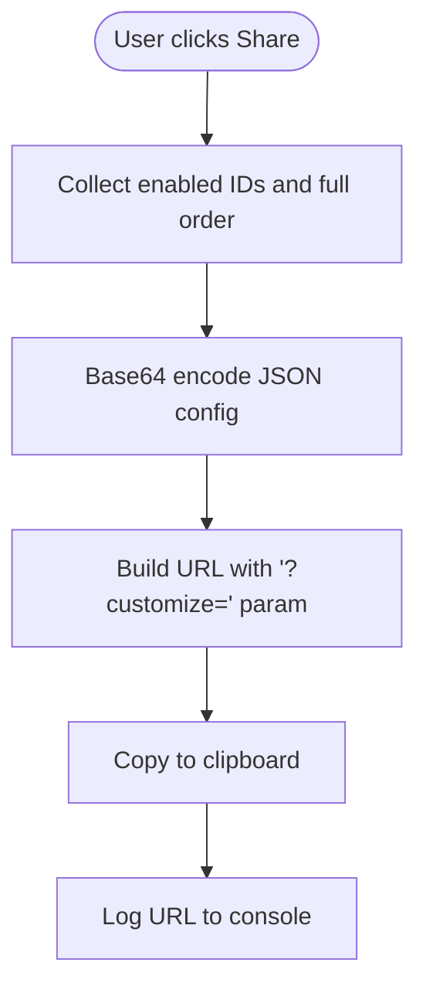
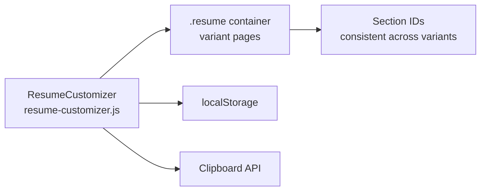

# Resume Customization

<cite>
**Referenced Files in This Document**
- [resume-customizer.js](file://assets/js/src/resume-customizer.js)
- [resume-customizer-styles.css](file://assets/css/resume-customizer-styles.css)
- [index.html](file://index.html)
- [digital/index.html](file://public/digital/index.html)
- [print/index.html](file://public/print/index.html)
- [ats/index.html](file://public/ats/index.html)
- [developer-testing.json](file://public/data/roles/developer-testing.json)
- [variant-manager.js](file://assets/js/src/variant-manager.js)
- [theme-manager.js](file://assets/js/src/theme-manager.js)
- [theme-manager-enhanced.js](file://assets/js/src/theme-manager-enhanced.js)
- [utils.js](file://assets/js/src/utils.js)
- [router.js](file://assets/js/router.js)
</cite>

## Table of Contents

1. [Introduction](#introduction)
2. [Project Structure](#project-structure)
3. [Core Components](#core-components)
4. [Architecture Overview](#architecture-overview)
5. [Detailed Component Analysis](#detailed-component-analysis)
6. [Dependency Analysis](#dependency-analysis)
7. [Performance Considerations](#performance-considerations)
8. [Troubleshooting Guide](#troubleshooting-guide)
9. [Conclusion](#conclusion)
10. [Appendices](#appendices)

## Introduction

This document explains the interactive resume editor and customization system. It covers drag-and-drop reordering, section visibility toggling, export and sharing, persistence, and integration with resume variants. It also documents the customization workflow, UX design, and cross-format compatibility across digital, print, and ATS variants.

## Project Structure

The customization system centers on a single interactive panel that modifies visible sections and ordering in supported resume variants. The panel is injected into pages that host resume content and persists preferences locally. Variant pages (digital, print, ATS) define the section IDs and rendering logic that the customizer manipulates.

**Diagram sources**

- [resume-customizer.js](file://assets/js/src/resume-customizer.js#L6-L307)
- [resume-customizer-styles.css](file://assets/css/resume-customizer-styles.css#L1-L406)
- [digital/index.html](file://public/digital/index.html#L922-L1196)
- [print/index.html](file://public/print/index.html#L451-L800)
- [ats/index.html](file://public/ats/index.html#L332-L543)
- [developer-testing.json](file://public/data/roles/developer-testing.json#L1-L136)

**Section sources**

- [resume-customizer.js](file://assets/js/src/resume-customizer.js#L6-L307)
- [resume-customizer-styles.css](file://assets/css/resume-customizer-styles.css#L1-L406)
- [digital/index.html](file://public/digital/index.html#L922-L1196)
- [print/index.html](file://public/print/index.html#L451-L800)
- [ats/index.html](file://public/ats/index.html#L332-L543)
- [developer-testing.json](file://public/data/roles/developer-testing.json#L1-L136)

## Core Components

- ResumeCustomizer: Manages UI panel, section toggles, drag-and-drop reordering, persistence, export, and sharing.
- Variant pages: Provide the DOM structure and section IDs that the customizer controls.
- Persistence: Local storage for saved customization and URL parameter loading for sharing.
- Styles: Dedicated styles for the customizer panel and responsive behavior.

Key responsibilities:

- UI lifecycle: create, render toggles/order, open/close panel.
- State: maintain enabled/disabled sections and their order.
- Interaction: toggle visibility, drag-and-drop reordering, apply changes to DOM.
- Persistence: save/load customization, encode/decode sharing URLs.
- Export: produce downloadable HTML snapshot of customized resume.
- Sharing: encode current configuration into a shareable URL.

**Section sources**

- [resume-customizer.js](file://assets/js/src/resume-customizer.js#L6-L307)
- [resume-customizer-styles.css](file://assets/css/resume-customizer-styles.css#L1-L406)

## Architecture Overview

The customization system is a client-side module that augments existing resume variants. It injects a floating panel into pages containing a resume container and applies live changes to section visibility and order.

**Diagram sources**

- [resume-customizer.js](file://assets/js/src/resume-customizer.js#L23-L297)
- [digital/index.html](file://public/digital/index.html#L922-L1196)
- [print/index.html](file://public/print/index.html#L451-L800)
- [ats/index.html](file://public/ats/index.html#L332-L543)

## Detailed Component Analysis

### ResumeCustomizer Class

The class encapsulates the entire customization experience: initialization, UI creation, drag-and-drop, toggling, persistence, export, and sharing.

Implementation highlights:

- Initialization loads saved or shared configuration, creates the panel, and wires drag-and-drop.
- Section toggles update visibility immediately and persist state.
- Drag-and-drop computes insertion point and reorders sections, keeping disabled sections last.
- ApplyCustomization enforces visibility and order on the DOM.
- ExportCustomized serializes the current resume container into a downloadable HTML file.
- ShareConfiguration encodes current enabled sections and order into a URL-safe token.
- Persistence uses localStorage with a timestamp; supports loading from URL query parameter.

**Diagram sources**

- [resume-customizer.js](file://assets/js/src/resume-customizer.js#L6-L307)

**Section sources**

- [resume-customizer.js](file://assets/js/src/resume-customizer.js#L6-L307)

### Drag-and-Drop API Integration

The drag-and-drop implementation uses native HTML5 Drag and Drop events:

- dragstart: marks dragged item and sets effect.
- dragover: prevents default drop, determines insertion point via vertical offset calculation.
- dragend: cleans up drag state.

**Diagram sources**

- [resume-customizer.js](file://assets/js/src/resume-customizer.js#L104-L148)
- [resume-customizer.js](file://assets/js/src/resume-customizer.js#L160-L179)

**Section sources**

- [resume-customizer.js](file://assets/js/src/resume-customizer.js#L104-L148)
- [resume-customizer.js](file://assets/js/src/resume-customizer.js#L160-L179)

### Section Toggling Logic

Each section has an associated checkbox. Toggling updates the in-memory state, re-applies visibility, refreshes the reorder list, and persists the change.

**Diagram sources**

- [resume-customizer.js](file://assets/js/src/resume-customizer.js#L150-L158)
- [resume-customizer.js](file://assets/js/src/resume-customizer.js#L181-L202)

**Section sources**

- [resume-customizer.js](file://assets/js/src/resume-customizer.js#L150-L158)
- [resume-customizer.js](file://assets/js/src/resume-customizer.js#L181-L202)

### Data Persistence Strategies

- Loading: On startup, checks URL query parameter "customize". If present, decodes and applies enabled sections. Otherwise, loads from localStorage.
- Saving: Serializes current sections array and timestamp, stores under a fixed key.
- Reset: Confirms and clears localStorage, reloading the page.

**Diagram sources**

- [resume-customizer.js](file://assets/js/src/resume-customizer.js#L261-L282)

**Section sources**

- [resume-customizer.js](file://assets/js/src/resume-customizer.js#L253-L297)

### Export Capabilities

Export produces a standalone HTML file containing the current resume snapshot and embedded styles. Filename includes the active role and date.

**Diagram sources**

- [resume-customizer.js](file://assets/js/src/resume-customizer.js#L204-L234)

**Section sources**

- [resume-customizer.js](file://assets/js/src/resume-customizer.js#L204-L234)

### Sharing Mechanisms

Sharing encodes the current configuration (enabled sections and order) into a base64 string appended as a URL parameter. Clipboard API copies the generated URL.

**Diagram sources**

- [resume-customizer.js](file://assets/js/src/resume-customizer.js#L236-L251)

**Section sources**

- [resume-customizer.js](file://assets/js/src/resume-customizer.js#L236-L251)

### Cross-Format Compatibility

The customizer targets three major formats by manipulating the same section IDs:

- Digital CV: Uses IDs like profile-summary, work-experience, education, projects, skills.
- Print CV: Same IDs mapped to print-friendly layout.
- ATS CV: Uses IDs like cv-summary-section, cv-work-section, etc., and renders from JSON data.

Integration points:

- Section IDs must match between the customizer and the variant page.
- The customizer reads/writes by ID and re-appends sections to enforce order.
- ATS variant loads data from JSON and exposes the same IDs for toggling.

**Section sources**

- [digital/index.html](file://public/digital/index.html#L931-L1195)
- [print/index.html](file://public/print/index.html#L593-L800)
- [ats/index.html](file://public/ats/index.html#L356-L391)
- [developer-testing.json](file://public/data/roles/developer-testing.json#L1-L136)

### UI Interactions and State Management

- Panel lifecycle: toggle button opens/closes the panel; close button hides it.
- Toggle labels reflect enabled state; disabled sections show strikethrough.
- Drag handles indicate reorderable items; visual feedback during drag.
- Actions: Export, Reset, Share buttons trigger respective behaviors.

**Section sources**

- [resume-customizer.js](file://assets/js/src/resume-customizer.js#L29-L69)
- [resume-customizer.js](file://assets/js/src/resume-customizer.js#L284-L297)
- [resume-customizer-styles.css](file://assets/css/resume-customizer-styles.css#L3-L406)

### Configuration Serialization

The configuration object includes:

- sections: array of section descriptors with id, label, enabled.
- timestamp: ISO string for save time.

Serialization and deserialization occur via JSON stringify/parse and localStorage getItem/setItem.

**Section sources**

- [resume-customizer.js](file://assets/js/src/resume-customizer.js#L253-L259)
- [resume-customizer.js](file://assets/js/src/resume-customizer.js#L271-L282)

### Integration with Resume Variants

While the customizer is primarily used on pages that embed a resume container, variant selection is handled by a separate manager. The customizer does not depend on variant-manager for its core logic; however, both can coexist on the same page.

- VariantManager manages tabs/cards and primary action links for variant selection.
- ResumeCustomizer injects itself into pages that contain a resume container and applies live edits.

**Section sources**

- [variant-manager.js](file://assets/js/src/variant-manager.js#L1-L125)
- [index.html](file://index.html#L192-L391)

## Dependency Analysis

The customizer depends on:

- DOM structure with identifiable section containers.
- Consistent section IDs across variants.
- Local storage for persistence.
- Clipboard API for sharing.

Potential coupling and risks:

- Tight coupling to section IDs across variants.
- Reliance on DOM structure; missing elements cause no-op behavior.
- URL parameter parsing errors fall back gracefully.

**Diagram sources**

- [resume-customizer.js](file://assets/js/src/resume-customizer.js#L181-L202)
- [ats/index.html](file://public/ats/index.html#L356-L391)
- [digital/index.html](file://public/digital/index.html#L931-L1195)
- [print/index.html](file://public/print/index.html#L593-L800)

**Section sources**

- [resume-customizer.js](file://assets/js/src/resume-customizer.js#L181-L202)
- [ats/index.html](file://public/ats/index.html#L356-L391)
- [digital/index.html](file://public/digital/index.html#L931-L1195)
- [print/index.html](file://public/print/index.html#L593-L800)

## Performance Considerations

- Drag-and-drop reordering triggers DOM reflow; batching updates reduces cost.
- Applying visibility and reordering occurs on each change; minimal overhead due to small number of sections.
- Export creates a Blob and initiates a download; consider throttling frequent exports.
- Local storage writes occur on every change; batching saves could reduce churn.

## Troubleshooting Guide

Common issues and resolutions:

- Sections not appearing: Verify section IDs exist in the current variant page.
- Drag-and-drop not working: Ensure draggable elements exist and event handlers are attached.
- Export fails silently: Confirm the ".resume" container exists and styles are accessible.
- Share URL invalid: Validate base64 encoding and that the URL parameter is present.
- Reset does not restore defaults: Confirm localStorage key and reload behavior.

**Section sources**

- [resume-customizer.js](file://assets/js/src/resume-customizer.js#L261-L282)
- [resume-customizer.js](file://assets/js/src/resume-customizer.js#L291-L297)

## Conclusion

The interactive resume editor provides a streamlined way to tailor resume presentation across digital, print, and ATS formats. Its design emphasizes simplicity, immediate feedback, and portability via sharing and export. By maintaining consistent section IDs and leveraging local storage, it offers a robust customization experience that integrates cleanly with existing variant pages.

## Appendices

### Customization Scenarios

- Scenario A: Hide sensitive section (e.g., Publications) and reorder Work Experience to top.
  - Steps: Toggle off the section, drag it to the top of the reorder list, export/share as needed.
- Scenario B: Reset to default configuration.
  - Steps: Click Reset; confirm; page reloads with defaults applied.
- Scenario C: Share configuration with a colleague.
  - Steps: Click Share; paste the URL; recipient loads the same configuration via URL parameter.

**Section sources**

- [resume-customizer.js](file://assets/js/src/resume-customizer.js#L150-L158)
- [resume-customizer.js](file://assets/js/src/resume-customizer.js#L160-L179)
- [resume-customizer.js](file://assets/js/src/resume-customizer.js#L236-L251)
- [resume-customizer.js](file://assets/js/src/resume-customizer.js#L291-L297)

### Export Processes

- Digital/Print: Export captures the current ".resume" container and embeds styles into a downloadable HTML file.
- ATS: Export is not implemented in the customizer; use the variant’s native download options.

**Section sources**

- [resume-customizer.js](file://assets/js/src/resume-customizer.js#L204-L234)
- [digital/index.html](file://public/digital/index.html#L922-L1196)
- [print/index.html](file://public/print/index.html#L451-L800)

### Configuration Sharing

- Encoding: enabled sections and full order serialized to JSON, base64-encoded, and appended as a URL parameter.
- Decoding: On load, if the parameter exists, decode and apply enabled sections; otherwise, load from localStorage.

**Section sources**

- [resume-customizer.js](file://assets/js/src/resume-customizer.js#L236-L251)
- [resume-customizer.js](file://assets/js/src/resume-customizer.js#L261-L282)
