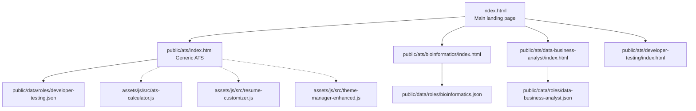
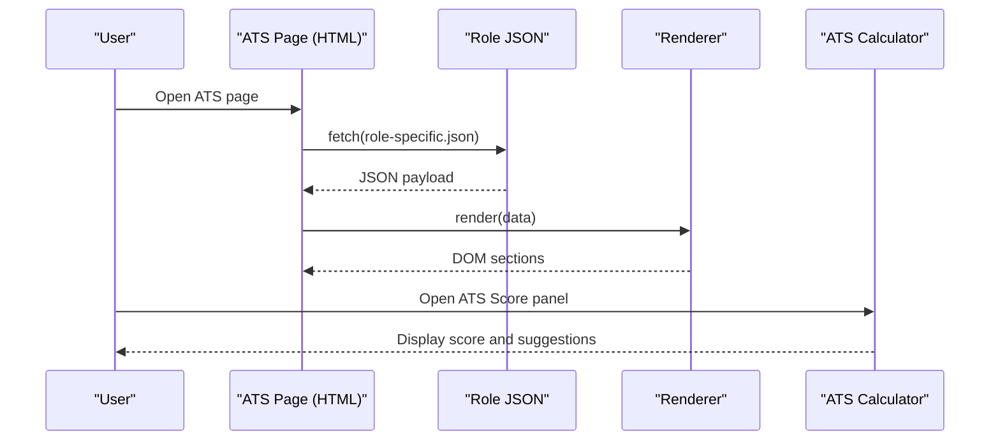
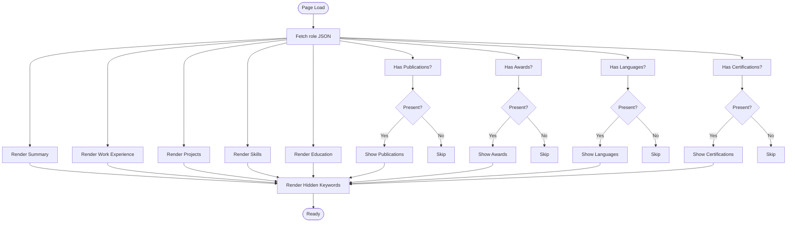
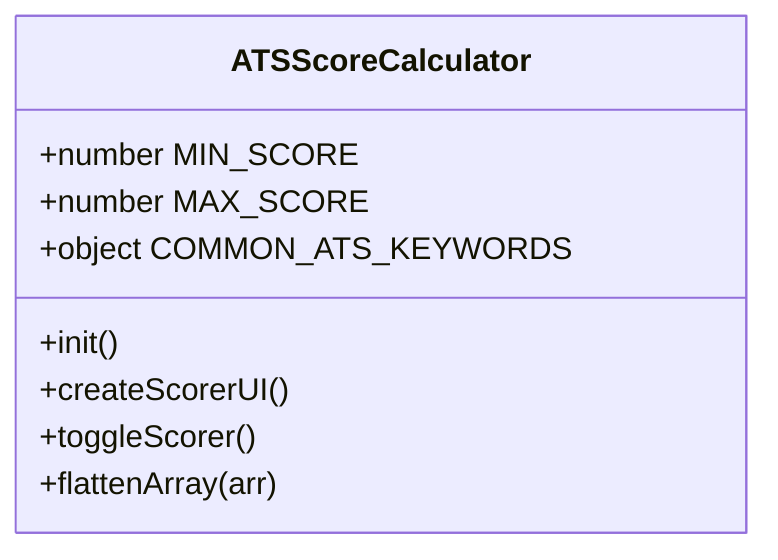
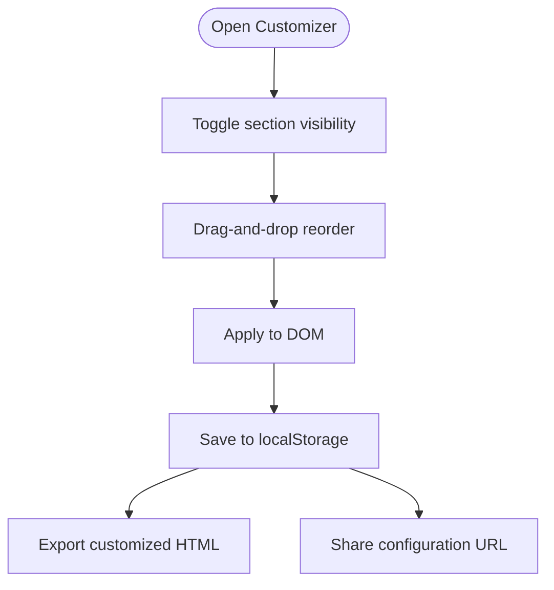
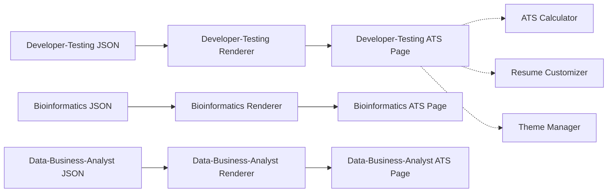

# ATS Format

<cite>
**Referenced Files in This Document**
- [index.html](file://index.html)
- [README.md](file://README.md)
- [ats-calculator.js](file://assets/js/src/ats-calculator.js)
- [ats-calculator-styles.css](file://assets/css/ats-calculator-styles.css)
- [resume-customizer.js](file://assets/js/src/resume-customizer.js)
- [theme-manager-enhanced.js](file://assets/js/src/theme-manager-enhanced.js)
- [public/ats/index.html](file://public/ats/index.html)
- [public/ats/bioinformatics/index.html](file://public/ats/bioinformatics/index.html)
- [public/ats/data-business-analyst/index.html](file://public/ats/data-business-analyst/index.html)
- [public/ats/developer-testing/index.html](file://public/ats/developer-testing/index.html)
- [public/data/roles/bioinformatics.json](file://public/data/roles/bioinformatics.json)
- [public/data/roles/data-business-analyst.json](file://public/data/roles/data-business-analyst.json)
- [public/data/roles/developer-testing.json](file://public/data/roles/developer-testing.json)
</cite>

## Table of Contents

1. [Introduction](#introduction)
2. [Project Structure](#project-structure)
3. [Core Components](#core-components)
4. [Architecture Overview](#architecture-overview)
5. [Detailed Component Analysis](#detailed-component-analysis)
6. [Dependency Analysis](#dependency-analysis)
7. [Performance Considerations](#performance-considerations)
8. [Troubleshooting Guide](#troubleshooting-guide)
9. [Conclusion](#conclusion)

## Introduction

This document explains the ATS (Applicant Tracking System) Format resume variant and how it is optimized for automated parsing. It covers ATS-specific formatting techniques, keyword optimization strategies, content structure, and the automated parsing considerations embedded in the implementation. It also documents the ATS calculator functionality, role-specific configurations, and optimization recommendations for maximum compatibility with ATS software.

## Project Structure

The ATS variant is delivered as static HTML pages with embedded rendering logic and role-specific data. Each role variant loads its own JSON dataset and renders a machine-readable, print-optimized layout. The main landing page exposes quick-access cards to ATS variants and role-specific pages.

**Diagram sources**

- [index.html](file://index.html#L239-L260)
- [public/ats/index.html](file://public/ats/index.html#L484-L526)
- [public/ats/bioinformatics/index.html](file://public/ats/bioinformatics/index.html#L384-L426)
- [public/ats/data-business-analyst/index.html](file://public/ats/data-business-analyst/index.html#L395-L437)
- [public/ats/developer-testing/index.html](file://public/ats/developer-testing/index.html#L381-L423)
- [public/data/roles/developer-testing.json](file://public/data/roles/developer-testing.json#L1-L136)
- [public/data/roles/bioinformatics.json](file://public/data/roles/bioinformatics.json#L1-L129)
- [public/data/roles/data-business-analyst.json](file://public/data/roles/data-business-analyst.json#L1-L112)
- [ats-calculator.js](file://assets/js/src/ats-calculator.js#L1-L161)
- [resume-customizer.js](file://assets/js/src/resume-customizer.js#L1-L307)
- [theme-manager-enhanced.js](file://assets/js/src/theme-manager-enhanced.js#L1-L85)

**Section sources**

- [index.html](file://index.html#L239-L390)
- [README.md](file://README.md#L104-L135)

## Core Components

- ATS Renderer: Role-specific HTML pages fetch JSON data and render sections with minimal markup suitable for OCR and ATS parsing.
- ATS Calculator: An interactive panel that computes an ATS compatibility score and provides suggestions.
- Resume Customizer: Allows toggling and reordering visible sections for print and ATS variants.
- Theme Manager: Provides theme switching with persisted preferences.

Key ATS characteristics implemented:

- Plain, semantic section headings and lists.
- Minimal inline styles and no complex layout.
- Hidden “Keywords” section for machine extraction.
- Print media queries for PDF generation.

**Section sources**

- [public/ats/index.html](file://public/ats/index.html#L333-L399)
- [public/ats/bioinformatics/index.html](file://public/ats/bioinformatics/index.html#L240-L302)
- [public/ats/data-business-analyst/index.html](file://public/ats/data-business-analyst/index.html#L243-L305)
- [public/ats/developer-testing/index.html](file://public/ats/developer-testing/index.html#L234-L299)
- [ats-calculator.js](file://assets/js/src/ats-calculator.js#L6-L43)
- [resume-customizer.js](file://assets/js/src/resume-customizer.js#L6-L27)
- [theme-manager-enhanced.js](file://assets/js/src/theme-manager-enhanced.js#L6-L21)

## Architecture Overview

The ATS pages are single-page apps driven by JSON datasets. They fetch role data at runtime, render sections, and expose a “Keywords” field for ATS extraction. The ATS calculator enhances the page with a sliding panel that computes a compatibility score and suggests improvements.

**Diagram sources**

- [public/ats/index.html](file://public/ats/index.html#L484-L526)
- [public/ats/bioinformatics/index.html](file://public/ats/bioinformatics/index.html#L384-L426)
- [public/ats/data-business-analyst/index.html](file://public/ats/data-business-analyst/index.html#L395-L437)
- [public/ats/developer-testing/index.html](file://public/ats/developer-testing/index.html#L381-L423)
- [ats-calculator.js](file://assets/js/src/ats-calculator.js#L45-L143)

## Detailed Component Analysis

### ATS Renderer (Role-Specific Pages)

Each ATS page defines a renderer object that maps JSON fields to DOM elements. It renders:

- Professional Summary
- Work Experience (with bullet lists)
- Projects (with optional links and keywords)
- Skills
- Education
- Optional sections: Publications, Awards, Languages, Certifications
- Hidden Keywords section for ATS extraction

Rendering logic:

- Work entries: role, company, period, and bullet points.
- Projects: name, description, optional link, and keywords list.
- Skills: comma-separated list.
- Education: degree, institution, year, optional details.
- Optional sections: shown only when present.
- Keywords: rendered into a hidden section to aid parsing.

**Diagram sources**

- [public/ats/index.html](file://public/ats/index.html#L401-L482)
- [public/ats/bioinformatics/index.html](file://public/ats/bioinformatics/index.html#L305-L383)
- [public/ats/data-business-analyst/index.html](file://public/ats/data-business-analyst/index.html#L308-L394)
- [public/ats/developer-testing/index.html](file://public/ats/developer-testing/index.html#L302-L380)

**Section sources**

- [public/ats/index.html](file://public/ats/index.html#L401-L526)
- [public/ats/bioinformatics/index.html](file://public/ats/bioinformatics/index.html#L305-L426)
- [public/ats/data-business-analyst/index.html](file://public/ats/data-business-analyst/index.html#L308-L437)
- [public/ats/developer-testing/index.html](file://public/ats/developer-testing/index.html#L302-L423)

### ATS Calculator (Compatibility Scoring)

The ATS calculator provides:

- Real-time ATS compatibility score out of 100.
- Breakdown across categories: Format & Structure, Keywords, Content Completeness, Parsing & Readability.
- Improvement suggestions.
- Optional job description analysis to compute match percentage and highlight missing keywords.

Implementation highlights:

- Keyword sets for technical, soft skills, experience descriptors, and section headings.
- UI with a toggle button and a sliding panel.
- Methods to calculate and display scores and suggestions.

**Diagram sources**

- [ats-calculator.js](file://assets/js/src/ats-calculator.js#L6-L43)

**Section sources**

- [ats-calculator.js](file://assets/js/src/ats-calculator.js#L1-L161)
- [ats-calculator-styles.css](file://assets/css/ats-calculator-styles.css#L1-L501)

### Resume Customizer (Section Visibility and Ordering)

The customizer allows:

- Toggling visibility of resume sections.
- Drag-and-drop reordering of visible sections.
- Exporting a customized HTML snapshot.
- Sharing configuration via URL-encoded parameters.
- Persisting preferences in local storage.

**Diagram sources**

- [resume-customizer.js](file://assets/js/src/resume-customizer.js#L23-L297)

**Section sources**

- [resume-customizer.js](file://assets/js/src/resume-customizer.js#L1-L307)

### Theme Manager (Dark/Light/Auto)

Provides theme switching with persistence and updates the theme toggle icon.

**Section sources**

- [theme-manager-enhanced.js](file://assets/js/src/theme-manager-enhanced.js#L1-L85)

### Role-Specific ATS Configurations

Each role variant consumes a dedicated JSON dataset containing:

- meta: name, title, contact info, and role identifier.
- summary: concise professional summary.
- work_experience: array of jobs with role, company, period, and bullet points.
- projects: array of projects with name, description, optional link, and keywords.
- skills: comma-separated list.
- education: array of degrees/institutions/years/details.
- Optional: publications, awards, languages, certifications.
- ats_keywords: comma-separated string intended for machine extraction.

Examples:

- Bioinformatics: specialized keywords and research publications.
- Data / Business Analyst: analytics, SQL, Python, Power BI.
- Developer & Testing: full-stack and QA automation technologies.

**Section sources**

- [public/data/roles/bioinformatics.json](file://public/data/roles/bioinformatics.json#L1-L129)
- [public/data/roles/data-business-analyst.json](file://public/data/roles/data-business-analyst.json#L1-L112)
- [public/data/roles/developer-testing.json](file://public/data/roles/developer-testing.json#L1-L136)

## Dependency Analysis

The ATS pages depend on:

- Role JSON datasets for content.
- Renderer logic to populate DOM sections.
- Optional ATS calculator and customizer for enhancements.
- Theme manager for UI consistency.

**Diagram sources**

- [public/ats/developer-testing/index.html](file://public/ats/developer-testing/index.html#L381-L423)
- [public/ats/bioinformatics/index.html](file://public/ats/bioinformatics/index.html#L384-L426)
- [public/ats/data-business-analyst/index.html](file://public/ats/data-business-analyst/index.html#L395-L437)
- [public/data/roles/developer-testing.json](file://public/data/roles/developer-testing.json#L1-L136)
- [public/data/roles/bioinformatics.json](file://public/data/roles/bioinformatics.json#L1-L129)
- [public/data/roles/data-business-analyst.json](file://public/data/roles/data-business-analyst.json#L1-L112)
- [ats-calculator.js](file://assets/js/src/ats-calculator.js#L1-L161)
- [resume-customizer.js](file://assets/js/src/resume-customizer.js#L1-L307)
- [theme-manager-enhanced.js](file://assets/js/src/theme-manager-enhanced.js#L1-L85)

**Section sources**

- [public/ats/index.html](file://public/ats/index.html#L484-L526)
- [public/ats/bioinformatics/index.html](file://public/ats/bioinformatics/index.html#L384-L426)
- [public/ats/data-business-analyst/index.html](file://public/ats/data-business-analyst/index.html#L395-L437)
- [public/ats/developer-testing/index.html](file://public/ats/developer-testing/index.html#L381-L423)

## Performance Considerations

- Rendering is client-side with small JSON payloads; performance is primarily dependent on DOM updates and network latency for JSON fetches.
- The ATS calculator adds minimal overhead; it initializes on demand and only computes scores when opened.
- Print styles minimize layout complexity, aiding fast PDF generation.

## Troubleshooting Guide

Common issues and resolutions:

- Missing or empty sections: Ensure the corresponding keys exist in the role JSON (e.g., work_experience, projects, skills).
- Hidden keywords not extracted: Verify the ats_keywords field is populated in the JSON and that the hidden section is present in the ATS page.
- Links not clickable: Confirm URLs are valid and included in the projects array.
- Customizer not persisting: Check browser local storage permissions and clearing cached data if needed.
- Theme toggle not working: Confirm the theme manager script is loaded and the toggle button exists.

**Section sources**

- [public/ats/index.html](file://public/ats/index.html#L484-L526)
- [public/data/roles/developer-testing.json](file://public/data/roles/developer-testing.json#L116)
- [resume-customizer.js](file://assets/js/src/resume-customizer.js#L253-L296)
- [theme-manager-enhanced.js](file://assets/js/src/theme-manager-enhanced.js#L52-L70)

## Conclusion

The ATS Format variant delivers machine-readable, print-optimized resumes tailored to specific roles. Its design emphasizes:

- Semantic section headings and bullet lists for parsing.
- Hidden keywords for ATS extraction.
- Role-specific JSON datasets for easy maintenance.
- Optional enhancements like the ATS calculator and customizer for optimization and personalization.

These practices maximize compatibility with ATS software while maintaining a clean, accessible presentation.
