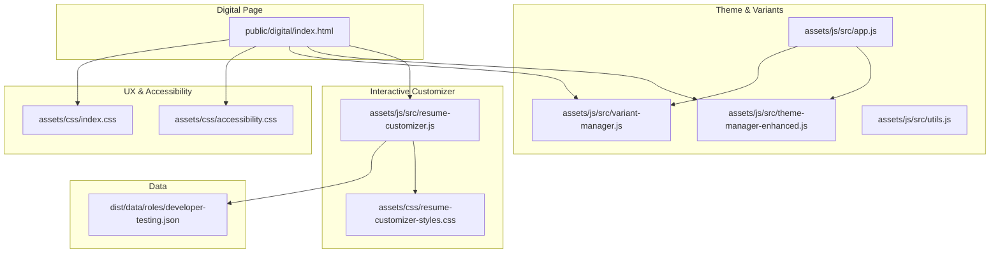
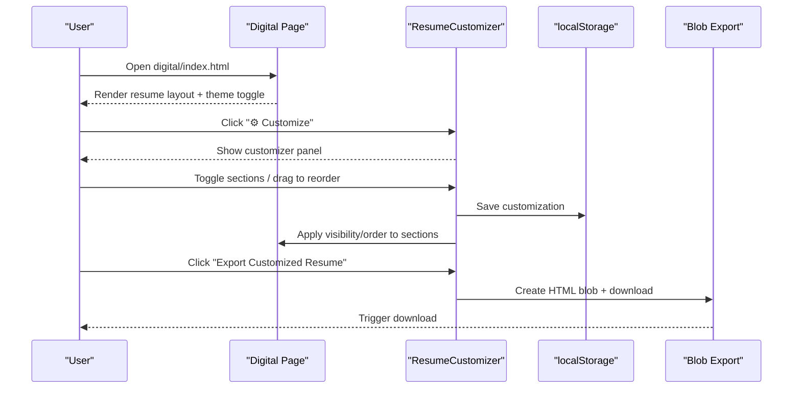
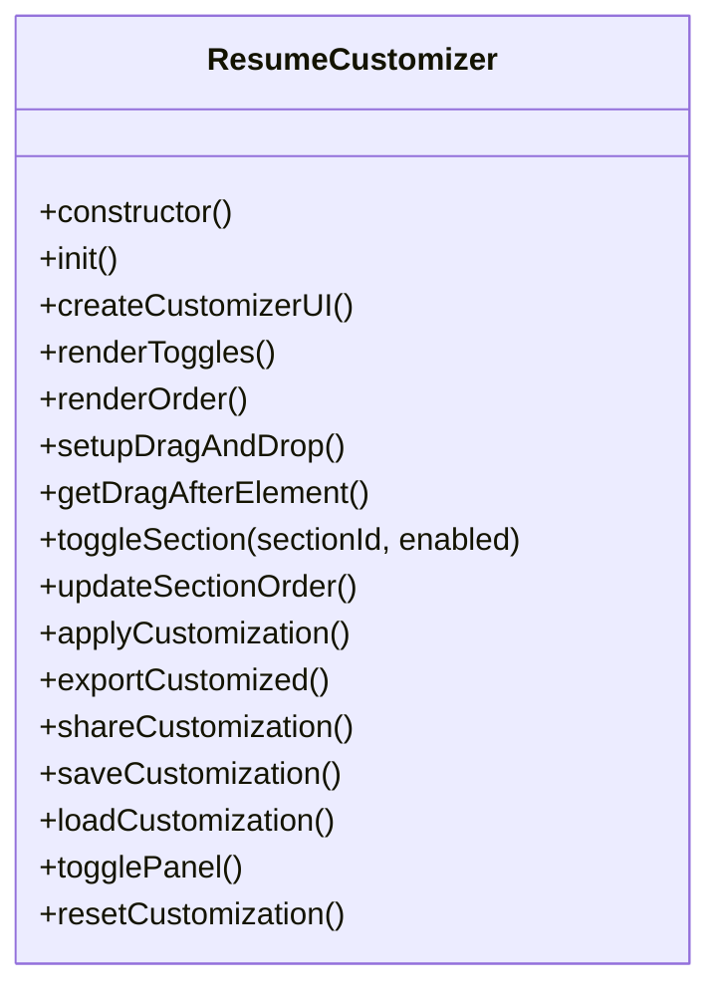
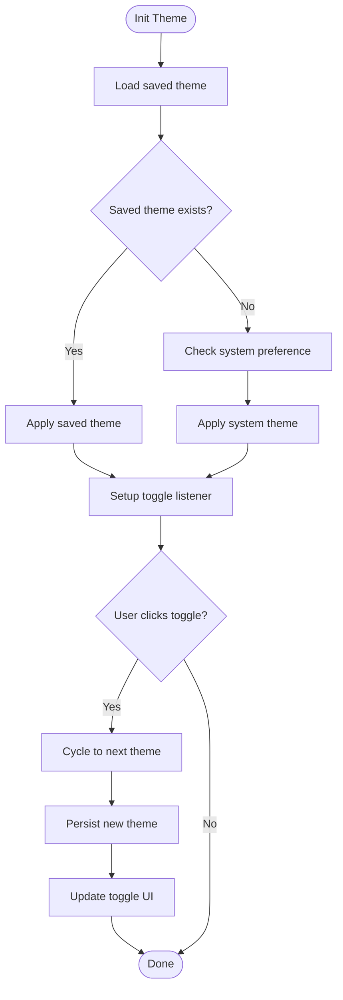
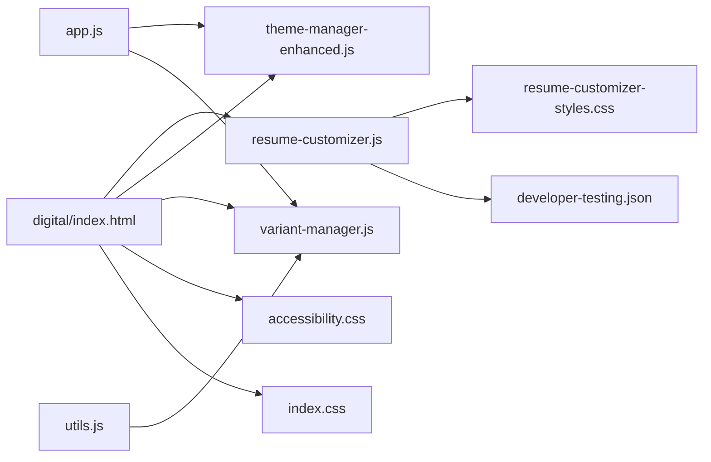

# Digital Format

<cite>
**Referenced Files in This Document**
- [index.html](file://public/digital/index.html)
- [resume-customizer.js](file://assets/js/src/resume-customizer.js)
- [resume-customizer-styles.css](file://assets/css/resume-customizer-styles.css)
- [variant-manager.js](file://assets/js/src/variant-manager.js)
- [theme-manager-enhanced.js](file://assets/js/src/theme-manager-enhanced.js)
- [utils.js](file://assets/js/src/utils.js)
- [app.js](file://assets/js/src/app.js)
- [main.js](file://assets/js/main.js)
- [developer-testing.json](file://dist/data/roles/developer-testing.json)
- [accessibility.css](file://assets/css/accessibility.css)
- [index.css](file://assets/css/index.css)
- [pwa-manager.js](file://assets/js/src/pwa-manager.js)
- [QUICK_REFERENCE.md](file://QUICK_REFERENCE.md)
- [DEPLOYMENT_COMPLETE.md](file://DEPLOYMENT_COMPLETE.md)
</cite>

## Table of Contents

1. [Introduction](#introduction)
2. [Project Structure](#project-structure)
3. [Core Components](#core-components)
4. [Architecture Overview](#architecture-overview)
5. [Detailed Component Analysis](#detailed-component-analysis)
6. [Dependency Analysis](#dependency-analysis)
7. [Performance Considerations](#performance-considerations)
8. [Troubleshooting Guide](#troubleshooting-guide)
9. [Conclusion](#conclusion)
10. [Appendices](#appendices)

## Introduction

This document describes the Digital Format resume variant focused on interactive web-based presentation. It covers dynamic content rendering, interactive customization, drag-and-drop section management, real-time preview, export capabilities, and responsive design. It also documents digital-specific enhancements such as theme switching, accessibility features, and PWA-related offline capabilities.

## Project Structure

The Digital Format is implemented as a single-page application with:

- A static HTML page that defines the resume layout and theme system
- A JavaScript-based resume customizer that enables live section toggling and drag-and-drop reordering
- A theme manager for light/dark/auto modes
- A variant manager coordinating between different resume variants
- Supporting CSS for customizer UI and accessibility/print/print-friendly overrides
- Data-driven content sourced from JSON for role-specific variants

**Diagram sources**

- [index.html](file://public/digital/index.html#L1-L1242)
- [resume-customizer.js](file://assets/js/src/resume-customizer.js#L1-L307)
- [resume-customizer-styles.css](file://assets/css/resume-customizer-styles.css#L1-L406)
- [theme-manager-enhanced.js](file://assets/js/src/theme-manager-enhanced.js#L1-L85)
- [variant-manager.js](file://assets/js/src/variant-manager.js#L1-L125)
- [app.js](file://assets/js/src/app.js#L1-L39)
- [utils.js](file://assets/js/src/utils.js#L1-L5)
- [developer-testing.json](file://dist/data/roles/developer-testing.json#L1-L136)
- [accessibility.css](file://assets/css/accessibility.css#L1-L92)
- [index.css](file://assets/css/index.css#L592-L672)

**Section sources**

- [index.html](file://public/digital/index.html#L1-L1242)
- [resume-customizer.js](file://assets/js/src/resume-customizer.js#L1-L307)
- [resume-customizer-styles.css](file://assets/css/resume-customizer-styles.css#L1-L406)
- [theme-manager-enhanced.js](file://assets/js/src/theme-manager-enhanced.js#L1-L85)
- [variant-manager.js](file://assets/js/src/variant-manager.js#L1-L125)
- [app.js](file://assets/js/src/app.js#L1-L39)
- [utils.js](file://assets/js/src/utils.js#L1-L5)
- [developer-testing.json](file://dist/data/roles/developer-testing.json#L1-L136)
- [accessibility.css](file://assets/css/accessibility.css#L1-L92)
- [index.css](file://assets/css/index.css#L592-L672)

## Core Components

- Digital resume page: Defines the two-column layout, theme variables, and section content blocks.
- Resume Customizer: Provides a floating panel to toggle visibility, reorder, export, and share configurations.
- Theme Manager: Manages theme selection and persistence.
- Variant Manager: Coordinates variant selection and primary action updates.
- Accessibility and Print Styles: Ensures WCAG-compliant focus, reduced motion, and print-friendly output.

**Section sources**

- [index.html](file://public/digital/index.html#L1-L1242)
- [resume-customizer.js](file://assets/js/src/resume-customizer.js#L1-L307)
- [resume-customizer-styles.css](file://assets/css/resume-customizer-styles.css#L1-L406)
- [theme-manager-enhanced.js](file://assets/js/src/theme-manager-enhanced.js#L1-L85)
- [variant-manager.js](file://assets/js/src/variant-manager.js#L1-L125)
- [accessibility.css](file://assets/css/accessibility.css#L1-L92)
- [index.css](file://assets/css/index.css#L592-L672)

## Architecture Overview

The Digital Format integrates a static resume shell with dynamic customization and theme management. The customizer reads and manipulates DOM sections, persists preferences, and supports export and sharing. Theme and variant managers provide user experience enhancements and navigation coordination.

**Diagram sources**

- [index.html](file://public/digital/index.html#L1-L1242)
- [resume-customizer.js](file://assets/js/src/resume-customizer.js#L1-L307)
- [resume-customizer-styles.css](file://assets/css/resume-customizer-styles.css#L1-L406)

## Detailed Component Analysis

### Digital Resume Page

- Two-column layout with a sidebar and main content area.
- Theme toggle controls a dark-mode class on the body.
- Section blocks for profile summary, work experience, education, projects, and skills.
- Uses CSS custom properties for theme-aware colors and shadows.
- Includes skip link and ARIA live region for accessibility.

Implementation highlights:

- Theme toggle script persists a theme preference and toggles body classes.
- Media queries adapt layout for narrow screens.

**Section sources**

- [index.html](file://public/digital/index.html#L1-L1242)
- [accessibility.css](file://assets/css/accessibility.css#L1-L92)

### Resume Customizer

- Creates a floating panel with:
  - Section visibility toggles
  - Drag-and-drop reordering of enabled sections
  - Export to HTML file
  - Share configuration via URL
  - Reset to defaults
- Persists configuration in localStorage and supports URL-parameter loading.
- Applies changes immediately to the DOM by updating display and ordering.

Key behaviors:

- Toggle sections on/off and re-render the reorder list accordingly.
- Drag-and-drop computes drop position and updates internal order.
- Export builds a self-contained HTML document with embedded styles.
- Share encodes current configuration and produces a shareable URL.

**Diagram sources**

- [resume-customizer.js](file://assets/js/src/resume-customizer.js#L1-L307)

**Section sources**

- [resume-customizer.js](file://assets/js/src/resume-customizer.js#L1-L307)
- [resume-customizer-styles.css](file://assets/css/resume-customizer-styles.css#L1-L406)

### Theme Manager (Enhanced)

- Manages theme selection among light, dark, and auto modes.
- Reads/writes theme preference to localStorage.
- Updates UI icon/text and applies appropriate body classes.
- Integrates with system preference detection.

**Diagram sources**

- [theme-manager-enhanced.js](file://assets/js/src/theme-manager-enhanced.js#L1-L85)

**Section sources**

- [theme-manager-enhanced.js](file://assets/js/src/theme-manager-enhanced.js#L1-L85)

### Variant Manager

- Coordinates variant selection across multiple cards and pills.
- Determines the primary action link based on selected variant.
- Supports keyboard navigation and focus management.

**Section sources**

- [variant-manager.js](file://assets/js/src/variant-manager.js#L1-L125)
- [app.js](file://assets/js/src/app.js#L1-L39)
- [utils.js](file://assets/js/src/utils.js#L1-L5)

### Accessibility and Print Styles

- Skip navigation link for keyboard users.
- Focus indicators and reduced-motion support.
- Print media queries enforce light theme and remove non-essential elements.

**Section sources**

- [accessibility.css](file://assets/css/accessibility.css#L1-L92)
- [index.css](file://assets/css/index.css#L592-L672)

### PWA Integration (Contextual)

- The repository includes a PWA manager module that registers a service worker, handles online/offline states, and provides install prompts and notifications.
- While the Digital page does not explicitly initialize the PWA manager, the module is present and can be integrated.

**Section sources**

- [pwa-manager.js](file://assets/js/src/pwa-manager.js#L1-L348)

## Dependency Analysis

The Digital Format relies on:

- Static HTML for structure and theme variables
- JavaScript modules for interactivity and persistence
- CSS for customizer UI and accessibility/print overrides
- Role-specific JSON data for content population

**Diagram sources**

- [index.html](file://public/digital/index.html#L1-L1242)
- [resume-customizer.js](file://assets/js/src/resume-customizer.js#L1-L307)
- [resume-customizer-styles.css](file://assets/css/resume-customizer-styles.css#L1-L406)
- [theme-manager-enhanced.js](file://assets/js/src/theme-manager-enhanced.js#L1-L85)
- [variant-manager.js](file://assets/js/src/variant-manager.js#L1-L125)
- [app.js](file://assets/js/src/app.js#L1-L39)
- [utils.js](file://assets/js/src/utils.js#L1-L5)
- [developer-testing.json](file://dist/data/roles/developer-testing.json#L1-L136)
- [accessibility.css](file://assets/css/accessibility.css#L1-L92)
- [index.css](file://assets/css/index.css#L592-L672)

**Section sources**

- [index.html](file://public/digital/index.html#L1-L1242)
- [resume-customizer.js](file://assets/js/src/resume-customizer.js#L1-L307)
- [resume-customizer-styles.css](file://assets/css/resume-customizer-styles.css#L1-L406)
- [theme-manager-enhanced.js](file://assets/js/src/theme-manager-enhanced.js#L1-L85)
- [variant-manager.js](file://assets/js/src/variant-manager.js#L1-L125)
- [app.js](file://assets/js/src/app.js#L1-L39)
- [utils.js](file://assets/js/src/utils.js#L1-L5)
- [developer-testing.json](file://dist/data/roles/developer-testing.json#L1-L136)
- [accessibility.css](file://assets/css/accessibility.css#L1-L92)
- [index.css](file://assets/css/index.css#L592-L672)

## Performance Considerations

- Minimal JavaScript footprint with ES6 modules and lightweight DOM manipulation.
- Local storage usage for persistence avoids server round-trips.
- CSS custom properties enable efficient theme switching without heavy reflows.
- Drag-and-drop uses native HTML5 APIs with minimal overhead.
- Print stylesheets reduce rendering cost for printed output.

## Troubleshooting Guide

Common issues and resolutions:

- Customizer panel not appearing
  - Ensure the customizer panel is appended to the DOM and the toggle handler is bound.
  - Verify the customizer initialization occurs after DOMContentLoaded.
- Drag-and-drop not working
  - Confirm sortable list exists and items have draggable attributes.
  - Check that dragstart/dragover handlers are attached and preventDefault is called.
- Export not triggering
  - Validate that the resume container exists and styles are embedded.
  - Ensure Blob creation and anchor download are executed.
- Theme toggle not persisting
  - Confirm localStorage availability and correct keys are used.
  - Verify theme classes are applied to the document element.
- Accessibility concerns
  - Ensure focus indicators are visible and skip links are reachable.
  - Validate color contrast in both light and dark modes.

**Section sources**

- [resume-customizer.js](file://assets/js/src/resume-customizer.js#L1-L307)
- [theme-manager-enhanced.js](file://assets/js/src/theme-manager-enhanced.js#L1-L85)
- [accessibility.css](file://assets/css/accessibility.css#L1-L92)

## Conclusion

The Digital Format provides a modern, interactive, and user-centric resume presentation. Its combination of live customization, theme management, and accessibility-focused design delivers a polished experience across devices. The modular architecture allows easy extension and maintenance.

## Appendices

### Digital-Specific Features

- Animated and interactive components
  - Smooth transitions for theme changes and hover states.
  - Drag-and-drop reordering with visual feedback.
- Real-time preview
  - Instant visibility toggles and reordering apply to the DOM without reload.
- Export and sharing
  - One-click HTML export and shareable URL generation for configurations.
- Responsive design
  - Flexible layout adapts to narrow screens with stacked columns.
- Accessibility
  - Skip links, focus management, reduced motion support, and print-friendly styles.

**Section sources**

- [index.html](file://public/digital/index.html#L1-L1242)
- [resume-customizer-styles.css](file://assets/css/resume-customizer-styles.css#L1-L406)
- [accessibility.css](file://assets/css/accessibility.css#L1-L92)
- [index.css](file://assets/css/index.css#L592-L672)

### Implementation Notes

- Data-driven content
  - Role-specific JSON supplies content for sections, ensuring accurate and up-to-date information.
- Integration points
  - Theme and variant managers coordinate user experience across variants.
  - PWA manager is available for offline and installable experiences.

**Section sources**

- [developer-testing.json](file://dist/data/roles/developer-testing.json#L1-L136)
- [variant-manager.js](file://assets/js/src/variant-manager.js#L1-L125)
- [app.js](file://assets/js/src/app.js#L1-L39)
- [pwa-manager.js](file://assets/js/src/pwa-manager.js#L1-L348)
