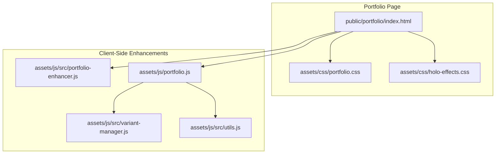
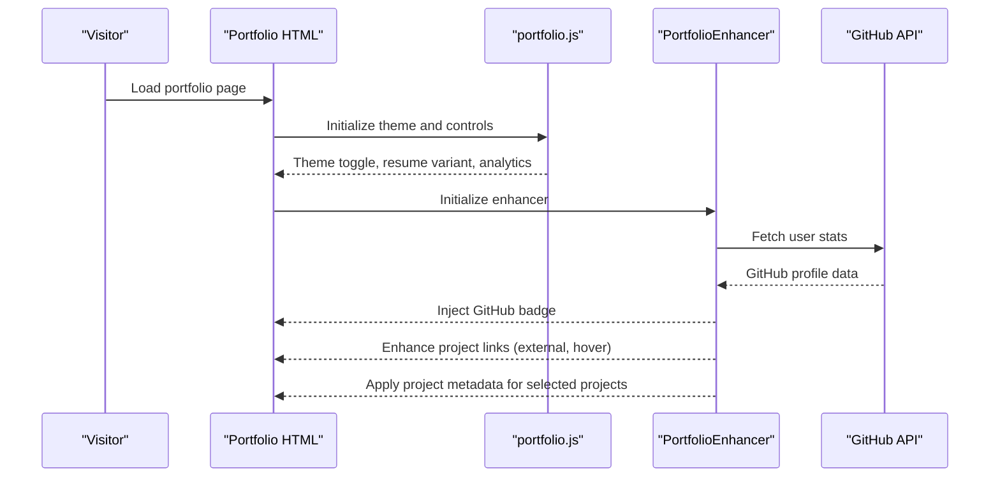
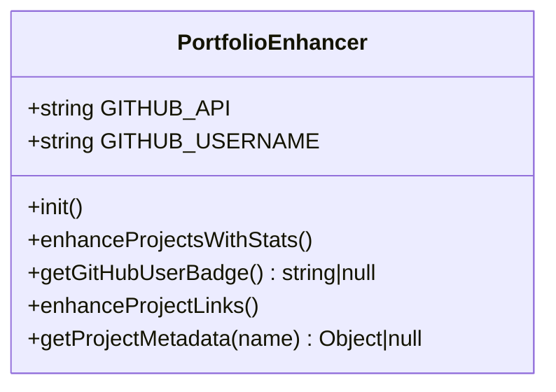
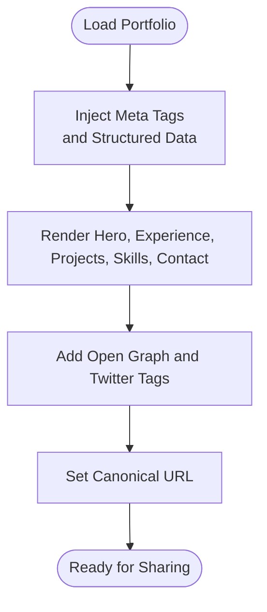
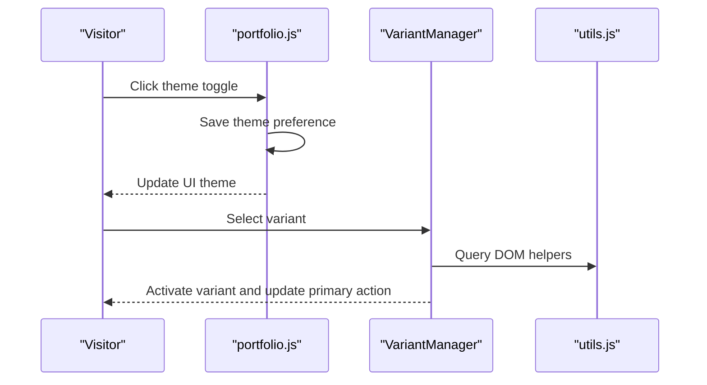
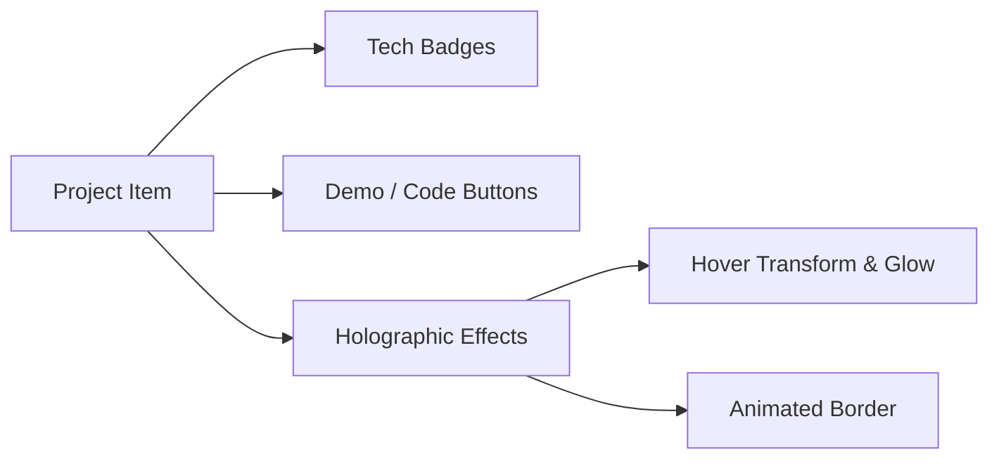
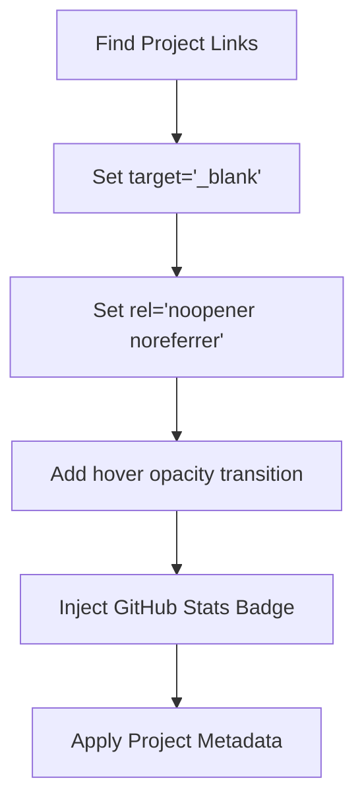
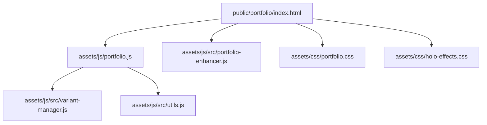

# Portfolio Format

<cite>
**Referenced Files in This Document**
- [portfolio-enhancer.js](file://assets/js/src/portfolio-enhancer.js)
- [portfolio.js](file://assets/js/portfolio.js)
- [index.html (Portfolio)](file://public/portfolio/index.html)
- [portfolio.css](file://assets/css/portfolio.css)
- [holo-effects.css](file://assets/css/holo-effects.css)
- [variant-manager.js](file://assets/js/src/variant-manager.js)
- [utils.js](file://assets/js/src/utils.js)
- [README.md](file://README.md)
</cite>

## Table of Contents

1. [Introduction](#introduction)
2. [Project Structure](#project-structure)
3. [Core Components](#core-components)
4. [Architecture Overview](#architecture-overview)
5. [Detailed Component Analysis](#detailed-component-analysis)
6. [Dependency Analysis](#dependency-analysis)
7. [Performance Considerations](#performance-considerations)
8. [Troubleshooting Guide](#troubleshooting-guide)
9. [Conclusion](#conclusion)

## Introduction

This document describes the Portfolio Format resume variant and its professional project showcase. It explains how the portfolio integrates live GitHub statistics, enhances project links for external platforms, and displays structured project metadata. It also covers the interactive theme switching, project showcase layouts, and social proof mechanisms such as structured data and Open Graph tags. Implementation details include the portfolio enhancer, project showcase layouts, and professional networking features integrated with GitHub repositories and external platforms.

## Project Structure

The Portfolio Format is implemented as a static HTML page with embedded metadata and structured data, complemented by client-side enhancements and CSS styling. The key elements are:

- Portfolio page with hero, experience, projects, skills, contact, and sidebar
- GitHub integration via a dedicated enhancer script
- Theme switching and resume variant selection
- Holographic effects for project cards
- SEO and social proof via meta tags and structured data

**Diagram sources**

- [index.html (Portfolio)](file://public/portfolio/index.html#L1-L644)
- [portfolio.js](file://assets/js/portfolio.js#L1-L174)
- [portfolio-enhancer.js](file://assets/js/src/portfolio-enhancer.js#L1-L105)
- [portfolio.css](file://assets/css/portfolio.css#L1-L1091)
- [holo-effects.css](file://assets/css/holo-effects.css#L1-L136)
- [variant-manager.js](file://assets/js/src/variant-manager.js#L1-L125)
- [utils.js](file://assets/js/src/utils.js#L1-L5)

**Section sources**

- [index.html (Portfolio)](file://public/portfolio/index.html#L1-L644)
- [portfolio.js](file://assets/js/portfolio.js#L1-L174)
- [portfolio-enhancer.js](file://assets/js/src/portfolio-enhancer.js#L1-L105)
- [portfolio.css](file://assets/css/portfolio.css#L1-L1091)
- [holo-effects.css](file://assets/css/holo-effects.css#L1-L136)
- [variant-manager.js](file://assets/js/src/variant-manager.js#L1-L125)
- [utils.js](file://assets/js/src/utils.js#L1-L5)

## Core Components

- Portfolio page with structured sections for hero, experience, projects, skills, and contact
- GitHub integration that fetches profile stats and injects a badge near the projects section
- External link optimization for project demos and code repositories
- Live metadata integration for selected projects via a metadata registry
- Theme switching with persistence and accessibility support
- Professional networking features including structured data and social proof tags

**Section sources**

- [index.html (Portfolio)](file://public/portfolio/index.html#L130-L465)
- [portfolio-enhancer.js](file://assets/js/src/portfolio-enhancer.js#L17-L33)
- [portfolio-enhancer.js](file://assets/js/src/portfolio-enhancer.js#L35-L53)
- [portfolio-enhancer.js](file://assets/js/src/portfolio-enhancer.js#L55-L72)
- [portfolio-enhancer.js](file://assets/js/src/portfolio-enhancer.js#L74-L94)
- [portfolio.js](file://assets/js/portfolio.js#L1-L88)

## Architecture Overview

The Portfolio Format combines static HTML with dynamic enhancements:

- The portfolio page defines the layout and metadata
- The enhancer script augments the page with GitHub stats and project metadata
- The theme manager and variant manager handle user preferences and navigation
- Holographic effects provide visual polish for project cards

**Diagram sources**

- [index.html (Portfolio)](file://public/portfolio/index.html#L1-L644)
- [portfolio.js](file://assets/js/portfolio.js#L1-L174)
- [portfolio-enhancer.js](file://assets/js/src/portfolio-enhancer.js#L17-L33)
- [portfolio-enhancer.js](file://assets/js/src/portfolio-enhancer.js#L35-L53)

## Detailed Component Analysis

### Portfolio Enhancer

The enhancer adds live GitHub statistics and improves project link UX:

- Fetches GitHub user profile and renders a badge with avatar, name, public repos, and followers
- Iterates project links to set target and rel attributes for safe external navigation
- Adds hover effects to project links
- Provides a metadata registry for selected projects (status, icon, highlights)

**Diagram sources**

- [portfolio-enhancer.js](file://assets/js/src/portfolio-enhancer.js#L6-L95)

**Section sources**

- [portfolio-enhancer.js](file://assets/js/src/portfolio-enhancer.js#L17-L33)
- [portfolio-enhancer.js](file://assets/js/src/portfolio-enhancer.js#L35-L53)
- [portfolio-enhancer.js](file://assets/js/src/portfolio-enhancer.js#L55-L72)
- [portfolio-enhancer.js](file://assets/js/src/portfolio-enhancer.js#L74-L94)

### Portfolio Page Layout and Social Proof

The portfolio page includes:

- Hero section with headline, subtitle, and action buttons
- Experience timeline
- Project showcase with badges, summaries, and links
- Skills grid
- Contact section with form and links
- Structured data (JSON-LD) for Person and Website
- Open Graph and Twitter meta tags
- Canonical URL and favicons

**Diagram sources**

- [index.html (Portfolio)](file://public/portfolio/index.html#L20-L83)
- [index.html (Portfolio)](file://public/portfolio/index.html#L32-L49)
- [index.html (Portfolio)](file://public/portfolio/index.html#L30-L31)

**Section sources**

- [index.html (Portfolio)](file://public/portfolio/index.html#L130-L465)
- [index.html (Portfolio)](file://public/portfolio/index.html#L20-L83)
- [index.html (Portfolio)](file://public/portfolio/index.html#L32-L49)
- [index.html (Portfolio)](file://public/portfolio/index.html#L30-L31)

### Theme and Variant Management

The portfolio supports:

- Theme switching with persistence (dark/light/auto)
- Resume variant toggling (print/ATS/digital)
- Analytics-style logging for resume actions
- Accessibility features (skip links, ARIA)

**Diagram sources**

- [portfolio.js](file://assets/js/portfolio.js#L1-L88)
- [variant-manager.js](file://assets/js/src/variant-manager.js#L68-L103)
- [utils.js](file://assets/js/src/utils.js#L2-L4)

**Section sources**

- [portfolio.js](file://assets/js/portfolio.js#L1-L88)
- [variant-manager.js](file://assets/js/src/variant-manager.js#L1-L125)
- [utils.js](file://assets/js/src/utils.js#L1-L5)

### Project Showcase Layouts and Visual Effects

Project cards use:

- Tech badges for stack identification
- Action buttons for live demo and code
- Holographic effects for hover states and animated borders
- Responsive design for mobile and desktop

**Diagram sources**

- [portfolio.css](file://assets/css/portfolio.css#L739-L864)
- [holo-effects.css](file://assets/css/holo-effects.css#L9-L74)

**Section sources**

- [portfolio.css](file://assets/css/portfolio.css#L739-L864)
- [holo-effects.css](file://assets/css/holo-effects.css#L1-L136)
- [index.html (Portfolio)](file://public/portfolio/index.html#L272-L465)

### External Link Optimization and Social Proof

External links are optimized for safety and UX:

- Target blank with noopener and noreferrer
- Hover opacity transitions
- Structured data for person and website
- Open Graph and Twitter cards
- Canonical URL for SEO

**Diagram sources**

- [portfolio-enhancer.js](file://assets/js/src/portfolio-enhancer.js#L55-L72)
- [portfolio-enhancer.js](file://assets/js/src/portfolio-enhancer.js#L35-L53)
- [portfolio-enhancer.js](file://assets/js/src/portfolio-enhancer.js#L74-L94)

**Section sources**

- [portfolio-enhancer.js](file://assets/js/src/portfolio-enhancer.js#L55-L72)
- [index.html (Portfolio)](file://public/portfolio/index.html#L20-L83)
- [index.html (Portfolio)](file://public/portfolio/index.html#L32-L49)
- [index.html (Portfolio)](file://public/portfolio/index.html#L30-L31)

## Dependency Analysis

The portfolio relies on:

- Portfolio HTML for structure and metadata
- Portfolio JS for theme, analytics logging, and form submission
- Portfolio Enhancer for GitHub integration and project metadata
- Variant Manager for resume variant selection
- Utilities for DOM helpers
- CSS for layout, theming, and visual effects

**Diagram sources**

- [index.html (Portfolio)](file://public/portfolio/index.html#L1-L644)
- [portfolio.js](file://assets/js/portfolio.js#L1-L174)
- [portfolio-enhancer.js](file://assets/js/src/portfolio-enhancer.js#L1-L105)
- [variant-manager.js](file://assets/js/src/variant-manager.js#L1-L125)
- [utils.js](file://assets/js/src/utils.js#L1-L5)
- [portfolio.css](file://assets/css/portfolio.css#L1-L1091)
- [holo-effects.css](file://assets/css/holo-effects.css#L1-L136)

**Section sources**

- [README.md](file://README.md#L104-L135)
- [portfolio.js](file://assets/js/portfolio.js#L1-L174)
- [portfolio-enhancer.js](file://assets/js/src/portfolio-enhancer.js#L1-L105)
- [variant-manager.js](file://assets/js/src/variant-manager.js#L1-L125)
- [utils.js](file://assets/js/src/utils.js#L1-L5)
- [portfolio.css](file://assets/css/portfolio.css#L1-L1091)
- [holo-effects.css](file://assets/css/holo-effects.css#L1-L136)

## Performance Considerations

- Minimize network requests: GitHub stats are fetched once per page load
- Lazy loading images: Project images use lazy loading attributes
- CSS-inlined for critical path: Theme and layout are styled efficiently
- Lightweight JS: Enhancer and theme manager are small and modular
- Accessibility-first: Focus management and skip links reduce reflow overhead

[No sources needed since this section provides general guidance]

## Troubleshooting Guide

Common issues and resolutions:

- GitHub stats not loading: Verify network connectivity and API availability; the enhancer logs errors to the console
- External links not opening safely: Confirm target and rel attributes are applied; ensure links are present in the projects section
- Theme toggle not persisting: Check localStorage availability and browser privacy settings
- Project metadata missing: Ensure project names match the metadata registry keys

**Section sources**

- [portfolio-enhancer.js](file://assets/js/src/portfolio-enhancer.js#L31-L32)
- [portfolio-enhancer.js](file://assets/js/src/portfolio-enhancer.js#L49-L52)
- [portfolio.js](file://assets/js/portfolio.js#L1-L26)

## Conclusion

The Portfolio Format provides a professional, accessible, and SEO-friendly showcase of projects and achievements. It integrates live GitHub statistics, enhances external links for safety and UX, and leverages structured data and social proof mechanisms. The modular JavaScript components enable easy customization while maintaining performance and accessibility standards.
