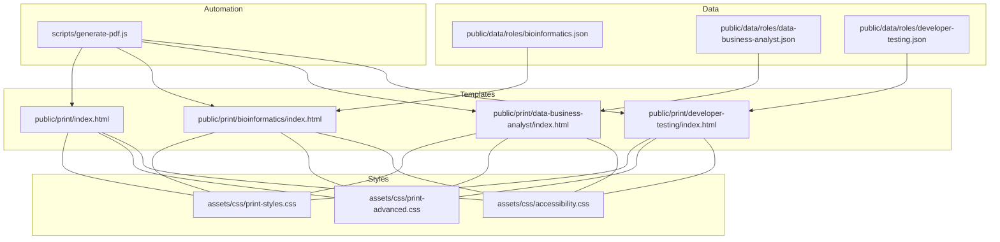
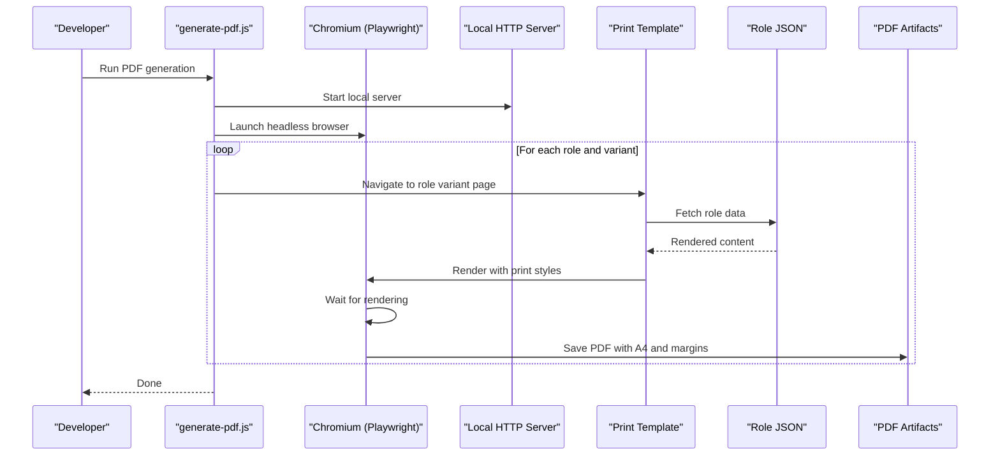
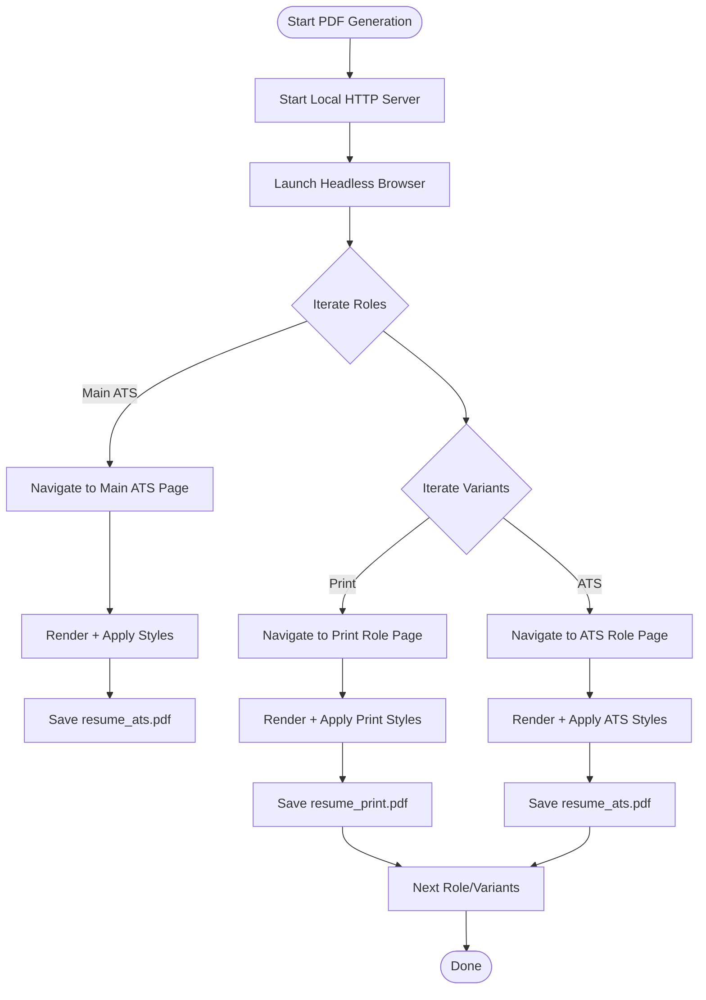
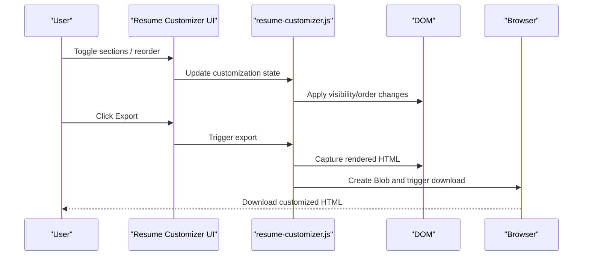
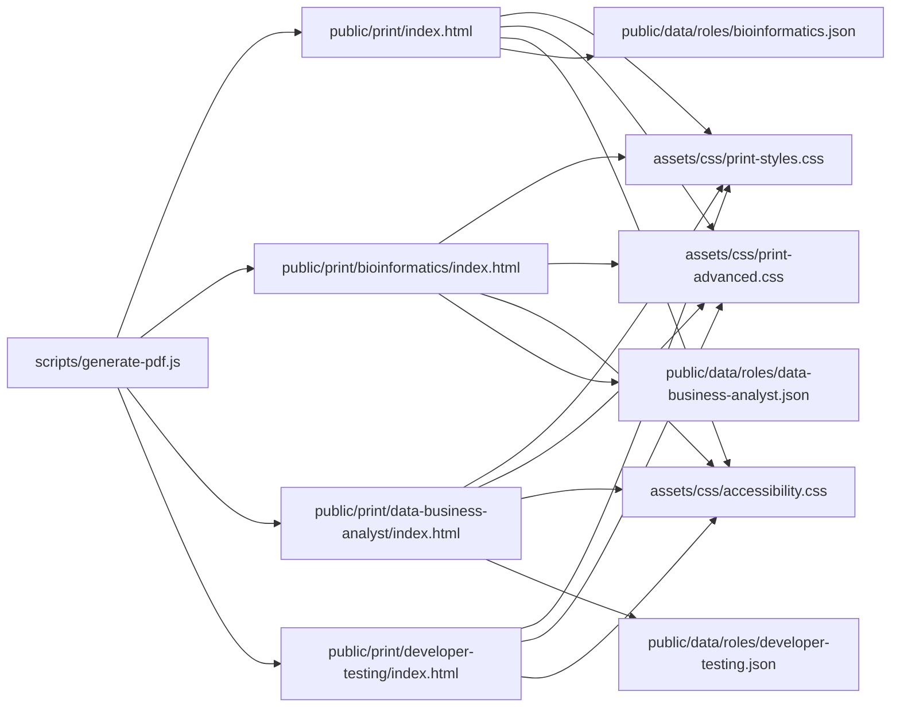

# Print Format

<cite>
**Referenced Files in This Document**
- [README.md](file://README.md)
- [generate-pdf.js](file://scripts/generate-pdf.js)
- [print-styles.css](file://assets/css/print-styles.css)
- [print-advanced.css](file://assets/css/print-advanced.css)
- [accessibility.css](file://assets/css/accessibility.css)
- [print/index.html](file://public/print/index.html)
- [print/bioinformatics/index.html](file://public/print/bioinformatics/index.html)
- [print/data-business-analyst/index.html](file://public/print/data-business-analyst/index.html)
- [print/developer-testing/index.html](file://public/print/developer-testing/index.html)
- [resume-customizer.js](file://assets/js/src/resume-customizer.js)
- [bioinformatics.json](file://public/data/roles/bioinformatics.json)
- [data-business-analyst.json](file://public/data/roles/data-business-analyst.json)
- [developer-testing.json](file://public/data/roles/developer-testing.json)
</cite>

## Table of Contents

1. [Introduction](#introduction)
2. [Project Structure](#project-structure)
3. [Core Components](#core-components)
4. [Architecture Overview](#architecture-overview)
5. [Detailed Component Analysis](#detailed-component-analysis)
6. [Dependency Analysis](#dependency-analysis)
7. [Performance Considerations](#performance-considerations)
8. [Troubleshooting Guide](#troubleshooting-guide)
9. [Conclusion](#conclusion)

## Introduction

This document explains the Print Format resume variant designed for traditional PDF resume generation. It covers print-specific layout optimizations, typography choices, content structuring for optimal print quality, the PDF generation pipeline, formatting rules, accessibility considerations for printed documents, role-specific print variations, content prioritization, export functionality, the template system, styling approaches, and quality assurance processes for print-ready documents.

## Project Structure

The Print Format is implemented as static HTML pages with embedded or linked styles tailored for print. Role-specific variants are generated from shared templates and role data. A dedicated script automates PDF generation using a headless browser.

**Diagram sources**

- [print/index.html](file://public/print/index.html#L1-L807)
- [print/bioinformatics/index.html](file://public/print/bioinformatics/index.html#L1-L472)
- [print/data-business-analyst/index.html](file://public/print/data-business-analyst/index.html#L1-L391)
- [print/developer-testing/index.html](file://public/print/developer-testing/index.html#L1-L391)
- [print-styles.css](file://assets/css/print-styles.css#L1-L110)
- [print-advanced.css](file://assets/css/print-advanced.css#L1-L173)
- [accessibility.css](file://assets/css/accessibility.css#L1-L148)
- [generate-pdf.js](file://scripts/generate-pdf.js#L1-L81)
- [bioinformatics.json](file://public/data/roles/bioinformatics.json#L1-L129)
- [data-business-analyst.json](file://public/data/roles/data-business-analyst.json#L1-L112)
- [developer-testing.json](file://public/data/roles/developer-testing.json#L1-L136)

**Section sources**

- [README.md](file://README.md#L104-L135)
- [generate-pdf.js](file://scripts/generate-pdf.js#L1-L81)

## Core Components

- Print templates: Role-specific HTML pages that embed or link print styles and render role data dynamically.
- Print styles: CSS modules that define A4 page sizing, typography, spacing, and print-specific optimizations.
- Automation: A script that launches a headless browser, navigates to each template, waits for rendering, and generates PDFs with precise margins and backgrounds.
- Data model: JSON files containing role metadata and content used to populate templates.
- Accessibility: Shared accessibility styles that remove non-essential UI for print and improve readability.

**Section sources**

- [print/index.html](file://public/print/index.html#L1-L807)
- [print/bioinformatics/index.html](file://public/print/bioinformatics/index.html#L1-L472)
- [print/data-business-analyst/index.html](file://public/print/data-business-analyst/index.html#L1-L391)
- [print/developer-testing/index.html](file://public/print/developer-testing/index.html#L1-L391)
- [print-styles.css](file://assets/css/print-styles.css#L1-L110)
- [print-advanced.css](file://assets/css/print-advanced.css#L1-L173)
- [accessibility.css](file://assets/css/accessibility.css#L1-L148)
- [generate-pdf.js](file://scripts/generate-pdf.js#L1-L81)
- [bioinformatics.json](file://public/data/roles/bioinformatics.json#L1-L129)
- [data-business-analyst.json](file://public/data/roles/data-business-analyst.json#L1-L112)
- [developer-testing.json](file://public/data/roles/developer-testing.json#L1-L136)

## Architecture Overview

The Print Format architecture centers on static HTML templates, role data, and a PDF generation pipeline. The pipeline uses a headless browser to render each template, apply print styles, and produce A4 PDFs with consistent margins and background printing.

**Diagram sources**

- [generate-pdf.js](file://scripts/generate-pdf.js#L5-L78)
- [print/index.html](file://public/print/index.html#L1-L807)
- [print/bioinformatics/index.html](file://public/print/bioinformatics/index.html#L1-L472)
- [print/data-business-analyst/index.html](file://public/print/data-business-analyst/index.html#L1-L391)
- [print/developer-testing/index.html](file://public/print/developer-testing/index.html#L1-L391)
- [bioinformatics.json](file://public/data/roles/bioinformatics.json#L1-L129)
- [data-business-analyst.json](file://public/data/roles/data-business-analyst.json#L1-L112)
- [developer-testing.json](file://public/data/roles/developer-testing.json#L1-L136)

## Detailed Component Analysis

### Print Templates and Content Structuring

- The main print template defines a two-column layout with a dark sidebar and light main content, optimized for A4 single-page printing. It includes print-specific media queries to reduce margins, adjust typography, and hide non-print elements.
- Role-specific templates embed a renderer that fetches role JSON and populates sections such as Professional Summary, Work Experience, Projects, Education, and optional Publications/Awards. They conditionally show sections based on data presence.

Key characteristics:

- A4 page sizing and tight margins for single-page fit.
- Typography scales reduced for print readability.
- Section ordering and visibility controlled by data presence.
- Links and icons styled for print clarity.

**Section sources**

- [print/index.html](file://public/print/index.html#L16-L449)
- [print/bioinformatics/index.html](file://public/print/bioinformatics/index.html#L12-L472)
- [print/data-business-analyst/index.html](file://public/print/data-business-analyst/index.html#L12-L391)
- [print/developer-testing/index.html](file://public/print/developer-testing/index.html#L12-L391)

### Print Styles and Typography

- Base print styles define A4 page size, minimal margins, and a clean sans-serif font stack for legibility.
- Advanced print styles remove non-printable UI, enforce page breaks, and optimize spacing for consistent pagination across browsers.
- Typography choices emphasize readability with reduced font sizes and line heights suitable for paper.

Optimization highlights:

- @page sizing and margins for A4.
- Media print rules to hide navigation and buttons.
- Page break controls to avoid orphaned headings and sections.
- Color-adjustment for crisp black-and-white prints.

**Section sources**

- [print-styles.css](file://assets/css/print-styles.css#L1-L110)
- [print-advanced.css](file://assets/css/print-advanced.css#L6-L134)

### Accessibility Considerations for Print

- Accessibility styles ensure focus visibility and sufficient contrast for screen viewing, while print media removes skip links and decorative elements.
- Reduced motion preferences are respected in the base styles, and print media avoids animations.

Practical outcomes:

- Clean print output without interactive elements.
- Consistent color and contrast for readability.

**Section sources**

- [accessibility.css](file://assets/css/accessibility.css#L6-L101)

### PDF Generation Pipeline

- The automation script starts a local HTTP server, launches a headless Chromium instance, and iterates through role variants to generate PDFs.
- It sets A4 format, enables background printing, and applies millimeter-based margins for precise print alignment.
- Output is organized per role and variant, with a main ATS variant included alongside print variants.

**Diagram sources**

- [generate-pdf.js](file://scripts/generate-pdf.js#L5-L78)

**Section sources**

- [generate-pdf.js](file://scripts/generate-pdf.js#L1-L81)

### Role-Specific Print Variations

- Each role variant uses the same structural template but renders role-specific data from JSON. Sections are shown/hidden based on data availability.
- Bioinformatics variant includes optional Publications and Awards sections; others include these sections conditionally.

Implementation details:

- Renderer functions assemble HTML for jobs, education, projects, skills, and optional sections.
- Conditional visibility toggled by data presence.

**Section sources**

- [print/bioinformatics/index.html](file://public/print/bioinformatics/index.html#L373-L469)
- [print/data-business-analyst/index.html](file://public/print/data-business-analyst/index.html#L287-L388)
- [print/developer-testing/index.html](file://public/print/developer-testing/index.html#L287-L388)
- [bioinformatics.json](file://public/data/roles/bioinformatics.json#L86-L99)
- [data-business-analyst.json](file://public/data/roles/data-business-analyst.json#L75-L82)
- [developer-testing.json](file://public/data/roles/developer-testing.json#L89-L97)

### Content Prioritization and Export Functionality

- The Resume Customizer allows users to toggle sections, reorder them, export a customized HTML, share configurations, and reset to defaults.
- Export produces a downloadable HTML file preserving current styles and rendered content for immediate print or PDF conversion.

**Diagram sources**

- [resume-customizer.js](file://assets/js/src/resume-customizer.js#L204-L234)

**Section sources**

- [resume-customizer.js](file://assets/js/src/resume-customizer.js#L1-L307)

### Template System and Styling Approaches

- Templates embed print styles directly and rely on shared print CSS for consistent behavior across variants.
- Advanced print CSS handles cross-browser differences (e.g., Firefox and Chrome adjustments) and ensures color fidelity for black-and-white printing.

Styling strategies:

- Minimalist design with high contrast for print.
- Grid and flex layouts optimized for A4 single-page composition.
- Media queries for print and landscape orientation.

**Section sources**

- [print/index.html](file://public/print/index.html#L16-L449)
- [print-advanced.css](file://assets/css/print-advanced.css#L136-L173)

### Quality Assurance Processes for Print-Ready Documents

- Automated PDF generation validates that each role variant renders consistently and fits A4 with acceptable margins.
- CI/CD pipelines regenerate PDFs on data changes, ensuring print artifacts remain synchronized with content updates.
- Accessibility and print media rules prevent interactive elements from appearing in print output.

**Section sources**

- [README.md](file://README.md#L29-L41)
- [print-advanced.css](file://assets/css/print-advanced.css#L6-L134)

## Dependency Analysis

The Print Format relies on a small set of cohesive dependencies: templates depend on print styles and role data; the automation script depends on the templates and a local server; the customizer enhances user-driven customization.

**Diagram sources**

- [generate-pdf.js](file://scripts/generate-pdf.js#L19-L67)
- [print/index.html](file://public/print/index.html#L1-L807)
- [print/bioinformatics/index.html](file://public/print/bioinformatics/index.html#L1-L472)
- [print/data-business-analyst/index.html](file://public/print/data-business-analyst/index.html#L1-L391)
- [print/developer-testing/index.html](file://public/print/developer-testing/index.html#L1-L391)
- [print-styles.css](file://assets/css/print-styles.css#L1-L110)
- [print-advanced.css](file://assets/css/print-advanced.css#L1-L173)
- [accessibility.css](file://assets/css/accessibility.css#L1-L148)
- [bioinformatics.json](file://public/data/roles/bioinformatics.json#L1-L129)
- [data-business-analyst.json](file://public/data/roles/data-business-analyst.json#L1-L112)
- [developer-testing.json](file://public/data/roles/developer-testing.json#L1-L136)

**Section sources**

- [generate-pdf.js](file://scripts/generate-pdf.js#L1-L81)
- [print/index.html](file://public/print/index.html#L1-L807)
- [print-styles.css](file://assets/css/print-styles.css#L1-L110)
- [print-advanced.css](file://assets/css/print-advanced.css#L1-L173)
- [accessibility.css](file://assets/css/accessibility.css#L1-L148)
- [bioinformatics.json](file://public/data/roles/bioinformatics.json#L1-L129)
- [data-business-analyst.json](file://public/data/roles/data-business-analyst.json#L1-L112)
- [developer-testing.json](file://public/data/roles/developer-testing.json#L1-L136)

## Performance Considerations

- Single-page A4 layout minimizes pagination and reduces the risk of page breaks disrupting content.
- Tight margins and reduced font sizes help fit content on one page.
- Background printing is enabled to preserve header colors and visual emphasis.
- Media print rules prevent unnecessary reflows and repaints during printing.

[No sources needed since this section provides general guidance]

## Troubleshooting Guide

Common issues and resolutions:

- Content overflows onto multiple pages:
  - Verify A4 margins and reduce font sizes or line heights in print styles.
  - Ensure page break rules are applied to sections and headings.
- Links and icons appear in print:
  - Confirm print media rules hide non-essential elements and remove underlines.
- Colors differ in print:
  - Enable background printing and use exact color values for print media.
- PDFs not generated:
  - Check local server startup and network idle conditions before PDF capture.
  - Ensure role data loads and templates render before capturing PDF.

**Section sources**

- [print-advanced.css](file://assets/css/print-advanced.css#L6-L134)
- [generate-pdf.js](file://scripts/generate-pdf.js#L19-L78)

## Conclusion

The Print Format provides a robust, automated solution for generating high-quality, print-ready PDFs. Its templates, print styles, and automation pipeline ensure consistent, accessible, and printer-friendly resumes across role variants. With role-specific data binding, content prioritization, and export capabilities, it supports both automated generation and user-driven customization for professional print distribution.
