# Resume Management System

<cite>
**Referenced Files in This Document**
- [index.html](file://index.html)
- [variant-manager.js](file://assets/js/src/variant-manager.js)
- [resume-customizer.js](file://assets/js/src/resume-customizer.js)
- [print-styles.css](file://assets/css/print-styles.css)
- [ats-styles.css](file://assets/css/ats-styles.css)
- [portfolio.css](file://assets/css/portfolio.css)
- [resume-customizer-styles.css](file://assets/css/resume-customizer-styles.css)
- [print/index.html](file://public/print/index.html)
- [digital/index.html](file://public/digital/index.html)
- [portfolio/index.html](file://public/portfolio/index.html)
- [ats/index.html](file://public/ats/index.html)
- [developer-testing.json](file://public/data/roles/developer-testing.json)
- [data-business-analyst.json](file://public/data/roles/data-business-analyst.json)
- [bioinformatics.json](file://public/data/roles/bioinformatics.json)
</cite>

## Table of Contents

1. [Introduction](#introduction)
2. [Project Structure](#project-structure)
3. [Core Components](#core-components)
4. [Architecture Overview](#architecture-overview)
5. [Detailed Component Analysis](#detailed-component-analysis)
6. [Dependency Analysis](#dependency-analysis)
7. [Performance Considerations](#performance-considerations)
8. [Troubleshooting Guide](#troubleshooting-guide)
9. [Conclusion](#conclusion)

## Introduction

This document describes the multi-format resume architecture used to generate and manage four distinct resume variants: Print, ATS, Digital, and Portfolio. It explains how the VariantManager controls format switching, how resume data is structured and optimized per role, and how templates and styles enable automated generation. It also covers customization features, export capabilities, and practical examples for selecting and tailoring resumes.

## Project Structure

The system centers around a landing page that links to four resume variants and a data-driven rendering engine that populates each variant from role-specific JSON datasets. The VariantManager orchestrates user selection and primary action updates across variants.

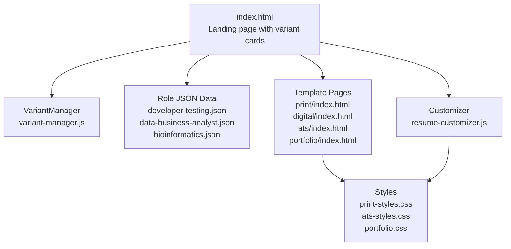

**Diagram sources**

- [index.html](file://index.html#L192-L390)
- [variant-manager.js](file://assets/js/src/variant-manager.js#L4-L124)
- [resume-customizer.js](file://assets/js/src/resume-customizer.js#L6-L306)
- [print-styles.css](file://assets/css/print-styles.css#L1-L110)
- [ats-styles.css](file://assets/css/ats-styles.css#L1-L46)
- [portfolio.css](file://assets/css/portfolio.css#L1-L1086)
- [print/index.html](file://public/print/index.html#L1-L807)
- [digital/index.html](file://public/digital/index.html#L1-L1242)
- [ats/index.html](file://public/ats/index.html#L1-L553)
- [portfolio/index.html](file://public/portfolio/index.html#L1-L624)

**Section sources**

- [index.html](file://index.html#L192-L390)

## Core Components

- VariantManager: Manages user selection among Print, ATS, Digital, and Portfolio variants; updates primary action links dynamically.
- ResumeCustomizer: Provides a UI to toggle and reorder resume sections, export customized HTML, and share configurations.
- Data Models: Role-specific JSON datasets define metadata, sections, and metrics for each variant.
- Templates and Styles: Static HTML templates and CSS define layout and presentation for each variant.

**Section sources**

- [variant-manager.js](file://assets/js/src/variant-manager.js#L4-L124)
- [resume-customizer.js](file://assets/js/src/resume-customizer.js#L6-L306)
- [developer-testing.json](file://public/data/roles/developer-testing.json#L1-L136)
- [data-business-analyst.json](file://public/data/roles/data-business-analyst.json#L1-L112)
- [bioinformatics.json](file://public/data/roles/bioinformatics.json#L1-L129)

## Architecture Overview

The resume system follows a data-driven rendering pattern:

- Landing page presents variant cards and role-specific options.
- VariantManager listens for user interactions and sets active variant.
- Templates are populated from role JSON data; styles tailor presentation per variant.
- Customizer augments the Digital variant with runtime UI controls and exports.

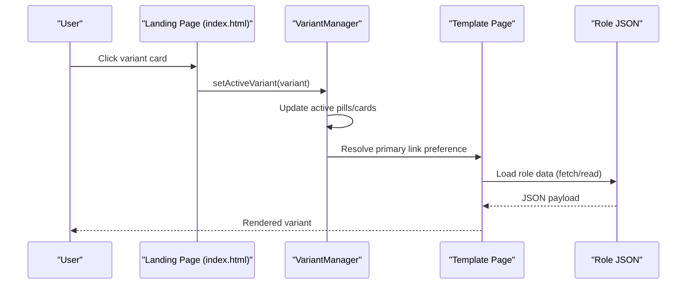

**Diagram sources**

- [index.html](file://index.html#L216-L261)
- [variant-manager.js](file://assets/js/src/variant-manager.js#L68-L123)
- [ats/index.html](file://public/ats/index.html#L483-L526)

## Detailed Component Analysis

### VariantManager

Responsibilities:

- Bind click and keyboard events to variant selection.
- Toggle active state across UI elements.
- Resolve preferred download/view link per variant and update primary action.

Key behaviors:

- Maintains a variant map with selector preferences for each variant.
- Updates aria attributes and focus behavior for accessibility.
- Falls back to Portfolio when a variant lacks a preferred link.

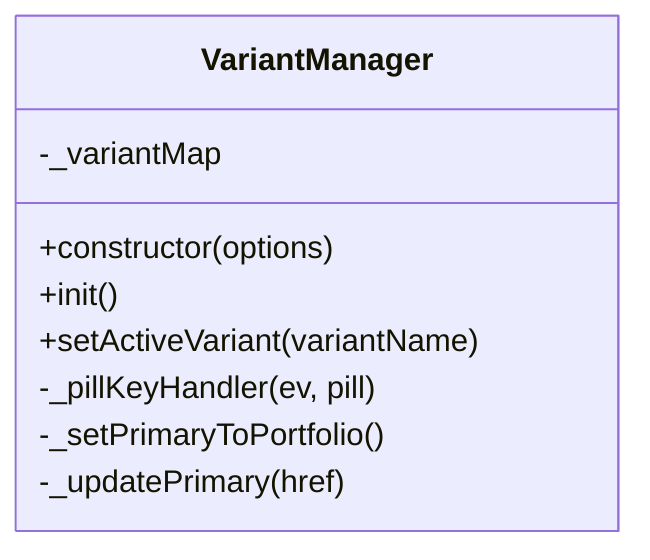

**Diagram sources**

- [variant-manager.js](file://assets/js/src/variant-manager.js#L4-L124)

**Section sources**

- [variant-manager.js](file://assets/js/src/variant-manager.js#L25-L123)
- [index.html](file://index.html#L216-L261)

### ResumeCustomizer

Responsibilities:

- Dynamically constructs a customization panel with toggles and drag-and-drop reordering.
- Applies visibility and ordering changes to resume sections.
- Exports current configuration as downloadable HTML and shares via encoded URL.

Key behaviors:

- Persists configuration to localStorage and supports URL-based sharing.
- Renders section toggles and sortable lists for enabled sections.
- Exports a complete HTML document with embedded styles and current resume markup.

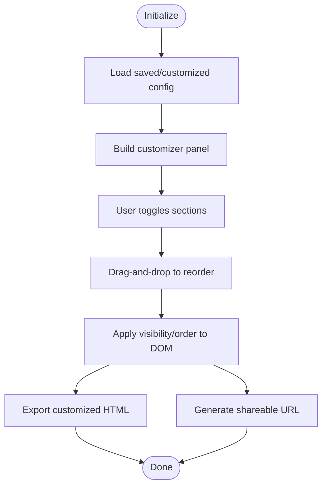

**Diagram sources**

- [resume-customizer.js](file://assets/js/src/resume-customizer.js#L23-L296)

**Section sources**

- [resume-customizer.js](file://assets/js/src/resume-customizer.js#L23-L296)
- [resume-customizer-styles.css](file://assets/css/resume-customizer-styles.css#L1-L406)

### Data Models and Role-Specific Optimizations

Each role dataset defines:

- Metadata (name, title, contact info, portfolio link).
- Sections (summary, work experience, projects, skills, education, publications, awards, languages, certifications).
- Keywords and metrics tailored for ATS parsing and analytics.

Examples:

- Developer & Testing Engineer: Emphasizes full-stack development, testing automation, and QA tools.
- Data & Business Analyst: Highlights analytics, SQL, visualization, and business insights.
- Bioinformatics Scientist: Focuses on computational biology, protein modeling, and research.

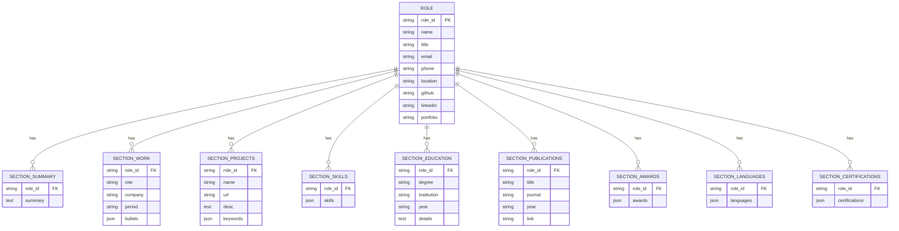

**Diagram sources**

- [developer-testing.json](file://public/data/roles/developer-testing.json#L1-L136)
- [data-business-analyst.json](file://public/data/roles/data-business-analyst.json#L1-L112)
- [bioinformatics.json](file://public/data/roles/bioinformatics.json#L1-L129)

**Section sources**

- [developer-testing.json](file://public/data/roles/developer-testing.json#L1-L136)
- [data-business-analyst.json](file://public/data/roles/data-business-analyst.json#L1-L112)
- [bioinformatics.json](file://public/data/roles/bioinformatics.json#L1-L129)

### Variant Implementations

#### Print Resume

- Purpose: Single-page, A4-friendly layout for offline printing.
- Layout: Two-column sidebar and main content; compact typography and minimal visuals.
- Content: Uses role JSON to populate sections; optimized for readability and print constraints.
- Export: PDF and HTML views available.

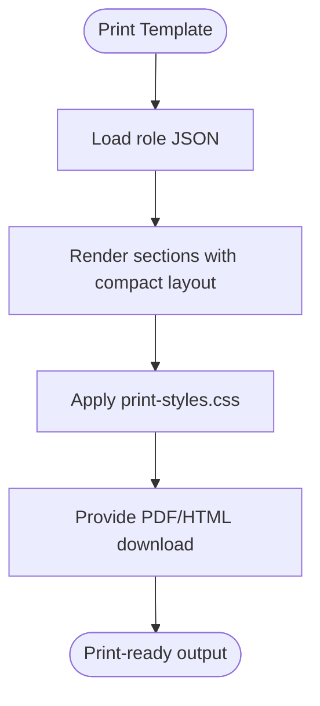

**Diagram sources**

- [print/index.html](file://public/print/index.html#L1-L807)
- [print-styles.css](file://assets/css/print-styles.css#L1-L110)

**Section sources**

- [print/index.html](file://public/print/index.html#L1-L807)
- [print-styles.css](file://assets/css/print-styles.css#L1-L110)

#### ATS Resume

- Purpose: Machine-readable, keyword-rich format for Applicant Tracking Systems.
- Layout: Clean, single-column, semantic HTML with hidden keyword blocks.
- Content: Populated via JSON fetch; includes dedicated keywords field for ATS parsing.
- Export: DOCX and PDF downloads; optional comparison features.

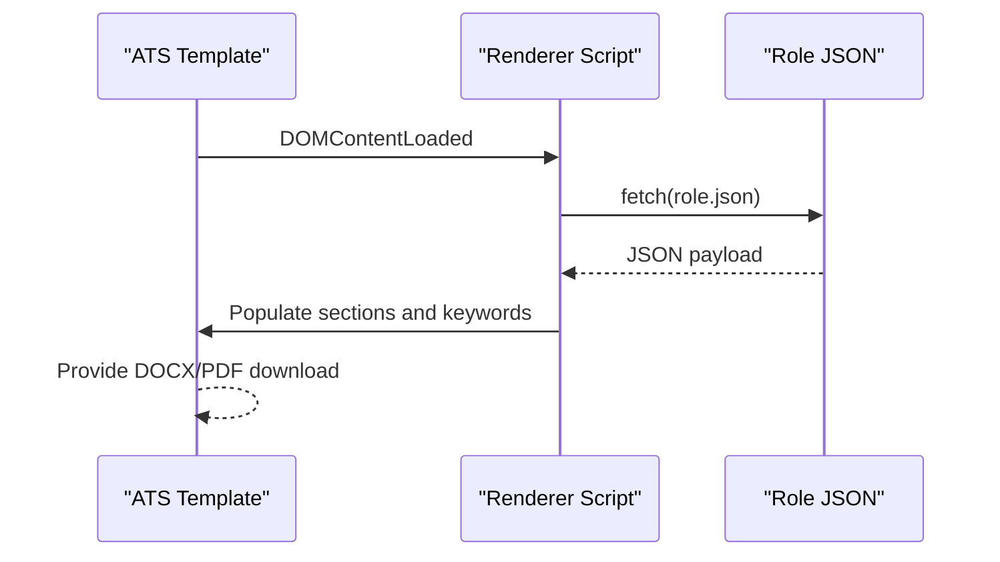

**Diagram sources**

- [ats/index.html](file://public/ats/index.html#L400-L526)

**Section sources**

- [ats/index.html](file://public/ats/index.html#L1-L553)
- [ats-styles.css](file://assets/css/ats-styles.css#L1-L46)

#### Digital Resume

- Purpose: Interactive, screen-optimized resume with theme support and animations.
- Layout: Flexible grid with sidebar and main content; responsive design.
- Content: Uses role JSON to render sections; enhanced with theme toggler and accessibility features.
- Export: Primarily HTML; can be printed or captured.

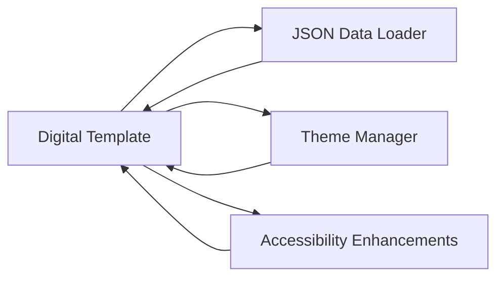

**Diagram sources**

- [digital/index.html](file://public/digital/index.html#L1-L1242)
- [portfolio.css](file://assets/css/portfolio.css#L1-L1086)

**Section sources**

- [digital/index.html](file://public/digital/index.html#L1-L1242)
- [portfolio.css](file://assets/css/portfolio.css#L1-L1086)

#### Portfolio Site

- Purpose: Showcase projects and professional narrative alongside resume variants.
- Layout: Main content with sidebar; variant toggle for Print/ATS.
- Content: Integrates resume variants and project showcases; includes contact form and social links.

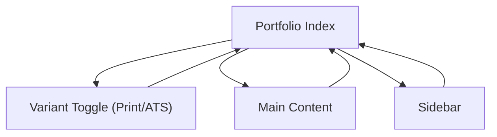

**Diagram sources**

- [portfolio/index.html](file://public/portfolio/index.html#L1-L624)

**Section sources**

- [portfolio/index.html](file://public/portfolio/index.html#L1-L624)

### Format Switching Mechanisms

- Landing page cards trigger VariantManager to set active variant and update primary action link.
- Portfolio variant exposes a toggle between Print and ATS with pre-defined links.
- ATS template includes a renderer script that loads role JSON and populates sections.

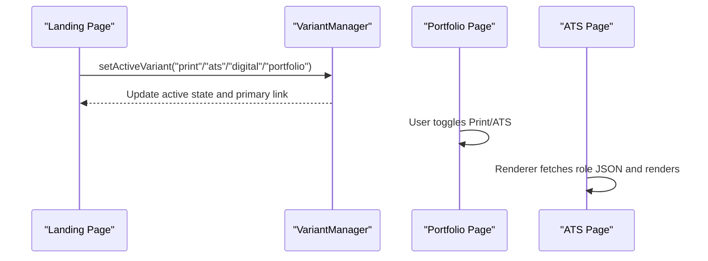

**Diagram sources**

- [index.html](file://index.html#L216-L261)
- [variant-manager.js](file://assets/js/src/variant-manager.js#L68-L123)
- [portfolio/index.html](file://public/portfolio/index.html#L125-L166)
- [ats/index.html](file://public/ats/index.html#L483-L526)

**Section sources**

- [index.html](file://index.html#L216-L261)
- [variant-manager.js](file://assets/js/src/variant-manager.js#L68-L123)
- [portfolio/index.html](file://public/portfolio/index.html#L125-L166)
- [ats/index.html](file://public/ats/index.html#L483-L526)

### Template Systems and Automated Generation

- Templates are static HTML pages with embedded CSS and optional scripts.
- Data binding occurs via:
  - JSON fetch in ATS template for dynamic population.
  - Role JSON files under public/data/roles/.
- Customizer augments Digital variant with runtime UI and export logic.

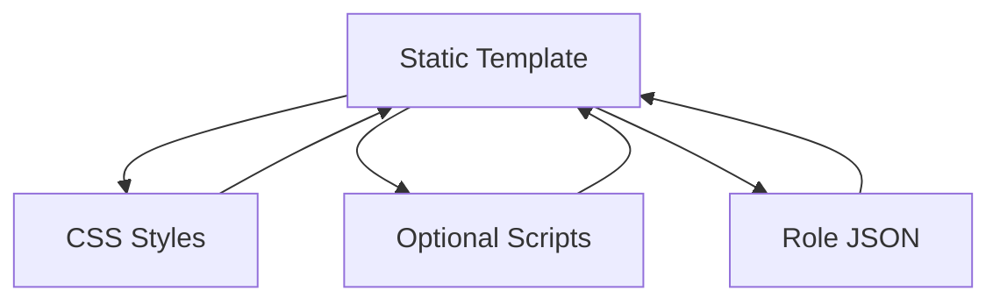

**Diagram sources**

- [ats/index.html](file://public/ats/index.html#L483-L526)
- [developer-testing.json](file://public/data/roles/developer-testing.json#L1-L136)
- [resume-customizer.js](file://assets/js/src/resume-customizer.js#L204-L234)

**Section sources**

- [ats/index.html](file://public/ats/index.html#L483-L526)
- [developer-testing.json](file://public/data/roles/developer-testing.json#L1-L136)
- [resume-customizer.js](file://assets/js/src/resume-customizer.js#L204-L234)

### Examples: Resume Customization, Variant Selection, and Format-Specific Features

- Customize Digital Resume:
  - Open the customization panel, toggle sections, reorder items, and export as HTML.
  - Share the current configuration via a generated URL.
- Select Variant:
  - On the landing page, click a variant card to activate it; the primary action updates accordingly.
  - In Portfolio, use the Print/ATS toggle to switch between formats.
- Format-Specific Features:
  - Print: Compact layout, A4 sizing, print media queries.
  - ATS: Semantic structure, keyword blocks, DOCX/PDF exports.
  - Digital: Theme toggle, accessibility enhancements, responsive design.
  - Portfolio: Project showcase, contact form, variant integration.

**Section sources**

- [resume-customizer.js](file://assets/js/src/resume-customizer.js#L23-L296)
- [variant-manager.js](file://assets/js/src/variant-manager.js#L68-L123)
- [print-styles.css](file://assets/css/print-styles.css#L1-L110)
- [ats-styles.css](file://assets/css/ats-styles.css#L1-L46)
- [portfolio.css](file://assets/css/portfolio.css#L1-L1086)
- [index.html](file://index.html#L216-L261)
- [portfolio/index.html](file://public/portfolio/index.html#L125-L166)

## Dependency Analysis

- VariantManager depends on DOM elements for variant cards and pills; it resolves preferred links per variant.
- ATS template depends on role JSON availability and renderer script to populate content.
- Customizer depends on DOM sections and localStorage for persistence and sharing.
- Templates depend on role JSON and CSS for rendering and styling.

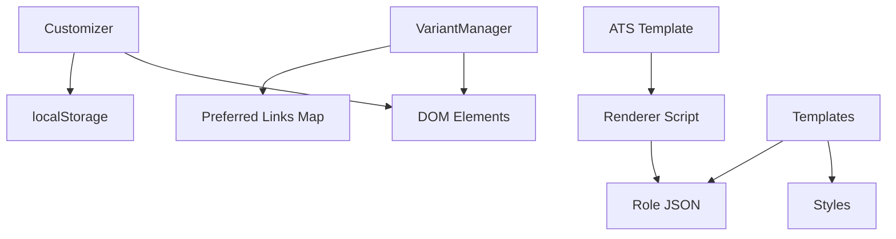

**Diagram sources**

- [variant-manager.js](file://assets/js/src/variant-manager.js#L4-L124)
- [ats/index.html](file://public/ats/index.html#L400-L526)
- [resume-customizer.js](file://assets/js/src/resume-customizer.js#L23-L296)

**Section sources**

- [variant-manager.js](file://assets/js/src/variant-manager.js#L4-L124)
- [ats/index.html](file://public/ats/index.html#L400-L526)
- [resume-customizer.js](file://assets/js/src/resume-customizer.js#L23-L296)

## Performance Considerations

- Minimize DOM manipulation during customization by batching updates and applying order changes efficiently.
- Use CSS media queries and print styles to optimize rendering for Print and ATS formats.
- Defer non-critical scripts and lazy-load images in Portfolio and Digital variants to improve initial load times.
- Cache role JSON data where appropriate and leverage browser caching for static assets.

## Troubleshooting Guide

- Variant selection not updating:
  - Verify active pills and cards exist and that setActiveVariant receives a valid variant name.
  - Confirm the variant map includes the selected variant and that preferred links resolve correctly.
- ATS content not rendering:
  - Ensure role JSON is accessible and the renderer script executes after DOMContentLoaded.
  - Check that the keywords and section blocks are present in the template.
- Customizer not persisting or exporting:
  - Confirm localStorage is enabled and accessible.
  - Validate that the export function constructs a complete HTML document and triggers a download.

**Section sources**

- [variant-manager.js](file://assets/js/src/variant-manager.js#L68-L123)
- [ats/index.html](file://public/ats/index.html#L483-L526)
- [resume-customizer.js](file://assets/js/src/resume-customizer.js#L23-L296)

## Conclusion

The resume management system provides a cohesive, data-driven approach to generating four distinct resume variants. VariantManager and ResumeCustomizer offer intuitive user controls, while role-specific JSON datasets and template/style systems enable automated, consistent generation across formats. This architecture supports rapid customization, efficient export, and role-specific optimization for diverse hiring scenarios.
