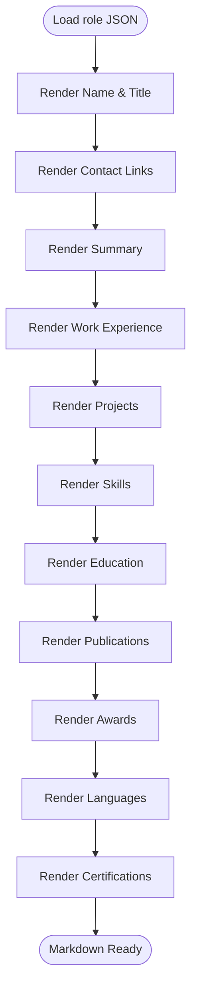

# Role-Specific Optimizations

<cite>
**Referenced Files in This Document**
- [bioinformatics.json](file://public/data/roles/bioinformatics.json)
- [data-business-analyst.json](file://public/data/roles/data-business-analyst.json)
- [developer-testing.json](file://public/data/roles/developer-testing.json)
- [bioinformatics.md](file://public/markdown/bioinformatics.md)
- [data-business-analyst.md](file://public/markdown/data-business-analyst.md)
- [developer-testing.md](file://public/markdown/developer-testing.md)
- [resume.md](file://public/markdown/resume.md)
- [generate-markdown.js](file://scripts/generate-markdown.js)
- [bioinformatics.html](file://public/email/bioinformatics.html)
- [data-business-analyst.html](file://public/email/data-business-analyst.html)
- [developer-testing.html](file://public/email/developer-testing.html)
- [resume.html](file://public/email/resume.html)
- [resume-customizer.js](file://assets/js/src/resume-customizer.js)
- [variant-manager.js](file://assets/js/src/variant-manager.js)
- [package.json](file://package.json)
- [README.md](file://README.md)
</cite>

## Table of Contents

1. [Introduction](#introduction)
2. [Project Structure](#project-structure)
3. [Core Components](#core-components)
4. [Architecture Overview](#architecture-overview)
5. [Detailed Component Analysis](#detailed-component-analysis)
6. [Dependency Analysis](#dependency-analysis)
7. [Performance Considerations](#performance-considerations)
8. [Troubleshooting Guide](#troubleshooting-guide)
9. [Conclusion](#conclusion)
10. [Appendices](#appendices)

## Introduction

This document explains the role-specific resume optimization system designed for three specialized career tracks: Bioinformatics, Data Business Analyst, and Developer/Testing. It covers the JSON data models, Markdown templates, automated generation processes, and the content management system that enables role-based adaptation, keyword optimization, and format customization. The goal is to help users tailor resumes for ATS systems, print, digital delivery, and email while highlighting domain-relevant keywords and skills.

## Project Structure

The system organizes role-specific content into:

- JSON data models per role under public/data/roles
- Markdown templates per role under public/markdown
- Email-optimized HTML variants under public/email
- Automation scripts under scripts
- Runtime customization UI under assets/js/src

**Diagram sources**

- [bioinformatics.json](file://public/data/roles/bioinformatics.json#L1-L129)
- [data-business-analyst.json](file://public/data/roles/data-business-analyst.json#L1-L112)
- [developer-testing.json](file://public/data/roles/developer-testing.json#L1-L136)
- [bioinformatics.md](file://public/markdown/bioinformatics.md#L1-L85)
- [data-business-analyst.md](file://public/markdown/data-business-analyst.md#L1-L78)
- [developer-testing.md](file://public/markdown/developer-testing.md#L1-L91)
- [resume.md](file://public/markdown/resume.md#L1-L91)
- [generate-markdown.js](file://scripts/generate-markdown.js#L1-L173)
- [bioinformatics.html](file://public/email/bioinformatics.html#L1-L229)
- [data-business-analyst.html](file://public/email/data-business-analyst.html#L1-L221)
- [developer-testing.html](file://public/email/developer-testing.html#L1-L247)
- [resume.html](file://public/email/resume.html#L1-L247)
- [resume-customizer.js](file://assets/js/src/resume-customizer.js#L1-L307)
- [variant-manager.js](file://assets/js/src/variant-manager.js#L1-L125)

**Section sources**

- [README.md](file://README.md#L104-L135)
- [package.json](file://package.json#L5-L24)

## Core Components

- Role JSON models define metadata, summary, work experience, projects, skills, education, publications, awards, languages, certifications, keywords, and ATS keywords plus metrics.
- Markdown templates standardize section ordering and formatting for each role.
- Automation script generates Markdown from JSON and also produces a main resume variant.
- Email HTML templates mirror Markdown content for email delivery.
- Runtime customization allows users to toggle and reorder resume sections and export customized HTML.
- Variant manager selects active delivery variant (print, ATS, digital, portfolio) and updates primary action links.

**Section sources**

- [bioinformatics.json](file://public/data/roles/bioinformatics.json#L1-L129)
- [data-business-analyst.json](file://public/data/roles/data-business-analyst.json#L1-L112)
- [developer-testing.json](file://public/data/roles/developer-testing.json#L1-L136)
- [bioinformatics.md](file://public/markdown/bioinformatics.md#L1-L85)
- [data-business-analyst.md](file://public/markdown/data-business-analyst.md#L1-L78)
- [developer-testing.md](file://public/markdown/developer-testing.md#L1-L91)
- [generate-markdown.js](file://scripts/generate-markdown.js#L1-L173)
- [resume-customizer.js](file://assets/js/src/resume-customizer.js#L1-L307)
- [variant-manager.js](file://assets/js/src/variant-manager.js#L1-L125)

## Architecture Overview

The system follows a data-first pipeline: role JSON feeds Markdown templates, which are then transformed into email-ready HTML. Users can further customize the rendered HTML at runtime, and the variant manager controls which delivery channel is prominently presented.

**Diagram sources**

- [generate-markdown.js](file://scripts/generate-markdown.js#L131-L173)
- [bioinformatics.md](file://public/markdown/bioinformatics.md#L1-L85)
- [data-business-analyst.md](file://public/markdown/data-business-analyst.md#L1-L78)
- [developer-testing.md](file://public/markdown/developer-testing.md#L1-L91)
- [bioinformatics.html](file://public/email/bioinformatics.html#L1-L229)
- [data-business-analyst.html](file://public/email/data-business-analyst.html#L1-L221)
- [developer-testing.html](file://public/email/developer-testing.html#L1-L247)
- [resume-customizer.js](file://assets/js/src/resume-customizer.js#L204-L234)
- [variant-manager.js](file://assets/js/src/variant-manager.js#L68-L103)

## Detailed Component Analysis

### Role JSON Data Models

Each role JSON encapsulates:

- meta: name, title, contact info, role identifier
- summary: concise professional narrative
- work_experience: array of jobs with bullets
- projects: array with optional URLs and keywords
- skills: list of competencies
- education: academic background
- publications: research outputs
- awards: honors and recognition
- languages: fluency levels
- certifications: credentials
- keywords: role-specific terms
- ats_keywords: comma-separated keywords for ATS
- metrics: experience_years, projects_count, publications_count, companies, tech_stack, domains

**Diagram sources**

- [bioinformatics.json](file://public/data/roles/bioinformatics.json#L2-L127)
- [data-business-analyst.json](file://public/data/roles/data-business-analyst.json#L2-L110)
- [developer-testing.json](file://public/data/roles/developer-testing.json#L2-L134)

**Section sources**

- [bioinformatics.json](file://public/data/roles/bioinformatics.json#L1-L129)
- [data-business-analyst.json](file://public/data/roles/data-business-analyst.json#L1-L112)
- [developer-testing.json](file://public/data/roles/developer-testing.json#L1-L136)

### Markdown Template Structure

Markdown templates enforce consistent section ordering and formatting:

- Header with name and title
- Contact block with links
- Professional Summary
- Work Experience (roles, companies, periods, bullets)
- Projects (with optional URLs and tech keywords)
- Skills (dash-separated)
- Education (degrees, institutions, years, details)
- Publications (titles, journals, years, links)
- Awards & Recognition
- Languages
- Certifications

**Diagram sources**

- [generate-markdown.js](file://scripts/generate-markdown.js#L13-L129)
- [bioinformatics.md](file://public/markdown/bioinformatics.md#L1-L85)
- [data-business-analyst.md](file://public/markdown/data-business-analyst.md#L1-L78)
- [developer-testing.md](file://public/markdown/developer-testing.md#L1-L91)

**Section sources**

- [bioinformatics.md](file://public/markdown/bioinformatics.md#L1-L85)
- [data-business-analyst.md](file://public/markdown/data-business-analyst.md#L1-L78)
- [developer-testing.md](file://public/markdown/developer-testing.md#L1-L91)
- [resume.md](file://public/markdown/resume.md#L1-L91)

### Automated Content Generation

The generator reads each role JSON, constructs Markdown, and writes to public/markdown. It also creates a main resume variant from the developer-testing dataset and sets a standardized title.

**Diagram sources**

- [generate-markdown.js](file://scripts/generate-markdown.js#L131-L173)

**Section sources**

- [generate-markdown.js](file://scripts/generate-markdown.js#L1-L173)

### Email HTML Variants

Email HTML mirrors Markdown content with inline styles for deliverability and readability. Each role has a dedicated HTML file with consistent section layout and contact formatting.

**Diagram sources**

- [bioinformatics.html](file://public/email/bioinformatics.html#L1-L229)
- [data-business-analyst.html](file://public/email/data-business-analyst.html#L1-L221)
- [developer-testing.html](file://public/email/developer-testing.html#L1-L247)
- [resume.html](file://public/email/resume.html#L1-L247)

**Section sources**

- [bioinformatics.html](file://public/email/bioinformatics.html#L1-L229)
- [data-business-analyst.html](file://public/email/data-business-analyst.html#L1-L221)
- [developer-testing.html](file://public/email/developer-testing.html#L1-L247)
- [resume.html](file://public/email/resume.html#L1-L247)

### Runtime Content Management System

The Resume Customizer provides a UI to:

- Toggle visibility of sections
- Drag-and-drop to reorder visible sections
- Export the customized HTML
- Share configuration via URL
- Persist preferences in local storage

**Diagram sources**

- [resume-customizer.js](file://assets/js/src/resume-customizer.js#L6-L307)

**Section sources**

- [resume-customizer.js](file://assets/js/src/resume-customizer.js#L1-L307)

### Variant Selection and Delivery

The Variant Manager:

- Manages variant pills/cards
- Activates a selected variant
- Updates the primary action link to the preferred delivery channel
- Falls back to portfolio if no suitable link exists

```mermaid
sequenceDiagram
participant User as "User"
participant VM as "VariantManager"
participant DOM as "DOM Cards/Pills"
participant Action as "Primary Action Link"
User->>VM : Click variant pill/card
VM->>DOM : Toggle active classes
VM->>Action : Update href to preferred link
VM->>Action : Set text to "Open / Download" or "Open — Selected"
```

**Diagram sources**

- [variant-manager.js](file://assets/js/src/variant-manager.js#L68-L123)

**Section sources**

- [variant-manager.js](file://assets/js/src/variant-manager.js#L1-L125)

## Dependency Analysis

The system relies on:

- Node.js for automation scripts
- Vite for development and build
- Scripts orchestrated via package.json
- Local storage for runtime customization persistence

**Diagram sources**

- [package.json](file://package.json#L5-L24)
- [generate-markdown.js](file://scripts/generate-markdown.js#L1-L173)

**Section sources**

- [package.json](file://package.json#L1-L56)
- [README.md](file://README.md#L14-L26)

## Performance Considerations

- Keep role JSON minimal and consistent to reduce template rendering overhead.
- Prefer lightweight Markdown templates to speed up generation and conversion.
- Inline styles in email HTML ensure compatibility but increase file size; keep styles concise.
- Use drag-and-drop reordering sparingly to avoid heavy DOM manipulation during frequent updates.
- Cache generated artifacts and leverage CI/CD to regenerate only when data changes.

## Troubleshooting Guide

Common issues and resolutions:

- Missing or malformed JSON: Verify keys like meta, summary, work_experience, projects, skills, education, and metrics.
- Markdown generation errors: Confirm the generator script can read and write files in public/data/roles and public/markdown.
- Email HTML discrepancies: Ensure Markdown sections align with HTML template structure.
- Customizer not persisting: Check browser local storage availability and permissions.
- Variant link not updating: Confirm variant cards contain expected anchor elements and that the mapping exists.

**Section sources**

- [generate-markdown.js](file://scripts/generate-markdown.js#L131-L173)
- [resume-customizer.js](file://assets/js/src/resume-customizer.js#L253-L282)
- [variant-manager.js](file://assets/js/src/variant-manager.js#L86-L103)

## Conclusion

The role-specific optimization system provides a robust, automated pipeline from structured role data to multiple delivery formats. By leveraging role-aware JSON models, standardized Markdown templates, and runtime customization, users can efficiently tailor resumes for ATS, print, digital, and email channels while emphasizing domain-relevant keywords and skills.

## Appendices

### Role-Specific Content Structures and Keyword Optimizations

- Bioinformatics
  - Emphasize structural biology, protein engineering, molecular simulation, PyMOL, AlphaFold, Rosetta, Linux/Bash, R, SQL, Git.
  - ATS keywords: Bioinformatics, Protein Engineering, PyMOL, AlphaFold, Rosetta, Molecular Simulation, Structural Biology, Python, Linux, Research.
- Data Business Analyst
  - Highlight SQL, Python, Excel, Power BI, data visualization, dashboarding, ETL, reporting, biotech analytics.
  - ATS keywords: Data Analyst, SQL, Python, Excel, Power BI, Data Visualization, Analytics, Dashboard, ETL, Reporting, Biotech.
- Developer/Testing
  - Focus on full-stack development, React, Next.js, TypeScript, Python, Selenium, Playwright, CI/CD, QA automation.
  - ATS keywords: Full-Stack Developer, React, Next.js, JavaScript, TypeScript, Selenium, Python, QA, Testing, Automation, REST APIs, CI/CD.

**Section sources**

- [bioinformatics.json](file://public/data/roles/bioinformatics.json#L101-L109)
- [data-business-analyst.json](file://public/data/roles/data-business-analyst.json#L83-L92)
- [developer-testing.json](file://public/data/roles/developer-testing.json#L105-L116)

### Format Customizations and Automation Options

- Markdown generation: scripts/generate-markdown.js
- Email HTML generation: scripts/generate-email.js
- PDF generation: scripts/generate-pdf.js
- DOCX generation: scripts/generate-docx.js
- Single resume generation: scripts/generate-single-resume.js
- Run all generators: npm run generate:all

**Section sources**

- [package.json](file://package.json#L17-L22)
- [README.md](file://README.md#L14-L26)
