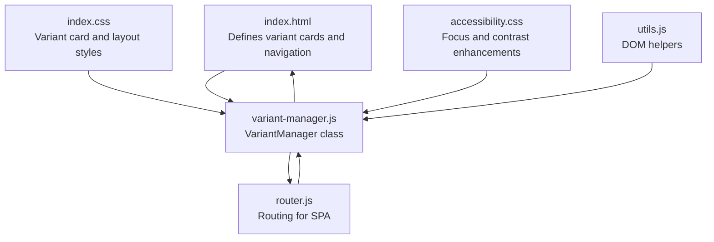
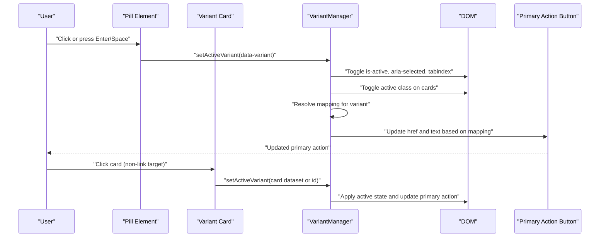
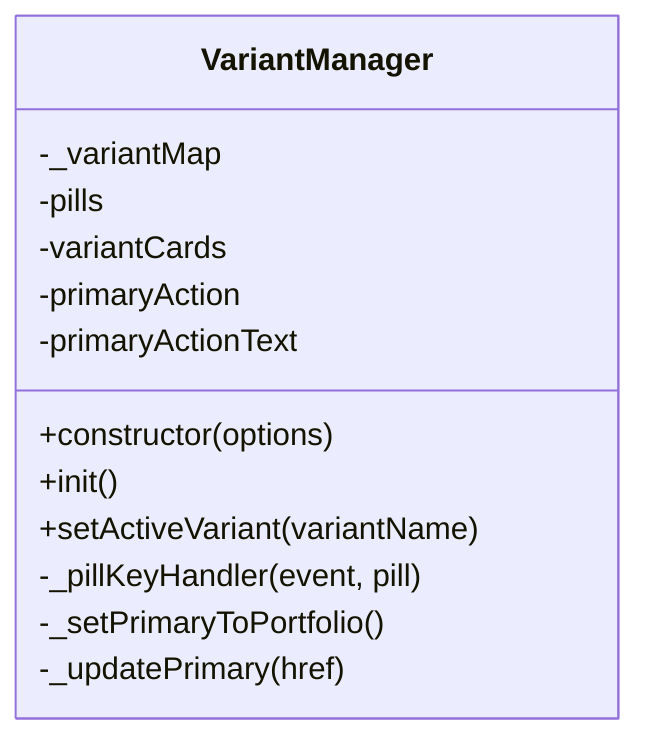
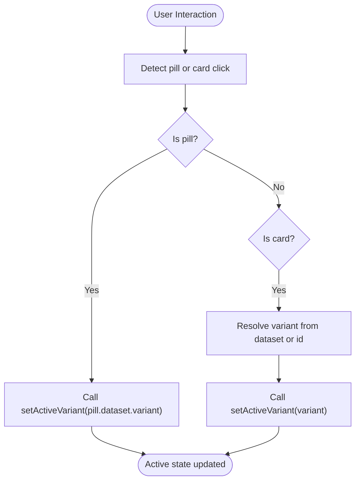
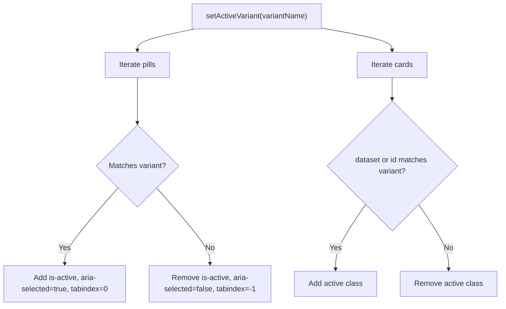
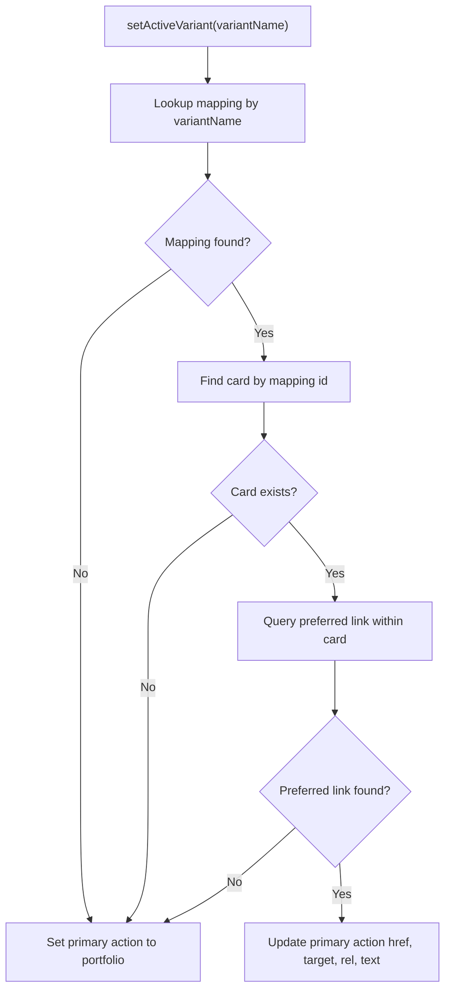
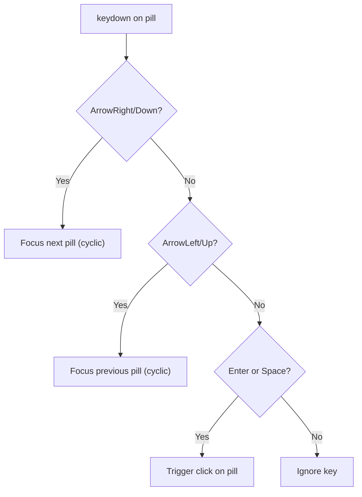
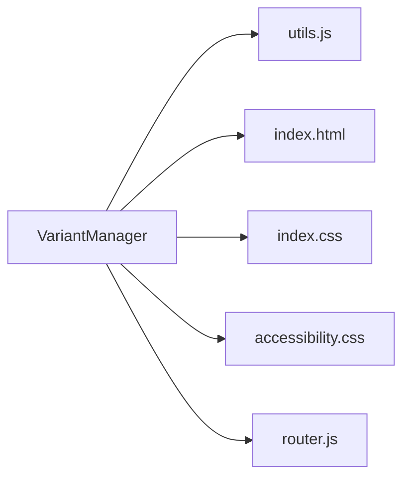

# Variant Switching and Management

<cite>
**Referenced Files in This Document**
- [variant-manager.js](file://assets/js/src/variant-manager.js)
- [index.html](file://index.html)
- [index.css](file://assets/css/index.css)
- [accessibility.css](file://assets/css/accessibility.css)
- [router.js](file://assets/js/router.js)
- [utils.js](file://assets/js/src/utils.js)
- [resume-customizer.js](file://assets/js/src/resume-customizer.js)
- [resume-customizer-styles.css](file://assets/css/resume-customizer-styles.css)
- [ats-calculator.js](file://assets/js/src/ats-calculator.js)
</cite>

## Table of Contents

1. [Introduction](#introduction)
2. [Project Structure](#project-structure)
3. [Core Components](#core-components)
4. [Architecture Overview](#architecture-overview)
5. [Detailed Component Analysis](#detailed-component-analysis)
6. [Dependency Analysis](#dependency-analysis)
7. [Performance Considerations](#performance-considerations)
8. [Troubleshooting Guide](#troubleshooting-guide)
9. [Conclusion](#conclusion)

## Introduction

This document explains the VariantManager class and the resume variant switching functionality. It covers how variants are selected, how the active state is managed, how the primary action is updated, and how keyboard navigation and accessibility are supported. It also documents the variant mapping system, pill-based navigation, card activation logic, integration with the routing system, state persistence, and user preference handling.

## Project Structure

The variant switching feature spans HTML markup, CSS styling, and JavaScript modules:

- HTML defines the variant cards and navigation elements.
- CSS provides responsive and accessible styling for cards, pills, and focus states.
- JavaScript manages variant selection, keyboard navigation, and primary action updates.
- Router integrates with the SPA navigation model for GitHub Pages deployments.

**Diagram sources**

- [index.html](file://index.html#L192-L262)
- [variant-manager.js](file://assets/js/src/variant-manager.js#L1-L125)
- [index.css](file://assets/css/index.css#L457-L471)
- [accessibility.css](file://assets/css/accessibility.css#L23-L31)
- [utils.js](file://assets/js/src/utils.js#L1-L5)
- [router.js](file://assets/js/router.js#L11-L33)

**Section sources**

- [index.html](file://index.html#L192-L262)
- [variant-manager.js](file://assets/js/src/variant-manager.js#L1-L125)
- [index.css](file://assets/css/index.css#L457-L471)
- [accessibility.css](file://assets/css/accessibility.css#L23-L31)
- [utils.js](file://assets/js/src/utils.js#L1-L5)
- [router.js](file://assets/js/router.js#L11-L33)

## Core Components

- VariantManager: Central controller for variant selection, active state management, and primary action updates.
- HTML variant cards: Interactive cards representing each variant (Portfolio, Digital CV, Print Resume, ATS Resume).
- Pill-based navigation: Clickable and keyboard-navigable pill elements associated with each variant.
- Router: SPA routing abstraction for GitHub Pages deployments.

Key responsibilities:

- Initialize listeners for pills and cards.
- Manage active state via CSS classes and ARIA attributes.
- Resolve preferred links per variant and update the primary action button.
- Support keyboard navigation (arrow keys, Enter/Space).
- Integrate with routing and preserve active selections.

**Section sources**

- [variant-manager.js](file://assets/js/src/variant-manager.js#L4-L50)
- [index.html](file://index.html#L192-L262)
- [router.js](file://assets/js/router.js#L11-L33)

## Architecture Overview

The VariantManager orchestrates user interactions with variant cards and pills, updates the active state, and synchronizes the primary action button. It relies on a variant mapping system to resolve preferred links for each variant.

**Diagram sources**

- [variant-manager.js](file://assets/js/src/variant-manager.js#L25-L103)
- [index.html](file://index.html#L192-L262)

## Detailed Component Analysis

### VariantManager Class

The VariantManager encapsulates variant selection and state management:

- Initialization binds click and keyboard events to pills and cards, and sets the initial active variant.
- setActiveVariant updates active state across pills and cards, resolves the preferred link for the selected variant, and updates the primary action button.
- Keyboard handler supports arrow keys for navigation and Enter/Space for activation.
- Fallback logic ensures the primary action defaults to the portfolio when a mapping is missing.

**Diagram sources**

- [variant-manager.js](file://assets/js/src/variant-manager.js#L4-L125)

Implementation highlights:

- Event binding for pills and cards: [variant-manager.js](file://assets/js/src/variant-manager.js#L25-L50)
- Keyboard navigation: [variant-manager.js](file://assets/js/src/variant-manager.js#L52-L66)
- Active state management: [variant-manager.js](file://assets/js/src/variant-manager.js#L68-L80)
- Variant mapping resolution and primary action update: [variant-manager.js](file://assets/js/src/variant-manager.js#L81-L123)

**Section sources**

- [variant-manager.js](file://assets/js/src/variant-manager.js#L4-L125)

### Variant Selection Mechanism

- Pills: Each pill carries a data-variant attribute. Clicking or pressing Enter activates the corresponding variant.
- Cards: Clicking anywhere on a card activates it unless the click target is a link.
- Initial selection: The manager finds the pill with the active class or falls back to the first pill.

**Diagram sources**

- [variant-manager.js](file://assets/js/src/variant-manager.js#L25-L50)
- [index.html](file://index.html#L192-L262)

**Section sources**

- [variant-manager.js](file://assets/js/src/variant-manager.js#L25-L50)
- [index.html](file://index.html#L192-L262)

### Active State Management

- Pills: Toggled with is-active class, aria-selected set to true/false, and tabindex adjusted to make only the active pill focusable.
- Cards: Toggled with active class based on matching dataset or id.

**Diagram sources**

- [variant-manager.js](file://assets/js/src/variant-manager.js#L68-L80)

**Section sources**

- [variant-manager.js](file://assets/js/src/variant-manager.js#L68-L80)

### Primary Action Updating Logic

- Mapping lookup: Uses a private mapping keyed by variant name to locate the target card and preferred selector.
- Preferred link resolution: Finds the first matching link within the card; falls back to the first link if none matches.
- Primary action update: Updates the primary action button’s href, target, rel, and text depending on whether the resolved link is a PDF.

**Diagram sources**

- [variant-manager.js](file://assets/js/src/variant-manager.js#L81-L123)

**Section sources**

- [variant-manager.js](file://assets/js/src/variant-manager.js#L81-L123)

### Keyboard Navigation Support

- Arrow keys: Move focus between pills cyclically.
- Enter/Space: Activate the focused pill.
- Focus management: Pills receive tabindex 0 when active, -1 otherwise.

**Diagram sources**

- [variant-manager.js](file://assets/js/src/variant-manager.js#L52-L66)

**Section sources**

- [variant-manager.js](file://assets/js/src/variant-manager.js#L52-L66)

### Accessibility Features

- Focus states: Enhanced focus outlines for interactive elements.
- ARIA attributes: aria-selected and aria-current are applied to reflect active state.
- Reduced motion: Respects prefers-reduced-motion media queries.
- Contrast and readability: Ensures sufficient contrast and readable line heights.

**Section sources**

- [accessibility.css](file://assets/css/accessibility.css#L23-L31)
- [accessibility.css](file://assets/css/accessibility.css#L61-L68)
- [accessibility.css](file://assets/css/accessibility.css#L103-L148)

### Variant Mapping System

The mapping associates each variant with a card identifier and a preferred link selector:

- print: Card id and selector for print links.
- ats: Card id and selector for ATS links.
- digital: Card id and selector for digital links.
- portfolio: Card id and selector for portfolio links.

Fallback behavior: If a mapping is missing or the card is not found, the primary action defaults to the portfolio.

**Section sources**

- [variant-manager.js](file://assets/js/src/variant-manager.js#L10-L21)
- [variant-manager.js](file://assets/js/src/variant-manager.js#L81-L102)

### Pill-Based Navigation

- Pills are initialized with click and keydown listeners.
- Focus and blur handlers manage a visual focus state for link-pills.
- The active pill determines the primary action and card activation.

**Section sources**

- [variant-manager.js](file://assets/js/src/variant-manager.js#L25-L44)

### Card Activation Logic

- Clicking a card activates it unless the click target is a link.
- The card’s dataset variant or id is used to resolve the active variant.

**Section sources**

- [variant-manager.js](file://assets/js/src/variant-manager.js#L31-L39)
- [index.html](file://index.html#L192-L262)

### Integration with Routing System

- Router provides SPA navigation for GitHub Pages deployments with base-aware URLs and active route highlighting.
- While VariantManager focuses on variant selection, Router ensures proper navigation when users open linked variants externally.

**Section sources**

- [router.js](file://assets/js/router.js#L11-L33)
- [router.js](file://assets/js/router.js#L140-L152)

### State Persistence and User Preferences

- VariantManager does not persist selections to storage; it initializes from the currently active pill.
- Resume Customizer persists user preferences for resume sections and order to localStorage and supports sharing configurations via URL parameters.
- These systems operate independently; VariantManager remains stateless across page loads.

**Section sources**

- [variant-manager.js](file://assets/js/src/variant-manager.js#L46-L50)
- [resume-customizer.js](file://assets/js/src/resume-customizer.js#L253-L282)
- [resume-customizer.js](file://assets/js/src/resume-customizer.js#L236-L251)

## Dependency Analysis

VariantManager depends on:

- DOM helpers for selecting elements.
- HTML structure for pills, cards, and primary action elements.
- CSS classes and selectors for active states and focus management.
- Router for SPA navigation awareness.

**Diagram sources**

- [variant-manager.js](file://assets/js/src/variant-manager.js#L1-L2)
- [utils.js](file://assets/js/src/utils.js#L1-L5)
- [index.html](file://index.html#L192-L262)
- [index.css](file://assets/css/index.css#L457-L471)
- [accessibility.css](file://assets/css/accessibility.css#L23-L31)
- [router.js](file://assets/js/router.js#L11-L33)

**Section sources**

- [variant-manager.js](file://assets/js/src/variant-manager.js#L1-L2)
- [utils.js](file://assets/js/src/utils.js#L1-L5)
- [index.html](file://index.html#L192-L262)
- [index.css](file://assets/css/index.css#L457-L471)
- [accessibility.css](file://assets/css/accessibility.css#L23-L31)
- [router.js](file://assets/js/router.js#L11-L33)

## Performance Considerations

- Event delegation: Consider consolidating event listeners for large numbers of pills/cards to minimize overhead.
- DOM queries: The mapping and selector queries are O(1) per variant switch; ensure selectors remain efficient.
- CSS transitions: Smooth transitions are applied; avoid heavy animations on low-end devices.
- Accessibility: Focus management and ARIA attributes are lightweight but ensure they do not trigger reflows unnecessarily.

## Troubleshooting Guide

Common issues and resolutions:

- Active pill not updating: Verify the presence of is-active class and aria-selected attributes on pills after setActiveVariant.
- Primary action not changing: Confirm the mapping exists for the variant and the card contains the preferred link.
- Keyboard navigation not working: Ensure keydown handlers are attached to pills and that Enter/Space are handled.
- Cards not activating: Check that clicks on cards target non-link elements or that dataset/id resolves correctly.

**Section sources**

- [variant-manager.js](file://assets/js/src/variant-manager.js#L68-L123)
- [index.html](file://index.html#L192-L262)

## Conclusion

The VariantManager provides a robust, accessible, and keyboard-friendly mechanism for switching between resume variants. It cleanly separates concerns between UI state, mapping resolution, and primary action updates while integrating with the SPA routing model. By leveraging clear CSS classes, ARIA attributes, and DOM helpers, it offers a maintainable foundation for variant selection and user preference handling.
