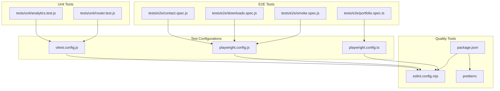
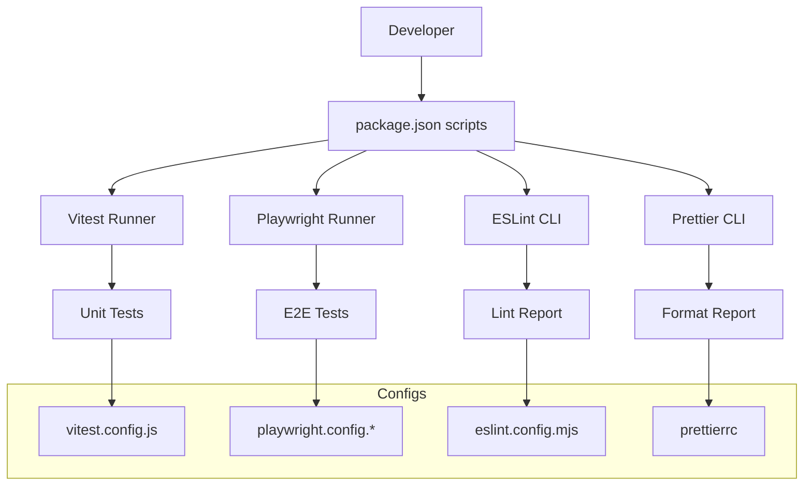
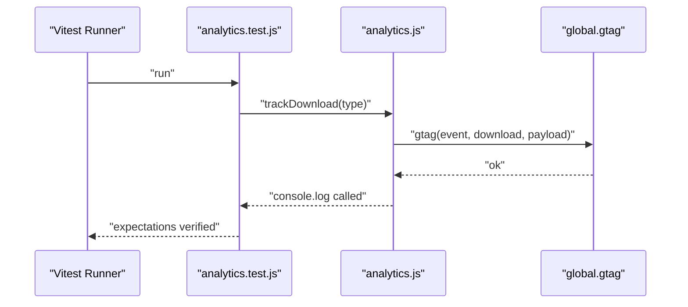
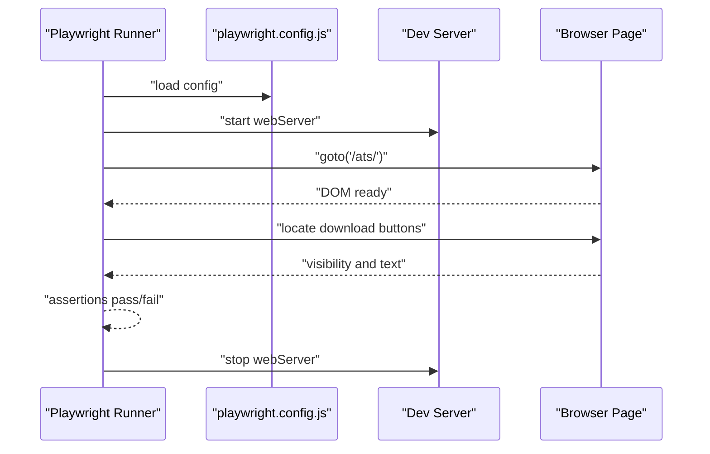
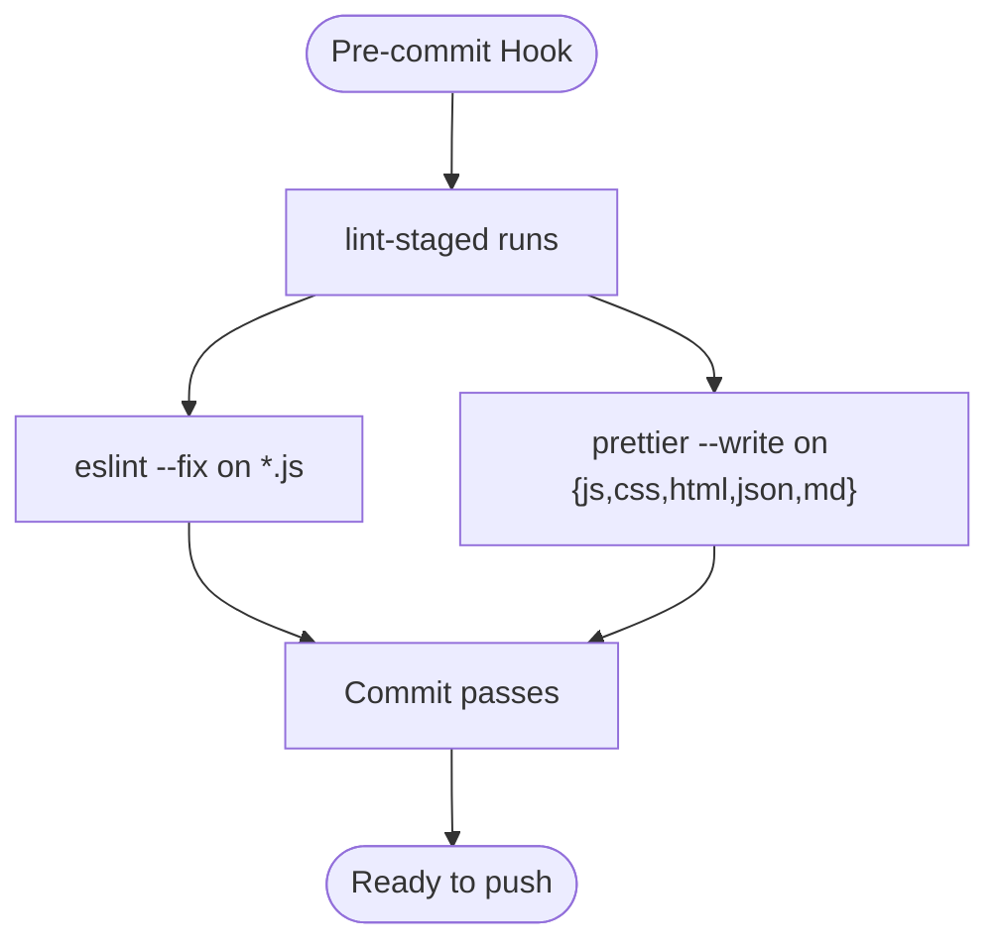
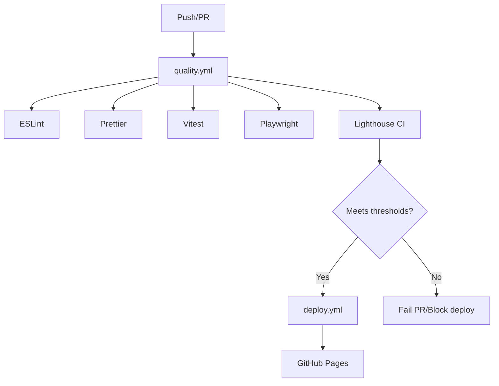
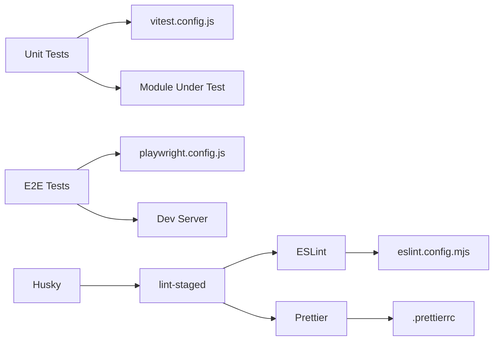

# Testing and Code Quality

<cite>
**Referenced Files in This Document**
- [vitest.config.js](file://vitest.config.js)
- [playwright.config.js](file://playwright.config.js)
- [playwright.config.ts](file://playwright.config.ts)
- [eslint.config.mjs](file://eslint.config.mjs)
- [.prettierrc](file://.prettierrc)
- [package.json](file://package.json)
- [tests/unit/analytics.test.js](file://tests/unit/analytics.test.js)
- [tests/unit/router.test.js](file://tests/unit/router.test.js)
- [tests/e2e/contact.spec.js](file://tests/e2e/contact.spec.js)
- [tests/e2e/downloads.spec.js](file://tests/e2e/downloads.spec.js)
- [tests/e2e/portfolio.spec.ts](file://tests/e2e/portfolio.spec.ts)
- [tests/e2e/smoke.spec.js](file://tests/e2e/smoke.spec.js)
- [assets/js/src/analytics.js](file://assets/js/src/analytics.js)
- [assets/js/router.js](file://assets/js/router.js)
- [assets/js/main.js](file://assets/js/main.js)
- [lighthouserc.json](file://lighthouserc.json)
- [verify-workflows.sh](file://verify-workflows.sh)
- [GITHUB_ACTIONS_SETUP.md](file://GITHUB_ACTIONS_SETUP.md)
</cite>

## Table of Contents

1. [Introduction](#introduction)
2. [Project Structure](#project-structure)
3. [Core Components](#core-components)
4. [Architecture Overview](#architecture-overview)
5. [Detailed Component Analysis](#detailed-component-analysis)
6. [Dependency Analysis](#dependency-analysis)
7. [Performance Considerations](#performance-considerations)
8. [Troubleshooting Guide](#troubleshooting-guide)
9. [Conclusion](#conclusion)
10. [Appendices](#appendices)

## Introduction

This document describes the testing and code quality systems for the project, focusing on:

- Unit testing with Vitest for core modules
- End-to-end testing with Playwright for user workflows
- Automated quality gates using ESLint, Prettier, Husky, and lint-staged
- Continuous integration testing and quality workflows

It explains the testing strategy, configuration, assertion and mocking approaches, and how to maintain and optimize the testing pipeline.

## Project Structure

The testing and quality infrastructure is organized as follows:

- Unit tests under tests/unit for modular, isolated logic
- End-to-end tests under tests/e2e for browser-based workflows
- Test configuration for Vitest and Playwright
- Code quality configuration for ESLint and Prettier
- Scripts and automation for CI and local development

**Diagram sources**

- [vitest.config.js](file://vitest.config.js#L1-L11)
- [playwright.config.js](file://playwright.config.js#L1-L45)
- [playwright.config.ts](file://playwright.config.ts#L1-L27)
- [eslint.config.mjs](file://eslint.config.mjs#L1-L82)
- [.prettierrc](file://.prettierrc#L1-L9)
- [package.json](file://package.json#L1-L56)

**Section sources**

- [vitest.config.js](file://vitest.config.js#L1-L11)
- [playwright.config.js](file://playwright.config.js#L1-L45)
- [playwright.config.ts](file://playwright.config.ts#L1-L27)
- [eslint.config.mjs](file://eslint.config.mjs#L1-L82)
- [.prettierrc](file://.prettierrc#L1-L9)
- [package.json](file://package.json#L1-L56)

## Core Components

- Vitest configuration defines the unit test environment, include/exclude patterns, and jsdom environment for DOM APIs.
- Playwright configurations define E2E test directories, parallelism, retries, workers, reporters, device projects, and local dev servers for both preview and development modes.
- ESLint flat config enforces correctness and formatting, with warnings in CI-friendly mode and Prettier rule disabling.
- Prettier configuration standardizes formatting across JS, CSS, HTML, JSON, and Markdown.
- Package scripts orchestrate unit tests, E2E tests, linting, formatting, and pre-commit hooks.

Key behaviors:

- Unit tests target assets/js/src and related modules.
- E2E tests run against built or served content with baseURL pointing to the appropriate host/port.
- Pre-commit hooks run ESLint and Prettier on staged files.

**Section sources**

- [vitest.config.js](file://vitest.config.js#L1-L11)
- [playwright.config.js](file://playwright.config.js#L1-L45)
- [playwright.config.ts](file://playwright.config.ts#L1-L27)
- [eslint.config.mjs](file://eslint.config.mjs#L1-L82)
- [.prettierrc](file://.prettierrc#L1-L9)
- [package.json](file://package.json#L1-L56)

## Architecture Overview

The testing and quality architecture integrates local and CI environments:

- Local development: run unit and E2E tests, lint and format code, and use pre-commit hooks.
- CI: run quality checks, unit tests, E2E tests, and optional Lighthouse assertions.

**Diagram sources**

- [package.json](file://package.json#L5-L24)
- [vitest.config.js](file://vitest.config.js#L1-L11)
- [playwright.config.js](file://playwright.config.js#L1-L45)
- [playwright.config.ts](file://playwright.config.ts#L1-L27)
- [eslint.config.mjs](file://eslint.config.mjs#L1-L82)
- [.prettierrc](file://.prettierrc#L1-L9)

## Detailed Component Analysis

### Vitest Unit Testing

- Environment: jsdom for DOM APIs; globals enabled for test helpers.
- Includes: tests/unit/\*\* with support for multiple extensions.
- Excludes: E2E tests and node_modules.

Representative unit tests:

- Analytics module tests validate event dispatching to gtag and console logging while handling missing gtag gracefully.
- Router module tests validate path computation, route detection, active link detection, URL construction, and navigation enforcement.

**Diagram sources**

- [tests/unit/analytics.test.js](file://tests/unit/analytics.test.js#L1-L50)
- [assets/js/src/analytics.js](file://assets/js/src/analytics.js#L1-L75)

**Section sources**

- [vitest.config.js](file://vitest.config.js#L1-L11)
- [tests/unit/analytics.test.js](file://tests/unit/analytics.test.js#L1-L50)
- [assets/js/src/analytics.js](file://assets/js/src/analytics.js#L1-L75)
- [tests/unit/router.test.js](file://tests/unit/router.test.js#L1-L49)
- [assets/js/router.js](file://assets/js/router.js#L1-L210)

### Playwright End-to-End Testing

- Playwright configs define:
  - Test directory and parallelism
  - Retries and worker limits for CI
  - HTML reporter and tracing
  - Projects for desktop and mobile devices
  - Local dev server commands and URLs

E2E scenarios:

- Contact form presence, required attributes, and submit button state.
- Resume download buttons across ATS pages and dynamic content rendering.
- Portfolio and ATS page loads, UI toggles, and customizer interactions.
- Smoke tests for homepage, navigation, and theme toggle.

**Diagram sources**

- [playwright.config.js](file://playwright.config.js#L1-L45)
- [tests/e2e/downloads.spec.js](file://tests/e2e/downloads.spec.js#L1-L136)

**Section sources**

- [playwright.config.js](file://playwright.config.js#L1-L45)
- [playwright.config.ts](file://playwright.config.ts#L1-L27)
- [tests/e2e/contact.spec.js](file://tests/e2e/contact.spec.js#L1-L35)
- [tests/e2e/downloads.spec.js](file://tests/e2e/downloads.spec.js#L1-L136)
- [tests/e2e/portfolio.spec.ts](file://tests/e2e/portfolio.spec.ts#L1-L71)
- [tests/e2e/smoke.spec.js](file://tests/e2e/smoke.spec.js#L1-L45)

### Code Quality Tools Integration

- ESLint flat config:
  - Recommended base rules
  - Project-specific rules scoped to assets/js and assets/js/src
  - Warnings instead of errors for CI friendliness
  - Prettier disabled rules and Prettier plugin as an ESLint rule
- Prettier configuration:
  - Width, tabs, semicolons, quotes, trailing commas, line endings
- Pre-commit hooks:
  - Husky prepare hook
  - lint-staged runs ESLint and Prettier on staged files

**Diagram sources**

- [package.json](file://package.json#L47-L54)
- [eslint.config.mjs](file://eslint.config.mjs#L1-L82)
- [.prettierrc](file://.prettierrc#L1-L9)

**Section sources**

- [eslint.config.mjs](file://eslint.config.mjs#L1-L82)
- [.prettierrc](file://.prettierrc#L1-L9)
- [package.json](file://package.json#L47-L54)

### Continuous Integration Testing and Quality Gates

- Lighthouse CI configuration:
  - Collects multiple URLs and runs multiple times
  - Asserts minimum scores per category
  - Uploads temporary public storage for reports
- GitHub Actions workflows:
  - Quality workflow runs lint, format, tests, and link checks
  - PDF generation workflow regenerates PDFs on role data changes
  - Deploy workflow deploys to GitHub Pages after quality checks
- Setup verification script checks for required files, dependencies, and roles.

**Diagram sources**

- [lighthouserc.json](file://lighthouserc.json#L1-L39)
- [GITHUB_ACTIONS_SETUP.md](file://GITHUB_ACTIONS_SETUP.md#L1-L273)
- [verify-workflows.sh](file://verify-workflows.sh#L1-L67)

**Section sources**

- [lighthouserc.json](file://lighthouserc.json#L1-L39)
- [GITHUB_ACTIONS_SETUP.md](file://GITHUB_ACTIONS_SETUP.md#L1-L273)
- [verify-workflows.sh](file://verify-workflows.sh#L1-L67)

## Dependency Analysis

- Unit tests depend on Vitest configuration and module under test.
- E2E tests depend on Playwright configuration and local dev server.
- Quality tools depend on ESLint/Prettier configs and package scripts.
- Pre-commit hooks depend on Husky and lint-staged configuration.

**Diagram sources**

- [vitest.config.js](file://vitest.config.js#L1-L11)
- [playwright.config.js](file://playwright.config.js#L1-L45)
- [eslint.config.mjs](file://eslint.config.mjs#L1-L82)
- [.prettierrc](file://.prettierrc#L1-L9)
- [package.json](file://package.json#L23-L54)

**Section sources**

- [vitest.config.js](file://vitest.config.js#L1-L11)
- [playwright.config.js](file://playwright.config.js#L1-L45)
- [eslint.config.mjs](file://eslint.config.mjs#L1-L82)
- [.prettierrc](file://.prettierrc#L1-L9)
- [package.json](file://package.json#L23-L54)

## Performance Considerations

- Prefer unit tests for fast, deterministic logic; use E2E tests sparingly for critical user journeys.
- Keep E2E tests focused and avoid heavy waits; rely on element visibility and attributes.
- Use parallelism judiciously; adjust workers and retries according to CI capacity.
- Cache dependencies and reuse existing servers in CI to reduce startup overhead.
- Minimize DOM queries and use targeted locators to improve stability and speed.

## Troubleshooting Guide

Common issues and resolutions:

- Missing gtag in analytics tests: ensure global mock is set up before invoking tracking functions.
- Router tests failing due to window.location: mock window.location and replace method in beforeEach.
- Playwright baseURL mismatch: verify baseURL in config matches the dev server URL and port.
- ESLint/Prettier failures locally: run lint and format scripts; ensure pre-commit hooks are installed.
- CI workflow not triggering: verify GitHub Actions permissions and workflow file existence.
- Lighthouse score below threshold: review assertions and optimize performance, accessibility, and SEO.

**Section sources**

- [tests/unit/analytics.test.js](file://tests/unit/analytics.test.js#L1-L50)
- [tests/unit/router.test.js](file://tests/unit/router.test.js#L1-L49)
- [playwright.config.js](file://playwright.config.js#L1-L45)
- [eslint.config.mjs](file://eslint.config.mjs#L1-L82)
- [.prettierrc](file://.prettierrc#L1-L9)
- [GITHUB_ACTIONS_SETUP.md](file://GITHUB_ACTIONS_SETUP.md#L213-L235)

## Conclusion

The project employs a robust testing and quality system combining Vitest for unit tests, Playwright for E2E workflows, and ESLint/Prettier for code quality. Pre-commit hooks and CI workflows enforce standards and prevent regressions. By following the provided strategies and examples, contributors can write effective tests, maintain high code quality, and optimize testing workflows.

## Appendices

### Writing Effective Unit Tests

- Isolate logic and mock external dependencies (e.g., gtag).
- Use beforeEach/afterEach to reset mocks and state.
- Assert both behavior and error handling (e.g., missing globals).
- Keep tests focused and readable with descriptive names.

**Section sources**

- [tests/unit/analytics.test.js](file://tests/unit/analytics.test.js#L1-L50)
- [assets/js/src/analytics.js](file://assets/js/src/analytics.js#L1-L75)

### Writing Effective E2E Tests

- Use meaningful selectors and wait for elements to be visible.
- Validate critical user flows and UI states.
- Test responsive behavior across device projects.
- Keep tests deterministic and avoid brittle timeouts.

**Section sources**

- [tests/e2e/contact.spec.js](file://tests/e2e/contact.spec.js#L1-L35)
- [tests/e2e/downloads.spec.js](file://tests/e2e/downloads.spec.js#L1-L136)
- [tests/e2e/portfolio.spec.ts](file://tests/e2e/portfolio.spec.ts#L1-L71)
- [tests/e2e/smoke.spec.js](file://tests/e2e/smoke.spec.js#L1-L45)

### Maintaining Code Quality

- Run lint and format scripts before committing.
- Fix warnings promptly; avoid suppressing rules unnecessarily.
- Keep Prettier and ESLint configs aligned to prevent conflicts.
- Use pre-commit hooks to automate checks.

**Section sources**

- [eslint.config.mjs](file://eslint.config.mjs#L1-L82)
- [.prettierrc](file://.prettierrc#L1-L9)
- [package.json](file://package.json#L13-L16)
- [package.json](file://package.json#L47-L54)

### Optimizing Testing Workflows

- Reduce flakiness by targeting specific tests during development.
- Use selective E2E runs for critical paths.
- Leverage CI retries and parallelism thoughtfully.
- Integrate Lighthouse CI to catch regressions early.

**Section sources**

- [playwright.config.js](file://playwright.config.js#L1-L45)
- [playwright.config.ts](file://playwright.config.ts#L1-L27)
- [lighthouserc.json](file://lighthouserc.json#L1-L39)
- [GITHUB_ACTIONS_SETUP.md](file://GITHUB_ACTIONS_SETUP.md#L1-L273)
