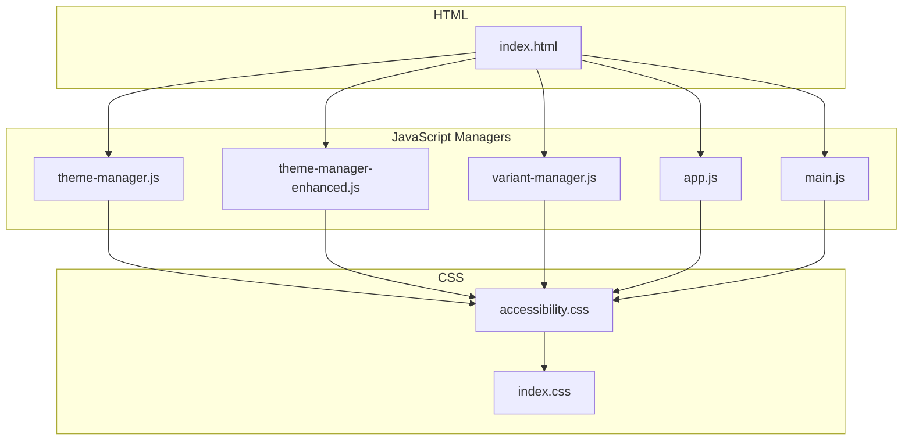
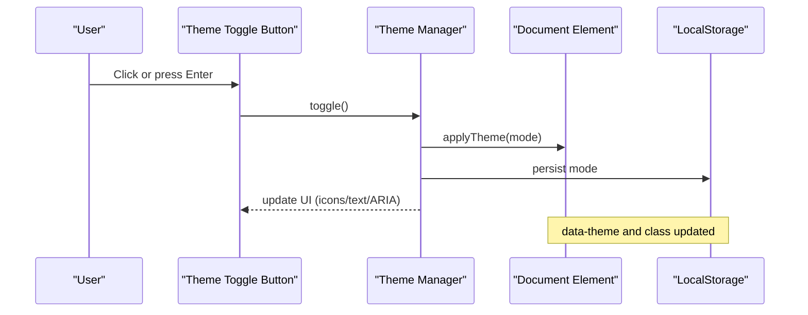
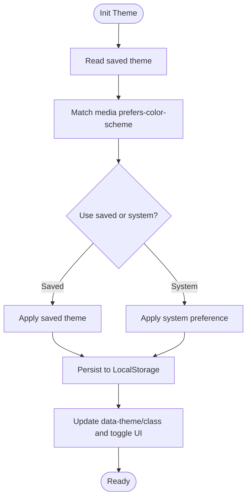
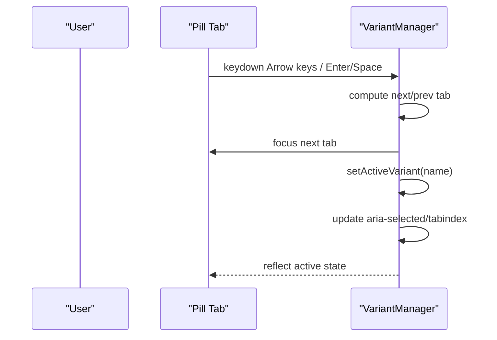
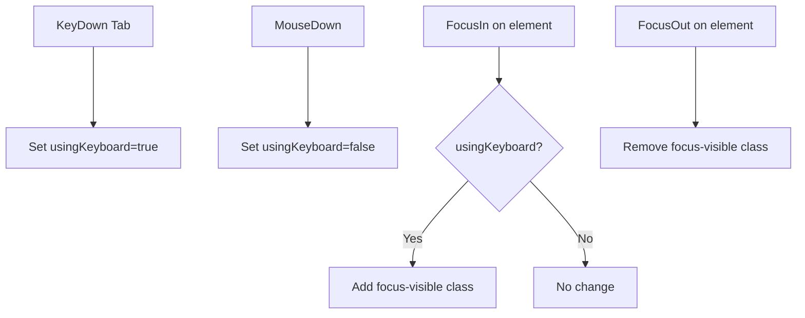
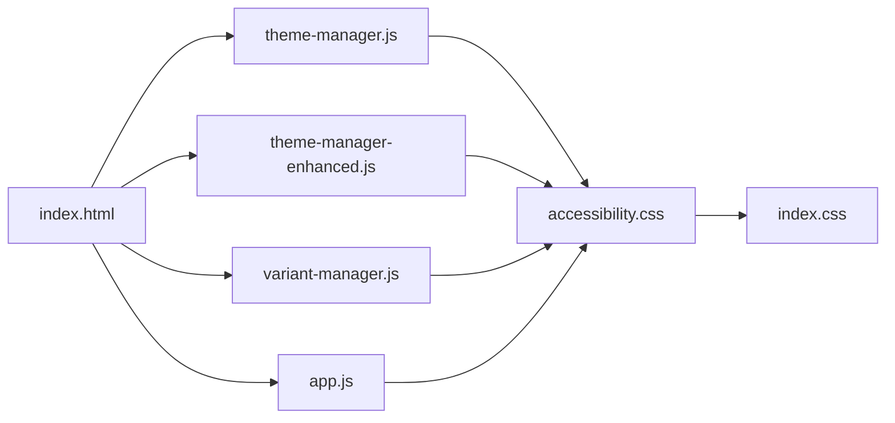

# Accessibility and Theming

<cite>
**Referenced Files in This Document**
- [index.html](file://index.html)
- [main.js](file://assets/js/main.js)
- [theme-manager.js](file://assets/js/src/theme-manager.js)
- [theme-manager-enhanced.js](file://assets/js/src/theme-manager-enhanced.js)
- [variant-manager.js](file://assets/js/src/variant-manager.js)
- [app.js](file://assets/js/src/app.js)
- [accessibility.css](file://assets/css/accessibility.css)
- [index.css](file://assets/css/index.css)
- [ACCESSIBILITY.md](file://docs/ACCESSIBILITY.md)
</cite>

## Table of Contents

1. [Introduction](#introduction)
2. [Project Structure](#project-structure)
3. [Core Components](#core-components)
4. [Architecture Overview](#architecture-overview)
5. [Detailed Component Analysis](#detailed-component-analysis)
6. [Dependency Analysis](#dependency-analysis)
7. [Performance Considerations](#performance-considerations)
8. [Troubleshooting Guide](#troubleshooting-guide)
9. [Conclusion](#conclusion)
10. [Appendices](#appendices)

## Introduction

This document explains how the theme management system supports accessibility, focusing on WCAG 2.1 AA compliance. It covers color contrast validation, screen reader compatibility, focus management during theme switching, keyboard navigation, ARIA attributes usage, high contrast mode support, reduced motion preferences, and color blindness considerations. It also documents the accessibility testing approach, automated checks, manual testing procedures, and provides examples of accessible theme switching and inclusive design patterns.

## Project Structure

The theme and accessibility features span HTML templates, JavaScript managers, and CSS stylesheets:

- HTML defines semantic structure and ARIA attributes for interactive elements.
- JavaScript managers handle theme toggling, persistence, and keyboard navigation.
- CSS enforces focus visibility, color contrast, reduced motion, and theme-aware variables.

**Diagram sources**

- [index.html](file://index.html#L1-L408)
- [theme-manager.js](file://assets/js/src/theme-manager.js#L1-L170)
- [theme-manager-enhanced.js](file://assets/js/src/theme-manager-enhanced.js#L1-L85)
- [variant-manager.js](file://assets/js/src/variant-manager.js#L1-L125)
- [app.js](file://assets/js/src/app.js#L1-L39)
- [main.js](file://assets/js/main.js#L1-L58)
- [accessibility.css](file://assets/css/accessibility.css#L1-L148)
- [index.css](file://assets/css/index.css#L1-L200)

**Section sources**

- [index.html](file://index.html#L1-L408)
- [accessibility.css](file://assets/css/accessibility.css#L1-L148)
- [index.css](file://assets/css/index.css#L1-L200)

## Core Components

- Theme managers: persist and apply theme modes, update UI, and integrate with system preferences.
- Variant manager: manages interactive tabs and ensures keyboard navigation and ARIA states.
- Accessibility stylesheet: establishes focus styles, contrast, reduced motion, and theme variables.
- Application bootstrapper: initializes managers and sets up focus-visible behavior.

Key responsibilities:

- Theme switching respects system preference and persists user choice.
- Keyboard navigation is supported for theme toggles and variant switches.
- ARIA attributes communicate state to assistive technologies.
- Focus visibility is enhanced for keyboard users.
- Reduced motion and high contrast modes are respected.

**Section sources**

- [theme-manager.js](file://assets/js/src/theme-manager.js#L1-L170)
- [theme-manager-enhanced.js](file://assets/js/src/theme-manager-enhanced.js#L1-L85)
- [variant-manager.js](file://assets/js/src/variant-manager.js#L1-L125)
- [app.js](file://assets/js/src/app.js#L1-L39)
- [accessibility.css](file://assets/css/accessibility.css#L1-L148)

## Architecture Overview

The theme system integrates with HTML semantics and CSS variables to provide a consistent, accessible experience across themes and modes.

**Diagram sources**

- [theme-manager.js](file://assets/js/src/theme-manager.js#L141-L161)
- [theme-manager-enhanced.js](file://assets/js/src/theme-manager-enhanced.js#L41-L50)
- [main.js](file://assets/js/main.js#L26-L42)

## Detailed Component Analysis

### Theme Management and Accessibility

- Persistence and system preference:
  - Theme managers read saved theme and system preference, then apply the appropriate mode.
  - Changes are persisted to LocalStorage and reflected in the document’s data-theme attribute and class.
- UI updates:
  - Theme toggle buttons update icons, text, and ARIA labels to reflect current mode.
- Focus and keyboard:
  - Toggle buttons are keyboard accessible and receive visible focus.
- Reduced motion and high contrast:
  - CSS media queries adapt animations/transitions and color schemes for reduced motion and system preference.

**Diagram sources**

- [theme-manager.js](file://assets/js/src/theme-manager.js#L33-L85)
- [theme-manager-enhanced.js](file://assets/js/src/theme-manager-enhanced.js#L17-L39)
- [main.js](file://assets/js/main.js#L13-L42)

**Section sources**

- [theme-manager.js](file://assets/js/src/theme-manager.js#L33-L168)
- [theme-manager-enhanced.js](file://assets/js/src/theme-manager-enhanced.js#L17-L70)
- [main.js](file://assets/js/main.js#L13-L42)
- [accessibility.css](file://assets/css/accessibility.css#L61-L68)

### Variant Switching and Keyboard Navigation

- Variant manager:
  - Implements arrow-key navigation among pill-style tabs.
  - Updates ARIA attributes (selected, tabindex) to reflect active state.
  - Ensures focus moves to the active tab and keyboard activation via Enter/Space.
- Accessibility:
  - Tabs use role="tab" and role="tablist".
  - aria-selected indicates the active tab.
  - Focus visibility is handled consistently across components.

**Diagram sources**

- [variant-manager.js](file://assets/js/src/variant-manager.js#L52-L66)
- [variant-manager.js](file://assets/js/src/variant-manager.js#L68-L103)

**Section sources**

- [variant-manager.js](file://assets/js/src/variant-manager.js#L25-L103)

### Focus Management During Theme Switching

- The application bootstrapper detects keyboard vs mouse focus behavior and adds/removes a focus-visible class on focus events.
- This ensures enhanced focus indicators only appear when navigating via keyboard, improving clarity for keyboard users.

**Diagram sources**

- [app.js](file://assets/js/src/app.js#L17-L36)

**Section sources**

- [app.js](file://assets/js/src/app.js#L17-L36)

### ARIA Attributes and Screen Reader Compatibility

- Theme toggle buttons include aria-label and aria-pressed where applicable.
- Variant tabs use role="tablist" and role="tab" with aria-label and aria-selected.
- Live regions (announcements) are present to convey dynamic changes to screen readers.

Examples of ARIA usage:

- Theme toggle: aria-label describes the action.
- Variant tabs: role="tablist" and role="tab" with aria-selected indicating active state.
- Live region: aria-live="polite" for non-intrusive announcements.

**Section sources**

- [index.html](file://index.html#L78-L116)
- [variant-manager.js](file://assets/js/src/variant-manager.js#L68-L74)
- [ACCESSIBILITY.md](file://docs/ACCESSIBILITY.md#L49-L73)

### Color Contrast Validation and High Contrast Mode

- The accessibility stylesheet enforces sufficient color contrast for text and UI elements.
- Dark mode variables are defined to maintain contrast ratios across themes.
- High contrast mode support is achieved via system preference media queries.

Contrast and theme variables:

- Body and component colors use CSS variables that adapt to light/dark modes.
- Media queries adjust colors for system dark mode preferences.

**Section sources**

- [accessibility.css](file://assets/css/accessibility.css#L33-L59)
- [accessibility.css](file://assets/css/accessibility.css#L104-L147)
- [index.css](file://assets/css/index.css#L4-L37)

### Reduced Motion Preferences

- Reduced motion support is implemented via a media query that minimizes animations/transitions for users who prefer reduced motion.
- Animations and transitions are constrained to minimal durations when the preference is set.

**Section sources**

- [accessibility.css](file://assets/css/accessibility.css#L61-L68)

### Color Blindness Considerations

- The theme system relies on CSS variables and system preference to adapt visuals.
- Ensure color combinations meet AA contrast guidelines and avoid conveying meaning through color alone.
- Provide alternative indicators (labels, icons) alongside color changes.

[No sources needed since this section provides general guidance]

### Accessibility Testing Approach

- Automated checks:
  - Lighthouse: Run accessibility audits to achieve high scores.
  - axe DevTools: Scan for common accessibility violations.
  - WAVE: Evaluate accessibility from a visual perspective.
- Manual testing:
  - Screen reader testing with NVDA, JAWS, and VoiceOver.
  - Keyboard-only navigation testing across all interactive elements.
  - Reduced motion and high contrast mode verification.

Testing procedures:

- Verify skip links, focus indicators, and ARIA attributes.
- Confirm theme changes are announced via live regions when integrated.
- Validate tab order and keyboard shortcuts for variant switching.

**Section sources**

- [ACCESSIBILITY.md](file://docs/ACCESSIBILITY.md#L300-L338)
- [ACCESSIBILITY.md](file://docs/ACCESSIBILITY.md#L267-L298)

### Examples of Accessible Theme Switching

- Use semantic buttons with aria-labels for theme toggles.
- Persist theme selection and reflect system preference.
- Update ARIA attributes and UI text/icons to indicate current mode.
- Respect reduced motion and high contrast preferences.

Integration points:

- Theme toggle in the main page uses aria-label and updates dynamically.
- Enhanced theme manager updates aria-label and icon text based on current mode.

**Section sources**

- [index.html](file://index.html#L78-L116)
- [theme-manager-enhanced.js](file://assets/js/src/theme-manager-enhanced.js#L59-L70)
- [main.js](file://assets/js/main.js#L26-L42)

### Inclusive Design Patterns

- Keyboard-first navigation: ensure all actions are reachable via Tab/Enter/Space.
- Focus visibility: provide prominent, visible focus indicators for keyboard users.
- ARIA semantics: use roles and attributes to describe interactive components.
- Color and contrast: maintain AA-compliant contrast across themes and modes.
- Motion preferences: honor reduced motion and high contrast system settings.

**Section sources**

- [ACCESSIBILITY.md](file://docs/ACCESSIBILITY.md#L340-L383)
- [accessibility.css](file://assets/css/accessibility.css#L23-L31)
- [accessibility.css](file://assets/css/accessibility.css#L61-L68)

## Dependency Analysis

Theme and accessibility features depend on:

- HTML semantics and ARIA attributes for screen reader compatibility.
- JavaScript managers to apply and persist theme state.
- CSS variables and media queries to enforce contrast, motion, and theme-aware styles.

**Diagram sources**

- [index.html](file://index.html#L1-L408)
- [theme-manager.js](file://assets/js/src/theme-manager.js#L1-L170)
- [theme-manager-enhanced.js](file://assets/js/src/theme-manager-enhanced.js#L1-L85)
- [variant-manager.js](file://assets/js/src/variant-manager.js#L1-L125)
- [app.js](file://assets/js/src/app.js#L1-L39)
- [accessibility.css](file://assets/css/accessibility.css#L1-L148)
- [index.css](file://assets/css/index.css#L1-L200)

**Section sources**

- [index.html](file://index.html#L1-L408)
- [accessibility.css](file://assets/css/accessibility.css#L1-L148)
- [index.css](file://assets/css/index.css#L1-L200)

## Performance Considerations

- Minimize layout thrashing by batching DOM updates during theme switching.
- Use CSS variables and data-theme for efficient theme application.
- Avoid heavy animations for users who prefer reduced motion.

[No sources needed since this section provides general guidance]

## Troubleshooting Guide

Common issues and resolutions:

- Focus not visible: Ensure focus-visible styles are applied and keyboard detection is active.
- Screen reader cannot navigate: Verify ARIA roles and labels are present on interactive elements.
- Keyboard trap: Confirm dropdowns and overlays are escapable and focus returns appropriately.
- Low contrast: Use a contrast checker and adjust colors to meet AA guidelines.
- Missing alt text: Provide descriptive alt attributes for images and aria-label for icons.

**Section sources**

- [ACCESSIBILITY.md](file://docs/ACCESSIBILITY.md#L386-L408)

## Conclusion

The theme management system integrates accessibility best practices across persistence, UI updates, keyboard navigation, ARIA semantics, and responsive design. By honoring system preferences for reduced motion and high contrast, maintaining AA-compliant contrast, and providing clear focus and ARIA feedback, the system delivers an inclusive experience. Automated and manual testing procedures help ensure ongoing compliance with WCAG 2.1 Level AA.

[No sources needed since this section summarizes without analyzing specific files]

## Appendices

- WCAG checklist and resources are documented in the accessibility guide.

**Section sources**

- [ACCESSIBILITY.md](file://docs/ACCESSIBILITY.md#L410-L488)
