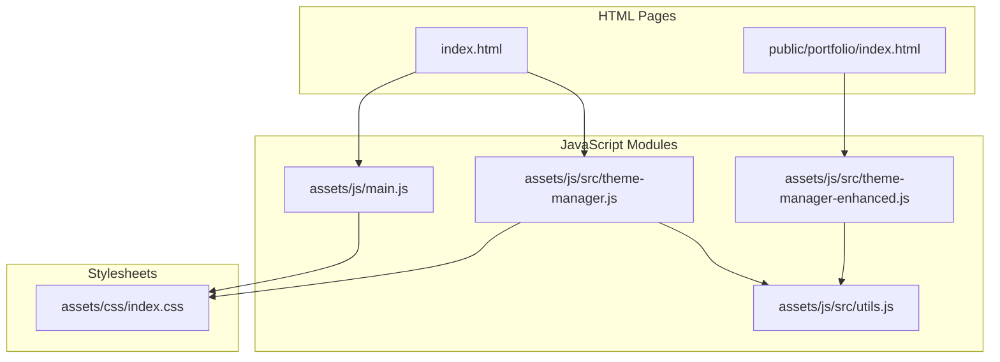
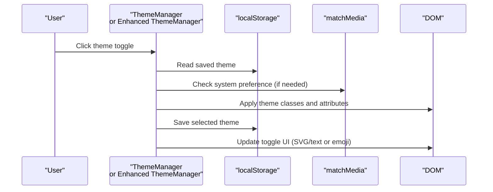
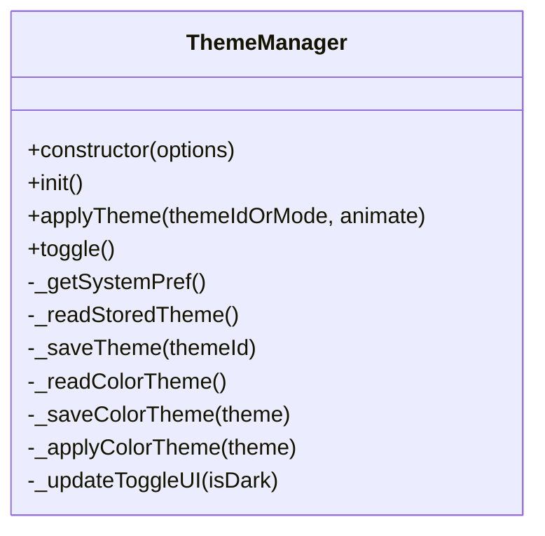
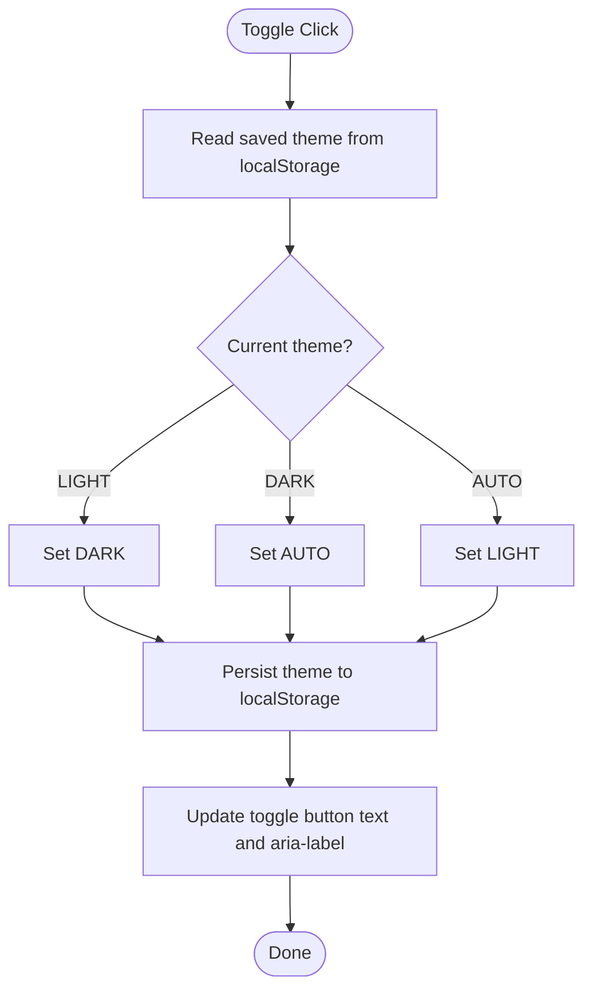
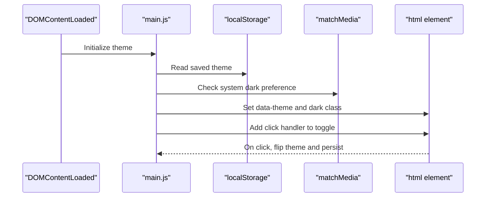
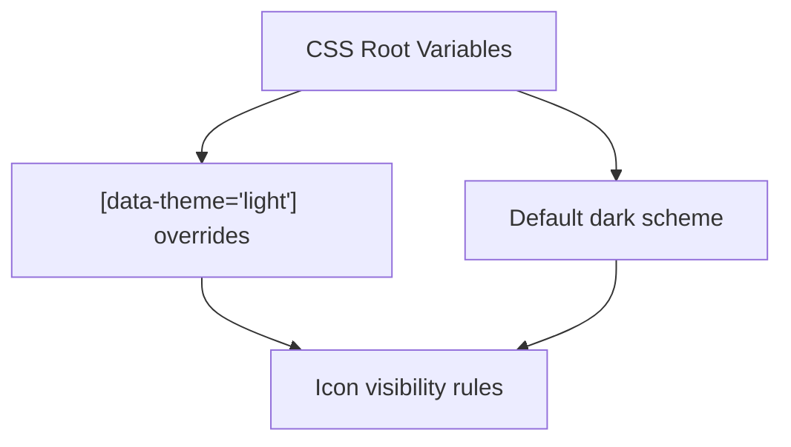
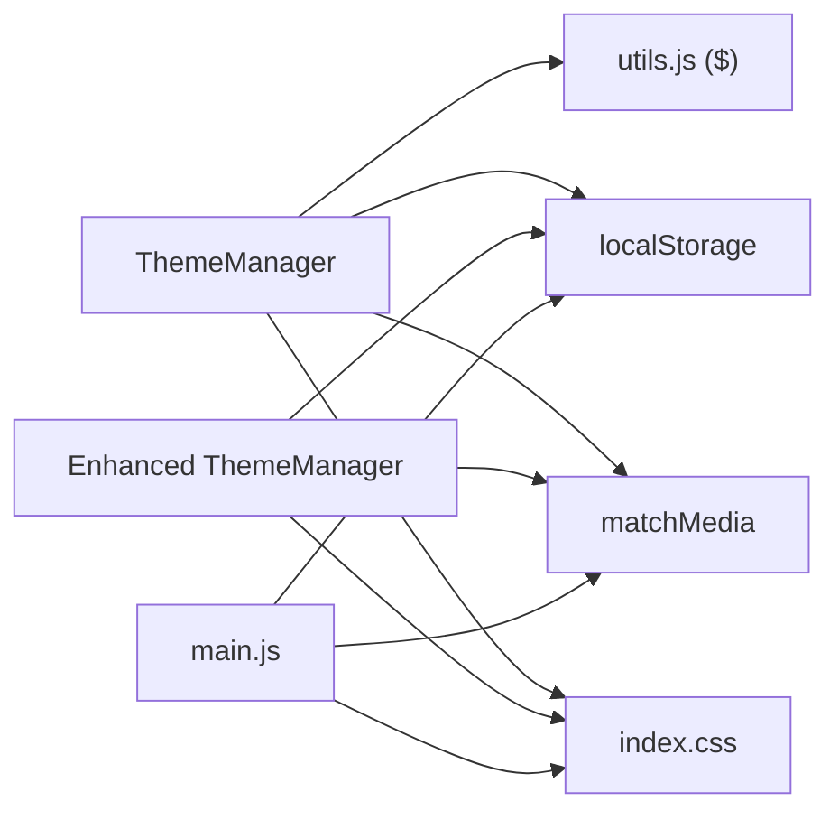

# Basic Theme Switching

<cite>
**Referenced Files in This Document**
- [theme-manager.js](file://assets/js/src/theme-manager.js)
- [theme-manager-enhanced.js](file://assets/js/src/theme-manager-enhanced.js)
- [main.js](file://assets/js/main.js)
- [index.html](file://index.html)
- [portfolio/index.html](file://public/portfolio/index.html)
- [index.css](file://assets/css/index.css)
- [utils.js](file://assets/js/src/utils.js)
</cite>

## Table of Contents

1. [Introduction](#introduction)
2. [Project Structure](#project-structure)
3. [Core Components](#core-components)
4. [Architecture Overview](#architecture-overview)
5. [Detailed Component Analysis](#detailed-component-analysis)
6. [Dependency Analysis](#dependency-analysis)
7. [Performance Considerations](#performance-considerations)
8. [Troubleshooting Guide](#troubleshooting-guide)
9. [Conclusion](#conclusion)

## Introduction

This document explains the basic theme switching functionality across the project. It focuses on the ThemeManager class constructor, initialization process, and core theme switching logic. It also covers the dark/light mode toggle mechanism, system preference detection using the matchMedia API, theme persistence through localStorage, SVG icon system for theme indicators, event listener setup, and cross-browser compatibility considerations. Examples of theme switching workflows, system preference handling, and fallback mechanisms are included to help developers integrate and troubleshoot the feature effectively.

## Project Structure

The theme switching feature spans multiple modules:

- ThemeManager class for advanced palette and theme switching
- Enhanced theme manager for simplified light/dark/auto toggling
- Main entry script for basic theme logic
- HTML pages that host the theme toggle controls
- CSS that applies theme-specific styles

**Diagram sources**

- [index.html](file://index.html#L79-L116)
- [portfolio/index.html](file://public/portfolio/index.html#L102-L122)
- [theme-manager.js](file://assets/js/src/theme-manager.js#L4-L31)
- [theme-manager-enhanced.js](file://assets/js/src/theme-manager-enhanced.js#L6-L21)
- [main.js](file://assets/js/main.js#L5-L42)
- [index.css](file://assets/css/index.css#L23-L37)

**Section sources**

- [index.html](file://index.html#L79-L116)
- [portfolio/index.html](file://public/portfolio/index.html#L102-L122)
- [theme-manager.js](file://assets/js/src/theme-manager.js#L4-L31)
- [theme-manager-enhanced.js](file://assets/js/src/theme-manager-enhanced.js#L6-L21)
- [main.js](file://assets/js/main.js#L5-L42)
- [index.css](file://assets/css/index.css#L23-L37)

## Core Components

- ThemeManager class: Provides palette selection, dark/light theme switching, system preference monitoring, and UI state updates.
- Enhanced ThemeManager: Simplifies theme modes to light/dark/auto with automatic system preference detection and toggle button updates.
- Main entry script: Implements a minimal theme switcher with localStorage persistence and matchMedia support.
- HTML toggle controls: Provide user interaction points for theme switching.
- CSS theme variables: Define light and dark color schemes and enable runtime switching.

Key responsibilities:

- Constructor and initialization: Set keys, DOM references, SVG icons, and initialize theme state.
- Persistence: Read/write theme preferences to localStorage.
- System preference: Detect OS-level theme preference via matchMedia.
- UI updates: Toggle icons and labels, manage dropdown menus, and apply CSS classes.

**Section sources**

- [theme-manager.js](file://assets/js/src/theme-manager.js#L4-L31)
- [theme-manager.js](file://assets/js/src/theme-manager.js#L33-L85)
- [theme-manager-enhanced.js](file://assets/js/src/theme-manager-enhanced.js#L6-L21)
- [theme-manager-enhanced.js](file://assets/js/src/theme-manager-enhanced.js#L17-L39)
- [main.js](file://assets/js/main.js#L13-L42)
- [index.html](file://index.html#L79-L116)
- [portfolio/index.html](file://public/portfolio/index.html#L102-L122)
- [index.css](file://assets/css/index.css#L23-L37)

## Architecture Overview

The theme switching architecture combines three complementary approaches:

- Advanced palette and theme manager (ThemeManager)
- Simplified light/dark/auto manager (Enhanced ThemeManager)
- Minimal main entry script (main.js)

**Diagram sources**

- [theme-manager.js](file://assets/js/src/theme-manager.js#L141-L161)
- [theme-manager.js](file://assets/js/src/theme-manager.js#L75-L84)
- [theme-manager-enhanced.js](file://assets/js/src/theme-manager-enhanced.js#L41-L49)
- [theme-manager-enhanced.js](file://assets/js/src/theme-manager-enhanced.js#L23-L39)
- [main.js](file://assets/js/main.js#L26-L31)

## Detailed Component Analysis

### ThemeManager Class

The ThemeManager class encapsulates palette and theme switching logic:

- Constructor: Initializes keys, DOM references, SVG icons, and calls init().
- Initialization: Loads color theme, loads dark/light theme (with system preference fallback), sets up event listeners, and subscribes to system preference changes.
- Palette switching: Saves and applies color themes via CSS classes on the root element.
- Theme switching: Adds/removes a dark theme class and updates the toggle UI.
- System preference: Uses matchMedia to detect OS-level preference and updates the theme accordingly.
- Persistence: Reads/writes theme preferences to localStorage with error handling.

**Diagram sources**

- [theme-manager.js](file://assets/js/src/theme-manager.js#L4-L169)

Key methods and responsibilities:

- applyTheme: Accepts "dark" or "light" to toggle the dark theme class and update UI; persists the selection.
- toggle: Determines next state based on stored preference or system preference and calls applyTheme.
- \_getSystemPref: Safely checks matchMedia for "(prefers-color-scheme: dark)" and defaults to "dark" on errors.
- \_readStoredTheme/\_saveTheme: Persist theme selection to localStorage with try/catch.
- \_readColorTheme/\_saveColorTheme/\_applyColorTheme: Manage palette themes via CSS classes on documentElement.
- \_updateToggleUI: Updates the toggle icon and text using embedded SVGs.

Event listeners:

- Theme toggle button: Calls toggle on click.
- Palette toggle: Toggles visibility of the theme menu.
- Theme choices: Apply selected palette and close menu.
- Outside clicks: Close the theme menu.

System preference monitoring:

- Subscribes to matchMedia change events to update theme when OS preference changes.

**Section sources**

- [theme-manager.js](file://assets/js/src/theme-manager.js#L4-L31)
- [theme-manager.js](file://assets/js/src/theme-manager.js#L33-L85)
- [theme-manager.js](file://assets/js/src/theme-manager.js#L87-L96)
- [theme-manager.js](file://assets/js/src/theme-manager.js#L98-L113)
- [theme-manager.js](file://assets/js/src/theme-manager.js#L115-L130)
- [theme-manager.js](file://assets/js/src/theme-manager.js#L132-L139)
- [theme-manager.js](file://assets/js/src/theme-manager.js#L141-L154)
- [theme-manager.js](file://assets/js/src/theme-manager.js#L156-L161)
- [theme-manager.js](file://assets/js/src/theme-manager.js#L163-L168)

### Enhanced ThemeManager (Light/Dark/Auto)

The enhanced manager simplifies the theme model to three states:

- LIGHT: Forces light theme
- DARK: Forces dark theme
- AUTO: Follows system preference

Initialization:

- Reads saved theme from localStorage or defaults to AUTO.
- Applies the theme immediately and sets up the toggle.

Toggle logic:

- Cycles through LIGHT → DARK → AUTO → LIGHT on each click.

System preference:

- Uses matchMedia to detect system preference when AUTO is active.

UI updates:

- Updates the toggle button content and aria-label with emojis.

**Diagram sources**

- [theme-manager-enhanced.js](file://assets/js/src/theme-manager-enhanced.js#L41-L49)
- [theme-manager-enhanced.js](file://assets/js/src/theme-manager-enhanced.js#L23-L39)
- [theme-manager-enhanced.js](file://assets/js/src/theme-manager-enhanced.js#L59-L69)

**Section sources**

- [theme-manager-enhanced.js](file://assets/js/src/theme-manager-enhanced.js#L6-L21)
- [theme-manager-enhanced.js](file://assets/js/src/theme-manager-enhanced.js#L17-L39)
- [theme-manager-enhanced.js](file://assets/js/src/theme-manager-enhanced.js#L41-L49)
- [theme-manager-enhanced.js](file://assets/js/src/theme-manager-enhanced.js#L52-L70)

### Main Entry Script (Basic Theme Switching)

The main entry script provides a lightweight theme switching implementation:

- On DOMContentLoaded, reads saved theme from localStorage or falls back to system preference.
- Applies the theme by setting data-theme on html and toggling a dark class.
- Sets up a click handler on the theme toggle to flip between light and dark.

**Diagram sources**

- [main.js](file://assets/js/main.js#L5-L42)

**Section sources**

- [main.js](file://assets/js/main.js#L13-L42)

### HTML Theme Toggle Controls

Two HTML pages include theme toggle controls:

- index.html: Contains a theme toggle button with nested sun/moon SVG icons.
- portfolio/index.html: Contains a theme toggle button with emoji icons.

Both rely on JavaScript to attach event handlers and update UI state.

**Section sources**

- [index.html](file://index.html#L79-L116)
- [portfolio/index.html](file://public/portfolio/index.html#L102-L122)

### CSS Theme Variables and Styles

The stylesheet defines:

- Light and dark color schemes using CSS custom properties.
- Conditional application of styles based on [data-theme="light"].
- Icon visibility toggles for sun/moon icons depending on current theme.

**Diagram sources**

- [index.css](file://assets/css/index.css#L4-L37)
- [index.css](file://assets/css/index.css#L217-L222)

**Section sources**

- [index.css](file://assets/css/index.css#L4-L37)
- [index.css](file://assets/css/index.css#L217-L222)

## Dependency Analysis

ThemeManager depends on:

- DOM utilities ($ from utils.js) for element queries.
- matchMedia for system preference detection.
- localStorage for persistence.
- Embedded SVG icons for UI updates.

Enhanced ThemeManager depends on:

- matchMedia for system preference detection.
- localStorage for persistence.
- Emojis for UI updates.

Main entry script depends on:

- matchMedia for system preference detection.
- localStorage for persistence.

**Diagram sources**

- [theme-manager.js](file://assets/js/src/theme-manager.js#L2-L3)
- [utils.js](file://assets/js/src/utils.js#L2-L3)
- [theme-manager-enhanced.js](file://assets/js/src/theme-manager-enhanced.js#L24-L36)
- [main.js](file://assets/js/main.js#L18-L21)
- [index.css](file://assets/css/index.css#L23-L37)

**Section sources**

- [theme-manager.js](file://assets/js/src/theme-manager.js#L2-L3)
- [utils.js](file://assets/js/src/utils.js#L2-L3)
- [theme-manager-enhanced.js](file://assets/js/src/theme-manager-enhanced.js#L24-L36)
- [main.js](file://assets/js/main.js#L18-L21)
- [index.css](file://assets/css/index.css#L23-L37)

## Performance Considerations

- CSS custom properties minimize layout thrashing during theme switches.
- matchMedia subscriptions are attached conditionally to avoid unnecessary overhead.
- localStorage access is wrapped in try/catch to prevent blocking on restricted environments.
- SVG icons are embedded to avoid extra network requests for theme toggle visuals.

[No sources needed since this section provides general guidance]

## Troubleshooting Guide

Common issues and resolutions:

- Toggle not working:
  - Verify the presence of the theme toggle element and that event listeners are attached.
  - Confirm that localStorage is accessible and not blocked by browser settings.
- System preference not detected:
  - Ensure matchMedia is supported and that the media query "(prefers-color-scheme: dark)" is valid.
  - Check for exceptions caught by the internal try/catch blocks.
- Icons not updating:
  - Confirm that the themeIcon and themeText elements exist and are updated by \_updateToggleUI.
  - For the enhanced manager, ensure the toggle button exists and emoji updates are applied.
- Menu not closing:
  - Validate that the document click handler properly closes the theme menu.

**Section sources**

- [theme-manager.js](file://assets/js/src/theme-manager.js#L42-L84)
- [theme-manager.js](file://assets/js/src/theme-manager.js#L163-L168)
- [theme-manager-enhanced.js](file://assets/js/src/theme-manager-enhanced.js#L52-L70)
- [main.js](file://assets/js/main.js#L26-L31)

## Conclusion

The project implements theme switching through multiple complementary modules:

- ThemeManager provides palette and dark/light switching with system preference monitoring.
- Enhanced ThemeManager offers a streamlined light/dark/auto model with automatic system detection.
- The main entry script delivers a minimal baseline for quick integration.

Together, these components ensure robust theme persistence, responsive system preference handling, accessible UI updates, and cross-browser compatibility through defensive programming and matchMedia usage.
