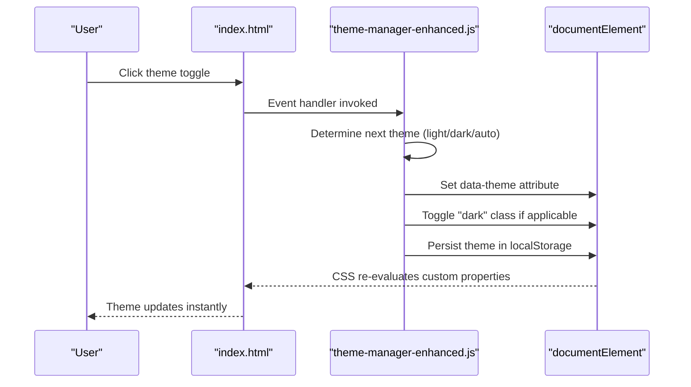
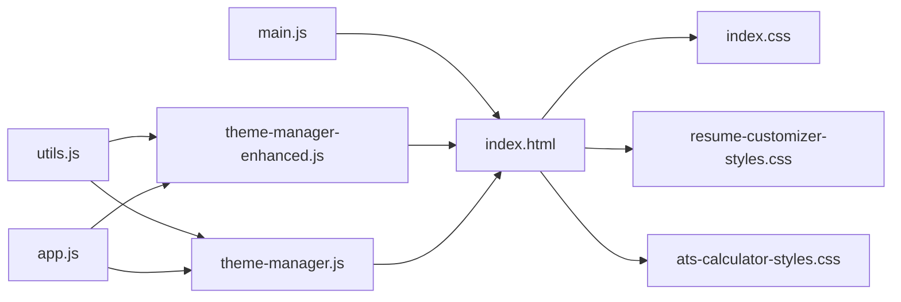

# CSS Theme Architecture

<cite>
**Referenced Files in This Document**
- [index.css](file://assets/css/index.css)
- [theme-manager.js](file://assets/js/src/theme-manager.js)
- [theme-manager-enhanced.js](file://assets/js/src/theme-manager-enhanced.js)
- [main.js](file://assets/js/main.js)
- [app.js](file://assets/js/src/app.js)
- [utils.js](file://assets/js/src/utils.js)
- [index.html](file://index.html)
- [resume-customizer-styles.css](file://assets/css/resume-customizer-styles.css)
- [ats-calculator-styles.css](file://assets/css/ats-calculator-styles.css)
</cite>

## Table of Contents

1. [Introduction](#introduction)
2. [Project Structure](#project-structure)
3. [Core Components](#core-components)
4. [Architecture Overview](#architecture-overview)
5. [Detailed Component Analysis](#detailed-component-analysis)
6. [Dependency Analysis](#dependency-analysis)
7. [Performance Considerations](#performance-considerations)
8. [Troubleshooting Guide](#troubleshooting-guide)
9. [Conclusion](#conclusion)
10. [Appendices](#appendices)

## Introduction

This document explains the CSS theme architecture and styling system used across the project. It covers the CSS custom properties system, theme variable definitions, responsive design patterns, color scheme implementation, dark and light theme styles, and the integration between JavaScript theme switching and CSS styling. It also documents how theme classes are applied to the document element, CSS cascade behavior, style inheritance patterns, media queries, and cross-browser compatibility. Practical examples demonstrate theme customization via CSS variables, style overrides, and responsive theme behavior.

## Project Structure

The theme system spans CSS and JavaScript modules that work together to provide a cohesive theming experience:

- CSS base defines custom properties and theme variants
- JavaScript manages theme persistence, toggling, and system preference detection
- HTML integrates theme controls and applies theme attributes/classes
- Additional component-specific styles (customizer and ATS calculator) include their own responsive and dark-mode adaptations

```mermaid
graph TB
subgraph "HTML"
HTML["index.html<br/>documentElement attributes/classes"]
end
subgraph "CSS"
BASE["assets/css/index.css<br/>Custom properties + theme variants"]
CUSTOMIZER["assets/css/resume-customizer-styles.css<br/>Dark mode + responsive"]
ATS["assets/css/ats-calculator-styles.css<br/>Dark mode + responsive"]
end
subgraph "JavaScript"
TM_ENH["assets/js/src/theme-manager-enhanced.js<br/>ThemeManager class"]
TM["assets/js/src/theme-manager.js<br/>Enhanced ThemeManager"]
MAIN["assets/js/main.js<br/>Entry-point theme logic"]
APP["assets/js/src/app.js<br/>App runner"]
UTILS["assets/js/src/utils.js<br/>DOM helpers"]
end
HTML --> BASE
HTML --> CUSTOMIZER
HTML --> ATS
APP --> TM
APP --> TM_ENH
MAIN --> HTML
TM_ENH --> HTML
TM --> HTML
UTILS --> TM
UTILS --> TM_ENH
```

**Diagram sources**

- [index.html](file://index.html#L1-L408)
- [index.css](file://assets/css/index.css#L1-L673)
- [resume-customizer-styles.css](file://assets/css/resume-customizer-styles.css#L1-L406)
- [ats-calculator-styles.css](file://assets/css/ats-calculator-styles.css#L1-L501)
- [theme-manager-enhanced.js](file://assets/js/src/theme-manager-enhanced.js#L1-L85)
- [theme-manager.js](file://assets/js/src/theme-manager.js#L1-L170)
- [main.js](file://assets/js/main.js#L1-L58)
- [app.js](file://assets/js/src/app.js#L1-L39)
- [utils.js](file://assets/js/src/utils.js#L1-L5)

**Section sources**

- [index.html](file://index.html#L1-L408)
- [index.css](file://assets/css/index.css#L1-L673)
- [resume-customizer-styles.css](file://assets/css/resume-customizer-styles.css#L1-L406)
- [ats-calculator-styles.css](file://assets/css/ats-calculator-styles.css#L1-L501)
- [theme-manager-enhanced.js](file://assets/js/src/theme-manager-enhanced.js#L1-L85)
- [theme-manager.js](file://assets/js/src/theme-manager.js#L1-L170)
- [main.js](file://assets/js/main.js#L1-L58)
- [app.js](file://assets/js/src/app.js#L1-L39)
- [utils.js](file://assets/js/src/utils.js#L1-L5)

## Core Components

- CSS custom properties define theme tokens for backgrounds, text, primary/accent colors, borders, glass effects, shadows, and fonts.
- Theme variants are defined using attribute selectors on the document element and pseudo-class selectors for light/dark modes.
- JavaScript theme managers persist and switch themes, integrate with system preferences, and update UI controls.
- Media queries enforce responsive breakpoints and print-specific styles.
- Component-specific styles (customizer and ATS calculator) adapt to dark mode and include responsive tweaks.

Key implementation references:

- Custom properties and theme variants: [index.css](file://assets/css/index.css#L4-L37)
- Base typography and transitions: [index.css](file://assets/css/index.css#L47-L62)
- Theme toggle and icon visibility: [index.css](file://assets/css/index.css#L200-L225)
- Print styles enforcing light theme: [index.css](file://assets/css/index.css#L602-L672)
- Enhanced theme manager (data-theme attribute): [theme-manager-enhanced.js](file://assets/js/src/theme-manager-enhanced.js#L23-L39)
- Legacy theme manager (classList toggling): [theme-manager.js](file://assets/js/src/theme-manager.js#L141-L154)
- Entry-point theme logic: [main.js](file://assets/js/main.js#L13-L42)
- App initialization: [app.js](file://assets/js/src/app.js#L11-L15)

**Section sources**

- [index.css](file://assets/css/index.css#L4-L37)
- [index.css](file://assets/css/index.css#L47-L62)
- [index.css](file://assets/css/index.css#L200-L225)
- [index.css](file://assets/css/index.css#L602-L672)
- [theme-manager-enhanced.js](file://assets/js/src/theme-manager-enhanced.js#L23-L39)
- [theme-manager.js](file://assets/js/src/theme-manager.js#L141-L154)
- [main.js](file://assets/js/main.js#L13-L42)
- [app.js](file://assets/js/src/app.js#L11-L15)

## Architecture Overview

The theme architecture combines CSS custom properties with JavaScript-driven theme switching. The document element carries either a data-theme attribute or a class to signal the active theme. CSS rules consume custom properties to render consistent visuals, while media queries and print styles ensure appropriate presentation across contexts.



**Diagram sources**

- [index.html](file://index.html#L79-L116)
- [theme-manager-enhanced.js](file://assets/js/src/theme-manager-enhanced.js#L41-L50)
- [theme-manager-enhanced.js](file://assets/js/src/theme-manager-enhanced.js#L23-L39)

## Detailed Component Analysis

### CSS Custom Properties and Theme Variables

- The :root block defines default dark-theme values for backgrounds, soft backgrounds, text colors, primary/accent hues, borders, glass effects, shadows, and fonts.
- A [data-theme="light"] selector overrides all variables to light-theme equivalents.
- Components consume these variables via var(--token) to maintain consistent theming.

Implementation references:

- Dark defaults: [index.css](file://assets/css/index.css#L4-L21)
- Light overrides: [index.css](file://assets/css/index.css#L23-L37)
- Body and typography using variables: [index.css](file://assets/css/index.css#L51-L62)

**Section sources**

- [index.css](file://assets/css/index.css#L4-L21)
- [index.css](file://assets/css/index.css#L23-L37)
- [index.css](file://assets/css/index.css#L51-L62)

### Theme Classes and Attributes Applied to documentElement

- The enhanced theme manager sets data-theme on the document element and toggles a "dark" class for additional targeting.
- The legacy theme manager toggles "dark-theme" class and uses attribute selectors for button styles.
- The entry-point script applies data-theme and class based on persisted or system preferences.

Implementation references:

- Enhanced manager attribute/class setting: [theme-manager-enhanced.js](file://assets/js/src/theme-manager-enhanced.js#L23-L39)
- Legacy manager class toggling: [theme-manager.js](file://assets/js/src/theme-manager.js#L141-L154)
- Entry-point logic: [main.js](file://assets/js/main.js#L13-L42)

**Section sources**

- [theme-manager-enhanced.js](file://assets/js/src/theme-manager-enhanced.js#L23-L39)
- [theme-manager.js](file://assets/js/src/theme-manager.js#L141-L154)
- [main.js](file://assets/js/main.js#L13-L42)

### CSS Cascade Behavior and Style Inheritance

- The cascade prioritizes attribute selectors and class selectors over base declarations when switching themes.
- Variables defined in :root are overridden by [data-theme="light"] rules, ensuring consistent inheritance.
- Components rely on inherited variables, enabling global theme changes without per-component overrides.

Implementation references:

- Attribute selector for light theme: [index.css](file://assets/css/index.css#L23-L37)
- Button styles using attribute selectors: [index.css](file://assets/css/index.css#L327-L330)
- Variable consumption across components: [index.css](file://assets/css/index.css#L143-L146)

**Section sources**

- [index.css](file://assets/css/index.css#L23-L37)
- [index.css](file://assets/css/index.css#L327-L330)
- [index.css](file://assets/css/index.css#L143-L146)

### Color Scheme Implementation and Dark/Light Variations

- Dark theme is the default with deep backgrounds and muted text.
- Light theme swaps to light backgrounds, darker text, and adjusted accent colors.
- Print styles enforce a strict light theme for print media.

Implementation references:

- Dark defaults: [index.css](file://assets/css/index.css#L4-L21)
- Light overrides: [index.css](file://assets/css/index.css#L23-L37)
- Print enforcement: [index.css](file://assets/css/index.css#L602-L618)

**Section sources**

- [index.css](file://assets/css/index.css#L4-L21)
- [index.css](file://assets/css/index.css#L23-L37)
- [index.css](file://assets/css/index.css#L602-L618)

### Responsive Design Patterns and Media Queries

- Breakpoints adjust typography and layout for smaller screens.
- Component panels adapt to mobile with reduced spacing and full-width panels.
- Dark mode media queries provide theme-aware UI for customizer and ATS calculator.

Implementation references:

- Hero title breakpoint: [index.css](file://assets/css/index.css#L270-L274)
- Mobile nav links: [index.css](file://assets/css/index.css#L593-L597)
- Customizer responsive panel: [resume-customizer-styles.css](file://assets/css/resume-customizer-styles.css#L289-L313)
- ATS scorer responsive panel: [ats-calculator-styles.css](file://assets/css/ats-calculator-styles.css#L347-L388)
- Dark mode media queries: [resume-customizer-styles.css](file://assets/css/resume-customizer-styles.css#L316-L386), [ats-calculator-styles.css](file://assets/css/ats-calculator-styles.css#L391-L482)

**Section sources**

- [index.css](file://assets/css/index.css#L270-L274)
- [index.css](file://assets/css/index.css#L593-L597)
- [resume-customizer-styles.css](file://assets/css/resume-customizer-styles.css#L289-L313)
- [ats-calculator-styles.css](file://assets/css/ats-calculator-styles.css#L347-L388)
- [resume-customizer-styles.css](file://assets/css/resume-customizer-styles.css#L316-L386)
- [ats-calculator-styles.css](file://assets/css/ats-calculator-styles.css#L391-L482)

### JavaScript Theme Switching Integration

- The enhanced theme manager persists theme selection and updates the UI accordingly.
- The legacy theme manager supports color themes and system preference listening.
- The entry-point script initializes theme logic and binds toggle events.

Implementation references:

- Enhanced manager lifecycle: [theme-manager-enhanced.js](file://assets/js/src/theme-manager-enhanced.js#L17-L50)
- Legacy manager initialization and listeners: [theme-manager.js](file://assets/js/src/theme-manager.js#L33-L84)
- Entry-point initialization: [main.js](file://assets/js/main.js#L5-L42)
- App bootstrapping: [app.js](file://assets/js/src/app.js#L11-L15)

**Section sources**

- [theme-manager-enhanced.js](file://assets/js/src/theme-manager-enhanced.js#L17-L50)
- [theme-manager.js](file://assets/js/src/theme-manager.js#L33-L84)
- [main.js](file://assets/js/main.js#L5-L42)
- [app.js](file://assets/js/src/app.js#L11-L15)

### Cross-Browser Compatibility

- Uses standard CSS custom properties and attribute selectors supported across modern browsers.
- Fallbacks for matchMedia listeners accommodate older environments.
- Print styles leverage print-specific directives for reliable output.

Implementation references:

- MatchMedia fallback handling: [theme-manager.js](file://assets/js/src/theme-manager.js#L75-L84)
- Print directives: [index.css](file://assets/css/index.css#L602-L672)

**Section sources**

- [theme-manager.js](file://assets/js/src/theme-manager.js#L75-L84)
- [index.css](file://assets/css/index.css#L602-L672)

### Examples of Theme Customization

- Override variables globally by editing :root or [data-theme="light"] blocks.
- Add component-level overrides by targeting specific selectors with higher specificity.
- Introduce new color themes by extending the color theme array and applying a class to documentElement.
- Use media queries to adapt theme behavior for print or narrow viewports.

Implementation references:

- Variable definitions: [index.css](file://assets/css/index.css#L4-L37)
- Component overrides via attribute selectors: [index.css](file://assets/css/index.css#L327-L330)
- Color theme classes: [theme-manager.js](file://assets/js/src/theme-manager.js#L8-L15)
- Print overrides: [index.css](file://assets/css/index.css#L602-L672)

**Section sources**

- [index.css](file://assets/css/index.css#L4-L37)
- [index.css](file://assets/css/index.css#L327-L330)
- [theme-manager.js](file://assets/js/src/theme-manager.js#L8-L15)
- [index.css](file://assets/css/index.css#L602-L672)

## Dependency Analysis

The theme system exhibits low coupling and high cohesion:

- CSS depends on custom properties and attribute selectors.
- JavaScript depends on DOM APIs and localStorage.
- HTML integrates controls and applies attributes/classes.



**Diagram sources**

- [utils.js](file://assets/js/src/utils.js#L1-L5)
- [theme-manager.js](file://assets/js/src/theme-manager.js#L1-L170)
- [theme-manager-enhanced.js](file://assets/js/src/theme-manager-enhanced.js#L1-L85)
- [app.js](file://assets/js/src/app.js#L1-L39)
- [main.js](file://assets/js/main.js#L1-L58)
- [index.html](file://index.html#L1-L408)
- [index.css](file://assets/css/index.css#L1-L673)
- [resume-customizer-styles.css](file://assets/css/resume-customizer-styles.css#L1-L406)
- [ats-calculator-styles.css](file://assets/css/ats-calculator-styles.css#L1-L501)

**Section sources**

- [utils.js](file://assets/js/src/utils.js#L1-L5)
- [theme-manager.js](file://assets/js/src/theme-manager.js#L1-L170)
- [theme-manager-enhanced.js](file://assets/js/src/theme-manager-enhanced.js#L1-L85)
- [app.js](file://assets/js/src/app.js#L1-L39)
- [main.js](file://assets/js/main.js#L1-L58)
- [index.html](file://index.html#L1-L408)
- [index.css](file://assets/css/index.css#L1-L673)
- [resume-customizer-styles.css](file://assets/css/resume-customizer-styles.css#L1-L406)
- [ats-calculator-styles.css](file://assets/css/ats-calculator-styles.css#L1-L501)

## Performance Considerations

- CSS custom properties enable efficient theme switching without recalculating styles per component.
- Minimal JavaScript footprint reduces runtime overhead.
- Media queries and print styles avoid unnecessary rendering for off-screen contexts.
- Consider lazy-loading non-critical theme panels to minimize initial paint impact.

## Troubleshooting Guide

Common issues and resolutions:

- Theme does not persist across sessions: Verify localStorage availability and correct key usage in theme managers.
- Toggle icon does not reflect current theme: Ensure data-theme attribute and class toggling logic is executed after DOM load.
- Light theme not applied despite system preference: Confirm matchMedia support and event listener registration.
- Print output not respecting light theme: Validate print media queries and !important overrides for critical elements.

Implementation references:

- Persistence and retrieval: [theme-manager-enhanced.js](file://assets/js/src/theme-manager-enhanced.js#L18-L39)
- Toggle UI updates: [theme-manager-enhanced.js](file://assets/js/src/theme-manager-enhanced.js#L59-L70)
- Print enforcement: [index.css](file://assets/css/index.css#L602-L672)

**Section sources**

- [theme-manager-enhanced.js](file://assets/js/src/theme-manager-enhanced.js#L18-L39)
- [theme-manager-enhanced.js](file://assets/js/src/theme-manager-enhanced.js#L59-L70)
- [index.css](file://assets/css/index.css#L602-L672)

## Conclusion

The theme architecture leverages CSS custom properties and attribute-based selectors to deliver a flexible, maintainable, and performant theming system. JavaScript ensures seamless persistence and responsiveness, while media queries and print styles guarantee consistent presentation across devices and contexts. Developers can customize themes by overriding variables, adding targeted CSS rules, and extending color themes without disrupting the cascade.

## Appendices

- Example customization steps:
  - Modify :root variables for global palette changes.
  - Add [data-theme="custom"] rules for specialized themes.
  - Extend color theme classes and apply them to documentElement.
  - Use media queries to tailor responsive behavior per theme.

[No sources needed since this section provides general guidance]
