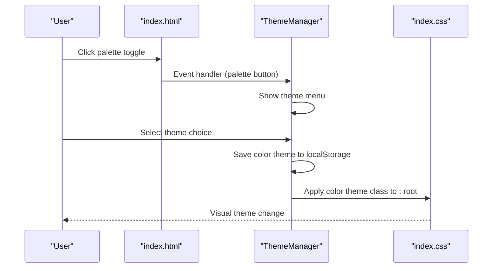
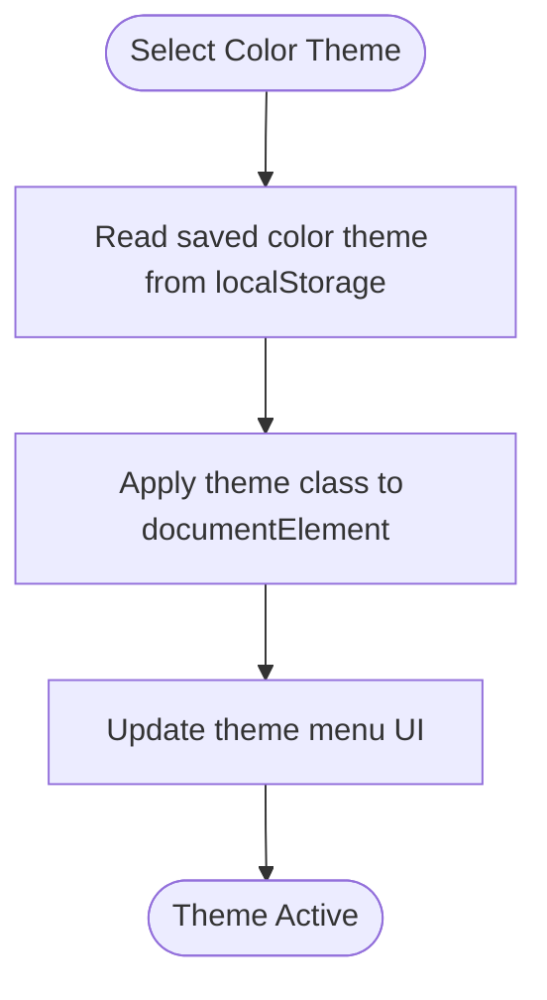
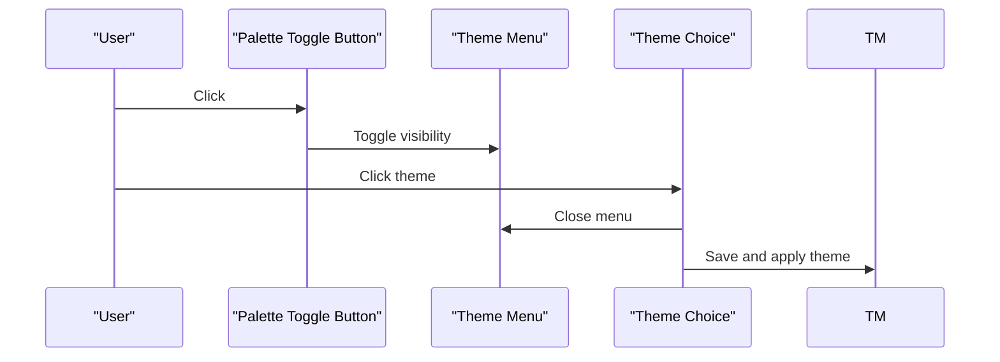
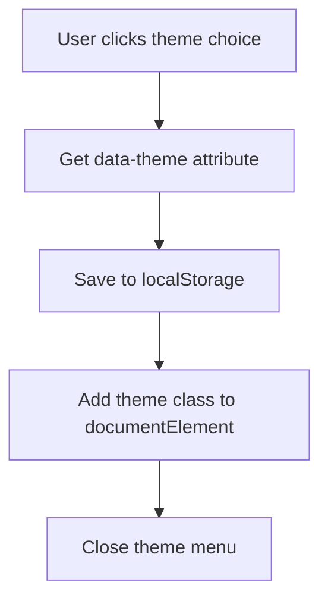
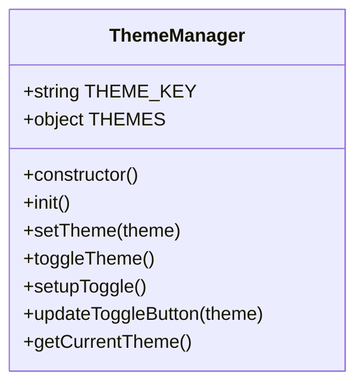
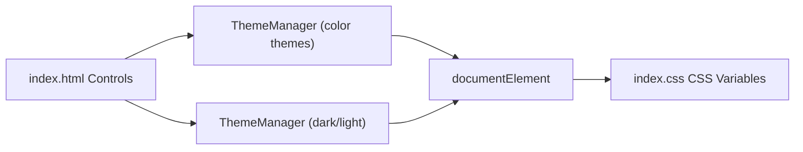
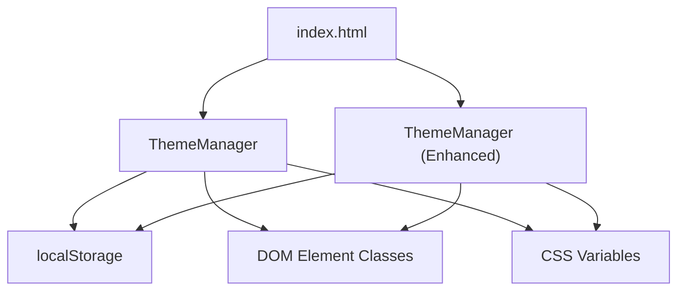

# Enhanced Theme Features

<cite>
**Referenced Files in This Document**
- [theme-manager.js](file://assets/js/src/theme-manager.js)
- [theme-manager-enhanced.js](file://assets/js/src/theme-manager-enhanced.js)
- [index.css](file://assets/css/index.css)
- [resume-customizer-styles.css](file://assets/css/resume-customizer-styles.css)
- [index.html](file://index.html)
- [main.js](file://assets/js/main.js)
- [app.js](file://assets/js/src/app.js)
- [variant-manager.js](file://assets/js/src/variant-manager.js)
- [resume-customizer.js](file://assets/js/src/resume-customizer.js)
</cite>

## Table of Contents

1. [Introduction](#introduction)
2. [Project Structure](#project-structure)
3. [Core Components](#core-components)
4. [Architecture Overview](#architecture-overview)
5. [Detailed Component Analysis](#detailed-component-analysis)
6. [Dependency Analysis](#dependency-analysis)
7. [Performance Considerations](#performance-considerations)
8. [Troubleshooting Guide](#troubleshooting-guide)
9. [Conclusion](#conclusion)
10. [Appendices](#appendices)

## Introduction

This document explains the enhanced theme management features implemented across the project. It covers the advanced color palette system, theme cycling functionality, and enhanced UI interactions. It documents the theme menu implementation, color theme selection mechanism, palette toggle functionality, the COLOR_THEMES array configuration, theme choice handling, and dynamic theme application. It also details the enhanced theme manager class methods, color theme persistence, and integration with the basic theme manager. Practical examples illustrate theme customization workflows, palette switching logic, and enhanced user interface patterns.

## Project Structure

The theme system spans JavaScript modules, CSS variables, and HTML markup. The primary integration points are:

- Theme manager module that handles color themes and dark/light modes
- CSS variables that define theme-dependent colors and transitions
- HTML elements that expose theme controls and menus
- Optional integration with other managers for variant selection

```mermaid
graph TB
subgraph "JavaScript Modules"
TM["ThemeManager<br/>theme-manager.js"]
TME["ThemeManager (Enhanced)<br/>theme-manager-enhanced.js"]
APP["App<br/>app.js"]
VM["VariantManager<br/>variant-manager.js"]
RC["ResumeCustomizer<br/>resume-customizer.js"]
end
subgraph "Styles"
ICSS["index.css"]
RCSS["resume-customizer-styles.css"]
end
subgraph "HTML"
HTML["index.html"]
end
HTML --> TM
HTML --> TME
APP --> TM
APP --> VM
TM --> ICSS
TME --> ICSS
RC --> RCSS
RC --> HTML
```

**Diagram sources**

- [theme-manager.js](file://assets/js/src/theme-manager.js#L1-L170)
- [theme-manager-enhanced.js](file://assets/js/src/theme-manager-enhanced.js#L1-L85)
- [index.css](file://assets/css/index.css#L1-L673)
- [resume-customizer-styles.css](file://assets/css/resume-customizer-styles.css#L1-L406)
- [index.html](file://index.html#L1-L408)
- [app.js](file://assets/js/src/app.js#L1-L39)
- [variant-manager.js](file://assets/js/src/variant-manager.js#L1-L125)
- [resume-customizer.js](file://assets/js/src/resume-customizer.js#L1-L307)

**Section sources**

- [theme-manager.js](file://assets/js/src/theme-manager.js#L1-L170)
- [theme-manager-enhanced.js](file://assets/js/src/theme-manager-enhanced.js#L1-L85)
- [index.css](file://assets/css/index.css#L1-L673)
- [resume-customizer-styles.css](file://assets/css/resume-customizer-styles.css#L1-L406)
- [index.html](file://index.html#L1-L408)
- [app.js](file://assets/js/src/app.js#L1-L39)

## Core Components

- ThemeManager (enhanced): Manages color themes via class toggles on the document element, persists selections in localStorage, and integrates with dark/light mode preferences.
- ThemeManager (basic): Provides a simpler toggle for dark/light mode with automatic system preference detection.
- CSS Variables: Define theme-dependent colors and transitions for both light and dark modes.
- HTML Controls: Expose theme toggles, palette menus, and theme choices.
- VariantManager: Coordinates variant selection and can influence theme-aware UI behavior.
- ResumeCustomizer: Offers customization panels and can coexist with theme toggles.

Key responsibilities:

- Persist and restore theme preferences
- Apply color themes dynamically
- Handle theme menu interactions and palette toggling
- Integrate with system preference changes

**Section sources**

- [theme-manager.js](file://assets/js/src/theme-manager.js#L4-L170)
- [theme-manager-enhanced.js](file://assets/js/src/theme-manager-enhanced.js#L6-L85)
- [index.css](file://assets/css/index.css#L4-L37)
- [index.html](file://index.html#L79-L116)
- [variant-manager.js](file://assets/js/src/variant-manager.js#L4-L125)
- [resume-customizer.js](file://assets/js/src/resume-customizer.js#L6-L307)

## Architecture Overview

The enhanced theme system combines two complementary managers:

- Basic ThemeManager (theme-manager.js) manages color themes and exposes palette controls
- Enhanced ThemeManager (theme-manager-enhanced.js) manages dark/light mode and persists it separately



**Diagram sources**

- [theme-manager.js](file://assets/js/src/theme-manager.js#L46-L74)
- [theme-manager.js](file://assets/js/src/theme-manager.js#L56-L66)
- [index.css](file://assets/css/index.css#L1-L673)
- [index.html](file://index.html#L79-L116)

## Detailed Component Analysis

### Advanced Color Palette System

The color palette system centers around the COLOR_THEMES array and class-based theme application:

- COLOR_THEMES defines available color themes (including an empty/default theme)
- \_applyColorTheme removes existing theme classes and adds the selected theme class to the document element
- \_readColorTheme/\_saveColorTheme persist and restore the color theme selection in localStorage



**Diagram sources**

- [theme-manager.js](file://assets/js/src/theme-manager.js#L8-L15)
- [theme-manager.js](file://assets/js/src/theme-manager.js#L132-L139)
- [theme-manager.js](file://assets/js/src/theme-manager.js#L115-L130)

**Section sources**

- [theme-manager.js](file://assets/js/src/theme-manager.js#L8-L15)
- [theme-manager.js](file://assets/js/src/theme-manager.js#L115-L139)

### Theme Menu Implementation and Palette Toggle

The theme menu and palette toggle enable users to switch color themes:

- Palette toggle button opens/closes the theme menu
- Theme choices trigger selection and persistence
- Outside clicks close the menu
- SVG icons represent current theme state



**Diagram sources**

- [theme-manager.js](file://assets/js/src/theme-manager.js#L46-L53)
- [theme-manager.js](file://assets/js/src/theme-manager.js#L56-L66)
- [theme-manager.js](file://assets/js/src/theme-manager.js#L69-L73)

**Section sources**

- [theme-manager.js](file://assets/js/src/theme-manager.js#L46-L74)
- [index.html](file://index.html#L79-L116)

### Theme Choice Handling and Dynamic Application

Theme choices are handled through event listeners attached to theme-choice elements:

- Each choice reads its data-theme attribute
- Saves the theme to localStorage
- Applies the theme class to the document element
- Closes the theme menu



**Diagram sources**

- [theme-manager.js](file://assets/js/src/theme-manager.js#L56-L66)
- [theme-manager.js](file://assets/js/src/theme-manager.js#L124-L139)

**Section sources**

- [theme-manager.js](file://assets/js/src/theme-manager.js#L56-L66)
- [theme-manager.js](file://assets/js/src/theme-manager.js#L124-L139)

### Enhanced Theme Manager Methods and Persistence

The enhanced theme manager provides:

- Persistent dark/light mode via localStorage
- Automatic system preference detection
- Toggle method that cycles between dark and light
- UI updates for theme toggle button



**Diagram sources**

- [theme-manager-enhanced.js](file://assets/js/src/theme-manager-enhanced.js#L6-L75)

**Section sources**

- [theme-manager-enhanced.js](file://assets/js/src/theme-manager-enhanced.js#L6-L75)

### Integration with Basic Theme Manager

The basic ThemeManager manages color themes while the enhanced ThemeManager manages dark/light mode. They can coexist:

- Basic manager applies color theme classes to documentElement
- Enhanced manager toggles dark/light mode and persists it
- Both use localStorage for persistence
- HTML controls integrate with both managers



**Diagram sources**

- [theme-manager.js](file://assets/js/src/theme-manager.js#L132-L139)
- [theme-manager-enhanced.js](file://assets/js/src/theme-manager-enhanced.js#L23-L39)
- [index.css](file://assets/css/index.css#L4-L37)
- [index.html](file://index.html#L79-L116)

**Section sources**

- [theme-manager.js](file://assets/js/src/theme-manager.js#L132-L139)
- [theme-manager-enhanced.js](file://assets/js/src/theme-manager-enhanced.js#L23-L39)
- [index.css](file://assets/css/index.css#L4-L37)
- [index.html](file://index.html#L79-L116)

### Enhanced UI Interactions and Patterns

- Theme toggle button updates icon and aria-label based on current theme
- Theme menu displays available color themes
- SVG icons provide clear visual indicators for theme states
- CSS transitions ensure smooth theme changes

**Section sources**

- [theme-manager-enhanced.js](file://assets/js/src/theme-manager-enhanced.js#L59-L70)
- [theme-manager.js](file://assets/js/src/theme-manager.js#L25-L28)
- [index.css](file://assets/css/index.css#L58-L61)

## Dependency Analysis

The theme system exhibits low coupling and clear separation of concerns:

- ThemeManager depends on DOM selectors and localStorage
- CSS variables define theme visuals independently
- HTML controls provide the user interface layer
- VariantManager and ResumeCustomizer operate independently but can coexist with theme controls



**Diagram sources**

- [theme-manager.js](file://assets/js/src/theme-manager.js#L115-L139)
- [theme-manager-enhanced.js](file://assets/js/src/theme-manager-enhanced.js#L17-L39)
- [index.css](file://assets/css/index.css#L4-L37)
- [index.html](file://index.html#L79-L116)

**Section sources**

- [theme-manager.js](file://assets/js/src/theme-manager.js#L115-L139)
- [theme-manager-enhanced.js](file://assets/js/src/theme-manager-enhanced.js#L17-L39)
- [index.css](file://assets/css/index.css#L4-L37)
- [index.html](file://index.html#L79-L116)

## Performance Considerations

- Class-based theme application is efficient and leverages CSS variable updates
- LocalStorage usage is minimal and occurs on user interactions
- CSS transitions provide smooth animations without heavy computations
- SVG icons are lightweight and cached by the browser

## Troubleshooting Guide

Common issues and resolutions:

- Theme not persisting: Verify localStorage availability and permissions
- Theme menu not closing: Ensure outside click listener is attached and not prevented by event propagation
- Color theme not applying: Confirm theme class exists on documentElement and CSS variables are defined
- Dark/light toggle not working: Check system preference media query support and localStorage access

**Section sources**

- [theme-manager.js](file://assets/js/src/theme-manager.js#L98-L105)
- [theme-manager.js](file://assets/js/src/theme-manager.js#L69-L73)
- [theme-manager.js](file://assets/js/src/theme-manager.js#L132-L139)
- [theme-manager-enhanced.js](file://assets/js/src/theme-manager-enhanced.js#L17-L39)

## Conclusion

The enhanced theme management system provides a robust, user-friendly solution for color theme selection and dark/light mode toggling. By combining class-based theme application, persistent storage, and intuitive UI controls, it delivers a seamless experience across different contexts. The modular design allows for easy extension and maintenance.

## Appendices

### Example Workflows

#### Theme Customization Workflow

1. User clicks palette toggle to open theme menu
2. User selects a color theme from the menu
3. ThemeManager saves the selection to localStorage
4. ThemeManager applies the theme class to documentElement
5. CSS variables update visuals immediately

#### Palette Switching Logic

1. Palette toggle button triggers menu visibility
2. Theme choice selection updates localStorage
3. Theme class is applied to documentElement
4. Theme menu closes automatically

#### Enhanced UI Patterns

- Theme toggle button reflects current theme with appropriate icon and aria-label
- Theme menu provides visual feedback for active selection
- Smooth CSS transitions ensure polished theme changes

**Section sources**

- [theme-manager.js](file://assets/js/src/theme-manager.js#L46-L74)
- [theme-manager.js](file://assets/js/src/theme-manager.js#L124-L139)
- [theme-manager-enhanced.js](file://assets/js/src/theme-manager-enhanced.js#L59-L70)
- [index.css](file://assets/css/index.css#L58-L61)
