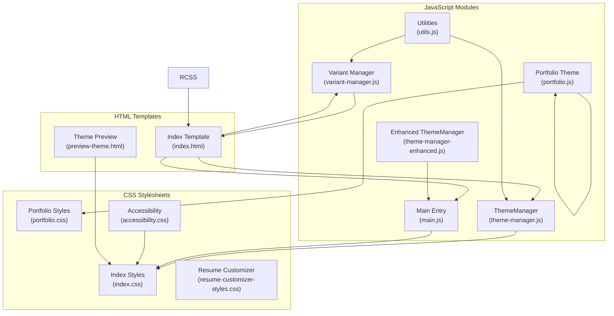
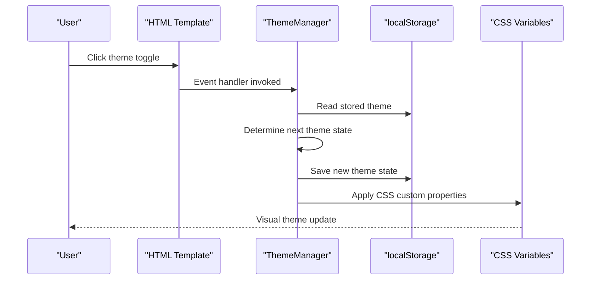
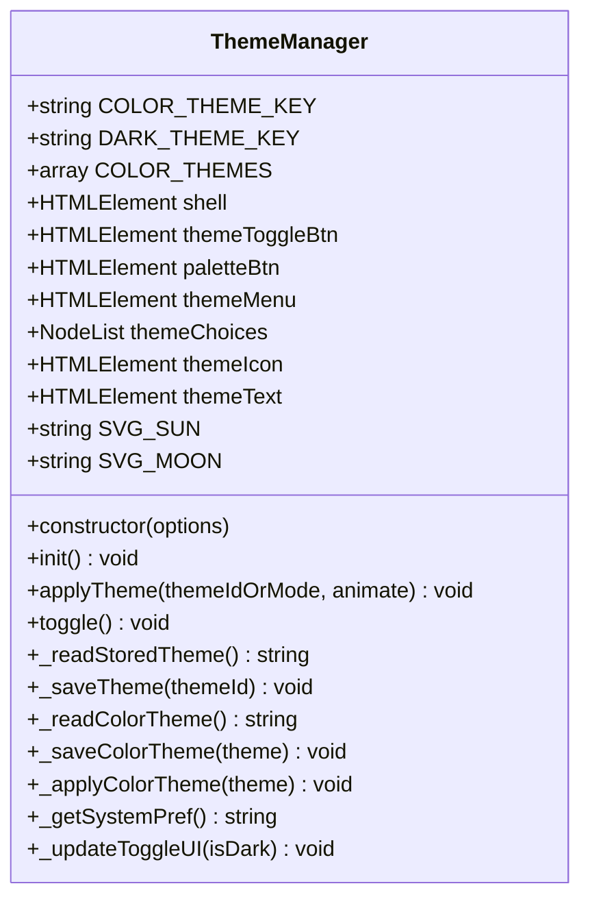
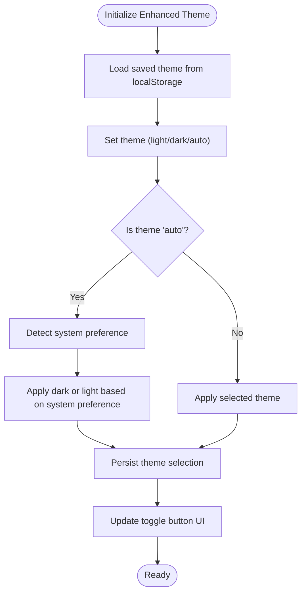
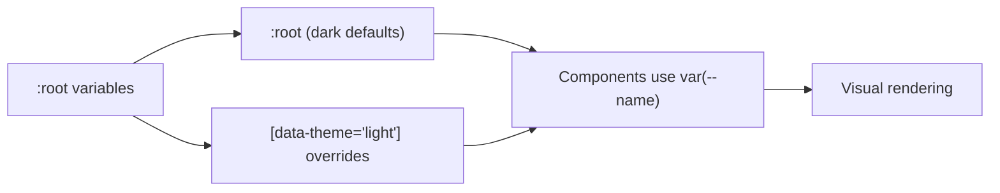
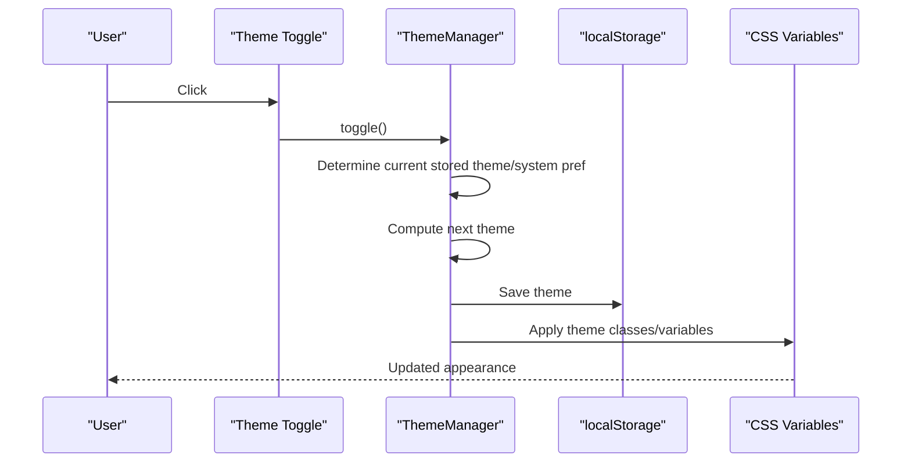
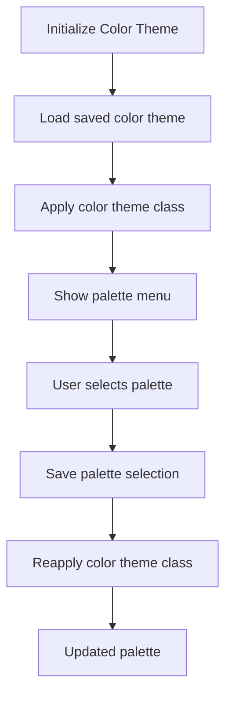
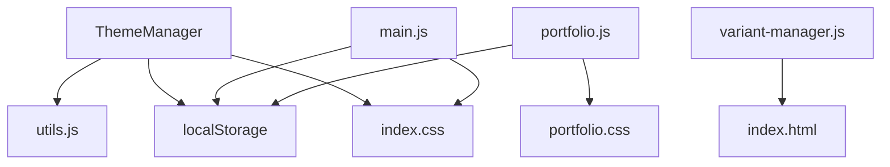

# Theme Management System

<cite>
**Referenced Files in This Document**
- [theme-manager.js](file://assets/js/src/theme-manager.js)
- [theme-manager-enhanced.js](file://assets/js/src/theme-manager-enhanced.js)
- [index.css](file://assets/css/index.css)
- [resume-customizer-styles.css](file://assets/css/resume-customizer-styles.css)
- [utils.js](file://assets/js/src/utils.js)
- [main.js](file://assets/js/main.js)
- [portfolio.js](file://assets/js/portfolio.js)
- [variant-manager.js](file://assets/js/src/variant-manager.js)
- [index.html](file://index.html)
- [preview-theme.html](file://preview/preview-theme.html)
- [accessibility.css](file://assets/css/accessibility.css)
- [portfolio.css](file://assets/css/portfolio.css)
</cite>

## Table of Contents

1. [Introduction](#introduction)
2. [Project Structure](#project-structure)
3. [Core Components](#core-components)
4. [Architecture Overview](#architecture-overview)
5. [Detailed Component Analysis](#detailed-component-analysis)
6. [Dependency Analysis](#dependency-analysis)
7. [Performance Considerations](#performance-considerations)
8. [Troubleshooting Guide](#troubleshooting-guide)
9. [Conclusion](#conclusion)

## Introduction

This document provides comprehensive technical documentation for the theme management system, focusing on advanced theming capabilities including dark/light mode switching, color palette cycling, system preference detection, CSS custom properties usage, theme persistence, and dynamic styling approaches. It covers the ThemeManager class implementation, color scheme management, responsive theme behavior, accessibility considerations, and cross-browser compatibility. Integration examples with resume variants and customization panels are included.

## Project Structure

The theme management system spans multiple modules:

- JavaScript theme managers for different contexts (main application, portfolio, enhanced dark mode)
- CSS custom properties for dynamic theming across themes
- HTML templates integrating theme toggles and variant cards
- Utility modules supporting DOM queries and theme persistence
- Preview and accessibility enhancements for testing and compliance

**Diagram sources**

- [theme-manager.js](file://assets/js/src/theme-manager.js#L1-L170)
- [theme-manager-enhanced.js](file://assets/js/src/theme-manager-enhanced.js#L1-L85)
- [index.css](file://assets/css/index.css#L1-L673)
- [portfolio.css](file://assets/css/portfolio.css#L1-L200)
- [accessibility.css](file://assets/css/accessibility.css#L1-L148)
- [resume-customizer-styles.css](file://assets/css/resume-customizer-styles.css#L1-L406)
- [index.html](file://index.html#L1-L408)
- [preview-theme.html](file://preview/preview-theme.html#L1-L364)

**Section sources**

- [theme-manager.js](file://assets/js/src/theme-manager.js#L1-L170)
- [theme-manager-enhanced.js](file://assets/js/src/theme-manager-enhanced.js#L1-L85)
- [index.css](file://assets/css/index.css#L1-L673)
- [index.html](file://index.html#L1-L408)

## Core Components

This section outlines the primary theme management components and their responsibilities.

- ThemeManager (theme-manager.js): Manages color palette cycling and dark/light mode switching with persistent storage and system preference detection.
- Enhanced ThemeManager (theme-manager-enhanced.js): Provides simplified dark mode toggle with three-state persistence (light, dark, auto).
- Main Theme Logic (main.js): Initializes theme based on local storage and system preferences, applies attributes to document element.
- Portfolio Theme (portfolio.js): Dedicated theme toggle for portfolio pages with localStorage persistence.
- Utilities (utils.js): Lightweight DOM helpers for query selectors and value clamping.
- Variant Manager (variant-manager.js): Coordinates active resume variant selection and updates primary action links.

Key implementation highlights:

- CSS custom properties define theme variables at :root and override them under [data-theme="light"].
- Theme persistence uses localStorage keys for both color themes and dark/light modes.
- System preference detection via matchMedia for automatic theme adaptation.
- Dynamic class toggling on documentElement for theme application.

**Section sources**

- [theme-manager.js](file://assets/js/src/theme-manager.js#L4-L169)
- [theme-manager-enhanced.js](file://assets/js/src/theme-manager-enhanced.js#L6-L75)
- [main.js](file://assets/js/main.js#L13-L42)
- [portfolio.js](file://assets/js/portfolio.js#L3-L23)
- [utils.js](file://assets/js/src/utils.js#L1-L5)
- [variant-manager.js](file://assets/js/src/variant-manager.js#L4-L124)

## Architecture Overview

The theme system follows a layered architecture:

- Presentation Layer: HTML templates with theme toggle buttons and variant cards.
- Application Layer: JavaScript managers coordinating theme state and persistence.
- Styling Layer: CSS custom properties and media queries for theme application.
- Persistence Layer: localStorage for cross-session theme state.

**Diagram sources**

- [theme-manager.js](file://assets/js/src/theme-manager.js#L141-L161)
- [index.css](file://assets/css/index.css#L23-L37)

## Detailed Component Analysis

### ThemeManager Class Implementation

The ThemeManager class encapsulates color palette cycling and dark/light mode switching with the following responsibilities:

- Color theme management: Maintains a list of color themes and applies them via CSS classes on the document element.
- Dark/light mode switching: Reads stored theme or system preference, toggles dark mode class, and persists the selection.
- UI integration: Updates theme toggle icon and text, manages palette menu visibility, and handles outside clicks to close menus.
- System preference detection: Listens for media query changes to adapt theme automatically.

**Diagram sources**

- [theme-manager.js](file://assets/js/src/theme-manager.js#L4-L169)

**Section sources**

- [theme-manager.js](file://assets/js/src/theme-manager.js#L4-L169)

### Enhanced Theme Manager Features

The enhanced theme manager provides a streamlined dark mode experience:

- Three-state theme management: light, dark, auto (system preference).
- Automatic system preference detection using matchMedia.
- Attribute-based theme application on documentElement for CSS targeting.
- Accessible toggle button with aria-label updates reflecting current theme.

**Diagram sources**

- [theme-manager-enhanced.js](file://assets/js/src/theme-manager-enhanced.js#L17-L75)

**Section sources**

- [theme-manager-enhanced.js](file://assets/js/src/theme-manager-enhanced.js#L6-L75)

### CSS Custom Properties System

The CSS custom properties system defines theme variables at the root level and overrides them for light mode:

- Root variables: Define dark theme defaults for backgrounds, text, accents, borders, and shadows.
- Light theme overrides: Provide lighter equivalents under [data-theme="light"].
- Component styling: Uses var(--variable-name) for consistent theming across navigation, cards, buttons, and typography.
- Print styles: Enforce light theme for print media and hide non-printable elements.

**Diagram sources**

- [index.css](file://assets/css/index.css#L4-L37)

**Section sources**

- [index.css](file://assets/css/index.css#L4-L673)

### Theme Persistence Mechanisms

Theme persistence is implemented using localStorage with distinct keys:

- Color theme persistence: Stored under resume_color_theme for palette selections.
- Dark/light theme persistence: Stored under resume_theme_v1 for mode selections.
- Enhanced theme persistence: Stored under resume-theme for three-state management.
- Portfolio theme persistence: Stored under portfolio_theme for dedicated portfolio pages.

Persistence ensures theme state survives page reloads and browser sessions.

**Section sources**

- [theme-manager.js](file://assets/js/src/theme-manager.js#L6-L7)
- [theme-manager-enhanced.js](file://assets/js/src/theme-manager-enhanced.js#L8-L13)
- [portfolio.js](file://assets/js/portfolio.js#L4-L22)

### Dynamic Styling Approaches

Dynamic styling leverages:

- CSS custom properties for runtime variable substitution.
- Attribute selectors ([data-theme="..."]) for theme targeting.
- Class toggling on documentElement for dark mode activation.
- Media queries for responsive theme behavior and reduced motion support.

These approaches enable seamless theme switching without page reloads.

**Section sources**

- [index.css](file://assets/css/index.css#L23-L37)
- [accessibility.css](file://assets/css/accessibility.css#L61-L68)

### Theme Switching Logic

Theme switching logic coordinates multiple factors:

- Read stored theme or system preference.
- Toggle between light and dark modes.
- Update UI toggle icon and text.
- Persist the new theme selection.
- Apply CSS custom properties for immediate visual feedback.

**Diagram sources**

- [theme-manager.js](file://assets/js/src/theme-manager.js#L156-L161)
- [index.css](file://assets/css/index.css#L23-L37)

**Section sources**

- [theme-manager.js](file://assets/js/src/theme-manager.js#L141-L161)

### Color Scheme Management

Color scheme management includes:

- Palette cycling: Applies CSS classes for different color themes (e.g., theme-sunset, theme-vibrant).
- System preference detection: Automatically adapts to user's OS theme setting.
- UI feedback: Updates toggle icon and text to reflect current theme state.

**Diagram sources**

- [theme-manager.js](file://assets/js/src/theme-manager.js#L33-L66)
- [preview-theme.html](file://preview/preview-theme.html#L23-L58)

**Section sources**

- [theme-manager.js](file://assets/js/src/theme-manager.js#L8-L15)
- [preview-theme.html](file://preview/preview-theme.html#L23-L58)

### Responsive Theme Behavior

Responsive theme behavior is achieved through:

- Media queries for light/dark theme overrides.
- Reduced motion support for accessibility.
- Print styles enforcing light theme and hiding non-printable elements.
- Adaptive layouts that respect user preferences.

**Section sources**

- [index.css](file://assets/css/index.css#L599-L673)
- [accessibility.css](file://assets/css/accessibility.css#L61-L68)

### Accessibility Considerations

Accessibility features include:

- Focus management with visible focus indicators.
- Reduced motion support via prefers-reduced-motion media query.
- Sufficient color contrast for both dark and light themes.
- ARIA labels on theme toggle buttons for screen reader support.

**Section sources**

- [accessibility.css](file://assets/css/accessibility.css#L23-L31)
- [accessibility.css](file://assets/css/accessibility.css#L103-L148)
- [index.html](file://index.html#L79-L116)

### Cross-Browser Compatibility

Cross-browser compatibility is addressed by:

- Using matchMedia for system preference detection with fallbacks.
- Applying CSS custom properties supported across modern browsers.
- Ensuring localStorage availability and graceful degradation.
- Providing print styles for consistent output across browsers.

**Section sources**

- [theme-manager.js](file://assets/js/src/theme-manager.js#L75-L84)
- [index.css](file://assets/css/index.css#L602-L673)

### Theme Customization Examples

Examples of theme customization and integration:

- Customizer panel styles: Dark mode support and responsive adjustments.
- Variant integration: Theme-aware variant cards and primary action updates.
- Preview system: Inline theme swatches for palette selection.

**Section sources**

- [resume-customizer-styles.css](file://assets/css/resume-customizer-styles.css#L315-L386)
- [variant-manager.js](file://assets/js/src/variant-manager.js#L68-L103)
- [preview-theme.html](file://preview/preview-theme.html#L319-L361)

## Dependency Analysis

The theme system exhibits low coupling and high cohesion among modules:

- ThemeManager depends on utils.js for DOM queries and localStorage for persistence.
- CSS custom properties decouple styling from JavaScript logic.
- HTML templates integrate theme toggles and variant cards with minimal script dependencies.
- Portfolio and main theme logic operate independently while sharing common CSS variables.

**Diagram sources**

- [theme-manager.js](file://assets/js/src/theme-manager.js#L2-L31)
- [utils.js](file://assets/js/src/utils.js#L1-L5)
- [main.js](file://assets/js/main.js#L13-L42)
- [portfolio.js](file://assets/js/portfolio.js#L3-L23)
- [index.html](file://index.html#L1-L408)

**Section sources**

- [theme-manager.js](file://assets/js/src/theme-manager.js#L2-L31)
- [utils.js](file://assets/js/src/utils.js#L1-L5)
- [main.js](file://assets/js/main.js#L13-L42)
- [portfolio.js](file://assets/js/portfolio.js#L3-L23)
- [index.html](file://index.html#L1-L408)

## Performance Considerations

- CSS custom properties minimize reflows during theme switches.
- matchMedia listeners are attached conditionally to avoid unnecessary overhead.
- localStorage reads/writes occur only on user interaction or initialization.
- Media queries handle responsive behavior efficiently without JavaScript intervention.

## Troubleshooting Guide

Common issues and resolutions:

- Theme not persisting: Verify localStorage availability and correct key usage.
- System preference not detected: Check matchMedia support and event listener registration.
- Toggle icon not updating: Ensure themeIcon and themeText elements exist and are properly updated.
- Palette menu not closing: Confirm event delegation and outside click handling.

**Section sources**

- [theme-manager.js](file://assets/js/src/theme-manager.js#L69-L73)
- [theme-manager.js](file://assets/js/src/theme-manager.js#L163-L168)

## Conclusion

The theme management system provides a robust, accessible, and performant theming solution. It leverages CSS custom properties, localStorage persistence, and system preference detection to deliver seamless user experiences across contexts. The modular architecture supports easy maintenance and extension, while comprehensive accessibility features ensure inclusive usage. Integration with resume variants and customization panels demonstrates practical application of advanced theming capabilities.
