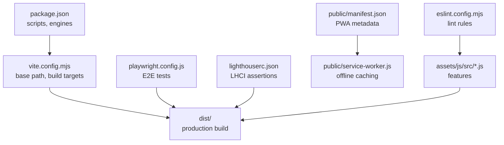
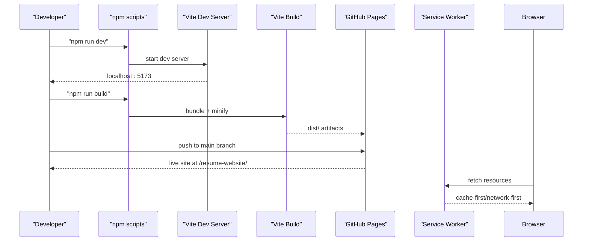
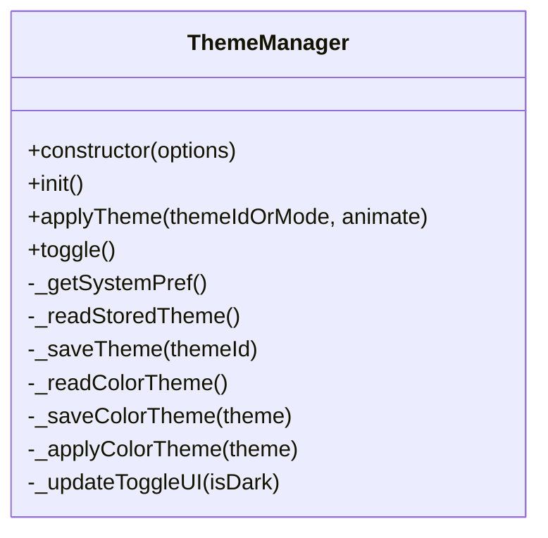
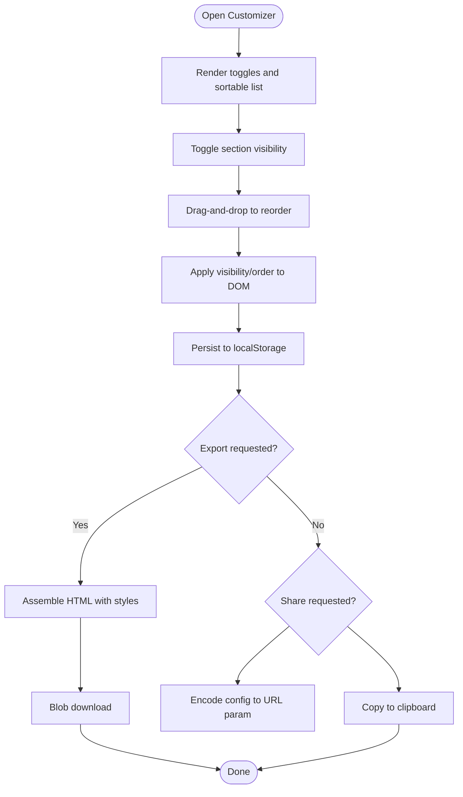
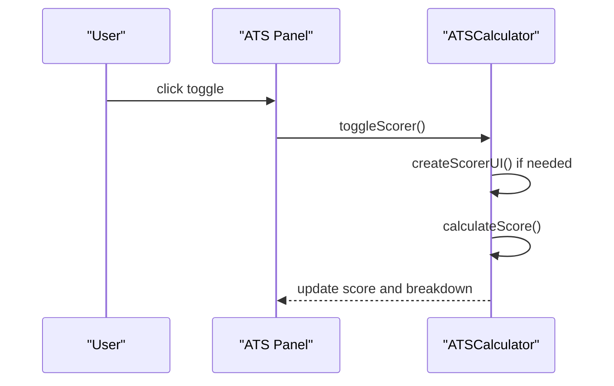
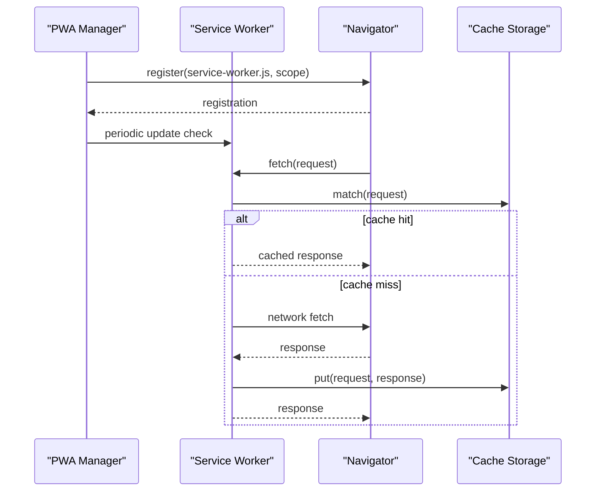
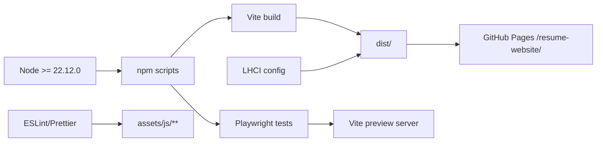

# Troubleshooting and FAQ

<cite>
**Referenced Files in This Document**
- [package.json](file://package.json)
- [vite.config.mjs](file://vite.config.mjs)
- [README.md](file://README.md)
- [DEPLOYMENT_COMPLETE.md](file://DEPLOYMENT_COMPLETE.md)
- [GITHUB_ACTIONS_SETUP.md](file://GITHUB_ACTIONS_SETUP.md)
- [playwright.config.js](file://playwright.config.js)
- [lighthouserc.json](file://lighthouserc.json)
- [eslint.config.mjs](file://eslint.config.mjs)
- [public/manifest.json](file://public/manifest.json)
- [public/service-worker.js](file://public/service-worker.js)
- [assets/js/src/theme-manager.js](file://assets/js/src/theme-manager.js)
- [assets/js/src/resume-customizer.js](file://assets/js/src/resume-customizer.js)
- [assets/js/src/ats-calculator.js](file://assets/js/src/ats-calculator.js)
- [assets/js/src/pwa-manager.js](file://assets/js/src/pwa-manager.js)
- [assets/js/main.js](file://assets/js/main.js)
</cite>

## Table of Contents

1. [Introduction](#introduction)
2. [Project Structure](#project-structure)
3. [Core Components](#core-components)
4. [Architecture Overview](#architecture-overview)
5. [Detailed Component Analysis](#detailed-component-analysis)
6. [Dependency Analysis](#dependency-analysis)
7. [Performance Considerations](#performance-considerations)
8. [Troubleshooting Guide](#troubleshooting-guide)
9. [FAQ](#faq)
10. [Conclusion](#conclusion)

## Introduction

This document provides comprehensive troubleshooting and FAQ guidance for the Resume Website project. It covers setup, development, build, deployment, browser compatibility, performance optimization, and maintenance. It includes step-by-step diagnostics, resolution strategies, and best practices to avoid common pitfalls.

## Project Structure

The project is a static, vanilla JavaScript site built with Vite and deployed to GitHub Pages. Key areas relevant to troubleshooting:

- Build configuration and base path for GitHub Pages hosting
- Testing and CI configuration
- PWA manifest and service worker
- Feature modules (theme, customizer, ATS calculator, PWA manager)
- Linting and formatting configuration

**Diagram sources**

- [package.json](file://package.json#L1-L56)
- [vite.config.mjs](file://vite.config.mjs#L1-L21)
- [playwright.config.js](file://playwright.config.js#L1-L45)
- [lighthouserc.json](file://lighthouserc.json#L1-L39)
- [public/manifest.json](file://public/manifest.json#L1-L81)
- [public/service-worker.js](file://public/service-worker.js#L1-L370)
- [eslint.config.mjs](file://eslint.config.mjs#L1-L82)

**Section sources**

- [README.md](file://README.md#L104-L135)
- [vite.config.mjs](file://vite.config.mjs#L1-L21)
- [package.json](file://package.json#L1-L56)

## Core Components

- Build and base path: Vite configuration sets the base path for GitHub Pages and targets modern browsers.
- Testing: Playwright E2E tests run against a Vite preview server; Vitest unit tests cover core logic.
- Linting and formatting: ESLint and Prettier configurations enforce code quality.
- PWA: Manifest and service worker enable offline support and installability.
- Feature modules: Theme manager, resume customizer, ATS calculator, and PWA manager are modular and initialized on DOMContentLoaded.

**Section sources**

- [vite.config.mjs](file://vite.config.mjs#L3-L20)
- [playwright.config.js](file://playwright.config.js#L1-L45)
- [lighthouserc.json](file://lighthouserc.json#L1-L39)
- [eslint.config.mjs](file://eslint.config.mjs#L1-L82)
- [public/manifest.json](file://public/manifest.json#L1-L81)
- [public/service-worker.js](file://public/service-worker.js#L1-L370)
- [assets/js/src/theme-manager.js](file://assets/js/src/theme-manager.js#L1-L170)
- [assets/js/src/resume-customizer.js](file://assets/js/src/resume-customizer.js#L1-L307)
- [assets/js/src/ats-calculator.js](file://assets/js/src/ats-calculator.js#L1-L161)
- [assets/js/src/pwa-manager.js](file://assets/js/src/pwa-manager.js#L1-L348)
- [assets/js/main.js](file://assets/js/main.js#L1-L58)

## Architecture Overview

High-level flow from development to deployment and runtime features:

**Diagram sources**

- [README.md](file://README.md#L139-L191)
- [vite.config.mjs](file://vite.config.mjs#L3-L20)
- [playwright.config.js](file://playwright.config.js#L38-L43)
- [public/service-worker.js](file://public/service-worker.js#L1-L370)

## Detailed Component Analysis

### Theme Manager

- Responsibilities: persist and apply color themes and dark/light modes; react to system preference changes.
- Common issues: missing DOM elements, localStorage errors, media query listener compatibility.
- Diagnostics: inspect theme-related DOM nodes and localStorage keys; verify media query support.

**Diagram sources**

- [assets/js/src/theme-manager.js](file://assets/js/src/theme-manager.js#L4-L170)

**Section sources**

- [assets/js/src/theme-manager.js](file://assets/js/src/theme-manager.js#L1-L170)

### Resume Customizer

- Responsibilities: toggle visibility, reorder sections, export customized HTML, share configuration via URL.
- Common issues: drag-and-drop not updating order, export/download failures, localStorage quota exceeded.
- Diagnostics: confirm section IDs exist, verify localStorage availability, check Blob download support.

**Diagram sources**

- [assets/js/src/resume-customizer.js](file://assets/js/src/resume-customizer.js#L23-L297)

**Section sources**

- [assets/js/src/resume-customizer.js](file://assets/js/src/resume-customizer.js#L1-L307)

### ATS Score Calculator

- Responsibilities: compute and display ATS compatibility score, provide breakdown and suggestions.
- Common issues: missing DOM elements, keyword matching anomalies, panel toggle not responding.
- Diagnostics: verify scorer panel exists, ensure keywords array is intact, confirm DOMContentLoaded initialization.

**Diagram sources**

- [assets/js/src/ats-calculator.js](file://assets/js/src/ats-calculator.js#L135-L143)

**Section sources**

- [assets/js/src/ats-calculator.js](file://assets/js/src/ats-calculator.js#L1-L161)

### PWA Manager and Service Worker

- Responsibilities: register service worker, handle install prompts, manage online/offline state, periodic/background sync.
- Common issues: service worker registration failure, incorrect scope/base path, caching conflicts, offline fallback not triggered.
- Diagnostics: check service worker path resolution, verify scope, inspect cache names, review fetch strategies.

**Diagram sources**

- [assets/js/src/pwa-manager.js](file://assets/js/src/pwa-manager.js#L48-L81)
- [public/service-worker.js](file://public/service-worker.js#L42-L119)

**Section sources**

- [assets/js/src/pwa-manager.js](file://assets/js/src/pwa-manager.js#L1-L348)
- [public/service-worker.js](file://public/service-worker.js#L1-L370)
- [public/manifest.json](file://public/manifest.json#L1-L81)

## Dependency Analysis

- Node engine requirement must be satisfied for builds and scripts.
- Vite base path must match GitHub Pages deployment root.
- Playwright uses a Vite preview server for E2E tests; ensure ports are free.
- LHCI asserts minimum scores per category; adjust expectations if needed.
- ESLint/Prettier ignore lists exclude generated and build artifacts.

**Diagram sources**

- [package.json](file://package.json#L2-L4)
- [vite.config.mjs](file://vite.config.mjs#L4-L19)
- [playwright.config.js](file://playwright.config.js#L38-L43)
- [lighthouserc.json](file://lighthouserc.json#L3-L37)
- [eslint.config.mjs](file://eslint.config.mjs#L24-L26)

**Section sources**

- [package.json](file://package.json#L1-L56)
- [vite.config.mjs](file://vite.config.mjs#L1-L21)
- [playwright.config.js](file://playwright.config.js#L1-L45)
- [lighthouserc.json](file://lighthouserc.json#L1-L39)
- [eslint.config.mjs](file://eslint.config.mjs#L1-L82)

## Performance Considerations

- Target modern browsers to reduce bundle size.
- Use CSS code splitting and manual chunking for vendor assets.
- Leverage service worker caching strategies (cache-first, network-first, stale-while-revalidate).
- Minimize render-blocking resources and ensure fast first paint.
- Monitor Lighthouse scores and adjust thresholds as needed.

[No sources needed since this section provides general guidance]

## Troubleshooting Guide

### Setup and Environment

- Symptom: Scripts fail due to Node version.
  - Resolution: Ensure Node.js meets the required version.
  - Reference: [package.json](file://package.json#L2-L4)

- Symptom: Cannot start dev server or preview.
  - Resolution: Clear port conflicts; verify Vite preview command.
  - References:
    - [README.md](file://README.md#L161-L172)
    - [playwright.config.js](file://playwright.config.js#L38-L43)

**Section sources**

- [package.json](file://package.json#L2-L4)
- [README.md](file://README.md#L139-L191)
- [playwright.config.js](file://playwright.config.js#L38-L43)

### Build and Preview Issues

- Symptom: Build fails or dist missing files.
  - Resolution: Run the build script; verify Vite configuration and base path.
  - References:
    - [README.md](file://README.md#L176-L191)
    - [vite.config.mjs](file://vite.config.mjs#L3-L20)

- Symptom: Preview server does not start for E2E tests.
  - Resolution: Check the webServer command and port availability.
  - Reference: [playwright.config.js](file://playwright.config.js#L38-L43)

**Section sources**

- [README.md](file://README.md#L176-L191)
- [vite.config.mjs](file://vite.config.mjs#L3-L20)
- [playwright.config.js](file://playwright.config.js#L38-L43)

### Deployment Problems

- Symptom: Site not served at expected GitHub Pages URL.
  - Resolution: Confirm base path matches repository path and deployment branch.
  - References:
    - [README.md](file://README.md#L244-L251)
    - [vite.config.mjs](file://vite.config.mjs#L4-L4)

- Symptom: GitHub Actions workflows not triggering.
  - Resolution: Enable Actions permissions and verify workflow files and path filters.
  - Reference: [GITHUB_ACTIONS_SETUP.md](file://GITHUB_ACTIONS_SETUP.md#L213-L236)

**Section sources**

- [README.md](file://README.md#L244-L251)
- [vite.config.mjs](file://vite.config.mjs#L4-L4)
- [GITHUB_ACTIONS_SETUP.md](file://GITHUB_ACTIONS_SETUP.md#L213-L236)

### Browser Compatibility Challenges

- Symptom: Features not working on older browsers.
  - Resolution: The project targets modern browsers; ensure users use supported browsers.
  - Reference: [vite.config.mjs](file://vite.config.mjs#L10-L10)

- Symptom: PWA install prompt not appearing.
  - Resolution: Check service worker registration path and scope; ensure HTTPS and valid manifest.
  - References:
    - [assets/js/src/pwa-manager.js](file://assets/js/src/pwa-manager.js#L48-L81)
    - [public/manifest.json](file://public/manifest.json#L1-L81)

**Section sources**

- [vite.config.mjs](file://vite.config.mjs#L10-L10)
- [assets/js/src/pwa-manager.js](file://assets/js/src/pwa-manager.js#L48-L81)
- [public/manifest.json](file://public/manifest.json#L1-L81)

### Feature-Specific Issues

#### Theme Manager

- Symptom: Theme toggle not switching or not persisting.
  - Resolution: Verify DOM elements exist and localStorage is available.
  - Reference: [assets/js/src/theme-manager.js](file://assets/js/src/theme-manager.js#L33-L85)

**Section sources**

- [assets/js/src/theme-manager.js](file://assets/js/src/theme-manager.js#L1-L170)

#### Resume Customizer

- Symptom: Drag-and-drop order not updating or export failing.
  - Resolution: Confirm section IDs, localStorage availability, and Blob download support.
  - Reference: [assets/js/src/resume-customizer.js](file://assets/js/src/resume-customizer.js#L104-L179)

**Section sources**

- [assets/js/src/resume-customizer.js](file://assets/js/src/resume-customizer.js#L1-L307)

#### ATS Calculator

- Symptom: Score panel not visible or not calculating.
  - Resolution: Ensure DOMContentLoaded initialization and scorer panel creation.
  - Reference: [assets/js/src/ats-calculator.js](file://assets/js/src/ats-calculator.js#L135-L143)

**Section sources**

- [assets/js/src/ats-calculator.js](file://assets/js/src/ats-calculator.js#L1-L161)

#### PWA Manager and Service Worker

- Symptom: Service worker not registering or offline fallback not working.
  - Resolution: Check service worker path resolution, scope, and fetch strategies.
  - References:
    - [assets/js/src/pwa-manager.js](file://assets/js/src/pwa-manager.js#L48-L81)
    - [public/service-worker.js](file://public/service-worker.js#L42-L119)

**Section sources**

- [assets/js/src/pwa-manager.js](file://assets/js/src/pwa-manager.js#L1-L348)
- [public/service-worker.js](file://public/service-worker.js#L1-L370)

### Code Quality and Formatting

- Symptom: Linting/formatting errors block commits or CI.
  - Resolution: Run lint and format scripts; address warnings and errors.
  - References:
    - [README.md](file://README.md#L194-L228)
    - [eslint.config.mjs](file://eslint.config.mjs#L44-L62)

**Section sources**

- [README.md](file://README.md#L194-L228)
- [eslint.config.mjs](file://eslint.config.mjs#L44-L62)

### Testing Failures

- Symptom: E2E tests fail locally or in CI.
  - Resolution: Review Playwright base URL and webServer configuration; check browser compatibility.
  - Reference: [playwright.config.js](file://playwright.config.js#L17-L43)

- Symptom: Unit tests fail.
  - Resolution: Inspect Vitest configuration and test files.
  - Reference: [README.md](file://README.md#L231-L241)

**Section sources**

- [playwright.config.js](file://playwright.config.js#L1-L45)
- [README.md](file://README.md#L231-L241)

### Performance and Lighthouse

- Symptom: Lighthouse scores below expectations.
  - Resolution: Adjust assertions and optimize assets; review caching and delivery.
  - Reference: [lighthouserc.json](file://lighthouserc.json#L8-L37)

**Section sources**

- [lighthouserc.json](file://lighthouserc.json#L1-L39)

## FAQ

### How do I run the project locally?

- Use the development server and open the provided URL.
- References:
  - [README.md](file://README.md#L161-L172)
  - [package.json](file://package.json#L8-L8)

**Section sources**

- [README.md](file://README.md#L161-L172)
- [package.json](file://package.json#L8-L8)

### How do I build for production?

- Build the project and preview the output locally.
- References:
  - [README.md](file://README.md#L176-L191)
  - [package.json](file://package.json#L9-L9)

**Section sources**

- [README.md](file://README.md#L176-L191)
- [package.json](file://package.json#L9-L9)

### How do I deploy to GitHub Pages?

- Ensure base path matches repository path and workflows are enabled.
- References:
  - [README.md](file://README.md#L244-L251)
  - [vite.config.mjs](file://vite.config.mjs#L4-L4)
  - [GITHUB_ACTIONS_SETUP.md](file://GITHUB_ACTIONS_SETUP.md#L56-L88)

**Section sources**

- [README.md](file://README.md#L244-L251)
- [vite.config.mjs](file://vite.config.mjs#L4-L4)
- [GITHUB_ACTIONS_SETUP.md](file://GITHUB_ACTIONS_SETUP.md#L56-L88)

### How do I customize the resume sections?

- Use the customizer panel to toggle visibility and reorder sections, then export or share.
- Reference: [assets/js/src/resume-customizer.js](file://assets/js/src/resume-customizer.js#L23-L297)

**Section sources**

- [assets/js/src/resume-customizer.js](file://assets/js/src/resume-customizer.js#L1-L307)

### How do I check ATS compatibility?

- Open the ATS panel and optionally paste a job description for analysis.
- Reference: [assets/js/src/ats-calculator.js](file://assets/js/src/ats-calculator.js#L135-L143)

**Section sources**

- [assets/js/src/ats-calculator.js](file://assets/js/src/ats-calculator.js#L1-L161)

### How do I install the PWA?

- Use the install prompt or browser menu to add to home screen.
- References:
  - [assets/js/src/pwa-manager.js](file://assets/js/src/pwa-manager.js#L180-L198)
  - [public/manifest.json](file://public/manifest.json#L1-L81)

**Section sources**

- [assets/js/src/pwa-manager.js](file://assets/js/src/pwa-manager.js#L1-L348)
- [public/manifest.json](file://public/manifest.json#L1-L81)

### How do I run tests?

- Run unit tests and E2E tests as configured.
- References:
  - [README.md](file://README.md#L231-L241)
  - [package.json](file://package.json#L10-L12)

**Section sources**

- [README.md](file://README.md#L231-L241)
- [package.json](file://package.json#L10-L12)

### How do I maintain code quality?

- Run linting and formatting; pre-commit hooks will enforce checks.
- References:
  - [README.md](file://README.md#L194-L228)
  - [eslint.config.mjs](file://eslint.config.mjs#L44-L81)

**Section sources**

- [README.md](file://README.md#L194-L228)
- [eslint.config.mjs](file://eslint.config.mjs#L44-L81)

### How do I monitor deployment status?

- Use workflow badges and Actions tab to track runs and artifacts.
- Reference: [GITHUB_ACTIONS_SETUP.md](file://GITHUB_ACTIONS_SETUP.md#L242-L257)

**Section sources**

- [GITHUB_ACTIONS_SETUP.md](file://GITHUB_ACTIONS_SETUP.md#L242-L257)

## Conclusion

This guide consolidates practical troubleshooting steps and answers to common questions for the Resume Website project. By following the diagnostics and resolutions here, you can quickly identify and fix issues across setup, development, build, deployment, browser compatibility, and performance. For deeper technical details, consult the linked documentation sections and source files.
